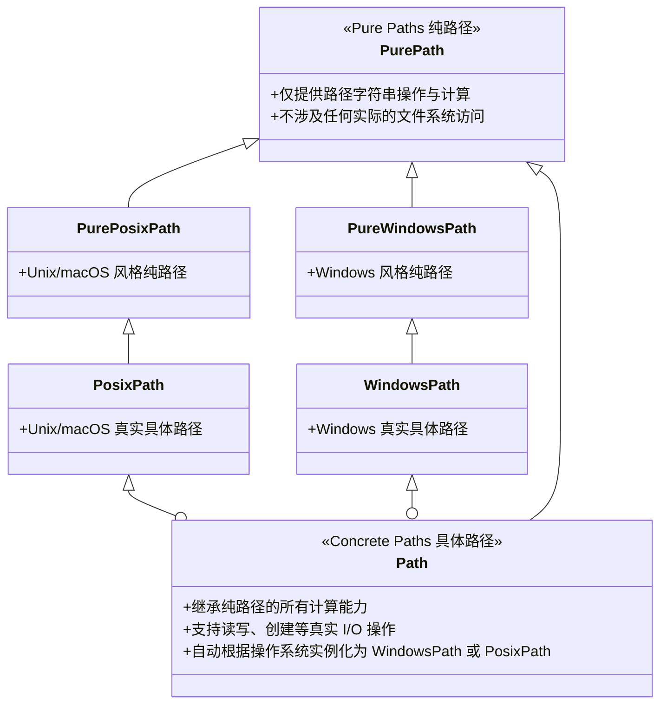

面向对象的文件系统路径。对于底层的路径字符串操作，你也可以使用 `os.path` 模块。`pathlib` 在 Python 3.4 引入，提供跨平台的路径表示与操作。

[pathlib 官方模块文档](https://docs.python.org/zh-cn/3/library/pathlib.html#module-pathlib)

## 路径类型概览

`pathlib` 的类层次结构设计非常精妙，主要分为纯路径（Pure Paths）和具体路径（Concrete Paths）两类：



- **纯路径（Pure Paths）**：当你只想做路径计算，或者在 Linux 服务器上解析处理别人发来的 Windows 路径字符串时使用。
- **具体路径（Concrete Paths）**：包含了真实的磁盘读写、文件判断等 I/O 操作。


日常开发中导入和使用 `Path` 即可，这是因为 Path 是一个工厂类。当你实例化它时，它会**自动**根据你当前运行的操作系统（Windows 还是 Mac/Linux），在底层实例化为 `WindowsPath` 或 `PosixPath`。

这种设计让你写的代码可以“一次编写，到处运行”。

## 路径的基础操作

pathlib 通过重载 `__truediv__` 和 `__rtruediv__`， 实现把`/` 运算符重载为路径拼接。

```python showLineNumbers
from pathlib import Path

# 当前目录
p = Path('.')

# 右侧拼接
path = p / 'docs' / 'readme.txt'

# 左侧拼接
path = '/etc' / Path('passwd')

print(path.name) 
# 输出：readme.txt
```

以 `p = Path('/usr/share/data/archive.tar.gz')` 为例：

| 属性 / 方法 | 说明 | 示例结果 |
| :--- | :--- | :--- |
| `name` | 路径的最后一段（通常为文件名或目录名），包含后缀 | `'archive.tar.gz'` |
| `stem` | 文件名主要部分（即去掉**最后一个**后缀的部分） | `'archive.tar'` |
| `suffix` | 最后一个后缀（扩展名） | `'.gz'` |
| `suffixes` | 所有后缀的列表 | `['.tar', '.gz']` |
| `parent` | 父目录（返回一个新的 `Path` 对象） | `Path('/usr/share/data')` |
| `parents` | 包含所有父目录的可切片序列（祖先目录序列） | `p.parents[1]` 等价于 `p.parent.parent` |
| `parts` | 将路径按层级拆分后的元组 | `('/', 'usr', 'share', 'data', 'archive.tar.gz')` |
| `anchor` | 根目录标识（如 Unix 的 `/` 或 Windows 的 `C:\`） | `'/'` |
| `root` | 路径的根部分（不含盘符） | `'/'` |
| `drive` | 盘符（仅限 Windows，如 `C:`） | `''`（Unix 路径下为空） |
| `is_absolute()` | 语义层判断是否为绝对路径 | `p.is_absolute()` -> `True` |
| `as_posix()` | 以 POSIX 风格字符串表示路径（统一使用 `/`） | `p.as_posix()` -> `'/usr/share/data/archive.tar.gz'` |
| `relative_to(other)` | 计算出相对于 `other` 的相对路径，无法计算时抛出 `ValueError` | `p.relative_to('/usr')`<br/>`Path('share/data/archive.tar.gz')` |
| **`with_name(name)`** | 替换最后一段的完整名称，返回新的 `Path` 对象 | `p.with_name('new.zip')`<br/>`Path('.../data/new.zip')` |
| **`with_suffix(suffix)`** | 替换**最后一个**后缀，返回新的 `Path` 对象 | `p.with_suffix('.bz2')`<br/>`Path('.../data/archive.tar.bz2')` |
| **`with_stem(stem)`** | 替换文件名主要部分，返回新的对象 | `p.with_stem('backup')`<br/>`Path('.../data/backup.gz')` |
| **`with_segments(*pathsegments)`** | 用新片段构造同类型路径对象（高级用法） | `p.with_segments('/tmp', 'a.txt')`<br/>`Path('/tmp/a.txt')` |

```python showLineNumbers
from pathlib import Path

p = Path('/usr/share/data/archive.tar.gz')

# 1) 路径信息
print(p.name)        # archive.tar.gz
print(p.stem)        # archive.tar
print(p.suffix)      # .gz
print(p.suffixes)    # ['.tar', '.gz']
print(p.parent)      # /usr/share/data
print(p.root)        # /
print(p.as_posix())  # /usr/share/data/archive.tar.gz

# 2) 相对路径计算
print(p.is_absolute())                 # True
print(p.relative_to('/usr'))           # share/data/archive.tar.gz

# 3) 基于旧路径派生新路径（不会立刻改动文件系统）
new_p1 = p.with_name('new.zip')        # /usr/share/data/new.zip
new_p2 = p.with_suffix('.bz2')         # /usr/share/data/archive.tar.bz2
new_p3 = p.with_stem('backup')         # /usr/share/data/backup.gz (Python 3.9+)

print(new_p1)
print(new_p2)
print(new_p3)

# 真正重命名时，再把新路径传给 rename()/replace()/move() 等方法
# p.rename(new_p1)
```

:::tip[with_segments 方法]
在 Python 3.12 之前，如果你继承了 Path 并在 `__init__` 中添加了自定义参数（比如 session_id），你会发现当你执行 `my_path / "subdir"` 时，返回的新对象会把你的 session_id 丢掉，甚至直接报错。

这是因为旧版的 pathlib 在内部创建新路径时，硬编码了只传递路径字符串。

with_segments 的出现就是为了给子类一个“交代”：

“每当我要产生一个新的路径对象时，我会调用 with_segments。子类你可以在这里决定，除了路径片段，还要把哪些‘传家宝’传给下一代。”


下面代码展示了如何使用 with_segments 方法构建一个具有权限控制的 AgentPath 类。

```python showLineNumbers
import os
from pathlib import Path, PosixPath, WindowsPath

# 动态选择父类
ParentPath = WindowsPath if os.name == 'nt' else PosixPath

class AgentPath(ParentPath):
    def __init__(self, *pathsegments, agent_id, session_token):
        self.agent_id = agent_id
        self.session_token = session_token

    def with_segments(self, *pathsegments):
        # 确保 Agent 派生出的所有子路径都逃不出这个 Session 的手掌心
        return type(self)(*pathsegments, agent_id=self.agent_id, session_token=self.session_token)

    def check_permission(self, permission):
        # 权限校验
        if self.agent_id != "admin" and permission == "DELETE":
            return False
        if self.session_token != "1234567890":
            return False
        return True

    def unlink(self, missing_ok=False):
        # 在真正删除前检查该 Agent 是否有删除权限
        if not self.check_permission("DELETE"):
            raise PermissionError(f"Agent {self.agent_id} 无权删除 {self}")
        super().unlink(missing_ok)

    def write_text(self, data, encoding='utf-8', errors='strict', newline=None):
        # 记录日志
        print(f"Agent {self.agent_id} 正在写入数据: {data}")
        return super().write_text(data, encoding, errors, newline)
```

:::


## 文件系统交互

这是 `pathlib` 真正强大的地方，它把很多 `os` 模块的功能集成到了路径对象中。下面按用途分组：

假设你有一个名为 project 的文件夹，里面散落着各种日志文件。我们的任务是：

- 找出所有 .log 文件。

- 过滤掉那些已经在 archive（归档）文件夹里的文件。

- 根据文件的修改月份，将它们分类移动到 archive/YYYY-MM/ 目录下。

- 在每个移动后的文件末尾，加上一行“归档时间”记录

你可以这样写代码：

```python showLineNumbers
from pathlib import Path

# 1. 目录与文件准备
work_dir = Path('./output/logs')
work_dir.mkdir(parents=True, exist_ok=True)        # 创建多级目录

log_file = work_dir / 'app.log'

# 2. 写入与判断
if not log_file.exists():                          # 检查是否存在
    log_file.write_text('初始化日志...\n', encoding='utf-8')

if log_file.is_file():                             # 判断是否为文件
    # 追加写入
    with log_file.open('a', encoding='utf-8') as f:
        f.write('发生了一次用户登录。\n')

    # 读取所有文本并打印
    print("--- 日志内容 ---")
    print(log_file.read_text(encoding='utf-8'))
    
    # 获取文件大小
    print("文件大小:", log_file.stat().st_size, "bytes")

# 3. 遍历与匹配（展示参数能力）
print("\n--- glob / rglob / walk 参数示例 ---")

# glob: case_sensitive 允许控制大小写敏感（Python 3.12+）
for f in work_dir.parent.glob('*.log', case_sensitive=False):
    print("glob 找到:", f.resolve())

# rglob: recurse_symlinks 可控制是否递归跟随符号链接（Python 3.13+）
for f in work_dir.parent.rglob('*.log', case_sensitive=False, recurse_symlinks=False):
    print("rglob 找到:", f.resolve())

# walk: top_down / on_error / follow_symlinks 参数（Python 3.12+）
for dirpath, dirnames, filenames in work_dir.parent.walk(
    top_down=True,
    on_error=lambda e: print("walk error:", e),
    follow_symlinks=False
):
    print("walk:", dirpath, "dirs=", dirnames, "files=", filenames)
    break

# 4. 文件重命名与清理
backup_file = work_dir / 'app.bak'
log_file.rename(backup_file)                       # 重命名 / 移动文件
backup_file.unlink(missing_ok=True)                # 删除文件
work_dir.rmdir()                                   # 删除空文件夹
```

### 扩展和计算路径

| 常用 API | 说明与常用参数 |
| :--- | :--- |
| `Path.home()` | **类方法**。返回当前用户的家目录（如 `/home/user`） |
| `Path.cwd()` | **类方法**。返回当前工作目录（等同于 `os.getcwd()`） |
| `p.expanduser()` | 解析路径中包含的 `~` 或 `~user`，返回展开后的绝对路径 |
| `p.absolute()` | 将路径补全为绝对路径，不解析符号链接 |
| `p.resolve(strict=False)` | 将路径解析为绝对路径，会解析所有符号链接及 `..` 相对路径（推荐）。`strict=False` 允许路径中存在未建立的文件 |
| `p.joinpath(*parts)` | 与 `/` 运算符等价，用方法方式拼接路径 |
| `p.is_relative_to(other)` | 判断当前路径是否可以相对 `other` 表示，返回布尔值 |
| `p.readlink()` | 获取符号链接指向的真实路径 |

```python showLineNumbers
from pathlib import Path

p = Path('~/project/docs/../README.md')
base = Path('/usr/share')

print(Path.home())            # /home/xxx
print(Path.cwd())             # 当前工作目录
print(p.expanduser())         # 展开 ~
print(p.absolute())           # 仅补全为绝对路径
print(p.resolve(strict=False))# 解析符号链接和 ..
print(base.joinpath('data', 'a.log'))         # /usr/share/data/a.log
print(Path('/usr/share/data').is_relative_to(base))  # True
```

### 查询文件类型和状态

| 常用 API | 说明与常用参数 |
| :--- | :--- |
| `p.exists()` | 判断路径（文件或目录）是否存在 |
| `p.is_file()` | 判断该路径是否为一个存在的文件 |
| `p.is_dir()` | 判断该路径是否为一个存在的目录 |
| `p.is_symlink()` | 判断该路径是否为一个符号链接 |
| `p.is_junction()` | 判断路径是否为 junction（Windows） |
| `p.is_mount()` | 判断路径是否为挂载点 |
| `p.is_socket()` | 判断路径是否为 Unix 域套接字 |
| `p.is_fifo()` | 判断路径是否为 FIFO（命名管道） |
| `p.is_block_device()` | 判断路径是否为块设备 |
| `p.is_char_device()` | 判断路径是否为字符设备 |
| `p.samefile(other)` | 判断该路径和 `other` 是否指向文件系统中的同一个真实文件/目录 |
| `p.stat()` | 类似 `os.stat()`。常用返回值：<br/>`.st_size` (文件大小，字节)<br/>`.st_mtime` (最后修改时间戳) |
| `p.lstat()` | 与 `stat()` 类似，但如果路径是符号链接，返回的是链接本身信息 |

```python showLineNumbers
from pathlib import Path

p = Path('./output/app.log')

print(p.exists())        # True / False
print(p.is_file())       # True / False
print(p.is_dir())        # True / False
print(p.is_symlink())    # True / False
print(p.is_mount())      # True / False
print(p.is_socket())     # True / False
print(p.is_fifo())       # True / False
print(p.is_block_device()) # True / False
print(p.is_char_device())  # True / False

if p.exists():
    st = p.stat()
    print(st.st_size, st.st_mtime)
    print(p.lstat().st_mode)
```

### 读写文件与目录

| 常用 API | 说明与常用参数 |
| :--- | :--- |
| `p.mkdir(parents=True, exist_ok=True)` | `parents=True`：允许创建不存在的多级父目录<br/>`exist_ok=True`：若目录已存在则不报错（默认会抛出 `FileExistsError`） |
| `p.touch(mode=0o666, exist_ok=True)` | 创建空文件或更新文件修改时间。`exist_ok=False` 时文件已存在会报错 |
| `p.symlink_to(target, target_is_directory=False)` | 创建符号链接，指向 `target` |
| `p.hardlink_to(target)` | 创建硬链接，指向 `target`（要求同一文件系统） |
| `p.unlink(missing_ok=True)` | 删除文件。`missing_ok=True`（Python 3.8+）时，文件不存在则忽略，不抛异常 |
| `p.rmdir()` | 删除目录（**必须为空目录**，若非空会抛出 `OSError`，需借助 `shutil.rmtree`） |
| `p.read_text(encoding='utf-8', errors='strict', newline=None)` | 以文本方式读取整个文件内容，自动处理文件关闭。可用 `errors` / `newline` 控制解码与换行 |
| `p.write_text(data, encoding='utf-8', errors='strict', newline=None)` | 写入字符串，若文件已存在会**覆盖**原有内容。可用 `errors` / `newline` 控制编码与换行 |
| `p.read_bytes()` | 以二进制方式读取整个文件 |
| `p.write_bytes(b'data')` | 以二进制方式写入整个文件，无需传 `encoding` |
| `p.open(mode='r', buffering=-1, encoding='utf-8', errors=None, newline=None)` | 行为与内置 `open()` 一致。`mode`：`'r'` 读取、`'w'` 覆盖写入、`'a'` 追加写入、`'b'` 二进制模式 |
| `p.copy(target)` | 复制文件或目录树到 `target`，返回新的 `Path`。可用 `follow_symlinks`、`preserve_metadata` 控制符号链接与元数据保留（Python 3.14+） |
| `p.copy_into(target_dir)` | 把当前文件/目录树复制到已存在目录 `target_dir` 中，返回新的 `Path`（Python 3.14+） |
| `p.rename(target)` | 将文件或目录重命名或移动到 `target`（可以是字符串或 `Path` 对象），返回新的 `Path` |
| `p.replace(target)` | 类似 `rename()`，但如果 `target` 已存在（文件或空目录），会无条件替换，返回新的 `Path` |
| `p.move(target)` | 移动文件或目录树到 `target`，返回新的 `Path`。同文件系统优先走 `os.replace()`；跨文件系统会先复制再删除源路径（Python 3.14+） |
| `p.move_into(target_dir)` | 把当前文件或目录树移动到已存在目录 `target_dir` 中，返回新的 `Path`（Python 3.14+） |
| `p.iterdir()` | 返回生成器，产出当前目录下所有文件和目录的 `Path` 对象（**不递归**） |
| `p.walk(top_down=True, on_error=None, follow_symlinks=False)` | (Python 3.12+) 替代 `os.walk()`，可控制遍历顺序、错误处理与是否跟随符号链接 |
| `p.glob(pattern, case_sensitive=None, recurse_symlinks=False)` | 返回当前目录下匹配模式的生成器（如 `*.py`，**不递归**）。可控制大小写与递归时是否跟随符号链接 |
| `p.rglob(pattern, case_sensitive=None, recurse_symlinks=False)` | **递归**匹配，等价于 `p.glob('**/' + pattern)`，并支持 `case_sensitive` / `recurse_symlinks` |
| `p.match(pattern)` | 将当前路径与 glob 风格模式匹配，返回布尔值 |
| `p.full_match(pattern)` | 要求整个路径完全匹配模式，返回布尔值（Python 3.13+） |

```python showLineNumbers
from pathlib import Path

work = Path('./demo')
work.mkdir(parents=True, exist_ok=True)

f = work / 'note.txt'
f.write_text('hello\n', encoding='utf-8')
print(f.read_text(encoding='utf-8'))

# touch / symlink_to / hardlink_to
stamp = work / 'stamp.txt'
stamp.touch(exist_ok=True)
link = work / 'note.link'
hard = work / 'note.hard'

# 目标不存在会报错；示例仅演示写法
# link.symlink_to(f)
# hard.hardlink_to(f)

for item in work.iterdir():
    print(item.name)

print((work / 'note.txt').match('*.txt'))         # True
print((work / 'note.txt').full_match('**/*.txt')) # True (Python 3.13+)

f.unlink(missing_ok=True)
work.rmdir()
```

### 访问权限与所有权

| 常用 API | 说明与常用参数 |
| :--- | :--- |
| `p.owner(follow_symlinks=True)` | 返回拥有者用户名。若需查看符号链接本身拥有者，可传 `follow_symlinks=False` |
| `p.group(follow_symlinks=True)` | 返回拥有者组名。若需查看符号链接本身所属组，可传 `follow_symlinks=False` |
| `p.chmod(mode, follow_symlinks=True)` | 修改文件模式与权限（如 `0o644`）。部分平台可对符号链接本身生效：`follow_symlinks=False` |
| `p.lchmod(mode)` | 与 `chmod()` 类似，但针对符号链接本身而不是链接目标（仅在支持的平台可用） |

```python showLineNumbers
from pathlib import Path

p = Path('./demo/script.sh')

if p.exists():
    print(p.owner(), p.group())
    p.chmod(0o644)

    # 仅在支持的平台可用；不支持时会报错
    # p.lchmod(0o777)
```


### 解析和生成 URI

`pathlib` 对 `file://` URI 提供了原生支持：既可以把本地绝对路径生成 URI，也可以把 URI 解析回路径对象。

| 场景 | 常用 API | 说明 |
| :--- | :--- | :--- |
| 生成 URI | `p.as_uri()` | 把**绝对路径**转换为 `file://` URI（相对路径会抛 `ValueError`） |
| 解析 URI | `Path.from_uri(uri)` | 把 `file://` URI 解析为 `Path` 对象（Python 3.13+） |

```python showLineNumbers
from pathlib import Path

# 1) 路径 -> URI
p = Path('/home/allen/data/report.txt')
uri = p.as_uri()
print(uri)
# file:///home/allen/data/report.txt

# 2) URI -> 路径（Python 3.13+）
p2 = Path.from_uri('file:///home/allen/data/report.txt')
print(p2)
# /home/allen/data/report.txt
```

如果你的运行环境低于 Python 3.13，没有 `Path.from_uri()`，可以用 `urllib.parse` + `urllib.request.url2pathname` 作为替代方案。
