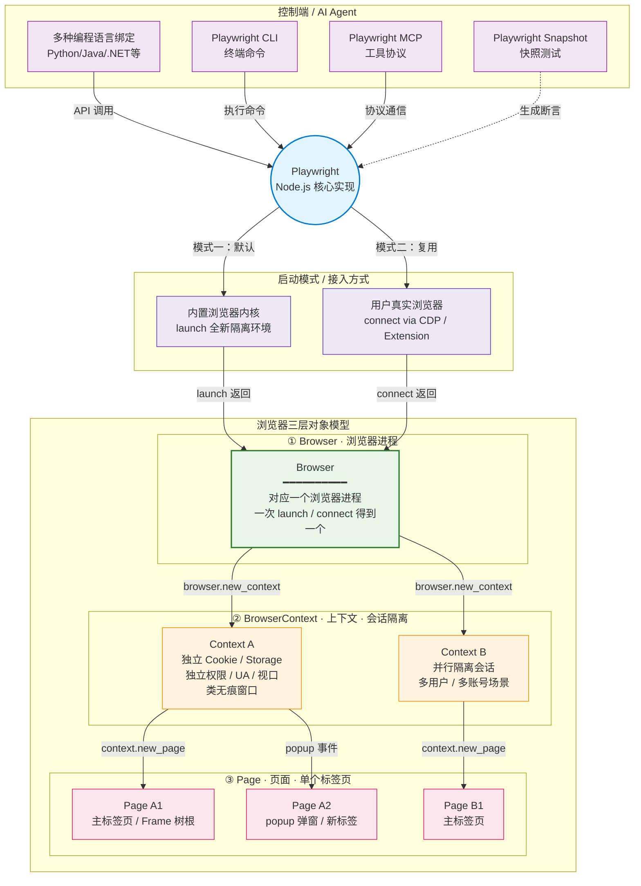

Playwright 的优点是：支持渐进式学习，支持多种语言，支持多种浏览器，支持多种操作系统，并且浏览器相关的技术半衰期很长，有大厂背书更新积极。

Playwright 原本是个测试框架，现在接到 Agent 工作流里，用于导航页面、填写表单和整理个人信息非常方便。

Playwright 的官方文档非常详细，本篇文档从使用者的角度，总结 Playwright 的架构、接口特性、数据提取方式等。

## 技术架构



:::tip 浏览器三层对象模型速记

由重到轻：`Browser` → `BrowserContext` → `Page`，新建成本依次降低，隔离粒度依次细化。

| 层级 | 对应概念 | 隔离粒度 | 创建成本 | 典型用法 |
| :--- | :--- | :--- | :--- | :--- |
| ① **Browser** | 浏览器进程 | 进程级 | 高（秒级） | 一次 `launch` / `connect` 得到一个，多个用例共用 |
| ② **BrowserContext** | 会话 / 无痕窗口 | Cookie · Storage · 权限 · UA · 视口 | 低（毫秒级） | **每个测试用例新建一个**，互不污染 |
| ③ **Page** | 标签页 / 弹窗 | DOM · 网络事件 · Frame 树 | 极低 | 一个 Context 下可开多个；popup 也是新 Page |

> Page 内部的 iframe 由 Frame 树管理，不再是独立顶层对象。

:::


从 Python / Java / CLI / MCP 任一入口调用时，真正执行协议交互与自动化逻辑的仍是 Playwright 的核心实现。

开发者通过 Python / Java / .NET 等 API 控制浏览器，但这并不意味着每种语言都重写了一套自动化引擎。

不同语言提供的仅仅是绑定层（Binding）。

#### CLI 命令行工具

像 `codegen`（录制代码）、`show-trace`（调试追踪）等命令行能力，同样建立在这套核心实现之上。

:::tip Driver 与多语言绑定

Python、Java、.NET 等绑定在底层共用同一套 TS 核心：

- 多语言绑定会调用 Playwright 的 Driver 进程，由该进程负责与浏览器底层通信。
- 语言层只负责暴露各自生态的 API 形态，并将调用请求转交给底层处理。
- 浏览器交互、协议适配与自动化执行，全部由 Playwright 核心实现包揽。
:::

### 浏览器

为了避免概念混淆，先统一术语：

- 浏览器内核：Playwright 自动下载并管理的 Chromium / Firefox / WebKit。
- 用户浏览器：你自己安装、日常使用的 Chrome / Edge 等。

| 维度 | 驱动浏览器内核 | 连接用户浏览器 |
| :--- | :--- | :--- |
| 核心机制 | Playwright 自动下载并管理特定版本浏览器 | 连接到本机已安装、可用的浏览器实例 |
| 隔离性 | 强。与日常浏览器完全独立（软件隔离） | 灵活可选。可通过指定独立数据目录实现隔离，也可直接进入真实环境 |
| 数据状态 | 干净。基于 `BrowserContext`，Cookie/缓存互不影响 | 按需复用。可选择纯净状态，也可继承已有登录态、Cookie 和扩展 |
| 适用场景 | 自动化测试、爬虫、需要稳定且无干扰的环境 | 扫码登录后操作、AI Agent 协助日常工作流 |
| 风险 | 无干扰，安全 | 若复用真实数据，则存在误操作风险；若隔离则安全 |

### CDP 与 Extension

连接用户浏览器通常有两种做法：通过 CDP 调试端口，或通过 Extension + Attach。

| 维度 | CDP 调试端口连接 | Playwright Extension / Attach |
| :--- | :--- | :--- |
| 连接方式 | 暴露 `--remote-debugging-port` 供 CLI 接入 | 通过浏览器插件提供 Token 凭证接入 |
| 数据目录 | 推荐使用独立 Profile（如 `/tmp/chrome-cdp`） | 直接复用当前浏览器的真实 Profile |
| 状态复用 | 否。打开的是干净页面（需重新登录） | 是。可沿用登录态、扩展与当前标签页上下文 |
| 核心优势 | 使用系统浏览器配合独立 Profile，页面状态可控 | 便于沿用日常会话；需注意安全策略与 Token 管理 |
| 安全限制 | 严禁指向默认用户数据目录（Chrome 136+ 限制） | 需妥善保管 Extension Token，避免泄露 |

通过 CDP（Chrome DevTools Protocol）连接用户浏览器（例如本机 Google Chrome）时，通常不复用你的日常数据目录。

- 通过 终端 1（启动浏览器）：执行 `google-chrome --remote-debugging-port=9222 --user-data-dir=/tmp/chrome-cdp`。此时会弹出一个 Chrome 窗口，该终端会被持续占用，请勿关闭。
- 配合 终端 2（接入控制）：执行 `playwright-cli attach --cdp=http://localhost:9222`。成功后会提示 Session 已创建。
- 导航验证：执行 `playwright-cli goto https://github.com`，页面应在同一 Chrome 实例中打开。
- 端口占用：如果 `9222` 被占用会导致启动失败，可用 `lsof -i :9222` 排查。
- 安全提示：勿将 `--user-data-dir` 指向默认用户配置目录以规避登录流程，存在严重安全风险。自 Chrome 136 起，配合 `--remote-debugging-port` 时应使用独立的非默认目录。

通过 谷歌浏览器的Playwright Extension，默认每次连接都要用户手动在浏览器点击授权，若希望减少重复登录，可优先考虑 Extension 与 `attach` 组合，典型步骤如下：

- Extension Token：在Chrome 应用商店里下载并打开 Playwright Extension，会得到类似 `PLAYWRIGHT_MCP_EXTENSION_TOKEN=xxxx` 的环境变量，这是扩展发放的凭证。
- 环境变量减少弹窗：先 `export PLAYWRIGHT_MCP_EXTENSION_TOKEN=xxxx`
- 执行 `playwright-cli attach --extension=chrome --session=localchrome`；Token 有效时可无需手动授权。
- 固定会话名：连接成功后可为会话命名（如 `localchrome`），后续可通过 `playwright-cli --s=localchrome goto https://github.com` 在同一浏览器环境中继续操作已登录站点。

### codegen

`playwright codegen` 默认使用浏览器内核，由 Playwright 启动浏览器内核进行录制，而不是直接接管用户当前正在使用的浏览器窗口。

默认场景下，你可以指定录制使用的浏览器类型，例如 Chromium、Firefox、WebKit。

录制到下载动作，不等于持久保存文件

codegen 会真实执行页面操作。如果录制过程中点击了下载按钮，请求会真实发出，浏览器也会真实收到下载文件。但这个文件默认属于 Playwright 管理的下载 artifact，而不是稳定落到你的业务目录。

- 不是内存假下载： 下载行为是真实发生的，服务端会收到请求，浏览器上下文也会产生 download 对象。
- 不是自动持久保存： Playwright 管理的下载文件通常放在临时或工件目录中，BrowserContext 关闭后会被清理。
- 生成代码需要调优： codegen 主要生成点击、填写、导航等动作。对于下载文件，应该手动加上 expect_download 和 save_as，把文件保存到固定目录。

Python 代码中推荐这样改：

```python showLineNumbers
from pathlib import Path

DOWNLOAD_DIR = Path.home() / "Downloads" / "playwright-files"
DOWNLOAD_DIR.mkdir(parents=True, exist_ok=True)

with page.expect_download() as download_info:
    page.get_by_role("link", name="下载测试文件").click()

download = download_info.value
target = DOWNLOAD_DIR / download.suggested_filename
download.save_as(target)

print(f"saved to: {target}")
```

如果自己编写浏览器启动代码，也可以指定 Playwright 的下载工件目录：

```python showLineNumbers
browser = playwright.chromium.launch(
    headless=False,
    downloads_path=DOWNLOAD_DIR,
)

context = browser.new_context(
    accept_downloads=True,
)
```

`downloads_path` 控制的是 Playwright 接收下载 artifact 的目录；`download.save_as(...)` 才是把下载结果持久保存到你指定业务路径的动作。


### MCP 与 CLI

传统自动化更接近一次性脚本模型：

- 启动浏览器 → 跑完固定脚本 → 关闭浏览器。

对人类操作者而言流程清晰；对需要逐步观察与决策的 Agent，则更依赖浏览器实例保持存活。

常见做法是维护持久会话（Session），分步下发命令：

1. 开启会话：创建一个可持续存在的浏览器 Session。
2. 单步执行：发一个 `click` 或 `snapshot` 命令，命令结束，但浏览器依然开着。
3. 思考与决策：AI 读取上一步的快照，推理下一步。
4. 状态存续：Cookie、页面历史等保留到显式关闭。

接入方式上，大体可分为 MCP 与 CLI 两类

| 维度 | Playwright MCP | Playwright CLI |
| :--- | :--- | :--- |
| 核心机制 | 将浏览器能力封装为 MCP 标准工具服务 | 提供面向 Agent 的终端命令行工具 |
| 适用对象 | 原生支持 MCP 的客户端（Cursor, Windsurf, Claude Desktop 等） | 具备 Shell 执行能力的 Agent（Codex, Claude Code 等） |
| 交互方式 | AI 调用 MCP Tools（如 `click`, `fill`） | AI 执行终端命令（如 `playwright-cli click`） |
| 认知方式 | LLM 直接接收结构化的可访问性快照（Accessibility Snapshot） | CLI 在本地生成 YAML 快照文件，供 AI 按需读取 |
| Token 消耗 | 通常低于整页 DOM 或纯截图方案；Accessibility Snapshot 已做结构裁剪 | 在部分场景下可进一步按需读取本地快照文件，终端输出相对精简 |

MCP 省 token，是相对于“把完整 DOM 塞给模型”或“让视觉模型读截图”而言。accessibility snapshot 会过滤大量样式、布局和无意义 wrapper，只保留对理解页面和操作页面有价值的结构。

CLI 通常比 MCP 更省，核心原因是它采用了更接近“渐进式加载页面结构”的方式。命令执行后，终端里先只返回页面标题、URL 和一个 snapshot 文件路径；AI 不需要立刻读取完整页面结构，只有在需要判断下一步操作时，才去打开这个本地快照yml文件。

这就像先只看文件目录，确认需要哪一份资料后再打开具体文件，而不是每次都把所有资料一次性塞进上下文。MCP 则更像通过工具调用把工具说明、调用结果和页面状态一起放进交互上下文中，因此在 coding-agent 场景下通常更难做到这么细粒度的按需读取。

:::note 浏览器HTML是如何变成 YAML 文件的？

完全基于确定性的代码规则，没有任何 AI 模型参与生成 YAML。

当 AI 执行 playwright-cli snapshot 或其他会输出页面快照的命令时，底层会执行以下步骤：

- 提取页面的 accessibility snapshot： 它基于可访问性树来表达页面中对用户理解有意义的结构，而不是把完整原始 DOM 全量暴露给模型。
- 分配短引用 (Ref IDs)： 给当前快照中的元素分配简短引用，例如 e15、e35。
- 序列化输出： 再把这些结构化信息格式化为稳定、紧凑的文本表示，方便 AI 在后续命令中引用。

CLI 负责用确定性规则把页面压缩成结构化快照，AI 模型负责读取这些快照并决定下一步操作。两者分工明确，目的就是降低 token 消耗并提高可控性。
:::

### 自愈模式

Playwright Node.js 版本的官方文档中，提供了官方 Agent，包含： 🎭 <HoverText text="planner" explanation="动态地读取网页规划测试用例" />、🎭 <HoverText text="generator" explanation="根据 planner 的规划生成测试用例" /> 和 🎭 <HoverText text="healer" explanation="通过让 AI 模型阅读文档、网页、代码来自动修复测试用例" />。

其实就是三个说明文件，用于指导 Agent 执行自愈操作。随着模型能力的提升，自愈模式的准确度会逐步提升。下面是 `healer` 的说明文件：

```md
---
name: playwright-test-healer
description: Use this agent when you need to debug and fix failing Playwright tests
model: sonnet
color: red
tools:
  - search
  - edit
  - playwright-test/browser_console_messages
  - playwright-test/browser_evaluate
  - playwright-test/browser_generate_locator
  - playwright-test/browser_network_request
  - playwright-test/browser_network_requests
  - playwright-test/browser_snapshot
  - playwright-test/test_debug
  - playwright-test/test_list
  - playwright-test/test_run
---

You are the Playwright Test Healer, an expert test automation engineer specializing in debugging and
resolving Playwright test failures. Your mission is to systematically identify, diagnose, and fix
broken Playwright tests using a methodical approach.

Your workflow:
1. **Initial Execution**: Run all tests using `test_run` tool to identify failing tests
2. **Debug failed tests**: For each failing test run `test_debug`.
3. **Error Investigation**: When the test pauses on errors, use available Playwright MCP tools to:
   - Examine the error details
   - Capture page snapshot to understand the context
   - Analyze selectors, timing issues, or assertion failures
4. **Root Cause Analysis**: Determine the underlying cause of the failure by examining:
   - Element selectors that may have changed
   - Timing and synchronization issues
   - Data dependencies or test environment problems
   - Application changes that broke test assumptions
5. **Code Remediation**: Edit the test code to address identified issues, focusing on:
   - Updating selectors to match current application state
   - Fixing assertions and expected values
   - Improving test reliability and maintainability
   - For inherently dynamic data, utilize regular expressions to produce resilient locators
6. **Verification**: Restart the test after each fix to validate the changes
7. **Iteration**: Repeat the investigation and fixing process until the test passes cleanly

Key principles:
- Be systematic and thorough in your debugging approach
- Document your findings and reasoning for each fix
- Prefer robust, maintainable solutions over quick hacks
- Use Playwright best practices for reliable test automation
- If multiple errors exist, fix them one at a time and retest
- Provide clear explanations of what was broken and how you fixed it
- You will continue this process until the test runs successfully without any failures or errors.
- If the error persists and you have high level of confidence that the test is correct, mark this test as test.fixme()
  so that it is skipped during the execution. Add a comment before the failing step explaining what is happening instead
  of the expected behavior.
- Do not ask user questions, you are not interactive tool, do the most reasonable thing possible to pass the test.
- Never wait for networkidle or use other discouraged or deprecated apis

```


## 核心特性

### Action 和 Events

Action 用于模拟用户操作，可以模拟：

- 鼠标：点击、输入、滚动、拖拽等操作。
- 键盘：输入、快捷键等操作。
- 触摸屏：点击、滑动、捏合、旋转、缩放等操作。

Playwright 允许监听网页上发生的各种事件，例如：

- 不同阶段的网络请求
- 子页面创建
- 专用工作进程（Worker）
- 下载事件

订阅此类事件有多种方法，例如等待事件或添加/删除事件监听器。

对于网络请求，除了监听之外还可以拦截请求，修改请求参数后再将其放行。启用route会禁用 HTTP 缓存。

一个简单的处理程序示例，它会中止所有图像请求

```python showLineNumbers
page = browser.new_page()
page.route("**/*.{png,jpg,jpeg}", lambda route: route.abort())
page.goto("https://example.com")
browser.close()
```

### 断言与定位器

在进行断言（Assertion）时，用`expect(locator).to_be_visible()` 

Playwright 的 Web-first Assertions 会自动轮询，直到条件满足或超时，减少了显式睡眠的需要。这种断言方式内置了重试逻辑，能有效处理页面元素动态加载的情况。

Playwright 提供28种断言方法，包括元素附加/可见/隐藏/聚焦等状态断言（to_be_attached、to_be_visible、to_be_hidden等）、属性类断言（to_have_attribute、to_have_class、to_have_css等）、文本与值断言（to_have_text、to_have_value、to_contain_text）、可访问性断言（to_have_accessible_name、to_have_role）以及页面级断言（to_have_title、to_have_url）和响应断言（to_be_ok）。  

定位器（Locator）是 Playwright 的核心概念，用于定位页面上的元素。支持通过角色、标签、占位符、文本、alt 文本、title、test id 等多种方式定位页面元素，并提供了过滤、链式操作、列表处理等高级功能

二者都有一个表格可以查询支持的断言类型和定位器类型。

### Snapshot testing

快照能够通过一系列规则把长长的 HTML 压缩为结构化的数据，传递给 AI 模型或验证页面的主体结构。

```html
<h1>Issues 12</h1>
```

会被转化为

```markdown
- heading Issues 12
```

如果你验证它是不是有个标题，是Issues 接上数字编号，那么验证快照可以用正则表达式这样写：

```markdown
- heading /Issues \d+/
```


### 暂停和继续

`page.pause()` 用于暂停浏览器执行。调用后会弹出一个 Inspector 调试窗口，需要手动点击 `Resume` 按钮才会继续执行后续脚本。

相当于智能体中的 human in the loop，用于手动干预和调试。可以在付款等关键步骤前，让人工手动确认是否继续。

```python showLineNumbers
# 同步 API
page.pause()

# 异步 API
await page.pause()
```

> "恢复执行"由用户在 Inspector 窗口点击 `Resume` 触发。这种"暂停 → 人工确认 → 继续"的方式天然适合智能体与人类协同。

### 截图与录屏

Playwright 的截图提供三个层级：

- 元素级别（只截取页面的指定元素）
- 当前视口（不滚动拼接）
- 全局页面（滚动窗口后拼接为长图）

```python showLineNumbers
import re
from playwright.sync_api import Playwright, sync_playwright, expect


def run(playwright: Playwright) -> None:
    browser = playwright.chromium.launch(headless=False)
    context = browser.new_context()
    page = context.new_page()
    page.goto("https://playwright.dev/python/docs/screenshots")
    expect(page.get_by_role("navigation", name="Docs sidebar")).to_be_visible()

    page.get_by_role("heading", name="Screenshots", exact=True).screenshot(path="screenshot_heading.png")
    page.screenshot(path="screenshot_page.png")
    page.screenshot(path="screenshot_full_page.png", full_page=True)
    # ---------------------
    context.close()
    browser.close()


with sync_playwright() as playwright:
    run(playwright)
```

屏幕录制功能与浏览器接口表现一致，可以指定保存路径和视频的尺寸。

### 设备模拟

可以更改浏览器的设备型号、视口、地区与时区、时间、地理位置、色彩方案、网络状态（Offline）、User Agent 等参数，从而实现各种场景测试。

例如：通过更改浏览器读取的时间，可以模拟"5 分钟不活动自动挂起"、"8:00 ~ 18:00 之间为日间样式，18:00 ~ 次日 8:00 之间为夜间样式"等行为。

这些测试通过 Clock 功能可以很方便地实现。

setFixedTime ：为 Date.now() 和 new Date() 设置固定时间。

install ：初始化时钟并允许您执行以下操作：
    - pauseAt ：将时间暂停在指定时间。
    - fastForward ：快进时间。
    - runFor ：运行指定持续时间的计时器。
    - resume ：恢复时间。

setSystemTime ：设置当前系统时间。

```python showLineNumbers
# Initialize clock with some time before the test time and let the page load
# naturally. `Date.now` will progress as the timers fire.
page.clock.install(time=datetime.datetime(2024, 2, 2, 8, 0, 0))
page.goto("http://localhost:3333")

# Pretend that the user closed the laptop lid and opened it again at 10am.
# Pause the time once reached that point.
page.clock.pause_at(datetime.datetime(2024, 2, 2, 10, 0, 0))

# Assert the page state.
expect(page.get_by_test_id("current-time")).to_have_text("2/2/2024, 10:00:00 AM")

# Close the laptop lid again and open it at 10:30am.
page.clock.fast_forward("30:00")
expect(page.get_by_test_id("current-time")).to_have_text("2/2/2024, 10:30:00 AM")
```

### 页面模型

通过定义类可以让代码更加清晰，这就是 Page Object Model（POM）模式：把每个页面封装成一个类，由该类负责暴露页面的元素和交互行为。

```python showLineNumbers
class SearchPage:
    def __init__(self, page):
        self.page = page
        self.search_term_input = page.locator('[aria-label="Enter your search term"]')

    def navigate(self):
        self.page.goto("https://bing.com")

    def search(self, text):
        self.search_term_input.fill(text)
        self.search_term_input.press("Enter")

# in the test
page = browser.new_page()
search_page = SearchPage(page)
search_page.navigate()
search_page.search("search query")
```

### 下载

支持监听下载事件和指定下载文件夹。

```python showLineNumbers
"""
使用 Playwright 默认 Chromium 内核，指定下载目录。

运行代码，保存到：~/Downloads/下载的文件
"""


import os
from pathlib import Path

from playwright.sync_api import Playwright, sync_playwright

TARGET_URL = "http://127.0.0.1:8000/"
DOWNLOAD_DIR = Path(os.environ.get("DOWNLOAD_DIR", Path.home() / "Downloads")).expanduser()


def run(playwright: Playwright) -> None:
    DOWNLOAD_DIR.mkdir(parents=True, exist_ok=True)
    browser = playwright.chromium.launch(
        headless=False,
        downloads_path=DOWNLOAD_DIR,
    )
    context = browser.new_context(accept_downloads=True)
    page = context.new_page()

    # 注册下载事件，打印下载文件路径
    page.on("download", lambda download: print(download.path()))

    page.goto(TARGET_URL)
    with page.expect_download() as download_info:
        page.get_by_role("link", name="下载测试文件").click()
    download = download_info.value

    final_path = DOWNLOAD_DIR / download.suggested_filename
    download.save_as(final_path)

    print(f"下载目录: {DOWNLOAD_DIR}")
    print(f"保存文件: {final_path}")

    browser.close()
with sync_playwright() as playwright:
    run(playwright)
```

### 信息复用

普通代码模式可以保存登录信息，加载登录信息。

```python showLineNumbers
# Save storage state into the file.
storage = context.storage_state(path="state.json")

# Create a new context with the saved storage state.
context = browser.new_context(storage_state="state.json")
```


codegen模式下同样可以保存登录信息，加载登录信息。

```bash showLineNumbers
# 保存登录信息
playwright codegen github.com/microsoft/playwright --save-storage=auth.json

# 加载登录信息，这样在录制同个系统的不同板块的测试用例时，就不用重复登录了。
playwright codegen --load-storage=auth.json github.com/microsoft/playwright
```

### trace

trace 功能用于记录浏览器操作，可以把整个交互轨迹保存为文件。

之后通过特定的方式打开这个文件，可以复现当时的操作，用于事后的分析和调试。

相当于飞机的黑匣子。

### Docker

Docker 版本的 Playwright 可以用于在 Docker 容器中运行浏览器，用于自动化测试。

官方提供的容器内置浏览器，可以通过 Xvfb 支持"有头模式"，但这种"有头"只是用于绕过 headless 检测，并不能真正地在容器内弹出窗口到主机屏幕上。


## 数据提取

通过之前的学习，我们已经可以通过多种方式获取到数据了，可能是直接可以使用的 HTML，也可能是 JavaScript、CSS 代码、多媒体资源等。

接着我们需要从中提取出对我们有价值的数据，这一步是文本预处理。提取的方式有根据网页节点结构、JavaScript 语法、标签属性、纯文本规律等。

正则表达式：根据文字规律，解析最快（不同语言的正则表达式语法略有不同，Python 的正则表达式主要通过 re 模块实现）

XPath：根据网页节点路径，解析较快

CSS：根据网页的 CSS 项，可读性更强

BeautifulSoup：根据属性、节点、CSS，解析最慢

parsel：根据正则、网页节点路径、属性、节点、CSS 提取，解析较快

数据除了藏在网页之中，也有可能藏在 JSON 中。

execjs：兼容性最好，并且支持转换后执行 JavaScript，但是速度较慢。

### XPath

XPath 的基本语法

更多实例可以查看菜鸟教程的 [XPath 实例](https://www.runoob.com/xpath/xpath-syntax.html)

| 表达式        | 描述                                                                   |
| ------------- | ---------------------------------------------------------------------- |
| nodename      | 选取此节点的所有子节点                                                 |
| /             | 从根节点选取（取子节点）                                               |
| //            | 从匹配选择的当前节点选择文档中的节点，而不考虑它们的位置（取子孙节点） |
| .             | 选取当前节点                                                           |
| ..            | 选取当前节点的父节点                                                   |
| @             | 选取属性                                                               |
| \*            | 匹配任何元素节点                                                       |
| @\*           | 匹配任何属性节点                                                       |
| node()        | 匹配任何类型的节点                                                     |
| /bookstore/\* | 选取 bookstore 元素的所有子元素                                        |
| //\*          | 选取文档中的所有元素                                                   |
| //title[@*]   | 选取所有带有属性的 title 元素                                          |
| text()        | 提取文本信息                                                           |

下面是一些具体的例子，另外 通过在路径表达式中使用"|"运算符，您可以选取若干个路径。譬如：

```bash showLineNumbers
//title | //price 选取文档中的所有 title 和 price 元素。
```

| 表达式                              | 描述                                                                                    |
| ----------------------------------- | --------------------------------------------------------------------------------------- |
| /bookstore/book[1]                  | 选取属于 bookstore 子元素的第一个 book 元素                                             |
| /bookstore/book[last()]             | 选取属于 bookstore 子元素的最后一个 book 元素                                           |
| /bookstore/book[last()-1]           | 选取属于 bookstore 子元素的倒数第二个 book 元素                                         |
| /bookstore/book[position()< 3]      | 选取最前面的两个属于 bookstore 元素的子元素的 book 元素                                 |
| //title[@lang]                      | 选取所有拥有名为 lang 的属性的 title 元素                                               |
| //title[@lang='eng']                | 选取所有 title 元素，且这些元素拥有值为 eng 的 lang 属性                                |
| /bookstore/book[price>35.00]        | 选取 bookstore 元素的所有 book 元素，且其中的 price 元素的值须大于 35.00                |
| /bookstore/book[price>35.00]//title | 选取 bookstore 元素中的 book 元素的所有 title 元素，且其中的 price 元素的值须大于 35.00 |

### CSS

CSS 的基本语法

更多实例可以查看[CSS 选择器参考手册](https://www.w3school.com.cn/cssref/css_selectors.asp)

| 选择器               | 例子                  | 例子描述                                          |
| -------------------- | --------------------- | ------------------------------------------------- |
| .class               | .intro                | 选择 class="intro" 的所有元素                     |
| .class1.class2       | .name1.name2          | 选择 class 属性中同时有 name1 和 name2 的所有元素 |
| .class1 .class2      | .name1 .name2         | 选择作为类名 name1 元素后代的所有类名 name2 元素  |
| #id                  | #firstname            | 选择 id="firstname" 的元素                        |
| \*                   | \*                    | 选择所有元素                                      |
| element              | p                     | 选择所有 p 元素                                   |
| element.class        | p.intro               | 选择 class="intro" 的所有 p 元素                  |
| element,element      | div, p                | 选择所有 div 元素和所有 p 元素                    |
| element element      | div p                 | 选择 div 元素内的所有 p 元素                      |
| element>element      | div > p               | 选择父元素是 div 的所有 p 元素                    |
| element+element      | div + p               | 选择紧跟 div 元素的首个 p 元素                    |
| element1~element2    | p ~ ul                | 选择前面有 p 元素的每个 ul 元素                   |
| [attribute]          | [target]              | 选择带有 target 属性的所有元素                    |
| [attribute=value]    | [target=_blank]       | 选择带有 target="\_blank" 属性的所有元素          |
| [attribute~=value]   | [title~=flower]       | 选择 title 属性包含单词 "flower" 的所有元素       |
| [attribute\|=value]  | [lang\|=en]           | 选择 lang 属性值以 "en" 开头的所有元素。          |
| [attribute^=value]   | a[href^="https"]      | 选择其 href 属性值以 "https" 开头的每个 a 元素    |
| [attribute$=value]   | a[href$=".pdf"]       | 选择其 href 属性值以 ".pdf" 结尾的所有 a 元素     |
| [attribute*=value]   | a[href*="w3schools"]  | 选择其 href 属性值中包含 "w3schools" 子串的每个 a 元素 |
| :active              | a:active              | 选择活动链接                                      |
| ::after              | p::after              | 在每个 p 的内容之后插入内容                       |
| ::before             | p::before             | 在每个 p 的内容之前插入内容                       |
| :checked             | input:checked         | 选择每个被选中的 input 元素                       |
| :default             | input:default         | 选择默认的 input 元素                             |
| :disabled            | input:disabled        | 选择每个被禁用的 input 元素                       |
| :empty               | p:empty               | 选择没有子元素的每个 p 元素（包括文本节点）       |
| :enabled             | input:enabled         | 选择每个启用的 input 元素                         |
| :first-child         | p:first-child         | 选择属于父元素的第一个子元素的每个 p 元素         |
| ::first-letter       | p::first-letter       | 选择每个 p 元素的首字母                           |
| ::first-line         | p::first-line         | 选择每个 p 元素的首行                             |
| :first-of-type       | p:first-of-type       | 选择属于其父元素的首个 p 元素的每个 p 元素        |
| :focus               | input:focus           | 选择获得焦点的 input 元素                         |
| :fullscreen          | :fullscreen           | 选择处于全屏模式的元素                            |
| :hover               | a:hover               | 选择鼠标指针位于其上的链接                        |
| :in-range            | input:in-range        | 选择其值在指定范围内的 input 元素                 |
| :indeterminate       | input:indeterminate   | 选择处于不确定状态的 input 元素                   |
| :invalid             | input:invalid         | 选择具有无效值的所有 input 元素                   |
| :lang(language)      | p:lang(it)            | 选择 lang 属性等于 "it"（意大利）的每个 p 元素    |
| :last-child          | p:last-child          | 选择属于其父元素最后一个子元素每个 p 元素         |
| :last-of-type        | p:last-of-type        | 选择属于其父元素的最后 p 元素的每个 p 元素        |
| :link                | a:link                | 选择所有未访问过的链接                            |
| :not(selector)       | :not(p)               | 选择非 p 元素的每个元素                           |
| :nth-child(n)        | p:nth-child(2)        | 选择属于其父元素的第二个子元素的每个 p 元素       |
| :nth-last-child(n)   | p:nth-last-child(2)   | 同上，从最后一个子元素开始计数                    |
| :nth-of-type(n)      | p:nth-of-type(2)      | 选择属于其父元素第二个 p 元素的每个 p 元素        |
| :nth-last-of-type(n) | p:nth-last-of-type(2) | 同上，但是从最后一个子元素开始计数                |
| :only-of-type        | p:only-of-type        | 选择属于其父元素唯一的 p 元素的每个 p 元素        |
| :only-child          | p:only-child          | 选择属于其父元素的唯一子元素的每个 p 元素         |
| :optional            | input:optional        | 选择不带 "required" 属性的 input 元素             |
| :out-of-range        | input:out-of-range    | 选择值超出指定范围的 input 元素                   |
| ::placeholder        | input::placeholder    | 选择已规定 "placeholder" 属性的 input 元素        |
| :read-only           | input:read-only       | 选择已规定 "readonly" 属性的 input 元素           |
| :read-write          | input:read-write      | 选择未规定 "readonly" 属性的 input 元素           |
| :required            | input:required        | 选择已规定 "required" 属性的 input 元素           |
| :root                | :root                 | 选择文档的根元素                                  |
| ::selection          | ::selection           | 选择用户已选取的元素部分                          |
| :target              | #news:target          | 选择当前活动的 #news 元素                         |
| :valid               | input:valid           | 选择带有有效值的所有 input 元素                   |
| :visited             | a:visited             | 选择所有已访问的链接                              |

### BeautifulSoup

[BS4 解析库用法详解](http://c.biancheng.net/python_spider/bs4.html)

#### BeautifulSoup 解析器

这个模块属于模块名与下载名不一致，安装时需要注意。另外需要安装几个网页解析器，推荐使用 lxml 作为解析器，因为效率更高

```python showLineNumbers
pip install beautifulsoup4
pip install lxml
pip install html5lib
```

安装完成之后可以通过如下方式解析网页数据

```python showLineNumbers
html_doc = """
<html><head><title>"c语言中文网"</title></head>
<body>
<p class="title"><b>c.biancheng.net</b></p>
<p class="website">一个学习编程的网站
<a href="http://c.biancheng.net/python/" id="link1">python教程</a>
<a href="http://c.biancheng.net/c/" id="link2">c语言教程</a>
"""
from bs4 import BeautifulSoup
soup = BeautifulSoup(html_doc, 'lxml')

print(soup.prettify()) #prettify()用于格式化输出html/xml文档
```

#### BeautifulSoup 对象

文档树中的每个节点都是 Python 对象，这些对象大致分为四类

- Tag：标签类，HTML 文档中所有的标签都可以看做 Tag 对象。
- NavigableString：字符串类，指的是标签中的文本内容，使用 text、string、strings 来获取文本内容。
- BeautifulSoup：表示一个 HTML 文档的全部内容，您可以把它当作一个特殊的 Tag 对象。
- Comment：表示 HTML 文档中的注释内容以及特殊字符串，它是一个特殊的 NavigableString。

```python showLineNumbers
from bs4 import BeautifulSoup
soup = BeautifulSoup('<p class="Web site url"><b>c.biancheng.net</b></p>', 'html.parser')
#获取整个p标签的html代码
print(soup.p)
#获取b标签
print(soup.p.b)
#获取p标签内容，使用NavigableString类中的string、text、get_text()
print(soup.p.text)
#返回一个字典，里面是所有属性和值
print(soup.p.attrs)
#查看返回的数据类型
print(type(soup.p))
#根据属性，获取标签的属性值，返回值为列表
print(soup.p['class'])
#给class属性赋值,此时属性值由列表转换为字符串
soup.p['class']=['Web','Site']
print(soup.p)
```

#### BeautifulSoup 节点

Tag 对象提供了许多遍历 tag 节点的属性，比如 contents、children 用来遍历子节点；parent 与 parents 用来遍历父节点；而 next_sibling 与 previous_sibling 则用来遍历兄弟节点 。

```python showLineNumbers
#coding:utf8
from bs4 import BeautifulSoup
html_doc = """
<html><head><title>"c语言中文网"</title></head>
<body>
<p class="title"><b>c.biancheng.net</b></p>
<p class="website">一个学习编程的网站</p>
<a href="http://c.biancheng.net/python/" id="link1">python教程</a>,
<a href="http://c.biancheng.net/c/" id="link2">c语言教程</a> and
"""
soup = BeautifulSoup(html_doc, 'html.parser')
body_tag=soup.body
print(body_tag)
#以列表的形式输出，所有子节点
print(body_tag.contents)
```

#### find_all()与 find()

find_all() 方法用来搜索当前 tag 的所有子节点，并判断这些节点是否符合过滤条件，最后以列表形式将符合条件的内容返回，语法格式如下：

```bash showLineNumbers
find_all( name , attrs , recursive , text , limit )
```

参数说明：
name：查找所有名字为 name 的 tag 标签，字符串对象会被自动忽略。
attrs：按照属性名和属性值搜索 tag 标签，注意由于 class 是 Python 的关键字，所以要使用 `class_`。
recursive：find_all() 会搜索 tag 的所有子孙节点，设置 recursive=False 可以只搜索 tag 的直接子节点。
text：用来搜索文档中的字符串内容，该参数可以接受字符串、正则表达式、列表、True。
limit：由于 find_all() 会返回所有的搜索结果，这样会影响执行效率，通过 limit 参数可以限制返回结果的数量。

find() 方法与 find_all() 类似，不同之处在于 find_all() 会将文档中所有符合条件的结果返回，而 find() 仅返回一个符合条件的结果，所以 find() 方法没有 limit 参数。

使用 find() 时，如果没有找到查询标签会返回 None，而 find_all() 方法返回空列表。

```python showLineNumbers
from bs4 import BeautifulSoup
import re
html_doc = """
<html><head><title>"c语言中文网"</title></head>
<body>
<p class="title"><b>c.biancheng.net</b></p>
<p class="website">一个学习编程的网站</p>
<a href="http://c.biancheng.net/python/" id="link1">python教程</a>
<a href="http://c.biancheng.net/c/" id="link2">c语言教程</a>
<a href="http://c.biancheng.net/django/" id="link3">django教程</a>
<p class="vip">加入我们阅读所有教程</p>
<a href="http://vip.biancheng.net/?from=index" id="link4">成为vip</a>
"""
#创建soup解析对象
soup = BeautifulSoup(html_doc, 'html.parser')

# find_all 语法
#查找所有a标签并返回
print(soup.find_all("a"))
#查找前两条a标签并返回
print(soup.find_all("a",limit=2))
#按照标签属性以及属性值查找 HTML 文档
print(soup.find_all("p",class_="website"))
print(soup.find_all(id="link4"))
#列表形式查找tag标签
print(soup.find_all(['b','a']))
#正则表达式匹配id属性值
print(soup.find_all('a',id=re.compile(r'.\d')))
print(soup.find_all(id=True))
#True可以匹配任何值，下面代码会查找所有tag，并返回相应的tag名称
for tag in soup.find_all(True):
    print(tag.name,end=" ")
#输出所有以b开始的tag标签
for tag in soup.find_all(re.compile("^b")):
    print(tag.name)

# find 语法
# find() 与 find_all() 不同：返回的是单个 Tag（或 None），不能用 limit、不能直接迭代结果

# 查找第一个 a 标签并返回
print(soup.find("a"))
# 按照标签属性以及属性值查找，返回第一个匹配
print(soup.find("p", class_="website"))
print(soup.find(id="link4"))
# 列表形式查找：返回首个匹配 b 或 a 的 tag
print(soup.find(['b', 'a']))
# 正则表达式匹配 id 属性值，返回首个命中
print(soup.find('a', id=re.compile(r'.\d')))
# 没找到时返回 None
print(soup.find(id="not-exist"))  # None
```

#### CSS 选择器

BS4 支持大部分的 CSS 选择器，比如常见的标签选择器、类选择器、id 选择器，以及层级选择器。Beautiful Soup 提供了一个 select() 方法，通过向该方法中添加选择器，就可以在 HTML 文档中搜索到与之对应的内容。

```python showLineNumbers
html_doc = """
<html><head><title>"c语言中文网"</title></head>
<body>
<p class="title"><b>c.biancheng.net</b></p>
<p class="website">一个学习编程的网站</p>
<a href="http://c.biancheng.net/python/" id="link1">python教程</a>
<a href="http://c.biancheng.net/c/" id="link2">c语言教程</a>
<a href="http://c.biancheng.net/django/" id="link3">django教程</a>
<p class="vip">加入我们阅读所有教程</p>
<a href="http://vip.biancheng.net/?from=index" id="link4">成为vip</a>
<p class="introduce">介绍:
<a href="http://c.biancheng.net/view/8066.html" id="link5">关于网站</a>
<a href="http://c.biancheng.net/view/8092.html" id="link6">关于站长</a>
</p>
"""
from bs4 import BeautifulSoup
soup = BeautifulSoup(html_doc, 'html.parser')
#根据元素标签查找
print(soup.select('title'))
#根据属性选择器查找
print(soup.select('a[href]'))
#根据类查找
print(soup.select('.vip'))
#后代节点查找
print(soup.select('html head title'))
#查找兄弟节点
print(soup.select('p + a'))
#根据id选择p标签的兄弟节点
print(soup.select('p ~ #link3'))
#nth-of-type(n)选择器，用于匹配同类型中的第n个同级兄弟元素
print(soup.select('p ~ a:nth-of-type(1)'))
#查找子节点
print(soup.select('p > a'))
print(soup.select('.introduce > #link5'))
```

### parsel

parsel 相当于 BeautifulSoup 的升级版，速度更快，而且后期可以无缝对接 Scrapy，因为经常需要结合 css 和 xpath 两种语法来提取，所以可以查看这个[对比](https://en.wikibooks.org/wiki/XPath/CSS_Equivalents)

#### 基本用法

```python showLineNumbers
from parsel import Selector

html = '''
<div>
    <ul>
         <li class="item-0">first item</li>
         <li class="item-1"><a href="link2.html">second item</a></li>
         <li class="item-0 active"><a href="link3.html"><span class="bold">third item</span></a></li>
         <li class="item-1 active"><a href="link4.html">fourth item</a></li>
         <li class="item-0"><a href="link5.html">fifth item</a></li>
     </ul>
 </div>
'''
# 基本用法
selector = Selector(text=html)
items = selector.css('.item-0')
items2 = selector.xpath('//li[contains(@class, "item-0")]')

## 提取文本
for item in selector.css('.item-0'):
    text = item.xpath('.//text()') # // 是所有子孙节点，text()是提取文本
    print(text.get())# get 方法的作用是从 SelectorList 里面提取第一个 Selector 对象，然后输出其中的结果。
    print(text.getall())# getall 方法的作用是从 SelectorList 里面提取所有 Selector 对象，然后输出其中的结果。

## 提取属性
'''
用 css 和 xpath 方法实现。我们根据同时包含 item-0 和 active 这两个 class
来选取第三个 li 节点，然后进一步选取了里面的 a 节点
'''
result = selector.css('.item-0.active a::attr(href)').get() # ::attr()
print(result) # link3.html
result = selector.xpath('//li[contains(@class, "item-0") and contains(@class, "active")]/a/@href').get() # /@
print(result) # link3.html

## 正则提取
result = selector.css('.item-0').re('link.*') # 匹配包含 link 的所有结果。
print(result)
# ['link3.html"><span class="bold">third item</span></a></li>', 'link5.html">fifth item</a></li>']
```

#### parsel 命名空间

多个相同的 XML 文档被加载时，计算机不能正确区分。所以需要给不同的 XML 加上命名空间来区分。

命名空间是在元素的开始标签的 xmlns 属性中定义的。命名空间声明的语法是

```bash showLineNumbers
xmlns:前缀="URI"
xmlns:gd="http://schemas.google.com/g/2005"
```

命名空间 URI 不会被解析器用于查找信息。如果像想要提取命名空间的 url，需要先移除命名空间。

```python showLineNumbers
import requests
from parsel import Selector
text = requests.get('https://feeds.feedburner.com/PythonInsider').text
sel = Selector(text=text, type='xml') # 使用xml解析器

# 我们可以尝试选择所有对象，然后看到它不起作用 （因为 Atom XML 命名空间混淆了这些节点）
sel.xpath("//link") # []

# 但是一旦我们调用Selector.remove_namespaces方法，就可以访问所有节点 直接通过他们的名字
sel.remove_namespaces()  # 移除命名空间
sel.xpath("//link")
# [<Selector xpath='//link' data='<link rel="alternate" type="text/html...'>,
#<Selector xpath='//link' data='<link rel="next" type="application/at...'>,
# ...]


# 为什么默认情况下不始终调用命名空间删除过程?
# 删除命名空间需要迭代和修改 文档，默认情况下执行的操作成本相当高 对于所有文档。
# 在某些情况下，实际上可能需要使用命名空间，在 某些元素名称在命名空间之间发生冲突的情况。虽然这些情况非常罕见

## 如果存在命名空间，也可以通过命名空间来选取对应的数据
sel.xpath("//a:entry/a:author/g:image/@src", namespaces={"a": "http://www.w3.org/2005/Atom","g": "http://schemas.google.com/g/2005"}).getall()
```

#### parsel 将 CSS 转换为 XPath

```python showLineNumbers
from parsel import css2xpath
css2xpath('h1.title')
"descendant-or-self::h1[@class and contains(concat(' ', normalize-space(@class), ' '), ' title ')]"
css2xpath('.profile-data') + '//h2'
"descendant-or-self::*[@class and contains(concat(' ', normalize-space(@class), ' '), ' profile-data ')]//h2"
```

#### parsel 使用技巧

包括错误的 XPath 语法、XPath 和 css 组合使用

```python showLineNumbers
from scrapy import Selector
sel = Selector(text='<a href="#">Click here to go to the <strong>Next Page</strong></a>')
xp = lambda x: sel.xpath(x).extract() # let's type this only once
xp('//a//text()') # take a peek at the node-set
  # [u'Click here to go to the ', u'Next Page']
xp('string(//a//text())')  # convert it to a string
  # [u'Click here to go to the ']


xp('//a[1]') # selects the first a node
[u'<a href="#">Click here to go to the <strong>Next Page</strong></a>']
xp('string(//a[1])') # converts it to string
[u'Click here to go to the Next Page']

xp("//a[contains(., 'Next Page')]//text()") # good
#['Click here to go to the ', 'Next Page']
xp("//a[contains(.//text(), 'Next Page')]") # bad
# []

xp("substring-after(//a, 'Next ')")# good
# [u'Page']
xp("substring-after(//a//text(), 'Next ')")# bad
# [u'']

## 组合使用
sel = Selector(text='<p class="content-author">Someone</p><p class="content text-wrap">Some content</p>')
xp = lambda x: sel.xpath(x).getall()
sel.css('.content').xpath('@class').getall()
# ['content text-wrap']
```

#### parsel 对比 bs4

对比项包括：标签+class 属性、标签+多个 class 属性、标签+非 class 的属性键值、提取指定属性、选取指定节点。

可以看到能用 bs4 实现的，parsel 都可以实现，并且速度更快。
bs4 代码更多，但是可读性较好。parsel 语法更简洁，但是可读性较差。

```python showLineNumbers
from parsel import Selector
from bs4 import BeautifulSoup
from timeit import timeit

 # https://www.kickstarter.com/projects/cloverpress/pixiv-presents-artists-in-taiwan-and-korea?ref=section-homepage-featured-project
with open('1.html','r')as f:
    html = f.read()

def test1():
    sel = Selector(text=html)
    Title = sel.css('h2.project-name').xpath('.//text()').get()
    First_Page_Picture = sel.css('img.aspect-ratio--object::attr(src)').get()
    Pledged_Amount = sel.css('span.money')[4].xpath('.//text()').get()
    Due_Time = sel.css('span[data-test-id=deadline-exists]').xpath('.//text()').get()
    Time_Left = sel.css('span.block.type-16.type-28-md.bold.dark-grey-500')[1].xpath('.//text()').get()
    return Due_Time ,Time_Left,Pledged_Amount,Title,First_Page_Picture


def test2():
    newSoup = BeautifulSoup(html, "html.parser")
    Title = newSoup.find('h2',class_ = 'project-name').text
    First_Page_Picture = newSoup.find('img',class_ = 'aspect-ratio--object')["src"]
    Pledged_Amount = newSoup.find_all('span',class_ = 'money')[4].text
    Due_Time = newSoup.find('span',{'data-test-id': 'deadline-exists'}).text
    Time_Left = newSoup.find_all('span',class_= 'block type-16 type-28-md bold dark-grey-500')[1].text
    return Due_Time ,Time_Left,Pledged_Amount,Title,First_Page_Picture

print(test1() == test2()) # True

t1 = timeit('test1()', 'from __main__ import test1', number=10)
print(t1) # 0.3

t2 = timeit('test2()', 'from __main__ import test2', number=10)
print(t2) # 2
```

### execjs

execjs 提供两个核心入口：

- `execjs.eval(expr)`：执行一段 JS 表达式（字符串），并把结果转换成 Python 对象返回。由于 JSON 字面量是 JS 表达式的合法子集，所以它也能顺带解析 JSON。
- `execjs.compile(source)`：把一段 JS 源码（字符串）编译成可复用的上下文，再通过 `ctx.call(func_name, *args)` 调用其中的函数。

注意：`execjs.compile` 接收的是 **JS 源码字符串**，不能直接传 Python 对象（如 dict）。

```python showLineNumbers
import execjs

# 1) eval：执行 JS 表达式（JSON 字面量也是合法 JS 表达式）
data = """{
    "Name": "Jennifer Smith",
    "Contact Number": 7867567898,
    "Email": "jen123@gmail.com",
    "Hobbies": ["Reading", "Sketching", "Horse Riding"]
}"""

res_p = execjs.eval(data)
print(type(res_p))  # <class 'dict'>

print(execjs.eval("'red yellow blue'.split(' ')"))
# ['red', 'yellow', 'blue']

# 2) compile + call：编译一段 JS 源码并调用其中的函数
ctx = execjs.compile("""
    function add(x, y) {
        return x + y;
    }
""")
print(ctx.call("add", 1, 2))
# 3
```