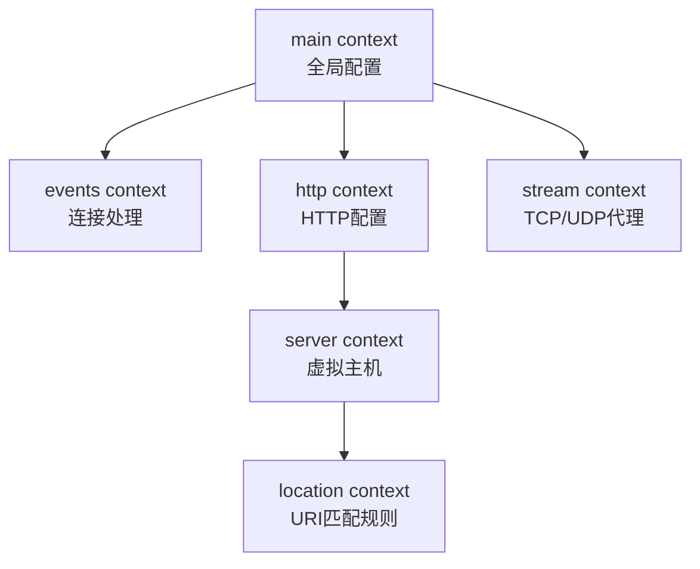

import Tabs from '@theme/Tabs';
import TabItem from '@theme/TabItem';

## 什么是 Nginx

Nginx (engine x) 是一个高性能的 HTTP 和反向代理服务器，特点是占用内存少，并发能力强。Nginx 专为性能优化而开发，在高并发场景下能够支持高达 50,000 个并发连接数的响应。

:::info Nginx 的核心优势
- **高并发高性能**：基于事件驱动架构，采用异步非阻塞方式处理请求
- **反向代理与负载均衡**：可将请求分发到多个后端服务器
- **静态资源服务**：高效处理静态文件
- **热部署**：可以在不停机的情况下升级
:::

## 快速开始

### 安装 Nginx

<Tabs>
  <TabItem value="docker" label="Docker" default>

```bash
# 拉取官方镜像
docker pull nginx:latest

# 运行容器
docker run -d \
  --name mynginx \
  -p 80:80 \
  -v /path/to/html:/usr/share/nginx/html:ro \
  -v /path/to/nginx.conf:/etc/nginx/nginx.conf:ro \
  nginx
```

  </TabItem>
  <TabItem value="ubuntu" label="Ubuntu/Debian">

```bash
# 更新软件包索引
sudo apt update

# 安装 Nginx
sudo apt install nginx

# 启动 Nginx 服务
sudo systemctl start nginx

# 设置开机自启
sudo systemctl enable nginx
```

  </TabItem>
  <TabItem value="centos" label="CentOS/RHEL">

```bash
# 安装 Nginx
sudo yum install nginx

# 启动 Nginx 服务
sudo systemctl start nginx

# 设置开机自启
sudo systemctl enable nginx
```

  </TabItem>
</Tabs>

### 常用命令

```bash
# 测试配置文件语法
nginx -t

# 重新加载配置（无需停止服务）
nginx -s reload

# 优雅停止（等待 worker 进程完成当前请求）
nginx -s quit

# 立即停止
nginx -s stop

# 查看 Nginx 版本
nginx -v

# 查看编译配置参数
nginx -V
```

## 配置文件结构

Nginx 配置文件由**指令（directives）**组成，分为**简单指令**和**块指令**两种。

### 指令类型

**简单指令**：由指令名称、参数和分号组成

```nginx
worker_processes  4;          # 设置 worker 进程数
pid        /var/run/nginx.pid; # 指定 pid 文件路径
```

**块指令**：使用大括号 `{}` 包裹其他指令，不用分号结尾

```nginx
events {
    worker_connections  1024;
}

http {
    server {
        location / {
            # 配置内容
        }
    }
}
```

### Context 作用域

Nginx 的配置有层级结构，每个块指令形成一个作用域（context）：



:::tip 配置继承规则
子 context 会继承父 context 的配置，子 context 中的同名指令会覆盖父 context 的配置
:::

### 标准配置文件结构

```nginx title="/etc/nginx/nginx.conf" showLineNumbers
# ==================== 全局配置 ====================
user  nginx;                    # worker 进程运行用户
worker_processes  auto;         # worker 进程数，auto 表示自动检测 CPU 核心数

error_log  /var/log/nginx/error.log notice;  # 错误日志路径和级别
pid        /var/run/nginx.pid;               # pid 文件路径

# ==================== 事件模块 ====================
events {
    worker_connections  1024;   # 每个 worker 进程的最大连接数
    use epoll;                  # 使用 epoll 事件驱动模型（Linux 推荐）
}

# ==================== HTTP模块 ====================
http {
    # MIME类型配置
    include       /etc/nginx/mime.types;
    default_type  application/octet-stream;

    # 日志格式定义
    log_format  main  '$remote_addr - $remote_user [$time_local] "$request" '
                      '$status $body_bytes_sent "$http_referer" '
                      '"$http_user_agent" "$http_x_forwarded_for"';

    access_log  /var/log/nginx/access.log  main;

    # 性能优化
    sendfile        on;         # 高效文件传输
    tcp_nopush      on;         # 优化数据包发送
    tcp_nodelay     on;         # 禁用 Nagle 算法，减少延迟
    keepalive_timeout  65;      # 长连接超时时间

    # Gzip 压缩
    gzip  on;
    gzip_vary on;
    gzip_comp_level 6;
    gzip_types text/plain text/css text/xml text/javascript 
               application/json application/javascript application/xml+rss;

    # 引入其他配置文件
    include /etc/nginx/conf.d/*.conf;
    include /etc/nginx/sites-enabled/*;
}
```

## 核心模块详解

### Core Module (核心模块)

核心模块提供Nginx的基础功能配置：

| 指令 | 说明 | 示例 |
| :---- | :---- | :---- |
| `worker_processes` | worker进程数量 | `worker_processes auto;` |
| `worker_connections` | 每个worker的最大连接数 | `worker_connections 1024;` |
| `error_log` | 错误日志路径和级别 | `error_log logs/error.log warn;` |
| `pid` | 主进程PID文件路径 | `pid /var/run/nginx.pid;` |
| `include` | 引入其他配置文件 | `include /etc/nginx/conf.d/*.conf;` |

:::warning 性能优化建议
- `worker_processes` 通常设置为 CPU 核心数或设为 `auto`
- `worker_connections` 默认 1024，高并发场景可设为 4096 或更高
- 需同时调整系统的 `ulimit -n` 参数
:::

### HTTP Module（HTTP 模块）

HTTP 模块是 Nginx 最重要的模块，用于配置 HTTP/HTTPS 服务。

#### server 块 - 虚拟主机

`server` 块定义虚拟主机，可配置多个虚拟主机监听不同端口或域名：

```nginx title="基础虚拟主机配置" {2,3,5-7}
server {
    listen       80;                    # 监听端口
    server_name  example.com www.example.com;  # 域名

    # 访问日志（可为每个虚拟主机单独配置）
    access_log  /var/log/nginx/example.access.log  main;
    error_log   /var/log/nginx/example.error.log   warn;

    location / {
        root   /usr/share/nginx/html;
        index  index.html index.htm;
    }
}
```

#### location 块 - URI 匹配

`location` 用于匹配 URI 路径，支持多种匹配模式：

| 匹配模式 | 语法 | 优先级 | 说明 |
| :---- | :---- | :----: | :---- |
| 精确匹配 | `location = /path` | 1 | 完全匹配URI |
| 前缀匹配（优先） | `location ^~ /path` | 2 | 前缀匹配，匹配成功后停止搜索 |
| 正则匹配（区分大小写） | `location ~ pattern` | 3 | 正则表达式匹配 |
| 正则匹配（不区分大小写） | `location ~* pattern` | 3 | 正则表达式匹配 |
| 前缀匹配 | `location /path` | 4 | 普通前缀匹配 |

```nginx title="location匹配示例"
server {
    listen 80;
    server_name example.com;

    # 精确匹配：只匹配 /
    location = / {
        return 200 "精确匹配首页";
    }

    # 优先前缀匹配：匹配 /api/ 开头的所有请求
    location ^~ /api/ {
        proxy_pass http://backend:8080;
    }

    # 正则匹配：匹配图片文件
    location ~* \.(gif|jpg|jpeg|png|webp)$ {
        root /data/images;
        expires 30d;  # 缓存30天
    }

    # 正则匹配：匹配静态资源
    location ~ \.(css|js)$ {
        root /data/static;
        expires 7d;
    }

    # 普通前缀匹配：匹配所有 /docs/ 开头的请求
    location /docs/ {
        root /usr/share/nginx;
    }

    # 默认匹配：其他所有请求
    location / {
        root /usr/share/nginx/html;
        index index.html;
    }
}
```

## 企业级实战配置

### 静态资源服务

```nginx title="/etc/nginx/conf.d/static.conf" showLineNumbers
server {
    listen       80;
    server_name  static.example.com;

    # 访问日志
    access_log  /var/log/nginx/static.access.log  main;

    # 网站根目录
    root /data/www;

    # 默认首页
    location / {
        index  index.html index.htm;
        try_files $uri $uri/ =404;
    }

    # 图片资源目录
    location /images/ {
        alias /data/images/;           # 使用alias重定向路径
        
        # 缓存配置
        expires 30d;                   # 浏览器缓存30天
        add_header Cache-Control "public, immutable";
        
        # 跨域配置
        add_header Access-Control-Allow-Origin *;
    }

    # 匹配特定扩展名的静态资源
    location ~* \.(gif|jpg|jpeg|png|webp|svg|ico)$ {
        root /data/images;
        expires 30d;
        access_log off;                # 不记录访问日志
    }

    # CSS和JS文件
    location ~* \.(css|js)$ {
        root /data/www;
        expires 7d;
        add_header Cache-Control "public";
    }

    # 字体文件
    location ~* \.(woff|woff2|ttf|otf|eot)$ {
        root /data/fonts;
        expires 1y;
        add_header Access-Control-Allow-Origin *;
    }

    # 禁止访问隐藏文件
    location ~ /\. {
        deny all;
        access_log off;
        log_not_found off;
    }
}
```

### 单页应用(SPA)部署

单页应用（React/Vue/Angular）使用前端路由，需要特殊配置：

```nginx title="/etc/nginx/conf.d/spa.conf" showLineNumbers
server {
    listen       80;
    server_name  app.example.com;

    root /usr/share/nginx/html;
    index index.html;

    # 前端路由配置：所有路径都返回 index.html
    location / {
        try_files $uri $uri/ /index.html;
    }

    # API请求代理到后端
    location /api/ {
        proxy_pass http://backend:8080/;
        proxy_set_header Host $host;
        proxy_set_header X-Real-IP $remote_addr;
        proxy_set_header X-Forwarded-For $proxy_add_x_forwarded_for;
        proxy_set_header X-Forwarded-Proto $scheme;
    }

    # 静态资源缓存
    location ~* \.(js|css|png|jpg|jpeg|gif|ico|svg|woff|woff2)$ {
        expires 1y;
        add_header Cache-Control "public, immutable";
    }

    # Service Worker不缓存
    location = /service-worker.js {
        expires off;
        add_header Cache-Control "no-cache, no-store, must-revalidate";
    }

    # 安全头部
    add_header X-Frame-Options "SAMEORIGIN" always;
    add_header X-Content-Type-Options "nosniff" always;
    add_header X-XSS-Protection "1; mode=block" always;
}
```

:::tip SPA配置要点
`try_files $uri $uri/ /index.html;` 的作用：
1. 先尝试访问 `$uri` 对应的文件
2. 如果不存在，尝试访问 `$uri/` 目录
3. 都不存在时，返回 `index.html`，交由前端路由处理
:::

### 反向代理

```nginx title="/etc/nginx/conf.d/proxy.conf" showLineNumbers
server {
    listen       80;
    server_name  api.example.com;

    # 代理到后端服务
    location /api/ {
        # 代理目标（注意末尾的 / 会替换掉 /api/）
        proxy_pass http://localhost:8080/;

        # === 请求头配置 ===
        proxy_set_header Host $host;                      # 传递原始Host
        proxy_set_header X-Real-IP $remote_addr;          # 客户端真实IP
        proxy_set_header X-Forwarded-For $proxy_add_x_forwarded_for;  # 代理链IP
        proxy_set_header X-Forwarded-Proto $scheme;       # 原始协议(http/https)

        # === 超时配置 ===
        proxy_connect_timeout 60s;   # 连接后端超时时间
        proxy_send_timeout 60s;      # 发送请求超时时间
        proxy_read_timeout 60s;      # 读取响应超时时间

        # === 缓冲配置 ===
        proxy_buffering on;              # 启用缓冲
        proxy_buffer_size 4k;            # 缓冲区大小
        proxy_buffers 8 4k;              # 缓冲区数量和大小
        proxy_busy_buffers_size 8k;      # 忙碌缓冲区大小

        # === 其他配置 ===
        proxy_redirect off;              # 不修改重定向响应
        proxy_http_version 1.1;          # 使用HTTP/1.1
        proxy_set_header Connection ""; # 支持长连接
    }

    # WebSocket代理
    location /ws/ {
        proxy_pass http://localhost:8080/ws/;
        
        # WebSocket必需配置
        proxy_http_version 1.1;
        proxy_set_header Upgrade $http_upgrade;
        proxy_set_header Connection "upgrade";
        proxy_set_header Host $host;
        
        # 超时时间（WebSocket通常需要更长的超时）
        proxy_read_timeout 3600s;
        proxy_send_timeout 3600s;
    }
}
```

:::warning proxy_pass的路径规则
- `proxy_pass http://backend;` - 保留location匹配的路径
- `proxy_pass http://backend/;` - 替换location匹配的路径
- `proxy_pass http://backend/api;` - 使用指定路径替换

示例：
```nginx
location /api/ {
    # 访问 /api/users 会代理到 http://backend/users
    proxy_pass http://backend/;
}

location /api/ {
    # 访问 /api/users 会代理到 http://backend/api/users
    proxy_pass http://backend;
}
```
:::

### 负载均衡

Nginx支持将请求分发到多个后端服务器，实现高可用和负载均衡。

#### 负载均衡算法

Nginx支持三种负载均衡算法：

<Tabs>
  <TabItem value="round-robin" label="轮询(默认)" default>

**轮询(round-robin)**：依次将请求分配给每个服务器，支持按权重比例分配。

```nginx title="轮询算法"
upstream backend {
    server backend1.example.com;
    server backend2.example.com;
    server backend3.example.com;
}

# 加权轮询
upstream backend_weighted {
    server backend1.example.com weight=3;  # 权重3，接收3/6的请求
    server backend2.example.com weight=2;  # 权重2，接收2/6的请求
    server backend3.example.com weight=1;  # 权重1，接收1/6的请求
}
```

**适用场景**：各服务器性能相近的场景
**优点**：配置简单，请求分配均匀
**缺点**：不考虑服务器当前负载状态

  </TabItem>
  <TabItem value="least-conn" label="最少连接">

**最少连接(least_conn)**：将请求分配给当前活跃连接数最少的服务器。

```nginx title="最少连接算法"
upstream backend {
    least_conn;  # 启用最少连接算法
    
    server backend1.example.com;
    server backend2.example.com;
    server backend3.example.com;
}
```

**适用场景**：请求处理时间差异较大的场景
**优点**：更智能的负载分配，避免某台服务器过载
**缺点**：相比轮询，计算开销略大

  </TabItem>
  <TabItem value="ip-hash" label="IP哈希">

**IP哈希(ip_hash)**：根据客户端IP计算哈希值，固定分配到特定服务器。

```nginx title="IP哈希算法"
upstream backend {
    ip_hash;  # 启用IP哈希算法
    
    server backend1.example.com;
    server backend2.example.com;
    server backend3.example.com;
}
```

**适用场景**：需要会话保持（session sticky）的场景
**优点**：同一客户端的请求固定路由到同一服务器
**缺点**：可能导致负载不均，不支持weight参数

  </TabItem>
</Tabs>

#### 完整的负载均衡配置

```nginx title="/etc/nginx/conf.d/loadbalance.conf" showLineNumbers
# ==================== 上游服务器定义 ====================
upstream backend_servers {
    # 负载均衡算法（默认轮询，可选 least_conn 或 ip_hash）
    least_conn;

    # 后端服务器列表
    server 192.168.1.101:8080 weight=3 max_fails=2 fail_timeout=30s;
    server 192.168.1.102:8080 weight=2 max_fails=2 fail_timeout=30s;
    server 192.168.1.103:8080 weight=1 max_fails=2 fail_timeout=30s;
    server 192.168.1.104:8080 backup;  # 备份服务器，仅在其他服务器都不可用时使用
    
    # 长连接配置（提高性能）
    keepalive 32;  # 保持32个长连接
}

# ==================== 虚拟主机配置 ====================
server {
    listen       80;
    server_name  www.example.com;

    location / {
        # 代理到上游服务器组
        proxy_pass http://backend_servers;

        # 请求头配置
        proxy_set_header Host $host;
        proxy_set_header X-Real-IP $remote_addr;
        proxy_set_header X-Forwarded-For $proxy_add_x_forwarded_for;

        # 支持长连接
        proxy_http_version 1.1;
        proxy_set_header Connection "";

        # 超时配置
        proxy_connect_timeout 5s;
        proxy_send_timeout 60s;
        proxy_read_timeout 60s;

        # 错误处理：如果后端返回502/503/504，尝试下一个服务器
        proxy_next_upstream error timeout http_502 http_503 http_504;
        proxy_next_upstream_tries 2;      # 最多尝试2次
        proxy_next_upstream_timeout 10s;  # 尝试总超时时间
    }

    # 健康检查页面（用于负载均衡器检查Nginx状态）
    location /health {
        access_log off;
        return 200 "healthy\n";
        add_header Content-Type text/plain;
    }
}
```

#### 服务器参数说明

| 参数 | 说明 | 示例 |
| :---- | :---- | :---- |
| `weight` | 权重，默认为1 | `weight=3` |
| `max_fails` | 失败次数，超过后标记为不可用 | `max_fails=2` |
| `fail_timeout` | 失败超时时间 | `fail_timeout=30s` |
| `backup` | 备份服务器 | `backup` |
| `down` | 标记服务器永久不可用 | `down` |
| `max_conns` | 最大连接数限制 | `max_conns=100` |

:::info 健康检查机制
Nginx自带被动健康检查：
- 当后端服务器连续失败 `max_fails` 次后，标记为不可用
- 在 `fail_timeout` 时间内不再分配请求
- 时间到期后自动尝试恢复
- 主动健康检查需要商业版Nginx Plus或使用第三方模块
:::

### HTTPS/SSL配置

```nginx title="/etc/nginx/conf.d/ssl.conf" showLineNumbers
# ==================== HTTP重定向到HTTPS ====================
server {
    listen       80;
    server_name  example.com www.example.com;

    # 将所有HTTP请求重定向到HTTPS
    return 301 https://$server_name$request_uri;
}

# ==================== HTTPS配置 ====================
server {
    listen       443 ssl http2;  # 启用SSL和HTTP/2
    server_name  example.com www.example.com;

    # === SSL证书配置 ===
    ssl_certificate      /etc/nginx/ssl/example.com.crt;      # 证书文件
    ssl_certificate_key  /etc/nginx/ssl/example.com.key;      # 私钥文件
    ssl_trusted_certificate /etc/nginx/ssl/ca-bundle.crt;     # CA证书链

    # === SSL协议和加密套件 ===
    ssl_protocols        TLSv1.2 TLSv1.3;  # 仅支持TLS 1.2和1.3
    ssl_ciphers          HIGH:!aNULL:!MD5:!RC4:!3DES;  # 加密套件
    ssl_prefer_server_ciphers on;  # 优先使用服务器端加密套件

    # === SSL会话缓存 ===
    ssl_session_cache    shared:SSL:10m;   # 共享缓存，大小10MB
    ssl_session_timeout  10m;              # 会话超时时间10分钟
    ssl_session_tickets  off;              # 关闭session ticket（更安全）

    # === OCSP Stapling（提高SSL握手性能）===
    ssl_stapling on;
    ssl_stapling_verify on;
    resolver 8.8.8.8 8.8.4.4 valid=300s;   # DNS解析器
    resolver_timeout 5s;

    # === 安全头部 ===
    add_header Strict-Transport-Security "max-age=31536000; includeSubDomains" always;  # HSTS
    add_header X-Frame-Options "SAMEORIGIN" always;
    add_header X-Content-Type-Options "nosniff" always;
    add_header X-XSS-Protection "1; mode=block" always;

    # === 站点配置 ===
    root /usr/share/nginx/html;
    index index.html;

    location / {
        try_files $uri $uri/ =404;
    }
}
```

:::tip 免费SSL证书
推荐使用 [Let's Encrypt](https://letsencrypt.org/) 获取免费SSL证书：

```bash
# 安装certbot
sudo apt install certbot python3-certbot-nginx

# 自动配置Nginx SSL
sudo certbot --nginx -d example.com -d www.example.com

# 自动续期（添加到crontab）
0 0 * * * certbot renew --quiet
```
:::

## 常用变量参考

Nginx提供了丰富的内置变量，可在配置中使用：

| 变量 | 说明 | 示例值 |
| :---- | :---- | :---- |
| `$host` | 请求的主机名 | `example.com` |
| `$uri` | 当前请求的URI（不含参数） | `/api/users` |
| `$request_uri` | 完整的原始请求URI（含参数） | `/api/users?id=1` |
| `$args` | 请求参数 | `id=1&name=test` |
| `$remote_addr` | 客户端IP地址 | `192.168.1.100` |
| `$remote_port` | 客户端端口 | `54321` |
| `$server_addr` | 服务器IP地址 | `10.0.0.1` |
| `$server_port` | 服务器端口 | `80` |
| `$scheme` | 请求协议 | `http` 或 `https` |
| `$request_method` | 请求方法 | `GET` `POST` 等 |
| `$content_type` | Content-Type头 | `application/json` |
| `$http_user_agent` | User-Agent头 | `Mozilla/5.0...` |
| `$http_referer` | Referer头 | `https://google.com` |

## 性能优化

### 工作进程优化

```nginx
# 自动设置为CPU核心数
worker_processes auto;

# 将worker进程绑定到特定CPU核心（避免进程切换开销）
worker_cpu_affinity auto;

# 每个worker进程的最大连接数
events {
    worker_connections 4096;
    use epoll;  # Linux使用epoll
    multi_accept on;  # 允许一次接受多个连接
}
```

### 文件传输优化

```nginx
http {
    # 高效文件传输
    sendfile on;
    tcp_nopush on;
    tcp_nodelay on;

    # 文件句柄缓存
    open_file_cache max=10000 inactive=60s;
    open_file_cache_valid 30s;
    open_file_cache_min_uses 2;
    open_file_cache_errors on;
}
```

### Gzip压缩优化

```nginx
http {
    gzip on;
    gzip_vary on;
    gzip_proxied any;
    gzip_comp_level 6;  # 压缩级别1-9，6是性能和压缩比的平衡点
    gzip_types text/plain text/css text/xml text/javascript 
               application/json application/javascript 
               application/xml+rss application/rss+xml 
               font/truetype font/opentype 
               application/vnd.ms-fontobject 
               image/svg+xml;
    gzip_disable "msie6";  # 禁用IE6的gzip
    gzip_min_length 1000;  # 小于1KB的文件不压缩
}
```

### 缓存配置

```nginx
# 代理缓存配置
proxy_cache_path /var/cache/nginx levels=1:2 keys_zone=my_cache:10m 
                 max_size=1g inactive=60m use_temp_path=off;

server {
    location / {
        proxy_pass http://backend;
        
        # 启用缓存
        proxy_cache my_cache;
        proxy_cache_valid 200 304 12h;  # 成功响应缓存12小时
        proxy_cache_valid any 1m;        # 其他响应缓存1分钟
        
        # 缓存键
        proxy_cache_key "$scheme$request_method$host$request_uri";
        
        # 显示缓存状态
        add_header X-Cache-Status $upstream_cache_status;
    }
}
```

## 故障排查

### 查看日志

```bash
# 实时查看访问日志
tail -f /var/log/nginx/access.log

# 实时查看错误日志
tail -f /var/log/nginx/error.log

# 查看最近100行错误日志
tail -n 100 /var/log/nginx/error.log

# 搜索特定错误
grep "error" /var/log/nginx/error.log | tail -n 50
```

### 常见错误排查

:::danger 502 Bad Gateway
**原因**：
- 后端服务未启动或无法连接
- 后端服务响应超时
- SELinux阻止连接

**排查步骤**：
```bash
# 1. 检查后端服务是否运行
systemctl status backend-service

# 2. 测试能否连接后端
curl http://localhost:8080

# 3. 检查SELinux状态（CentOS/RHEL）
getenforce
# 临时关闭SELinux
sudo setenforce 0

# 4. 允许Nginx网络连接
sudo setsebool -P httpd_can_network_connect 1
```
:::

:::warning 413 Request Entity Too Large
**原因**：上传文件大小超过限制

**解决方案**：
```nginx
http {
    client_max_body_size 100M;  # 设置最大上传大小
}
```
:::

:::warning 504 Gateway Timeout
**原因**：后端处理请求超时

**解决方案**：
```nginx
location / {
    proxy_pass http://backend;
    proxy_connect_timeout 300s;
    proxy_send_timeout 300s;
    proxy_read_timeout 300s;
}
```
:::

### 测试配置文件

```bash
# 测试配置文件语法
nginx -t

# 查看详细错误信息
nginx -t -v

# 测试配置并查看所有配置项
nginx -T
```

## 安全加固

### 隐藏版本号

```nginx
http {
    server_tokens off;  # 隐藏Nginx版本号
}
```

### 限制请求速率

```nginx
http {
    # 定义限流区域：每个IP每秒最多10个请求
    limit_req_zone $binary_remote_addr zone=api_limit:10m rate=10r/s;

    server {
        location /api/ {
            # 应用限流：允许突发20个请求，延迟处理超出的请求
            limit_req zone=api_limit burst=20 nodelay;
            
            proxy_pass http://backend;
        }
    }
}
```

### 限制连接数

```nginx
http {
    # 定义限制区域：每个IP最多10个并发连接
    limit_conn_zone $binary_remote_addr zone=addr:10m;

    server {
        # 应用连接限制
        limit_conn addr 10;
        
        location /download/ {
            limit_conn addr 1;       # 下载目录每个IP只允许1个连接
            limit_rate 500k;         # 限速500KB/s
        }
    }
}
```

### 防止恶意访问

```nginx
server {
    # 禁止特定User-Agent
    if ($http_user_agent ~* (bot|spider|crawler|scanner)) {
        return 403;
    }

    # 禁止特定请求方法
    if ($request_method !~ ^(GET|POST|HEAD)$) {
        return 405;
    }

    # 防止目录遍历攻击
    location ~ /\. {
        deny all;
        access_log off;
        log_not_found off;
    }

    # 禁止访问敏感文件
    location ~* \.(sql|bak|swp|old|tmp)$ {
        deny all;
    }
}
```

## 最佳实践总结

:::tip 配置文件组织
1. **模块化配置**：将不同功能拆分到独立文件
   ```
   /etc/nginx/
   ├── nginx.conf           # 主配置
   ├── conf.d/             # 通用配置
   │   ├── gzip.conf
   │   └── security.conf
   └── sites-enabled/      # 站点配置
       ├── example.com.conf
       └── api.example.com.conf
   ```

2. **使用include指令**：提高可维护性
   ```nginx
   http {
       include /etc/nginx/conf.d/*.conf;
       include /etc/nginx/sites-enabled/*.conf;
   }
   ```

3. **注释重要配置**：便于团队协作
:::

:::tip 性能优化清单
- ✅ 设置合理的 `worker_processes` 和 `worker_connections`
- ✅ 启用 `sendfile`、`tcp_nopush`、`tcp_nodelay`
- ✅ 配置 Gzip 压缩
- ✅ 启用静态资源浏览器缓存
- ✅ 使用 `upstream` 的 `keepalive` 长连接
- ✅ 配置合理的超时时间
:::

:::tip 安全加固清单
- ✅ 隐藏Nginx版本号 (`server_tokens off`)
- ✅ 使用HTTPS并配置HSTS
- ✅ 配置请求速率限制和连接数限制
- ✅ 设置安全响应头（X-Frame-Options、X-XSS-Protection等）
- ✅ 禁止访问隐藏文件和敏感文件
- ✅ 定期更新Nginx版本
:::

## 参考资源

- [Nginx官方文档](http://nginx.org/en/docs/)
- [Nginx新手指南](http://nginx.org/en/docs/beginners_guide.html)
- [Nginx配置指令索引](http://nginx.org/en/docs/dirindex.html)
- [Nginx变量索引](http://nginx.org/en/docs/varindex.html)
- [使用Nginx作为HTTP负载均衡器](http://nginx.org/en/docs/http/load_balancing.html)
- [配置HTTPS服务器](http://nginx.org/en/docs/http/configuring_https_servers.html)
