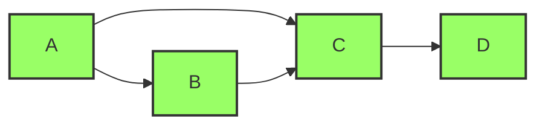
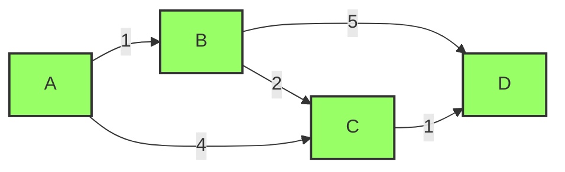
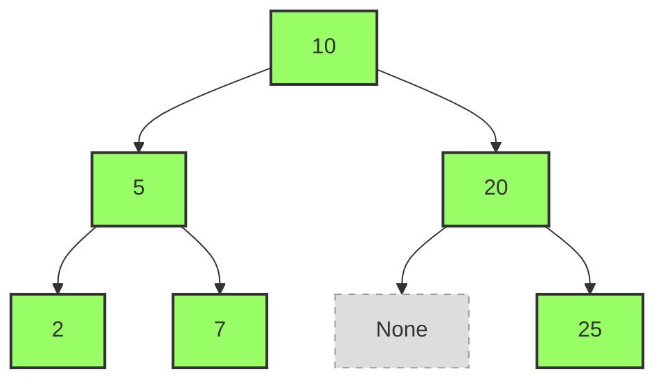
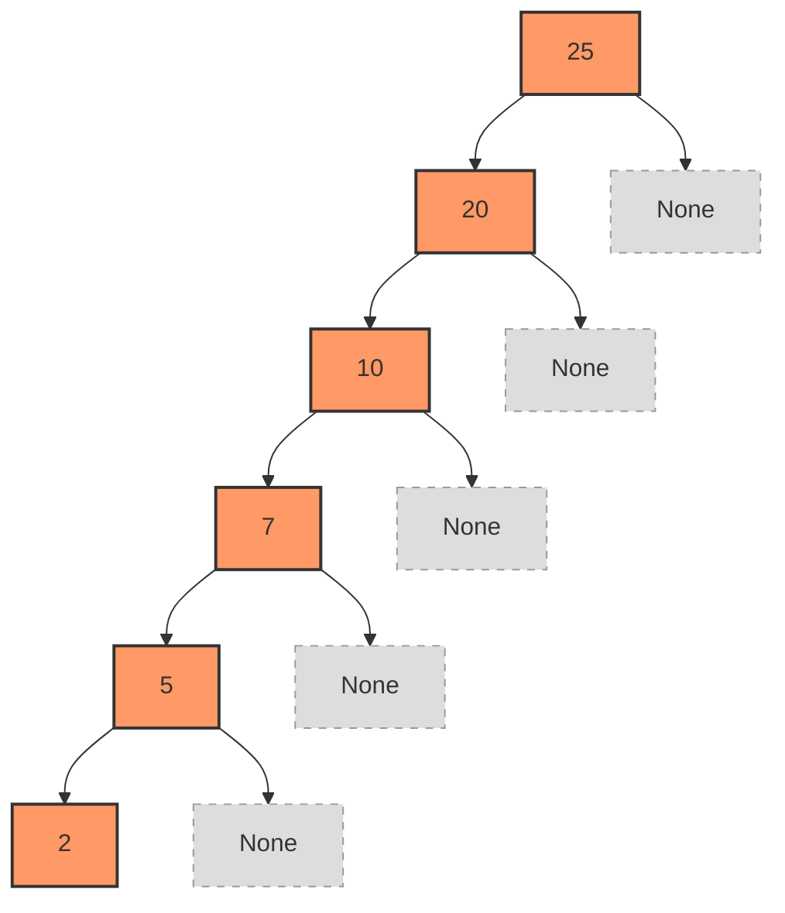

有太多的天才程序员、知名学者、行业大佬，都或多或少写过算法相关的书籍。目前算法已经是每个程序员必备的技能之一，是进入大厂的第一道门槛。

本文面向初学者，由浅入深的给出一些算法题解，帮助你理解算法的基本概念和实现方式。

:::tip
本篇内容主要参考《算法图解》，后续推荐

- [labuladong的算法笔记](https://labuladong.online/zh/roadmap/)
- [Algorithms](https://thealgorithms.github.io/Python/DIRECTORY.html)

如果你对算法产生了浓厚的兴趣，可以去参加[LeetCode竞赛](https://leetcode.cn/contest/)，赢取属于你的Offer和奖品。

算法部分值得花1年以上的时间去探索。
:::

## 基础

大O表示法是一种表示算法时间复杂度的方法。它表示算法运行时间与输入规模之间的关系。

```bash showLineNumbers
O(1) # 常数时间复杂度
O(log n) # 对数时间复杂度
O(n) # 线性时间复杂度
O(n log n) # 线性对数时间复杂度
O(n^2) # 平方时间复杂度
```

对于大O表示法，我们只需要关注最高次项并忽略系数。例如`O(2n + 1)`可以简化为`O(n)`。

请你完成下面的练习并给出其时间复杂度。

### 二分查找

#### 描述

给定一个有序列表和一个目标值，请你查找目标值在列表中的索引。如果目标值不存在，则返回-1。

```bash showLineNumbers
arr = [1, 2, 6, 7, 8, 9, 10]
target = 6
输出: 2
```

```bash showLineNumbers
arr = [1, 2, 6, 7, 8, 9, 10]
target = 0
输出: -1
```

#### 题解

```python showLineNumbers  
def binary_search(arr, target):
    left, right = 0, len(arr) - 1
    while left <= right:
        mid = (left + right) // 2
        if arr[mid] == target:
            return mid
        elif arr[mid] < target:
            left = mid + 1
        else:
            right = mid - 1
    return -1

print(binary_search([1, 2, 6, 7, 8, 9, 10], 0))# -1
print(binary_search([1, 2, 6, 7, 8, 9, 10], 6))# 2
```

### 冒泡排序

#### 描述

给定一个列表，请你对列表的元素进行排序。

示例：
```bash showLineNumbers
输入: [13, 22, 6, 99, 11, 0]
输出: [0, 6, 11, 13, 22, 99]
```

```bash showLineNumbers
输入: [13, 22, 6, 99, 11, 0]
输出: [0, 6, 11, 13, 22, 99]
```

#### 题解

```python showLineNumbers  
list1 = [13, 22, 6, 99, 11, 0]

for a in range(len(list1)):
    for b in range(a,len(list1)):
        if list1[a] < list1[b]:  #如果m大于了n
           list1[a] ,list1[b] =  list1[b],list1[a]#交换位置
print(list1)
```

## 分治

分治法是一种将问题分解为更小的子问题，然后解决子问题，最后合并子问题结果的算法。

### 快速排序

#### 描述

快速排序（Quicksort）是对冒泡排序的一种改进算法。

该算法的实现基本可分为以下几步：

在数组中选一个基准数（通常为数组第一个）。
将数组中小于基准数的数据移到基准数左边，大于基准数的移到右边
对于基准数左、右两边的数组，不断重复以上两个过程，直到每个子集只有一个元素，即为全部有序。

请你编写它的实现代码。

#### 题解

```python showLineNumbers  
def quick_sort(arr):
    """
    快速排序
    :param arr: 待排序的List
    :return: 排序后的List
    """
    # 递归结束条件：如果列表长度小于等于1，直接返回
    if len(arr) <= 1:
        return arr
    
    # 创建左右2个空列表
    left = []
    right = []
    
    # 选择一个选中值（pivot），选择第一个元素
    pivot = arr[0]
    
    # 将元素分配到左右列表
    for i in range(1, len(arr)):
        if arr[i] <= pivot:  # 小于等于pivot的元素放入左列表
            left.append(arr[i])
        else:  # 大于pivot的元素放入右列表
            right.append(arr[i])
    
    # 递归排序左右两部分，并合并结果
    return quick_sort(left) + [pivot] + quick_sort(right)

# 测试数据
if __name__ == '__main__':
    arr = [17, 56, 71, 38, 61, 62, 48, 28, 57, 42, 10, 21, 12, 90]  # 长度为14
    sorted_arr = quick_sort(arr)
    print("快速排序结果：", sorted_arr)
```

### 密码组合

#### 描述

Python中的string模块包含了许多字符，请根据以下提示设计一个函数：

参数1：密码可用字符的列表
参数2：密码的长度
输出：一个符合要求的所有的密码组合

#### 题解

```python showLineNumbers  
def set_password(chars, length):
    passwords = []
    def get_password(char, length):
        if len(char) == length:  # 修复：检查当前密码长度，而不是字符集长度
            passwords.append(char)  # 修复：添加当前构建的密码，而不是字符集
            return
        for i in chars:
            get_password(char + i, length)
    get_password("", length)
    return passwords

print(set_password(['a', 'b', 'c'], 2))# ['aa', 'ab', 'ac', 'ba', 'bb', 'bc', 'ca', 'cb', 'cc']
print(set_password(['a', 'b', 'c'], 3))# ['aaa', 'aab', 'aac', 'aba', 'abb', 'abc', 'aca', 'acb', 'acc', 'baa', 'bab', 'bac', 'bba', 'bbb', 'bbc', 'bca', 'bcb', 'bcc', 'caa', 'cab', 'cac', 'cba', 'cbb', 'cbc', 'cca', 'ccb', 'ccc']
```


### 括号组合

#### 描述

给定一个数字n，请你生成所有可能的括号组合

#### 题解

```python showLineNumbers  

def generate_parenthesis(n):
    def backtrack(s, left, right):
        if len(s) == 2 * n:
            result.append(s)
            return
        if left < n:
            backtrack(s + '(', left + 1, right)
        if right < left:
            backtrack(s + ')', left, right + 1)

    result = []
    backtrack('', 0, 0)
    return result

print(generate_parenthesis(3))# ['((()))', '(()())', '(())()', '()(())', '()()()']  
```

### 质数分解

#### 描述

每个数字可以写成多个质数的乘积，给定一个数字，请你分解为多个质数

#### 题解

```python showLineNumbers 
def fun(num, list=None):
    if list is None:
        list = []
    for i in range(2, num):
        while num % i == 0:
            list.append(i)
            num = int(num / i)
            if num > 1:
                fun(num)
    return list
x = 9*5
print(fun(x))# [3, 3, 5]
```

## 图

### 最少换乘

#### 描述

假设你要从起点去往终点，路上有多个**单向**站点，怎么设计一个算法，找到最少换乘的路线？

这是一个经典的图论问题，可以用广度优先搜索（BFS）来解决。每条路线可以看作是一条边，换乘次数就是路径的边数。


图数据结构定义：

```python
edges = {
    'A': ['B', 'C'],
    'B': ['C'],
    'C': ['D'],
    'D': [],
}
```

如下图所示：




#### 思路

1. 找到起点能去的所有节点
2. 检查可去节点是否包含终点
3. 如果不包含则继续前往这些节点的可去节点
4. 使用广度优先搜索（BFS）确保找到的是最少换乘路线
5. 使用队列记录当前层级的节点，逐层扩展直到找到终点

#### 题解

```python showLineNumbers

def min_transfers(edges, start, end):
    """
    找到从起点到终点的最少换乘路线
    
    :param edges: 图的邻接表表示，edges[u] = [v1, v2, ...] 表示从u可以到达的站点
    :param start: 起点
    :param end: 终点
    :return: 最少换乘次数和路径，如果无法到达返回-1和None
    """
    if start == end:
        return 0, [start]
    
    # BFS队列，存储(当前站点, 换乘次数, 路径)
    queue = [(start, 0, [start])]
    visited = {start}  # 已访问的站点
    
    # 只要队列不为空，就继续遍历
    while queue:
        # 获取队列中最左侧（最左边是第一个进入队列的元素）元素，并从队列中删除
        # 当前站点, 换乘次数, 路径
        current, transfers, path = queue.pop(0)
        
        # 遍历所有可达的下一个站点(即当前站点可去的站点)
        # 如果当前站点没有下一个站点，则跳过
        # 如果当前站点有下一个站点，则将下一个站点加入队列
        for next_station in edges.get(current, []):
            if next_station == end:
                # 找到终点
                return transfers + 1, path + [end]
            # 如果下一个站点没有被访问过，则将下一个站点加入已访问集合，并加入队列
            # 这一步可以避免重复访问同一个站点，提升算法效率
            if next_station not in visited:
                # 将下一个站点加入已访问集合
                visited.add(next_station)
                # 将下一个站点加入队列
                # 换乘次数加1，路径加上下一个站点
                queue.append((next_station, transfers + 1, path + [next_station]))
    
    # 无法到达终点
    return -1, None

# 测试数据
if __name__ == '__main__':
    # 示例：站点A->B->D, A->C->D, A->D
    edges = {
        'A': ['B', 'C'],
        'B': ['C'],
        'C': ['D'],
        'D': []
    }
    
    transfers, path = min_transfers(edges, 'A', 'D')
    print(f"最少换乘次数: {transfers}")
    print(path)  
```

### 最少价格路径

#### 描述

给定一个带权有向图，每条边都有一个价格（权重），请找到从起点到终点的**价格总和最小**的路径。

这是一个典型的**单源最短路径**问题，可以使用Dijkstra算法来解决（假设所有边权非负）。

图数据结构定义：

```python
graph = {
    'A': [('B', 1), ('C', 4)],
    'B': [('C', 2), ('D', 5)],
    'C': [('D', 1)],
    'D': []
}
```

如下图所示：



虽然`A` -> `B` -> `D` 或 `A` -> `C` -> `D` 的路径最短，但价格较高。

其中沿着`A` -> `B` -> `C` -> `D` 的路径，价格总和最小，为`1 + 2 + 1 = 4`。

#### 思路

1. 初始化起点的距离为0，其他所有节点距离为无穷大
2. 找到起点能去的所有节点，计算到达这些节点的价格
3. 选择价格最小的节点作为下一个访问节点
4. 检查该节点的可去节点，更新到达这些节点的最少价格
5. 重复步骤3-4，直到访问到终点或所有可达节点都访问完毕
6. 使用优先队列（堆）来快速找到价格最小的节点

#### 题解

```python showLineNumbers
def dijkstra(graph, start, end):
    """
    使用Dijkstra算法找到从起点到终点的最少价格路径
    
    :param graph: 图的邻接表表示，graph[u] = [(v1, weight1), (v2, weight2), ...]
    :param start: 起点
    :param end: 终点
    :return: 最少价格和路径，如果无法到达返回-1和None
    """
    # 初始化节点信息字典：每个节点包含价格、前驱节点等信息
    nodes = {}
    processed = set()  # 已处理的节点集合
    
    # 获取所有节点
    # 1. 获取所有节点放入 集合，集合具有去重的特点
    all_nodes = set(graph.keys())
    # 2. 获取所有邻居节点
    for neighbors in graph.values():
        for neighbor, _ in neighbors:
            all_nodes.add(neighbor) # 将邻居节点加入所有节点集合
    
    # 步骤1：初始化起点的距离为0，其他所有节点距离为无穷大
    for node in all_nodes:
        nodes[node] = {
            'price': 0 if node == start else float('inf'),
            'previous': None # 前一个节点
        }
    """
    all_nodes = {'A', 'B', 'C', 'D'}

    nodes = {'A': {'price': 0, 'previous': None},
     'D': {'price': inf, 'previous': None}, 
     'C': {'price': inf, 'previous': None}, 
     'B': {'price': inf, 'previous': None}}
    """
    
    def find_lowest_price_node():
        """在所有未处理的节点中，找到价格最小的节点"""
        lowest_price = float('inf')
        lowest_price_node = None
        for node_name, node_info in nodes.items():
            # 依次取出每个节点，并检查其价格是否小于最低价格
            # 初始选择中，除了起点是0，其他都是无穷大，所以一定会选择起点
            if node_name not in processed:  # 只从未处理的节点中查找
                cost = node_info['price']
                if cost < lowest_price:
                    lowest_price = cost
                    lowest_price_node = node_name
        return lowest_price_node
    
    # 步骤3-5：重复选择价格最小的节点，更新其邻居节点的价格
    node = find_lowest_price_node()  # 在所有未处理的节点中，找到价格最小的节点
    
    while node is not None:  # 只要存在未处理的节点，就继续循环

        # 如果到达终点，可以提前结束（可选优化）
        if node == end:
            break
            
        price = nodes[node]['price']  # 当前节点的价格
        
        # 步骤2和4：找到当前节点能去的所有节点，计算到达这些节点的价格
        neighbors = graph.get(node, [])  # 当前节点的邻居（从图的邻接表中获取）
        for neighbor_name, edge_weight in neighbors:  # 遍历当前节点的邻居
            # 计算到达邻居的价格 = 当前节点价格 + 边权重
            new_price = price + edge_weight
            # 如果到达邻居的价格比当前价格更小，则更新邻居的价格
            if new_price < nodes[neighbor_name]['price']:
                nodes[neighbor_name]['price'] = new_price  # 更新邻居的价格
                nodes[neighbor_name]['previous'] = node  # 更新邻居的前一个节点
        
        processed.add(node)  # 将当前节点标记为已处理
        node = find_lowest_price_node()  # 在所有未处理的节点中，找到价格最小的节点
    
    # 检查是否能到达终点
    if nodes[end]['price'] == float('inf'):
        return -1, None
    
    # 重建路径
    def get_path(node_name):
        """根据前驱节点重建路径"""
        path = []
        current = node_name
        while current is not None:
            path.append(current)
            current = nodes[current]['previous']
        path.reverse()
        return path if path else None
    
    path = get_path(end)
    return nodes[end]['price'], path


# 测试数据
if __name__ == '__main__':
    # 示例图：A->B(1), B->C(2),
    #                 B->D(5),
    #       A->C(4),  C->D(1)
    graph = {
        'A': [('B', 1), ('C', 4)],
        'B': [('C', 2), ('D', 5)],
        'C': [('D', 1)],
        'D': []
    }
    
    price, path = dijkstra(graph, 'A', 'D')
    print(f"最少价格: {price}")
    print(f"路径: {' -> '.join(path)}")  # 最少价格: 4, 路径: A -> B -> C -> D
```

## 树

树是一种特殊的图，没有环路。其中更特殊的是二叉树。二叉树是一种每个节点最多有两个子节点的树。

其中左子节点及其所有子节点称为左子树，右子节点及其所有子节点称为右子树。

树兼顾了数组与链表的优点，即可以快速访问任意元素，又可以快速插入和删除元素。

BST树满足普通二叉树的条件，同时：左子节点与左子树总是比父节点要小，右子节点与右子树总是比父节点要大。

假设其根节点为：10 ，左节点为5，右节点为20 则表示为：`[10, 5, 20]`

如果5有左节点为2，右节点为7。20没有左节点，有右节点为25。则表示为：`[10, 5, 20, 2, 7, None,25]`

如下图所示：



这棵树从根节点出发，到任意子节点，最多只有两条边。所以树的高度为2。

同样的这组数据，也可绘制以25为根节点的树，所有比25小的都在左侧，但是这样树会很高（去往左侧节点需要走很多步）。

如下图所示：



这棵树高度为5，所有节点都形成了一条链，访问最左侧的节点2需要经过5步，效率很低。

AVL树是一种平衡二叉树，它保证树的左右节点尽量平衡，即左右子树的高度差不超过1。

在上面不平衡的树中，你可以把位于中间的节点`10`或者节点`7`，这样可以把树大致对折。持续对折所有节点，直到所有节点都高度差不超过1为止。
:::info
在AVL树中，每个节点存储一个平衡因子，如果仅有左子树或仅有右子树，则平衡因子为1或-1。如果左右子树都有，则平衡因子和为0。

如果左子树还有左子树，没有右子树，则总平衡因子为2，其绝对值大于1。此时需要进行左旋转。

如果右子树还有右子树，没有左子树，则总平衡因子为-2，其绝对值大于1。此时需要进行右旋转。

叶子节点由于没有子节点，所以平衡因子为0。
:::

每当数据被插入，其可以通过O(logn)时间复杂度找到插入位置。

然后对每个父节点更新其平衡因子（父节点数量小于logn）。如果发生不平衡，则最多进行1次旋转操作，即可恢复平衡（常量操作）。

所以插入操作的时间复杂度为：

O(logn) + O(logn) + O(1) = 2O(logn)

大O表示法中，常量可以忽略不计，所以插入操作的时间复杂度为：O(logn)。

:::tip
另一种是伸展树，其访问性能很高，每次访问后，会将访问节点移动到根节点，从而提高后续访问性能。

其工作原理是：你在伸展树中查找过一次节点后，会将该节点移动到根节点，后续再次访问该节点时，可以一瞬间找到该节点。

所有经常访问的节点，都可以会聚集在根节点附近，从而提高访问性能。代价是无法保持自平衡，偶尔访问很偏远的节点，需要更多的时间。

但在大部分情况下，伸展树的访问性能很高，可以接受。
:::

B树是一种广义的二叉树，其每个节点可以有多个子节点，每个节点可以有多个键值。主要用于数据库索引。

在计算机真实进行数据库检索时，需要移动物理部件到指定位置，这称为**寻道**。

寻道时间非常长，好比你去超市买东西，假设你从家走到超市买了一个面包，然后从超市走到家，发现也许应该再买一瓶水。往返很耗时。

B树的理念是：既然都去超市了，不如把这个超市的东西都加载到内存里。免得反复**寻道**。所以B树的子节点更多。

B+树是B树的一种变种和改进，在数据库系统中应用更加广泛。B+树与B树的主要区别在于：

1. **数据存储位置**：
   - B树：内部节点既存储键值，也存储实际数据
   - B+树：只有叶子节点存储实际数据，内部节点只存储键值和指向子节点的指针

2. **叶子节点结构**：
   - B+树的叶子节点通过指针相互连接，形成有序链表
   - 这使得范围查询和顺序访问非常高效

3. **树的高度**：
   - 由于B+树内部节点不存储数据，在相同数据量下，B+树通常比B树更矮
   - 更少的层级意味着更少的磁盘I/O操作

4. **查询性能**：
   - 对于精确查询，B树和B+树性能相近
   - 对于范围查询，B+树性能明显优于B树，因为可以通过叶子节点的链表顺序访问

继续用超市的比喻：B+树就像是在超市门口放了一个**目录架**，目录架上只写了商品类别和对应的货架编号（内部节点存储键值），而实际的商品（数据）都放在货架上（叶子节点）。当你想找某个商品时，先看目录找到货架位置，然后直接去货架拿商品。如果你要买多个同类商品，可以在同一个货架上依次拿取，非常方便。

由于B+树这些优势，大多数现代数据库系统（如MySQL的InnoDB引擎、PostgreSQL等）都采用B+树作为索引结构，特别适合处理大量的范围查询和排序操作。

接下来，请你根据深度优先和广度优先，分别遍历出下面的B树的所有节点。

我们以之前提到的BST树为例：`[10, 5, 20, 2, 7, None, 25]`

树的结构如下：
```bash
        10
       /  \
      5    20
     / \   / \
    2   7 None 25
```

### 深度优先(DFS)

深度优先遍历有三种方式：前序遍历、中序遍历、后序遍历。

**1. 前序遍历（根-左-右）**

访问顺序：先访问根节点，再访问左子树，最后访问右子树。

```python showLineNumbers
class TreeNode:
    def __init__(self, val=0, left=None, right=None):
        self.val = val
        self.left = left
        self.right = right

def preorder_traversal(root):
    """前序遍历：根-左-右"""
    result = []
    
    def dfs(node):
        if node is None:
            return
        result.append(node.val)  # 先访问根节点
        dfs(node.left)           # 再访问左子树
        dfs(node.right)          # 最后访问右子树
    
    dfs(root)
    return result

# 构建树：[10, 5, 20, 2, 7, None, 25]
root = TreeNode(10)
root.left = TreeNode(5)
root.right = TreeNode(20)
root.left.left = TreeNode(2)
root.left.right = TreeNode(7)
root.right.right = TreeNode(25)

print("前序遍历结果:", preorder_traversal(root))
# 输出: [10, 5, 2, 7, 20, 25]
```

**2. 中序遍历（左-根-右）**

访问顺序：先访问左子树，再访问根节点，最后访问右子树。对于BST树，中序遍历的结果是有序的。

```python showLineNumbers
def inorder_traversal(root):
    """中序遍历：左-根-右"""
    result = []
    
    def dfs(node):
        if node is None:
            return
        dfs(node.left)           # 先访问左子树
        result.append(node.val)  # 再访问根节点
        dfs(node.right)          # 最后访问右子树
    
    dfs(root)
    return result

print("中序遍历结果:", inorder_traversal(root))
# 输出: [2, 5, 7, 10, 20, 25]  (BST树中序遍历是有序的)
```

**3. 后序遍历（左-右-根）**

访问顺序：先访问左子树，再访问右子树，最后访问根节点。

```python
def postorder_traversal(root):
    """后序遍历：左-右-根"""
    result = []
    
    def dfs(node):
        if node is None:
            return
        dfs(node.left)           # 先访问左子树
        dfs(node.right)          # 再访问右子树
        result.append(node.val)  # 最后访问根节点
    
    dfs(root)
    return result

print("后序遍历结果:", postorder_traversal(root))
# 输出: [2, 7, 5, 25, 20, 10]
```

### 广度优先(BFS)

广度优先遍历（层序遍历）使用队列实现，按照从上到下、从左到右的顺序访问节点。

```python showLineNumbers
from collections import deque

def bfs_traversal(root):
    """广度优先遍历（层序遍历）"""
    if not root:
        return []
    
    result = []
    queue = deque([root])
    
    while queue:
        node = queue.popleft()
        result.append(node.val)
        
        # 将左右子节点加入队列
        if node.left:
            queue.append(node.left)
        if node.right:
            queue.append(node.right)
    
    return result

print("广度优先遍历结果:", bfs_traversal(root))
# 输出: [10, 5, 20, 2, 7, 25]
```

**按层输出（每层单独一行）**

```python
def level_order_traversal(root):
    """按层输出，每层单独一个列表"""
    if not root:
        return []
    
    result = []
    queue = deque([root])
    
    while queue:
        level_size = len(queue)  # 当前层的节点数
        level = []
        
        for _ in range(level_size):
            node = queue.popleft()
            level.append(node.val)
            
            if node.left:
                queue.append(node.left)
            if node.right:
                queue.append(node.right)
        
        result.append(level)
    
    return result

print("按层遍历结果:", level_order_traversal(root))
# 输出: [[10], [5, 20], [2, 7, 25]]
```
## 贪心

贪心算法是一种寻找局部最优解的算法。它每次选择当前最优解，直到找到全局最优解。

### 集合覆盖

每个广播站都覆盖一个或者多个州市，广播站的覆盖范围可能会有重复。如何设计一个算法，找到最少广播站，覆盖所有州市？

这是一个典型的**集合覆盖**问题，可以使用贪心算法来解决。

贪婪算法寻找局部最优解，可能不是全局最优解（例如背包问题），但通常情况下，贪婪算法的结果已经足够接近最优解。

数据示例：

```python showLineNumbers
stations = {
    'kone': {'id', 'nv', 'ut'},
    'ktwo': {'wa', 'id', 'mt'},
    'kthree': {'or', 'nv', 'ca'},
    'kfour': {'nv', 'ut'},
    'kfive': {'ca', 'az'},
}
```

#### 思路

正确的解可能有多个，你需要遍历所有未选择的广播站，从中选择一个最多未覆盖的广播站。

#### 题解

```python showLineNumbers
stations = {
    'kone': {'id', 'nv', 'ut'},
    'ktwo': {'wa', 'id', 'mt'},
    'kthree': {'or', 'nv', 'ca'},
    'kfour': {'nv', 'ut'},
    'kfive': {'ca', 'az'},
}

# 最终选择的广播站
final_stations = set()

# 获取所有州
states_needed = set.union(*stations.values())
print(states_needed)
# {'mt', 'az', 'nv', 'wa', 'id', 'ut', 'ca', 'or'}

# 如果还有未覆盖的州，则继续选择最好的广播站
while states_needed :
    # 当前最好的选择
    best_station = None
    # 当前最好的选择覆盖的州
    states_covered = set()
    for station, states in stations.items():
        # 计算当前广播站与还需覆盖的州的交集
        covered = states & states_needed
        # 如果此交集比 states_covered 大，
        if len(covered) > len(states_covered):
            # 则更新当前最好的选择
            best_station = station
            # 则更新覆盖的州为当前交集
            states_covered = covered
    # 需要覆盖的州减去当前最好的选择的覆盖的州
    states_needed -= states_covered
    # 将当前最好的选择添加到最终选择的广播站中
    print(best_station)
    final_stations.add(best_station)
"""
kone
ktwo
kthree
kfive
"""
```

## 动态规划

### 背包问题

假设你有一个4磅的背包，需要在容量范围内，选择总价值最高的物品放入背包。

```python showLineNumbers
items = {
    "音响":{'重量':4, '价值':3000},
    "笔记本电脑":{'重量':3, '价值':2000},
    "吉他":{'重量':1, '价值':1500},
    "iphone":{'重量':1, '价值':2000},
}
```

暴力求解的复杂度为$$2^n$$，其中n是物品数量。

#### 思路

这题属于动态规划问题，首先定义一个二维表格。

|物品名称|0|1|2|3|4|
|---|---|---|---|---|---|
|无物品 | 0 | 0 | 0 | 0 | 0 |
|音响| 0 | A |  | | |
|笔记本电脑| 0 |  |  | | |
|吉他| 0 |  |  | | |
|iphone| 0 |  |  | | |

- 横向增加说明在当前可选择的物品中，背包容量增加。
- 纵向增加说明在当前背包容量下，可选择的物品增加。
- 由于无物品时再多的空间也没有物品可选，所以最大价值都为0。即第一行都为0。
- 由于空间为0时，有再多的物品可选也放不下，所以最大价值都为0。即第一列都为0。


这个表格的左上角的A格子表示：当只有音响可以选择时，且背包容量为1时，可选的最大价值。所以我们可以从左上角的A格子开始，逐步填充表格。


由于音响的重量为4，所以当背包容量为1 ~ 3时，无法选择音响。最大价值为0。当背包容量为4时，可以选择音响，最大价值为3000。

|物品名称|0|1|2|3|4|
|---|---|---|---|---|---|
|无物品 | 0 | 0 | 0 | 0 | 0 |
|音响| 0 | 0 | 0 | 0| 3000|
|笔记本电脑| 0 |  |  | |
|吉他| 0 |  |  | |
|iphone| 0 |  |  | |

当来到第二行时，可以选择笔记本电脑或音响。其中笔记本电脑重量为3，所以当背包容量为1 ~ 2时，无法选择笔记本电脑。最大价值为0。

当背包容量为3时，可以选择笔记本电脑，最大价值为2000。当背包容量为4时，可以选择笔记本电脑或音响，由于音响的价值更高，所以选择音响，最大价值为3000。

|物品名称|0|1|2|3|4|
|---|---|---|---|---|---|
|无物品 | 0 | 0 | 0 | 0 | 0 |
|音响| 0 | 0 | 0 | 0| 3000|
|笔记本电脑| 0 | 0 | 0 | 2000| 3000|
|吉他| 0 |  |  | |
|iphone| 0 |  |  | |

当来到第三行时，可以选择吉他、笔记本电脑或音响。

当背包重量为1~2时，选吉他，最大价值为1500。不选则为0。所以应该选择，此时最大价值为1500。

你会发现从上往下，每行都比上一行多一个物品。且对应的最大价值不会变小（只会变大或者与上一行相等）

目前已经更新的表的最后一行，就表示当前容量下，可选物品的最大价值。

且从左向右，每列都比前一格容量更多，所以对应的最大价值也不会变小（只会变大或者与上一行相等）

最终右下角的值，就是整个表最大的值之一（因为可能会有多个相等的最大值）

|物品名称|0|1|2|3|4|
|---|---|---|---|---|---|
|无物品 | 0 | 0 | 0 | 0 | 0 |
|音响| 0 | 0 | 0 | 0 | 3000|
|笔记本电脑| 0 | 0 | 0 | 2000 | 3000|
|吉他| 0 | 1500 | 1500 | X | Y |
|iphone|0 |   |  |  | |

当填写 "X" 时，我们<Highlight>向上数一格</Highlight>，发现没有新增当前行的物品可选时，容量为3时，历史最佳价值是2000。

如果选了吉他（1500），剩余空间为2，则无法选择其他物品，所以最大价值为1500。

2000 > 1500，所以填写2000。

当填写 "Y" 时，我们<Highlight>向左看</Highlight>，发现"Y"只比左侧的"X"增加<Highlight>一个</Highlight>空间。<Highlight>向上看</Highlight>，发现之前的最佳选择是3000。

所以我们选了当前行的物品（吉他），剩余空间为3，排除吉他（向上走一行）历史上空间为3的最佳选择是2000。所以最大价值为2000 + 1500 = 3500。

没有新增当前行的物品可选时，容量为3时，历史最佳价值是3000。

所以取两者中的最大值，所以应该填 3500

|物品名称|0|1|2|3|4|
|---|---|---|---|---|---|
|无物品 | 0 | 0 | 0 | 0 | 0 |
|音响|0 |  0 | 0 | 0 | 3000|
|笔记本电脑| 0 | 0 | 0 | 2000 | 3000|
|吉他| 0 | 1500 | 1500 | 2000 | 3500 |
|iphone|0 |   |  |  | |

最后一层，我们尝试编写伪代码

<Highlight>每下移一行，我们就会多了一个物品可以选择。所以这一行的每个判断都是围绕着是否选择这个新增物品展开的。</Highlight>

首先判断当前背包空间是否大于等于这个物品的空间。如果是否则直接沿用上一列对应格子的值。

其次判断如果比当前物品大，是否选择：

如果选择这个物品，`最大价值 = 当前物品价值 + 表格[前一行][（当前背包空间-物品空间）的值]`

如果不选择这个物品，`最大价值 = 表格[前一行][当前背包空间的值]`

我们来试一下：

```bash showLineNumbers

当前容量 = 1

当前背包空间是否大于等于这个物品的空间？ 1 >=1 ——> 是

如果选择这个物品：

最大价值 = 当前物品价值（2000） + 表格[前一行][（当前背包空间-物品空间）的值]（0） = 2000

如果不选择这个物品：

最大价值 = 表格[前一行][当前背包空间的值]（1500） = 1500

所以应该选择这个物品，最大价值为2000。
```

|物品名称|0|1|2|3|4|
|---|---|---|---|---|---|
|无物品 | 0 | 0 | 0 | 0 | 0 |
|音响|  0 | 0 | 0 | 0 | 3000|
|笔记本电脑|  0 | 0 | 0 | 2000 | 3000|
|吉他|  0 | 1500 | 1500 | 2000 | 3500 |
|iphone|  0 | 2000 |  |  | |

```bash showLineNumbers
当前容量 = 2

当前背包空间是否大于等于这个物品的空间？ 2 >=1 ——> 是

如果选择这个物品：

最大价值 = 当前物品价值（2000） + 表格[前一行][（当前背包空间-物品空间）的值]（1500） = 3500

如果不选择这个物品：

最大价值 = 表格[前一行][当前背包空间的值]（1500） = 1500

所以应该选择这个物品，最大价值为3500。
```

|物品名称|0|1|2|3|4|
|---|---|---|---|---|---|
|无物品 | 0 | 0 | 0 | 0 | 0 |
|音响| 0 |  0 | 0 | 0 | 3000|
|笔记本电脑| 0 |  0 | 0 | 2000 | 3000|
|吉他|  0 | 1500 | 1500 | 2000 | 3500 |
|iphone|  0 | 2000 | 3500 |  |  |

```bash showLineNumbers
当前容量 = 3

当前背包空间是否大于等于这个物品的空间？ 3 >=1 ——> 是

如果选择这个物品：

最大价值 = 当前物品价值（2000） + 表格[前一行][（当前背包空间-物品空间）的值]（1500） = 3500

如果不选择这个物品：

最大价值 = 表格[前一行][当前背包空间的值]（2000） = 2000

所以应该选择这个物品，最大价值为3500。
```
|物品名称|0|1|2|3|4|
|---|---|---|---|---|---|
|无物品 | 0 | 0 | 0 | 0 | 0 |
|音响| 0|0 | 0 | 0 | 3000|
|笔记本电脑| 0|0 | 0 | 2000 | 3000|
|吉他| 0|1500 | 1500 | 2000 | 3500 |
|iphone| 0|2000 | 3500 | 3500 |  |


```bash showLineNumbers
当前容量 = 4

当前背包空间是否大于等于这个物品的空间？ 4 >=1 ——> 是

如果选择这个物品：

最大价值 = 当前物品价值（2000） + 表格[前一行][（当前背包空间-物品空间）的值]（2000） = 4000

如果不选择这个物品：

最大价值 = 表格[前一行][当前背包空间的值]（3500） = 3500

所以应该选择这个物品，最大价值为4000。
```

|物品名称|0|1|2|3|4|
|---|---|---|---|---|---|
|无物品 | 0 | 0 | 0 | 0 | 0 |
|音响| 0 |0 | 0 | 0 | 3000|
|笔记本电脑|0 |0 | 0 | 2000 | 3000|
|吉他| 0 |1500 | 1500 | 2000 | 3500 |
|iphone|0 | 2000 | 3500 | 3500 | 4000 |

最后的最大值一定在左下角。（可能出现多个相等的最大值）

外层是嵌套循环：先逐行遍历物品，再逐列遍历背包空间。

内层是嵌套判断：空间是否大于等于当前物品的空间，如果大于等于则判断是否选择当前物品。

#### 题解

```python showLineNumbers
items = {
    "音响": {'重量': 4, '价值': 3000},
    "笔记本电脑": {'重量': 3, '价值': 2000},
    "吉他": {'重量': 1, '价值': 1500},
    "iphone": {'重量': 1, '价值': 2000},
}
# 背包最大容量
max_weight = 4
# 物品名称
names = list(items.keys())

# 行：物品个数，列：当前背包容量（1~max_weight）
rows = len(names)
cols = max_weight

# dp[i][w] 表示：在前 i 个物品中选择，容量为 w 时的最大价值
dp = [[0] * (cols + 1) for _ in range(rows + 1)]

# 为了让我们使用统一的状态转移方程，我们多生成了一列0和一行0，便于我们使用统一的状态转移方程。
# 表示当没有物品或没有背包空间时，最大价值为0。
# 下图中我用0.0 将其特殊标注出来
# 你从A开始逐行填写，填到Z
"""
[[0.0, 0.0, 0.0, 0.0, 0.0],
 [0.0, A, 0, 0, 0],
 [0.0, 0, 0, 0, 0],
 [0.0, 0, 0, 0, Z]]
"""
for i in range(1, rows + 1):
    name = names[i - 1]
    weight = items[name]['重量']
    value = items[name]['价值']
    # 判断当前行的每一个背包空间是否应该选择这个物品
    for w in range(1, cols + 1):
        # 首先判断当前背包空间是否大于等于这个物品的空间
        if w < weight:
            # 如果否，则直接沿用上一行对应格子的值
            dp[i][w] = dp[i - 1][w]
        else:
            # 如果是，则围绕「是否选择这个新增物品」展开判断
            # 选择这个物品：当前物品价值 + 表格[前一行][当前背包空间-物品空间]
            choose = value + dp[i - 1][w - weight]
            # 不选择这个物品：表格[前一行][当前背包空间]
            not_choose = dp[i - 1][w]
            # 取两者中的最大值
            dp[i][w] = max(choose, not_choose)

# 打印表格，便于和上面的推导对照
header = ["物品名称"] + [str(w) for w in range(1, cols + 1)]
print("\t".join(header))
for i in range(1, rows + 1):
    row_name = names[i - 1]
    values = [str(dp[i][w]) for w in range(1, cols + 1)]
    print(row_name + "\t" + "\t".join(values))

# 最右下角就是最大价值
max_value = dp[rows][cols]
print("最大总价值：", max_value)
```

### 最长公共子串

当用户输入"hish"时，下面三个单词哪个更有可能是用户真正输入的单词？

- fish
- vista
- hsih（原单词的反转）

我们希望找到：哪个单词和 hish 之间有“最长的公共子串”（连续、顺序一致的公共部分），这个单词就更有可能是用户真正想输的。

#### 思路

这题是不能用集合取交集判断长度来解决的。

因为用户输入的单词是"hish"，而单词"hsih"是原单词的反转。取集合交集判断虽然最长，但是交集不判断顺序。

最长公共子串要求顺序也一致的公共子字符串。

我们可以用动态规划来解决这个问题。

| 字符串 | h | i | s | h |
| --- | --- | --- | --- | --- |
| f | 0(左上角) | 0 | 0 | 0 |
| i | 0  | 0+1=1 |   |  |
| s |   |  |   |  |
| h |   |  |   |  |

如果两个字母不相同，则标记0 , 由于 f 和 `['h', 'i', 's', 'h']` 每个字母都不相同，所以标记0。

如果两个字母相同，值为右上角的邻居的值 + 1  

<Highlight>为了让每个点都有一个左上角，你依然可以在第一行前和第一列前补0</Highlight>

直到填满所有表格。表格最大值为3，说明最多有3个连续相同的字符串。

| 字符串 | h | i | s | h |
| --- | --- | --- | --- | --- |
| f | 0 | 0 | 0 | 0 |
| i | 0  | 1| 0  | 0 |
| s | 0  | 0 | 2  | 0 |
| h | 0  | 0 | 0  | 3 |

接着我们把和hsih的表格也绘制出来。下表说明最多有1个连续相同的字符串。

| 字符串 | h | i | s | h |
| --- | --- | --- | --- | --- |
| h | 1 | 0 | 0 | 1 |
| s | 0  | 0| 1  | 0 |
| i | 0  | 1 | 0  | 0 |
| h | 1 | 0 | 0  | 1|

接着我们把和vista的表格也绘制出来。下表说明最多有2个连续相同的字符串。

| 字符串 | h | i | s | h |
| --- | --- | --- | --- | --- |
| v | 0 | 0 | 0 | 0 |
| i | 0  | 1| 0  | 0 |
| s | 0  | 0| 2  | 0 |
| t | 0  | 0 | 0  | 0 |
| a | 0  | 0 | 0  | 0 |


#### 题解

```python showLineNumbers
# 用户输入的单词
user_word = "hish"

# 备选单词列表
candidates = ["fish", "vista", "hsih"]


def longest_common_substring_length(a, b):
    # 计算字符串 a 和 b 的最长公共子串长度（必须连续、顺序一致）

    # 行：字符串 a 的字符个数，列：字符串 b 的字符个数
    rows = len(a)
    cols = len(b)

    # dp[i][j] 表示：以 a 的第 i 个字符、b 的第 j 个字符结尾时
    # 它们的「最长公共后缀子串」的长度
    # 为了让每个点都有一个左上角，我们在前面额外补一行 0 和一列 0
    dp = [[0] * (cols + 1) for _ in range(rows + 1)]

    # 记录当前遇到的最长公共子串长度
    longest = 0

    # 从第 1 行、第 1 列开始填表（第 0 行和第 0 列是我们人为补上的 0）
    for i in range(1, rows + 1):
        for j in range(1, cols + 1):
            # 如果两个字符相同，就把左上角的值 + 1
            if a[i - 1] == b[j - 1]:
                dp[i][j] = dp[i - 1][j - 1] + 1
                # 顺便更新目前为止的最长公共子串长度
                longest = max(longest, dp[i][j])
            else:
                # 如果两个字符不同，根据「最长公共子串」的定义，这个格子只能是 0
                dp[i][j] = 0

    return longest


# 用上面的函数分别计算每个候选单词和用户输入之间的最长公共子串长度
result = {}
for word in candidates:
    # 每个候选单词和 user_word 的最长公共子串长度
    length = longest_common_substring_length(word, user_word)
    result[word] = length

# 找到最长公共子串长度最大的那个单词
best_word = max(result, key=result.get)
print("最有可能是用户真正输入的单词是：", best_word)
```

至此，你可以总结出动态规划的解题步骤：

- 确定维度？（在背包问题中是物品和背包空间 在最长公共子串问题中是原字符串和待比较字符串）
- 边界条件与初始值？（首行首列前补0）
- 状态转移方程是？（根据题目要求，确定状态转移方程，核心难点）
- 答案在哪？（背包问题中是右下角，最长公共子串问题中是表格最大值）

### 最长公共子序列


当用户输入"fosh"时，下面哪个更有可能是用户真正输入的单词？

- fort
- fish

#### 思路

按照之前最长公共子串的思路，两个单词的最长公共子串都为2。

我们可以绘制出两个单词的表格：

| 字符串 | f | o | s | h |
| --- | --- | --- | --- | --- |
| f | 1 | 0 | 0 | 0 |
| o | 0  | 2| 0  | 0 |
| r | 0  | 0| 0  | 0 |
| t | 0  | 0 | 0  | 0 |

| 字符串 | f | o | s | h |
| --- | --- | --- | --- | --- |
| f | 1 | 0 | 0 | 0 |
| i | 0  | 0| 0  | 0 |
| s | 0  | 0| 1  | 0 |
| h | 0  | 0 | 0  | 2|

但是fish和fosh的相似度更高，怎么修改状态转移方程，使得fish和fosh的相似度更高？

把状态转移方程改为：

- 如果两个字母不相同，则<HoverText text="标记从左上角、上方和左方的值中取最大值" explanation="最长公共子串是取0"/>

- 如果两个字母相同，值为右上角的邻居的值 + 1  

| 字符串 | - | f | o | s | h |
| --- | --- | --- | --- | --- | --- |
| - | 0 | 0 | 0 | 0 | 0 |
| f | 0  | 1 | 1 | 1 | 1 |
| o | 0  | 1|  2  | 2  | 2 |
| r | 0  | 1 | 2  | 2  | 2 |
| t | 0  | 1 | 2  | 2 | 2 |

表格最大值为2，说明最多有2个连续相同的字符串。

| 字符串 | - | f | o | s | h |
| --- | --- | --- | --- | --- | --- |
| - | 0 | 0 | 0 | 0 | 0 |
| f | 0  | 1 | 1 | 1 | 1 |
| i | 0  | 1|  1  | 1  | 1 |
| s | 0  | 1 | 1  | 2  | 2 |
| h | 0  | 1 | 2  | 2 | 3 |

表格最大值为3，说明最多有3个连续相同的字符串。

#### 题解

```python showLineNumbers
# 用户输入的单词
user_word = "fosh"

# 备选单词列表
candidates = ["fort", "fish"]


def longest_common_subsequence_length(a, b):
    # 计算字符串 a 和 b 的最长公共子序列长度（字符顺序一致，但不要求连续）

    # 行：字符串 a 的字符个数，列：字符串 b 的字符个数
    rows = len(a)
    cols = len(b)

    # dp[i][j] 表示：a 的前 i 个字符、b 的前 j 个字符之间
    # 能得到的「最长公共子序列」的长度
    # 为了让每个点都有一个左上角、上方和左方，我们在前面额外补一行 0 和一列 0
    dp = [[0] * (cols + 1) for _ in range(rows + 1)]

    # 从第 1 行、第 1 列开始填表（第 0 行和第 0 列是我们人为补上的 0）
    for i in range(1, rows + 1):
        for j in range(1, cols + 1):
            if a[i - 1] == b[j - 1]:
                # 如果两个字符相同，值为左上角的邻居的值 + 1
                dp[i][j] = dp[i - 1][j - 1] + 1
            else:
                # 如果两个字符不同，则从「左上角、上方和左方」三者中取最大值
                dp[i][j] = max(dp[i - 1][j - 1], dp[i - 1][j], dp[i][j - 1])

    # 整个表格的右下角，就是最长公共子序列的长度
    return dp[rows][cols]


# 用上面的函数分别计算每个候选单词和用户输入之间的最长公共子序列长度
result = {}
for word in candidates:
    # 每个候选单词和 user_word 的最长公共子序列长度
    length = longest_common_subsequence_length(word, user_word)
    result[word] = length

# 打印每个候选单词的最长公共子序列长度，方便对照
for word, length in result.items():
    print(f"{word} 和 {user_word} 的最长公共子序列长度为: {length}")

# 找到最长公共子序列长度最大的那个单词
best_word = max(result, key=result.get)
print("最有可能是用户真正输入的单词是：", best_word)
```
