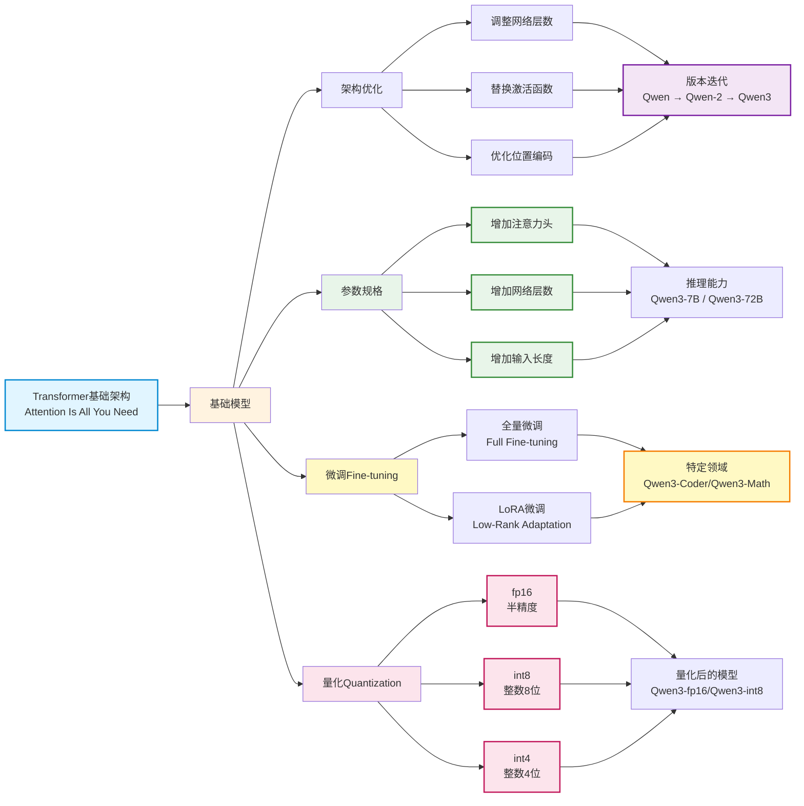

本部分内容告诉你如何选择或者微调量化出功能及大小合适的模型并部署。

## 开源模型

所谓“开源模型”，通常指公开以下两个核心部分：

- 模型架构（Framework）：即网络结构设计，如 Transformer 层堆叠方式、注意力机制等；
- 参数权重（Weights）：训练完成后保存的数值，决定模型的实际能力。

早期代表性开源模型如 LLaMA（Meta）、Qwen（通义）、ChatGLM（智谱）等，均完整发布架构代码和权重文件，推动了社区快速发展。这些模型的设计大多基于经典论文《Attention Is All You Need》提出的 Transformer 架构，成为当今绝大多数大模型的技术基石。

### 模型架构

#### 架构优化

在基础模型之上，各大厂商和研究机构进行了多样化改进：

- 调整网络层数或注意力头数；
- 替换激活函数；
- 优化位置编码；
- 改进训练策略。

每个厂商都有自己的优化想法，由此催生了 Qwen、ChatGLM 等一系列具有各自特色的衍生模型。

以通义千问（Qwen）为例，其经历了从 Qwen → Qwen-2 → Qwen-2.5 → Qwen3 的持续迭代。每一代升级都伴随着架构优化、训练数据扩充、上下文长度提升或推理效率增强，体现了技术的快速演进。

不同的架构显然是不同的开源模型，大模型抄袭与套皮往往指的就是架构一致。下面的表格列出了头部公司及其主要模型代号：

| **国内** | **国外** |
| :---- | :---- |
| 阿里巴巴: 通义千问 (Qwen)/通义万象(Wan) | 谷歌: Gemini/Veo |
| 字节跳动: 豆包 (coze)/即梦(Seedream)  | OpenAI: GPT/Sora |
| 深度求索: DeepSeek | Anthropic: Claude |
| 智谱: 智谱清言 (GLM) | xAI: Grok |
| 腾讯: 混元 (Hunyuan) | Meta: Llama |

### 参数权重

#### 参数多少

模型的参数量是影响性能的关键因素之一，常见规格包括：7B（70亿）、14B（140亿）、72B（720亿）等。

一般来说：参数越大，语言理解与生成能力越强，但对算力、显存要求也更高；参数越小，推理速度快、部署门槛低，适合端侧或边缘设备。

因此，厂商常发布同一架构下的多个参数版本，如 Qwen3-7B、Qwen3-14B、Qwen3-72B，满足不同场景需求。

:::info
随着大模型走向商业化闭源，部分厂商开始淡化甚至隐藏具体参数信息，转而采用更具用户体验导向的命名方式。

- Qwen3-14B 可能对应名称为 Qwen3-Fast
- Qwen3-72B 可能对应名称为 Qwen3-High
:::

#### 权重大小

在预训练模型基础上，将权重大小使用特定领域数据进行进一步训练调整，称为微调（fine-tuning），用于提升模型在某类任务上的表现。微调后的模型也算一个新的开源模型。

- 全量微调（Full Fine-tuning）：更新全部参数，适合有大量高质量数据的场景；
- LoRA 微调（Low-Rank Adaptation）：仅训练低秩矩阵，冻结主干权重，显著降低计算开销。

通过微调，可得到面向特定任务的专用模型，例如：

- Qwen3-Coder：擅长代码生成；
- Qwen3-Math：专精数学推理

#### 权重精度

将权重精度从高精度浮点数（如 float64）转换为低精度表示：

float32 → float16 / bf16 → int8 / int4
虽然会带来轻微精度损失（如 99.99 → 99），但能显著：

- 减少模型体积；
- 降低内存占用；
- 提升推理速度；
- 降低部署门槛。

这个技术称为：模型量化（quantization）

量化后的模型也算新的开源模型。通常在名称中标注精度类型，例如：-fp16、-int8、-g16 等。

### 演化过程

开源模型的完整演化过程可以用下图表示：



这四类演化中，架构是最重要的，目前可以分为三代（代表模型不是最早模型，而是知名度最高的模型）：

| 代际 | 时间段 | 特征 | 代表模型 |
| :---- | :---- | :---- | :---- |
| 第一代 | 2020–2022 | 传统大模型应用 | GPT-3.5 |
| 第二代 | 2023–2024 | 原生多模态应用 | GPT-4o |
| 第三代 | 2025– | 高效架构（MoE）+ 智能体（Agent）范式 | Claude-4.5 |

:::info
Qwen 3-MAX 使用的也是MoE架构。官方称其参数超过1T（1000B）远超最大开源模型 Llama 3.1（405B ）是国内最顶级的第三代模型之一。
:::

## 大模型社区

大模型社区是指围绕大型深度学习模型构建的开放协作平台和生态系统，除了开源模型还提供：数据集、教程、体验等功能。这些社区由研究人员、开发者、数据科学家、工程师及爱好者组成，他们共同致力于大模型的研究、开发、优化和应用。

社区具有明显的马太效应，即头部效应明显，头部模型拥有最多的资源，最新的技术，最多的用户。

### 开源模型推理

Hugging Face 是国外最著名的开源社区，提供了 `transformers` 库，可以方便地下载模型，地址：[https://huggingface.co/](https://huggingface.co/)

魔搭社区是阿里达摩院推出的开源社区，基于中国网络环境，`modelscope` 库，对标 Hugging Face 的 `transformers` 库。地址：[https://www.modelscope.cn/](https://www.modelscope.cn/)

以 Qwen 模型为例，下面展示如何使用 `transformers` 或 `modelscope` 库进行推理。其中`model_name`为模型地址。

```python showLineNumbers
types = "huggingface"  # 模型社区选择："huggingface" 或 "modelscope"
if types == "huggingface":
    from transformers import AutoModelForCausalLM, AutoTokenizer
elif types == "modelscope":
    from modelscope import AutoModelForCausalLM, AutoTokenizer

model_size = "3B"  # 3B 7B 14B 32B
model_name = f"Qwen/Qwen2.5-{model_size}-Instruct"

model = AutoModelForCausalLM.from_pretrained(model_name, torch_dtype="auto", device_map="auto")
tokenizer = AutoTokenizer.from_pretrained(model_name)

while True:
    prompt = input("输入你的问题: ")
    if prompt == "退出":
        break

    messages = [
        {
            "role": "system",
            "content": "你是一个AI助手，由阿里巴巴云创建。你是一个乐于助人的助手。你总是以中文回答问题。",
        },
        {"role": "user", "content": prompt},
    ]
    text = tokenizer.apply_chat_template(messages, tokenize=False, add_generation_prompt=True)
    model_input = tokenizer([text], return_tensors="pt").to(model.device)

    generated_ids = model.generate(**model_input, max_new_tokens=512)
    generated_ids = [output[len(input_ids):] for input_ids, output in zip(model_input.input_ids, generated_ids)]

    response = tokenizer.batch_decode(generated_ids, skip_special_tokens=True)[0]
    print(response)
```
### 开源数据集

除了开源模型，还有开源数据集。

```python showLineNumbers
from modelscope.msdatasets import MsDataset
dataset = MsDataset.load('swift/Chinese-Qwen3-235B-2507-Distill-data-110k-SFT')
print(f'dataset[0]: {dataset[0]}')
```

## 模型评测

为了更好的了解当下模型性能，我们列举了几个模型排名网站，这些网站通过主观测试（人工盲选较优模型）或者客观测试（自动通过含有答案的测试对比准确度），对模型进行排名，并给出排名结果。

- Hugging Face 模型排名：[https://huggingface.co/spaces/HuggingFaceH4/open_llm_leaderboard](https://huggingface.co/spaces/HuggingFaceH4/open_llm_leaderboard)
- lmarena排名：[https://lmarena.ai/](https://lmarena.ai/)

那么如何自动化测评得出排名？

### 自动化评测

#### "考试"评测：客观题与标准化能力测试

这是一种最基础且高效的评测方法，类似于给模型进行一场"标准化考试"。评测者提供包含多选题或客观题的数据集，模型给出答案，然后通过脚本或工具自动比对答案，计算分数。这种方法的优点在于评测过程客观、可重复，且成本低廉。

##### 核心基准测试

**MMLU (Massive Multitask Language Understanding)**：这是一个大规模的英文多任务测试，包含来自人文、社会科学、硬科学等57个领域的选择题。要在这个测试中获得高分，模型必须具备广泛的世界知识和强大的问题解决能力，而非仅仅是单一领域的专家。

**C-Eval**：作为MMLU的中文版，C-Eval是专门为评估语言模型在中文语境下的知识和推理能力而设计的综合性基准。它包含了13,948道多选题，跨越52个学科和4个难度级别，其中许多问题都具有中国特定的文化和常识背景。

**GSM8K**：这是一个由小学数学应用题组成的数据集，主要用于评估模型在数学方面的逻辑推理能力。

##### 如何得出评分

这类评测的核心指标通常是准确率（Accuracy），即模型答对的题目数占总题目数的百分比。例如，在C-Eval的100道题中，如果模型答对了80道，那么它的准确率就是80%。在评测中，准确率分数越高越好。

然而，仅仅依赖这些标准化基准也存在挑战。随着模型能力的提升，业界开始担忧模型是否仅仅是通过对训练数据集的"死记硬背"来获得高分，而非真正具备推理能力。例如，GPT-4在C-Eval Hard等榜单上的表现优于其他模型，但其能力来源是否仅仅是记忆，引发了新的讨论。为了解决这种"刷榜"和数据偏见的问题，研究者们开始构建新的、更具挑战性的评测基准，如GSM-Symbolic和GSM8K-Platinum。这些新的基准通过修正原有数据集中的标签噪音和生成更多样的变体问题，来更准确地衡量模型的真实能力。

这种模型与评测基准之间的博弈，恰恰体现了评测工作的动态演进本质。一个优秀的评测工程师不仅要懂得如何使用现有的工具，更要具备敏锐的洞察力，能够识别现有评测的局限性，并为设计新一代、更可靠的评测体系提供宝贵的见解。

#### "创作"评测：评估文本生成质量

相较于有唯一正确答案的客观题，评估模型生成开放性、非确定性文本（如摘要、翻译、创作等）的能力更具挑战性。自动化评测通过复杂的算法，衡量模型生成文本与人工参考文本之间的相似度，以量化其质量。

##### 核心指标详解

**BLEU (Bilingual Evaluation Understudy)**  
- **核心思想**：BLEU基于n-gram（连续词组）重合度，来衡量模型生成的文本与参考答案有多大的词汇重叠。
- **如何得出评分**：它计算模型生成文本中与参考答案重合的n-gram数量。为了防止模型只生成少量高频词以获得高分，BLEU还引入了简短惩罚（Brevity Penalty）。如果生成文本比参考答案短，分数会降低。
- **计算举例**：
  - 参考答案："The cat sat on the mat."
  - 模型生成："The cat is sitting on the mat."
  - BLEU算法会识别出"the", "cat", "on", "the", "mat"等单词的重合。
- **分数解读**：分数范围在0到1之间，分数越高越好。但需要注意的是，单纯的高分可能无法反映生成文本的语义和语法正确性，因为BLEU不考虑词序和同义词。

**ROUGE (Recall-Oriented Understudy for Gisting Evaluation)**  
- **核心思想**：与BLEU强调精确率不同，ROUGE更关注召回率，即模型生成的文本捕获了多少参考文本中的关键信息。
- **如何得出评分**：
  - ROUGE-N：基于n-gram重合度计算，其召回率公式为：ROUGE−N Recall=参考答案的n−gram总数重合的n−gram数​。
  - ROUGE-L：基于最长公共子序列（LCS）。它寻找两个文本中最长的、顺序一致但不要求连续的单词序列。这使其能更好地衡量句子的整体结构和信息流。
- **分数解读**：分数范围同样在0到1之间，分数越高越好。ROUGE特别适用于评估文本摘要和问答任务中关键信息的完整性。

**METEOR (Metric for Evaluation of Translation with Explicit Ordering)**  
- **核心思想**：METEOR被认为是比BLEU和ROUGE更全面的指标。它综合了精确率和召回率，并加入了词形还原（stemming）和同义词匹配的功能。这使得它能更好地处理不同形式但意思相同的词语，能更接近人类的判断。
- **如何得出评分**：它计算精确率和召回率的调和平均值，并加入一个基于"分块"（chunks）数量的惩罚项，来反映词语的乱序程度。
- **分数解读**：分数范围在0到1之间，分数越高越好。研究表明，METEOR与人类判断的相关性通常更高。

尽管这些自动化指标高效，但它们无法完全捕捉模型的流畅性、逻辑性和观点表达等深层能力。因此，在实际工作中，评测者通常会采用混合评测方式，将自动化评测与人工评测（通过专家打分）和大模型辅助评测（利用GPT-4等强大模型作为"裁判员"）结合起来。一个专业的评测工程师不会只依赖某一个指标，而是能根据具体任务，选择最合适的指标组合，甚至为特定业务需求设计独特的评测体系，例如在代码生成领域使用Pass@k指标来评估代码的功能正确性。这凸显了评测工作的价值在于"组合"与策略。


### 多模态自动化评测

#### 文生图（T2I）评测：图像的"视觉"与"语义"衡量

多模态模型，尤其是文生图（Text-to-Image, T2I）模型，其评测挑战在于需要同时衡量两个关键维度：生成的图像质量（是否真实、美观）以及与输入文本的一致性（是否准确反映提示词）。

##### 核心指标详解

**FID (Fréchet Inception Distance)**  
- **核心思想**：FID是评估图像生成模型质量和多样性的黄金标准。它不直接比较单个生成的图像与真实图像，而是通过计算生成图像的群体分布与真实图像的群体分布之间的距离。
- **如何得出评分**：FID利用一个预训练的图像分类模型（如Inception V3）来提取图像的高维特征。它将真实图像和生成图像的特征向量分别建模为多元正态分布，然后计算这两个分布之间的弗雷谢距离。
- **分数解读**：FID分数越低越好。一个完美的模型，其生成的图像分布与真实图像分布完全一致，FID为0。一个形象的比喻是"遛狗"：如果你的模型能生成各种各样的狗（多样性），且每只狗都栩栩如生（真实性），那么它的FID分数就会很低。反之，如果它只生成一种狗，或者生成的狗都模糊不清，那么FID就会很高。

**CLIP Score (Contrastive Language-Image Pretraining Score)**  
- **核心思想**：CLIP Score专门评估生成图像与输入文本描述的匹配程度，即"图文一致性"。
- **如何得出评分**：CLIP模型将图像和文本映射到同一个嵌入空间，使得语义相关的图文对在此空间中距离相近。CLIP Score就是通过计算图像向量和文本向量之间的余弦相似度来衡量它们的语义相关性。
- **分数解读**：分数范围通常在-1到1，分数越高越好。

**CIDEr (Consensus-based Image Description Evaluation)**  
- **核心思想**：该指标尤其适用于图像描述生成任务。它通过衡量生成的描述与多个人工参考描述之间的共识程度来打分，并使用TF-IDF（词频-逆文档频率）加权，给那些罕见但重要的词语更高的权重。
- **分数解读**：分数越高越好。

**SPICE (Semantic Propositional Image Caption Evaluation)**  
- **核心思想**：SPICE更进一步，它通过**语义图（semantic graph）**来评估生成描述与参考描述的语义相似度，而不仅仅是词语重叠。它关注描述中物体、属性和它们之间的关系，因此对同义词和改写有更强的鲁棒性。
- **分数解读**：分数越高越好。

图像生成模型的评测是多维度的，没有单一指标能完美涵盖所有方面。FID关注图像群体的分布，CLIP Score关注图文匹配，而CIDEr/SPICE关注描述的语义质量。同时，这些自动化指标也存在局限性：FID依赖于特定的预训练模型，计算成本高昂；CLIP Score虽然高效，但可能无法捕捉到细节（如艺术家风格），导致评测不准确。这些局限性推动了行业对更多元化、更精细的评测方法和榜单的探索，并形成了评测工作的**"全栈"**属性。一个顶尖的AI评测工程师不仅要理解这些指标，还要能根据项目需求，选择和组合不同的指标，甚至进行众包评测，从而为模型优化提供最精准、最具价值的反馈。

## 微调与量化

模型微调（Fine-Tuning） 是指在一个预训练的基础模型上，使用特定领域或特定任务的数据进行进一步训练，以使模型能够在特定任务上表现得更好。例如对计算机科学的名词翻译进行微调，可以提高翻译的准确性。
:::info
把模型想象为一个固定容量的大脑，脑容量是固定的，通过微调让它对A印象深刻，它就会淡忘B。
:::

LLaMA-Factory 是基于 LLaMA 的模型微调框架，支持 LoRA 微调、冻结层微调、全量微调。既可以通过 WebUI 微调，也可以通过命令行微调。

项目地址：[https://github.com/hiyouga/LLaMA-Factory](https://github.com/hiyouga/LLaMA-Factory)

安装

```bash
git clone --depth 1 https://github.com/hiyouga/LLaMA-Factory.git
cd LLaMA-Factory
pip install --no-deps -e .
```

启动 WebUI

```bash
llamafactory-cli webui
```

微调有三种方法：LoRA 微调、冻结层微调、全量微调。

以微调一个 **14B 参数**的大型语言模型为例，以下是对三种常见微调方法的硬件需求和大致时间的估算：

### LoRA 微调

**硬件需求**：

- **显存**：~24GB 显存以上即可（如 NVIDIA RTX 3090 或 A100）。LoRA 主要通过冻结大部分模型参数，仅在少量层中插入低秩适配模块，因此显存需求较低。
- **GPU 数量**：单卡或 2 卡即可应付中等规模的微调任务。

**时间估算**：

- **小规模数据**（如数十万条数据，100k steps 以内）：几个小时到 1 天。
- **大规模数据**（如百万条数据，300k steps）：2-3 天。

**优点**：

- 高效，显存需求低，适合个人开发者或中小型实验室。
- 微调后的模型参数（LoRA 插件）仅几百 MB，方便存储和共享。

### 冻结层微调

**硬件需求**：

- **显存**：需要 48GB 以上显存（如 A6000 或 80GB A100）。冻结大部分模型参数，微调后几层或部分特定模块。
- **GPU 数量**：1-4 张高性能 GPU。

**时间估算**：

- **小规模数据**：1-2 天。
- **大规模数据**：3-5 天。

**优点**：

- 显存需求较低，性能适中。
- 微调时间比全量微调短，但仍需较多资源。

### 全量微调

**硬件需求**：

- **显存**：需 80GB 显存以上的高性能 GPU（如 NVIDIA A100 或 H100）。14B 参数模型通常需要 4 卡或更多 GPU 的分布式训练。
- **GPU 数量**：4-8 张 A100（或等效）GPU。对于超大模型，可能需要更多。

**时间估算**：

- **小规模数据**：2-3 天。
- **大规模数据**：5 天到 1 周甚至更长。

**优点**：

- 微调灵活性最高，可以针对特定任务完全优化模型。
- 模型质量可能略高于 LoRA 和冻结层微调。

**缺点**：

- 显存需求高，成本昂贵。
- 微调后模型体积巨大，通常需要数百 GB 存储。

有些框架可以以时间换空间，例如使用梯度检查点：在显存不足时保存中间计算结果，降低瞬时显存需求。或者以精度换空间，例如使用混合精度训练：可以显著减少显存需求和训练时间。有兴趣可以自行搜索。

### 量化

随着语言模型规模的不断增大，其训练的难度和成本已成为共识。 而随着用户数量的增加，模型推理的成本也在不断攀升，甚至可能成为限制模型部署的首要因素。 因此，我们需要对模型进行压缩以加速推理过程，而模型量化是其中一种有效的方法。

大语言模型的参数通常以高精度浮点数存储，这导致模型推理需要大量计算资源。 量化技术通过将高精度数据类型存储的参数转换为低精度数据类型存储， 可以在不改变模型参数量和架构的前提下加速推理过程。这种方法使得模型的部署更加经济高效，也更具可行性。

浮点数一般由 3 部分组成：符号位、指数位和尾数位。指数位越大，可表示的数字范围越大。尾数位越大、数字的精度越高。

量化可以根据何时量化分为：后训练量化和训练感知量化，也可以根据量化参数的确定方式分为：静态量化和动态量化。

#### QAT: 感知量化训练
在训练感知量化（QAT, **Quantization-Aware Training**）中，模型一般在预训练过程中被量化，然后又在训练数据上再次微调，得到最后的量化模型。

#### PTQ: 后训练量化
后训练量化（PTQ, **Post-Training Quantization**）一般指在模型预训练完成后，基于校准数据集（**calibration dataset**）确定量化参数进而对模型进行量化。

#### GPTQ: 分组精度调优量化
GPTQ（**Group-wise Precision Tuning Quantization**）是一种静态的后训练量化技术。  
“静态”指的是预训练模型一旦确定，经过量化后量化参数不再更改。  
**GPTQ 的特点**：
- 将 fp16 精度模型量化为 4-bit
- 节省约 75% 的显存
- 大幅提高推理速度  

**使用示例**：
```yaml
model_name_or_path: TechxGenus/Meta-Llama-3-8B-Instruct-GPTQ
```

#### AWQ: 激活感知层量化
AWQ（**Activation-Aware Layer Quantization**）是一种静态的后训练量化技术。其核心思想为：少部分重要权重保持不被量化，以维持模型性能。  
**AWQ 的优势**：
- 所需校准数据集更小
- 在指令微调和多模态模型上表现良好  

**使用示例**：
```yaml
model_name_or_path: TechxGenus/Meta-Llama-3-8B-Instruct-AWQ
```

#### AQLM: 语言模型加法量化
AQLM（**Additive Quantization of Language Models**）是一种仅对模型权重进行量化的 PTQ 方法。  
**特点**：
- 在 2-bit 量化下达到了最佳性能
- 在 3-bit 和 4-bit 量化下同样表现优异
- 2-bit 量化适用于低显存部署大模型  

尽管 AQLM 的推理速度提升并不显著，但其极低的显存占用具有很高实用价值。

#### OFTQ: 动态后训练量化
OFTQ（**On-the-fly Quantization**）无需校准数据集，直接在推理阶段进行动态量化。  
**特点**：
- 无需校准数据集
- 能够在推理阶段动态量化，保持性能  

**使用示例**：
```yaml
model_name_or_path: meta-llama/Meta-Llama-3-8B-Instruct
quantization_bit: 4
quantization_method: bitsandbytes  # 可选: [bitsandbytes (4/8), hqq (2/3/4/5/6/8), eetq (8)]
```

#### bitsandbytes: 动态后训练量化
区别于 GPTQ，**bitsandbytes** 是一种动态的后训练量化技术。  
**特点**：
- 支持大于 1B 的模型量化
- 在 8-bit 量化后，性能损失极小
- 能够节省约 50% 的显存  

#### HQQ: 半二次量化
HQQ（**Half-Quadratic Quantization**）在准确度和速度之间取得平衡。  
**特点**：
- 不需要校准阶段
- 推理速度极快
- 准确度与需要校准数据的方法相当  

HQQ 是一种动态的后训练量化方法，适合需要快速推理且性能敏感的场景。

#### EETQ: 高效变换器量化
EETQ（**Easy and Efficient Quantization for Transformers**）是一种只对模型权重进行量化的 PTQ 方法。  
**特点**：
- 速度快
- 简单易用  

EETQ 特别适合对性能和实现复杂度都有较高要求的用户。


## 模型本地部署

截至2025年6月,大模型最佳实践依然是本地运行。大型和小型算力平台易用性与性价比均不高。

小型算力平台例如：无问芯穹，需要先企业认证才能开始模型训练与微调。

大型算例平台例如：阿里云百炼，无需企业认证，但是200MB的训练语料就需要加载80分钟，数据还需要分割后再上传。200MB语料下，训练`Qwen2.5 7b`一轮训练就需要4小时，约18元。换算后：1个G的语料，训练`Qwen2.5 7b`一轮训练就需要20小时，约90元。成本是租算力1倍往上。

社区上默认的部署方式往往是用来测试，生产环境下我们往往需要：并发高、延迟低、占用小。同时兼顾不同的底层硬件。主流部署框架是 Ollama 和 VLLM。

| 维度                 | Ollama                                    | VLLM                     |
| :-------------------- | :------------------------------------------ | :---------------------------------------------- |
| **官网**             | [https://ollama.com/](https://ollama.com/) | [https://vllm.ai/](https://vllm.ai/) |
| **GitHub**           | [https://github.com/ollama/ollama](https://github.com/ollama/ollama) | [https://github.com/vllm-project/vllm](https://github.com/vllm-project/vllm) |
| **核心功能**         | 模型管理和推理框架，支持快速加载、切换模型 | 高性能推理引擎，优化 Transformer 模型推理      |
| **主要特点**         | 易用的命令行工具，支持多个预训练模型       | 动态批次合并（dynamic batching），高吞吐量推理 |
| **性能**             | 适中，重点在于易用性                       | 高，专为分布式和高吞吐量推理优化               |
| **支持硬件**         | CPU/GPU                                    | GPU                                            |
| **异步支持**         | 支持多任务异步加载模型                     | 原生支持，面向大规模分布式推理设计                     |         |
| **部署难度**         | 低，支持简单命令行部署                     | 中，需要配置分布式推理环境                     |
| **内存优化**         | 支持基础内存管理                           | 通过动态批次和显存优化提高吞吐量               |
| **适用场景**         | 小型项目、模型快速切换、开发测试           | 高性能推理、分布式推理、服务大规模用户         |
| **对 Python 的支持** | 易于集成到 Python 应用中，支持 REST API  | 强支持，直接集成到 Python 项目                 |

### ollama示例

示例1:ollama部署huggingface模型

```bash showLineNumbers
ollama run hf.co/{username}/{reponame}:latest
```

示例2:运行最新的模型
```bash showLineNumbers
ollama run hf.co/bartowski/Llama-3.2-1B-Instruct-GGUF:latest
```

示例3:运行特定的量化模型
```bash showLineNumbers
ollama run hf.co/bartowski/Llama-3.2-1B-Instruct-GGUF:Q8_0
```

### vllm示例

示例1:vllm部署huggingface模型

```bash showLineNumbers
vllm serve NousResearch/Meta-Llama-3-8B-Instruct --dtype auto --api-key token-abc123
```

示例2：vllm部署本地模型，调用8卡推理
```bash showLineNumbers
vllm serve /home/ly/qwen2.5/Qwen2.5-32B-Instruct/ --tensor-parallel-size 8 --dtype auto --api-key 123 --gpu-memory-utilization 0.95 --max-model-len 27768  --enable-auto-tool-choice --tool-call-parser hermes --served-model-name Qwen2.5-32B-Instruct --kv-cache-dtype fp8_e5m2
```
示例3：vllm部署本地模型，指定某块GPU运行模型
```bash showLineNumbers
CUDA_VISIBLE_DEVICES=2 vllm serve /home/ly/qwen2.5/Qwen2-VL-7B-Instruct --dtype auto --tensor-parallel-size 1 auto --api-key 123 --gpu-memory-utilization 0.5 --max-model-len 5108  --enable-auto-tool-choice --tool-call-parser hermes --served-model-name Qwen2-VL-7B-Instruct --port 1236
```
:::info
Vllm不支持启动一个服务就可以随机切换其他模型（ollama支持）。

通常需要为每一个模型单独运行一次vllm命令，并且每个模型都要提供不同的端口，比如他默认的是8000端口，而我上一个命令使用的是1236端口
:::
