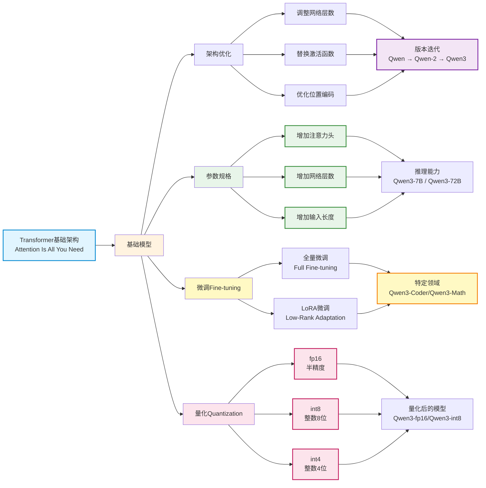

## 开源模型

所谓“开源模型”，通常指公开以下两个核心部分：

- 模型架构（Framework）：即网络结构设计，如 Transformer 层堆叠方式、注意力机制等；
- 参数权重（Weights）：训练完成后保存的数值，决定模型的实际能力。

早期代表性开源模型如 LLaMA（Meta）、Qwen（通义）、ChatGLM（智谱）等，均完整发布架构代码和权重文件，推动了社区快速发展。这些模型的设计大多基于经典论文《Attention Is All You Need》提出的 Transformer 架构，成为当今绝大多数大模型的技术基石。

### 模型架构

#### 架构优化

在基础模型之上，各大厂商和研究机构进行了多样化改进：

- 调整网络层数或注意力头数；
- 替换激活函数；
- 优化位置编码；
- 改进训练策略。

每个厂商都有自己的优化想法，由此催生了 Qwen、ChatGLM 等一系列具有各自特色的衍生模型。

以通义千问（Qwen）为例，其经历了从 Qwen → Qwen-2 → Qwen-2.5 → Qwen3 的持续迭代。每一代升级都伴随着架构优化、训练数据扩充、上下文长度提升或推理效率增强，体现了技术的快速演进。

不同的架构显然是不同的开源模型，大模型抄袭与套皮往往指的就是架构一致。下面的表格列出了头部公司及其主要模型代号：

| **国内** | **国外** |
| :---- | :---- |
| 阿里巴巴: 通义千问 (Qwen)/通义万象(Wan) | 谷歌: Gemini/Veo |
| 字节跳动: 豆包 (coze)/即梦(Seedream)  | OpenAI: GPT/Sora |
| 深度求索: DeepSeek | Anthropic: Claude |
| 智谱: 智谱清言 (GLM) | xAI: Grok |
| 腾讯: 混元 (Hunyuan) | Meta: Llama |

### 参数权重

#### 参数多少

模型的参数量是影响性能的关键因素之一，常见规格包括：7B（70亿）、14B（140亿）、72B（720亿）等。

一般来说：参数越大，语言理解与生成能力越强，但对算力、显存要求也更高；参数越小，推理速度快、部署门槛低，适合端侧或边缘设备。

因此，厂商常发布同一架构下的多个参数版本，如 Qwen3-7B、Qwen3-14B、Qwen3-72B，满足不同场景需求。

:::info
随着大模型走向商业化闭源，部分厂商开始淡化甚至隐藏具体参数信息，转而采用更具用户体验导向的命名方式。

- Qwen3-14B 可能对应名称为 Qwen3-Fast
- Qwen3-72B 可能对应名称为 Qwen3-High
:::

#### 权重大小

在预训练模型基础上，将权重大小使用特定领域数据进行进一步训练调整，称为微调（fine-tuning），用于提升模型在某类任务上的表现。微调后的模型也算一个新的开源模型。

- 全量微调（Full Fine-tuning）：更新全部参数，适合有大量高质量数据的场景；
- LoRA 微调（Low-Rank Adaptation）：仅训练低秩矩阵，冻结主干权重，显著降低计算开销。

通过微调，可得到面向特定任务的专用模型，例如：

- Qwen3-Coder：擅长代码生成；
- Qwen3-Math：专精数学推理

#### 权重精度

将权重精度从高精度浮点数（如 float64）转换为低精度表示：

float32 → float16 / bf16 → int8 / int4
虽然会带来轻微精度损失（如 99.99 → 99），但能显著：

- 减少模型体积；
- 降低内存占用；
- 提升推理速度；
- 降低部署门槛。

这个技术称为：模型量化（quantization）

量化后的模型也算新的开源模型。通常在名称中标注精度类型，例如：-fp16、-int8、-g16 等。

### 演化过程

开源模型的完整演化过程可以用下图表示：



这四类演化中，架构是最重要的，目前可以分为三代（代表模型不是最早模型，而是知名度最高的模型）：

| 代际 | 时间段 | 特征 | 代表模型 |
| :---- | :---- | :---- | :---- |
| 第一代 | 2020–2022 | 传统大模型应用 | GPT-3.5 |
| 第二代 | 2023–2024 | 原生多模态应用 | GPT-4o |
| 第三代 | 2025– | 高效架构（MoE）+ 智能体（Agent）范式 | Claude-4.5 |

:::info
Qwen 3-MAX 使用的也是MoE架构。官方称其参数超过1T（1000B）远超最大开源模型 Llama 3.1（405B ）是国内最顶级的第三代模型之一。
:::

## 大模型社区

大模型社区是指围绕大型深度学习模型构建的开放协作平台和生态系统，除了开源模型还提供：数据集、教程、体验等功能。这些社区由研究人员、开发者、数据科学家、工程师及爱好者组成，他们共同致力于大模型的研究、开发、优化和应用。

社区具有明显的马太效应，即头部效应明显，头部模型拥有最多的资源，最新的技术，最多的用户。

### 开源模型推理

Hugging Face 是国外最著名的开源社区，提供了 `transformers` 库，可以方便地下载模型，地址：[https://huggingface.co/](https://huggingface.co/)

魔搭社区是阿里达摩院推出的开源社区，基于中国网络环境，`modelscope` 库，对标 Hugging Face 的 `transformers` 库。地址：[https://www.modelscope.cn/](https://www.modelscope.cn/)

以 Qwen 模型为例，下面展示如何使用 `transformers` 或 `modelscope` 库进行推理。其中`model_name`为模型地址。

```python showLineNumbers
types = "huggingface"  # 模型社区选择："huggingface" 或 "modelscope"
if types == "huggingface":
    from transformers import AutoModelForCausalLM, AutoTokenizer
elif types == "modelscope":
    from modelscope import AutoModelForCausalLM, AutoTokenizer

model_size = "3B"  # 3B 7B 14B 32B
model_name = f"Qwen/Qwen2.5-{model_size}-Instruct"

model = AutoModelForCausalLM.from_pretrained(model_name, torch_dtype="auto", device_map="auto")
tokenizer = AutoTokenizer.from_pretrained(model_name)

while True:
    prompt = input("输入你的问题: ")
    if prompt == "退出":
        break

    messages = [
        {
            "role": "system",
            "content": "你是一个AI助手，由阿里巴巴云创建。你是一个乐于助人的助手。你总是以中文回答问题。",
        },
        {"role": "user", "content": prompt},
    ]
    text = tokenizer.apply_chat_template(messages, tokenize=False, add_generation_prompt=True)
    model_input = tokenizer([text], return_tensors="pt").to(model.device)

    generated_ids = model.generate(**model_input, max_new_tokens=512)
    generated_ids = [output[len(input_ids):] for input_ids, output in zip(model_input.input_ids, generated_ids)]

    response = tokenizer.batch_decode(generated_ids, skip_special_tokens=True)[0]
    print(response)
```
### 开源数据集

除了开源模型，还有开源数据集。

```python showLineNumbers
from modelscope.msdatasets import MsDataset
dataset = MsDataset.load('swift/Chinese-Qwen3-235B-2507-Distill-data-110k-SFT')
print(f'dataset[0]: {dataset[0]}')
```
