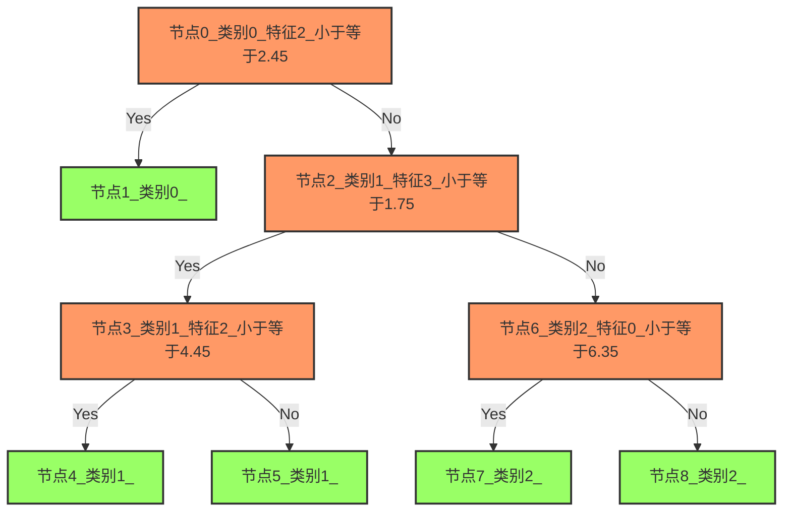

传统机器学习是机器学习的一个分支，主要关注如何使用传统的机器学习算法来解决分类、回归、聚类等问题。

高度依赖于特征工程，需要手动提取特征，然后输入到模型中。

主要使用的框架是`scikit-learn`、`pandas`、`numpy`、`matplotlib`、`opencv`等。

## 分类算法

### KNN算法

这个算法既可以解决分类问题，也可以用于回归问题，但工业上用于分类的情况更多。

KNN 先记录所有已知数据，再利用一个距离函数，

找出已知数据中距离未知事件最近的 K 组数据，

最后按照这 K 组数据里最常见的类别预测该事件。

```python showLineNumbers
from sklearn.neighbors import KNeighborsClassifier
import numpy as np

# 创建一些示例数据
X = np.array([[1, 2], [2, 3], [2, 5], [3, 2], [3, 3], [4, 5]])  # 特征
y = np.array([0, 0, 1, 0, 1, 1])  # 目标标签

# 创建K-最近邻分类器
k = 3  # 选择K的值
model = KNeighborsClassifier(n_neighbors=k).fit(X, y)

# 预测新数据点
new_data_point = np.array([[3, 4]])  # 要预测的新数据点

# .predicts()方法返回一个数组，数组中包含了预测的类别
predicted_class = model.predict(new_data_point)

print("预测类别:", predicted_class)
```

#### 简单实战

```python showLineNumbers
from sklearn.neighbors import KNeighborsClassifier
from sklearn.model_selection import train_test_split

# 导入鸢尾花数据库
from sklearn.datasets import load_iris

# 加载数据集，数据集包含数据的特征、标签、类别等许多信息
iris = load_iris()
# 获取数据特征（即花的高度、宽度等）
iris_X = iris.data
# 获取数据标签（即花的品种，用0、1、2代替）
iris_y = iris.target
print(len(iris_X)) # 查看数据集的大小

# # 获取前2条数据,从0开始到2结束,不包括2。写法1
# print(iris_X[0:2])

# # 获取前2条数据,从0开始到2结束,不包括2。写法2，省略0
# print(iris_X[:2])

# # 获取前2条数据,从0开始到2结束,不包括2。写法3，省略0
# print(iris_X[:2,:])

# # 获取前2条数据,从0开始到2结束,不包括2。写法4，省略0,只取第一列
# print(iris_X[:2,0])

# # 查看花的类别
# print(iris_y)
# # 查看花的数据
# print(iris_X)
# # 合在一起查看
# print(list(zip(iris_X,iris_y)))

# 把数据打乱，并分成测试数据和训练数据，test_size是测试数据的比例，0.3表示为30%
X_train, X_test, y_train, y_test = train_test_split(iris_X, iris_y, test_size=0.3)

'''
train_test_split详解

此方法会将数据和标签均分成两部分并打乱，一部分用于训练，一部分用于测试。

所以返回的数据有4个，我们用1、2、3、4给他们做上记号.

数据X [------70%---(1)-- | -30%(2)-]
标签y [------70%---(3)-- | -30%(4)-]

与上图对应，依次是:

训练的数据X(1),  测试的数据X(2),
     ↑↓              ↑↓
训练的标签y(3),  测试的标签y(4)

用(1)、(3)喂出一个模型

让模型预测(2)，获得预测结果

将预测结果与(4)进行比较来测试模型的准确率
'''

# 查看训练数据，已经被随机打乱了
# print(y_train)
# 实例化KNN分类器
knn = KNeighborsClassifier()
# .fit()方法用于训练模型，即让模型从数据中学习
knn.fit(X_train, y_train)
# .predicts()方法返回一个数组，数组中包含了预测的类别
print(knn.predict(X_test))
# 查看真实数据
print(y_test)
```

#### 效果评估

```python showLineNumbers
right = 0
error = 0
for i in zip(knn.predict(X_test),y_test):
    #print(i)
    if i[0] == i[1]:
        right +=1
    else:
        error +=1
print(right,error)
print('正确率：{}%'.format(right/(right+error)*100))
```

#### 效果评估的改进

```python showLineNumbers
print('正确率：{}%'.format(knn.score(X_test,y_test)*100))

# 正确率：100.0%
```

#### 实时分类器

##### 描述

KNN 算法先记录所有已知数据，再利用一个距离函数，找出已知数据中距离未知事件最近的 K 组数据，最后按照这 K 组数据里最常见的类别预测该事件。可以解决分类问题。

请编写一段程序读取用户的摄像头，让用户通过按键或点击的方式实时训练并查看当前摄像头的预测结果。

##### 题解

```python showLineNumbers
'''
新建`.py`并将下方代码复制进去，确保已经安装好了下方的模块库。

pip install opencv-python
pip install tensorflow


1. 等待模型加载（加载完成后会弹出摄像头）

2. 按下键盘的A则获取当前摄像头截图加入A训练集

3. 以此类推添加B、C训练集

4. 观察屏幕输出的预测结果
'''
import cv2
import tensorflow as tf
from tensorflow.keras.applications import MobileNet
from tensorflow.keras.preprocessing import image
from tensorflow.keras.applications.mobilenet import preprocess_input
from tensorflow.keras.models import Model
import numpy as np


# 定义KNN分类器类
class KNNClassifier:
    def __init__(self):
        # 初始化存储不同类别样本特征的字典，包含A、B、C三个类别
        self.examples = {"A": [], "B": [], "C": []}

    def add_example(self, activation, class_id):
        # 将新的特征向量添加到对应类别的样本集中
        self.examples[class_id].append(activation)

    def predict_class(self, activation):
        # 初始化存储各类别距离的字典
        distances = {}
        # 遍历所有类别及其对应的样本
        for class_id, examples in self.examples.items():
            # 计算当前特征向量与该类别所有样本的平均欧氏距离
            distances[class_id] = np.mean(
                # np.linalg.norm 计算向量范数 范数是衡量向量"大小"或"长度"的数学概念。最常用的是2范数（也叫欧氏范数），就是我们熟悉的向量长度公式。
                [np.linalg.norm(act - activation) for act in examples]
            )

        # 找到距离最小的类别作为预测结果
        predicted_class = min(distances, key=distances.get)
        # 根据距离计算置信度，距离越小置信度越高
        confidence = 1 / (1 + distances[predicted_class])
        # 返回预测类别和置信度
        return predicted_class, confidence


def main():
    # 创建KNN分类器实例
    classifier = KNNClassifier()
    # 初始化摄像头，参数0表示默认摄像头
    webcam = cv2.VideoCapture(0)

    print("Loading MobileNet...")
    # 加载预训练的MobileNet模型，使用ImageNet权重
    base_model = tf.keras.applications.MobileNet(weights="imagenet")
    # 创建特征提取模型，输出conv_preds层的特征（用于分类的高级特征）
    model = Model(
        inputs=base_model.input, outputs=base_model.get_layer("conv_preds").output
    )

    print("Successfully loaded model")

    # 定义三个分类类别
    classes = ["A", "B", "C"]

    # 主循环，持续处理摄像头画面
    while True:
        # 从摄像头读取一帧图像
        ret, frame = webcam.read()
        # 将图像调整为224x224像素，这是MobileNet的输入尺寸要求
        frame = cv2.resize(frame, (224, 224))
        # 将OpenCV图像转换为Keras可处理的数组格式
        img = image.img_to_array(frame)
        # 增加批次维度，从(224,224,3)变为(1,224,224,3)
        img = np.expand_dims(img, axis=0)
        # 使用MobileNet专用的预处理函数，标准化像素值
        img = preprocess_input(img)

        # 通过模型提取图像的高级特征向量
        activation = model.predict(img)

        # 检测键盘输入，等待1毫秒
        key = cv2.waitKey(1)
        # 如果按下'a'键，将当前特征添加到类别A的训练样本中
        if key == ord("a"):
            classifier.add_example(activation, "A")
        # 如果按下'b'键，将当前特征添加到类别B的训练样本中
        elif key == ord("b"):
            classifier.add_example(activation, "B")
        # 如果按下'c'键，将当前特征添加到类别C的训练样本中
        elif key == ord("c"):
            classifier.add_example(activation, "C")

        # 只有当至少有一个A类别的样本时才进行预测
        if len(classifier.examples["A"]) > 0:
            # 使用KNN算法预测当前图像的类别
            predicted_class, confidence = classifier.predict_class(activation)
            # 打印预测结果和置信度
            print(f"Prediction: {predicted_class}, Confidence: {confidence}")

        # 显示摄像头画面窗口
        cv2.imshow("Webcam", frame)

        # 如果按下ESC键（ASCII码27），退出循环
        if key == 27:  # ESC key to break from the loop
            break

    # 释放摄像头资源
    webcam.release()
    # 关闭所有OpenCV窗口
    cv2.destroyAllWindows()


# 运行主函数
main()

```


### 朴素贝叶斯

这个算法是建立在贝叶斯理论上的分类方法。

它的假设条件是自变量之间相互独立。

简言之，朴素贝叶斯假定某一特征的出现与其它特征无关。即给定类别，特征之间没有相关性。这个假设是“朴素”的来源。

比如说，如果一个水果它是红色的，圆状的，直径大概 7cm 左右，我们可能猜测它为苹果。即使这些特征之间存在一定关系，在朴素贝叶斯算法中我们都认为红色，圆状和直径在判断一个水果是苹果的可能性上是相互独立的。

一个二分类的案例假设:

我今天收到了 100 封邮件，其中有 80 封是垃圾邮件，20 封是正常邮件。

```markdown
P（垃圾邮件） = 80/100 = 0.8
P（正常邮件） = 20/100 = 0.2
```

我选定了一些词作为特征，这些词可能出现在邮件中，也可能不出现。这些词有“免费”，“恭喜”，“辛苦”等。

我发现垃圾邮件中有 20 封含有“免费”这个词，50 封含有“恭喜”这个词，0 封含有“辛苦”这个词。

```markdown
P（免费|垃圾邮件） = 20/80 = 0.25
P（恭喜|垃圾邮件） = 50/80 = 0.625
P（辛苦|垃圾邮件） = 0/80 = 0
```

正常邮件中有 5 封含有“免费”这个词。6 封含有“恭喜”这个词，2 封含有“辛苦”这个词。

```markdown
P（免费|正常邮件） = 5/20 = 0.25
P（恭喜|正常邮件） = 6/20 = 0.3
P（辛苦|正常邮件） = 2/20 = 0.1
```

现在我收到了一封邮件，这封邮件内容为：“**恭喜**您获得了一次**免费**的机会”，我想知道这封邮件是垃圾邮件的概率是多少？

```markdown
P（垃圾邮件|免费，恭喜） = P（免费|垃圾邮件）* P（恭喜|垃圾邮件）* P（垃圾邮件）= 0.25 * 0.625 * 0.8 = 0.125

P（正常邮件|免费，恭喜） = P（免费|正常邮件）* P（恭喜|正常邮件）* P（正常邮件）= 0.25 * 0.3 * 0.2 = 0.015
```

因为 P（垃圾邮件|免费，恭喜） > P（正常邮件|免费，恭喜），所以这封邮件被判定为垃圾邮件。

如果狡猾的垃圾邮件制造者把邮件内容改为：“**恭喜**您获得了一次**免费**的机会，**辛苦**您动动手指参加我们的**免费**活动”，那么这封邮件被判定为垃圾邮件的概率就会变成 0，因为“辛苦”这个词在正常邮件中有出现，在垃圾邮件中没有出现。

改进:拉普拉斯平滑法

在每个关键词上人为的增加一个出现的次数，这样就不会出现概率为 0 的情况了。（下面的公式免费的平方表示这个关键词出现 2 次）

```markdown
P（垃圾邮件|免费，恭喜，辛苦） = P（免费|垃圾邮件）* P（恭喜|垃圾邮件）* P（辛苦|垃圾邮件）* P（垃圾邮件）= (20+1/80)² * (50+1/80) * (0+1/80) * 0.8 = 0.0351421875

P（正常邮件|免费，恭喜，辛苦） = P（免费|正常邮件）* P（恭喜|正常邮件）* P（辛苦|正常邮件）* P（正常邮件）= (5+1/20)² * (6+1/20) * (2+1/20) * 0.2 =0.012885
```

```python showLineNumbers

# 参考答案
import numpy as np

class NaiveBayes:
    def __init__(self):
        self.class_probs = {}  # 存储每个类别的先验概率 P(c)
        self.word_probs = {}   # 存储每个类别中单词的条件概率 P(w|c)
        self.vocab = set()     # 保存所有出现的单词构成的词汇表
        self.smooth = 1        # 拉普拉斯平滑参数

    def fit(self, X, y):
        # 获取唯一类别和其数量
        classes, class_counts = np.unique(y, return_counts=True)
        self.class_probs = {label: count / len(y) for label, count in zip(classes, class_counts)}  # 先验概率
        
        # 初始化词汇表和词频统计
        word_count = {label: {} for label in classes}  # 每个类别的词频表
        class_word_totals = {label: 0 for label in classes}  # 每个类别单词总数
        
        # 遍历每个样本进行分词和统计
        for text, label in zip(X, y):
            words = text.split(" ")
            for word in words:
                self.vocab.add(word)  # 添加到词汇表
                if word not in word_count[label]:
                    word_count[label][word] = 0
                word_count[label][word] += 1  # 更新词频
                class_word_totals[label] += 1  # 当前类别单词总数加1

        # 计算条件概率 P(w|c) 加拉普拉斯平滑
        vocab_size = len(self.vocab)  # 词汇表大小
        self.word_probs = {label: {} for label in classes}
        for label in classes:
            for word in self.vocab:
                count = word_count[label].get(word, 0)  # 获取词频，若未出现则为0
                self.word_probs[label][word] = (count + self.smooth) / (
                    class_word_totals[label] + vocab_size * self.smooth
                )

    def predict(self, X):
        predictions = []  # 存储所有样本的预测结果
        for text in X:
            words = text.split(" ")
            class_scores = {}  # 存储每个类别的后验概率

            # 计算后验概率 P(c|w1,w2,...,wn)
            for label in self.class_probs:
                class_scores[label] = self.class_probs[label]
                for word in words:
                    if word in self.word_probs[label]:  # 如果词在词汇表中
                        class_scores[label] *= self.word_probs[label][word]
                    else:
                        # 若单词未在词汇表中，跳过计算
                        class_scores[label] *= 1/len(self.vocab)
            
            # 选择后验概率最大的类别作为预测结果
            predictions.append(max(class_scores, key=class_scores.get))
        
        return predictions
    
    def score(self, X, y):
        predictions = self.predict(X)
        return np.mean(predictions == y)


# 数据
data = np.array([
    ("恭喜 你 赢得 了 大奖 ！","诈骗"),
    ("请 立即 更新 您 的 账户 信息","诈骗"),
    ("您的 账户 存在 异常 ，请 尽快 处理","诈骗"),
    ("这是 您 的 账单 ，请 查看","正常"),
    ("您的 订单 已 发货","正常"),
    ("请 确认 您 的 注册 信息","正常"),
    ("您 有 新的 消息 ，请 查看","正常"),
    ("点击 此 链接 获取 优惠券","诈骗"),
    ("您的 账户 已 被 锁定 ，请 立即 联系","诈骗"),
    ("恭喜 您 获得 免费 试用 ！","诈骗"),
    ("请 不要 分享 您 的 密码","正常"),
    ("您的 订阅 即将 到期 ，请 续费","正常"),
    ("您 有 未 读 邮件 ，请 查看","正常"),
    ("立即 行动 ，获取 限时 优惠 ！","诈骗"),
    ("您的 信用卡 信息 需要 更新","诈骗"),
])
X = data[:, 0]  # 文本数据
y = data[:, 1]  # 标签数据

# 创建模型并训练
model = NaiveBayes()
model.fit(X, y)

# 输出结果，比较预测类别与实际类别
print(model.score(X, y))


```

#### 使用sklearn模块完成

```python showLineNumbers
from sklearn.naive_bayes import GaussianNB
import numpy as np

# 创建一些示例数据
X = np.array([[1], [2], [3], [4], [5]])  # 特征
y = np.array([0, 0, 1, 1, 1])  # 目标标签

# 创建朴素贝叶斯分类器 (高斯朴素贝叶斯)
model = GaussianNB()

# .fit() 方法用于拟合模型
model.fit(X, y)

# 要预测的新数据点
new_data_point = np.array([[6]])

# .predict() 方法返回预测的类别
predicted_class = model.predict(new_data_point)
# .predict_proba() 方法返回每个类别的概率
predicted_proba = model.predict_proba(new_data_point)

print("预测类别:", predicted_class)
print("类别概率:", predicted_proba)

```


#### 简单示例

```python showLineNumbers
from sklearn.naive_bayes import GaussianNB
from sklearn.model_selection import train_test_split
import sklearn.datasets
# 加载数据
data = sklearn.datasets.load_iris()
# .data 属性包含特征
X = data.data
# .target 属性包含目标标签
y = data.target
# 划分数据集
X_train, X_test, y_train, y_test = train_test_split(X, y, test_size=0.3)
# 创建朴素贝叶斯分类器 (高斯朴素贝叶斯)
model = GaussianNB()
# 拟合模型
model.fit(X_train, y_train)

```

#### 效果评估

```python showLineNumbers
from sklearn.metrics import accuracy_score

# 计算准确率
accuracy = accuracy_score(y_test, model.predict(X_test))
accuracy
```

#### 查看分类错误的样本信息

```python showLineNumbers
import pandas as pd

# 把测试数据、目标标签、预测结果合并到一起
# pd.DataFrame()函数用于创建DataFrame
# pd.concat()函数用于合并多个DataFrame
# axis=1 表示按列合并
df = pd.concat(
    [pd.DataFrame(X_test,columns=data.feature_names),
     pd.DataFrame(y_test,columns=['target']),
     pd.DataFrame(model.predict(X_test),columns=['predict'])
     ],axis=1 )

# 筛选target列与predict列不相等的数据
df.loc[df['target']!=df['predict']]

```


### 支持向量机

这是一个分类算法。

在这个算法中我们将每一个数据作为一个点在一个 n 维空间上作图（n 是特征数），每一个特征值就代表对应坐标值的大小。

比如说我们有两个特征：一个人的身高和发长。我们可以将这两个变量在一个二维空间上作图，图上的每个点都有两个坐标值（这些坐标轴也叫做支持向量）。

在这个示例中，我们首先导入了 scikit-learn 库中的 svm 模块以及 NumPy 库。然后，我们创建了一些示例数据 X 和 y，其中 X 是特征，y 是目标标签。

接下来，我们创建了一个 SVM 分类器，使用线性核函数（kernel='linear'）。

然后，我们使用 fit 方法拟合了模型，并在新数据点上使用 predict 方法进行预测，以获取新数据点的类别。

```python showLineNumbers
from sklearn import svm
import numpy as np

# 创建一些示例数据
X = np.array([[1, 2], [2, 3], [2, 5], [3, 2], [3, 3], [4, 5]])  # 特征
y = np.array([0, 0, 1, 0, 1, 1])  # 目标标签

# 创建SVM分类器
model = svm.SVC(kernel="linear")

# 拟合模型
model.fit(X, y)

# 要预测的新数据点
new_data_point = np.array([[3, 4]])
# 预测新数据点的类别
predicted_class = model.predict(new_data_point)

print("预测类别:", predicted_class)
```

#### 简单示例

```python showLineNumbers
from sklearn.model_selection import train_test_split
from sklearn.datasets import load_breast_cancer
from sklearn import svm

# 导入一个数据量较多的数据，乳腺癌
iris = load_breast_cancer()
# 获取数据集
X, y = iris.data ,iris.target

# 直接使用数据
X_train, X_test, y_train, y_test = train_test_split(X, y, test_size=0.3)
# 创建SVM分类器
clf = svm.SVC()
# 拟合模型
clf.fit(X_train, y_train)
```

#### 效果评估

```python showLineNumbers
# .score()返回的是准确度
# 和之前学习的accuracy_score、cross_val_score一样都是检测准确度的方法
print('预测是准确度为{}%'.format(clf.score(X_test, y_test)*100))
```

#### 数据 normalization

```python showLineNumbers
from sklearn import preprocessing
# normalization是指将数据按比例缩放，使之落入一个小的特定区间
# 先标准化数据再使用数据
X2 = preprocessing.scale(X)    # normalization step
# print(X2)
X2_train, X2_test, y2_train, y2_test = train_test_split(X2, y, test_size=0.3)

clf2 = svm.SVC()
clf2.fit(X2_train, y2_train)
print('预测是准确度为{}%'.format(clf2.score(X2_test, y2_test)*100))
# 简单验证后发现处理后的数据显然表现更好，预测是准确度为98.83040935672514%

from sklearn import model_selection

# 但是并不是每次验证得到的结果都是一致的，验证具有随机性，因此需要交叉验证
# 把数据分成5份，分别做测试集，提取分数并求平均值，显然处理后的数据表现更好
print(model_selection.cross_validate(clf,X_test, y_test,cv=5)['test_score'].mean())
print(model_selection.cross_validate(clf2,X2_test, y2_test,cv=5)['test_score'].mean())
'''
0.8947899159663866 # 未处理的数据
0.9825210084033614 # 处理后的数据
'''
```

#### 防止过拟合

```python showLineNumbers
from __future__ import print_function
from sklearn.model_selection import  learning_curve
from sklearn.datasets import load_digits
from sklearn.svm import SVC
import matplotlib.pyplot as plt
import numpy as np
# 载入数据
digits = load_digits()
X = digits.data
y = digits.target

# learning_curve()函数用于计算在不同大小的训练集上训练得到的模型在验证集上的得分情况
# 进而分析模型是否过拟合或者欠拟合
# 这里我们使用SVC模型，gamma=0.01
# gamma参数用于控制模型的复杂度，gamma越大，模型越复杂，越容易过拟合
# 通过train_sizes参数来指定训练集的大小
# 通过cv参数来指定交叉验证的次数
# 通过scoring参数来指定评价指标，这里使用的是负均方误差
train_sizes, train_loss, test_loss= learning_curve(
        SVC(gamma=0.01), X, y, cv=10, scoring="neg_mean_squared_error",
        train_sizes=[0.1, 0.25, 0.5, 0.75, 1])

# 计算平均值和标准差
train_loss_mean = -np.mean(train_loss, axis=1)
test_loss_mean = -np.mean(test_loss, axis=1)

# 绘制曲线
# 这里我们使用的是负均方误差，因此数值越小，模型越好
# ro-表示红色圆形实线，go-表示绿色圆形实线
plt.plot(train_sizes, train_loss_mean, 'ro-',
             label="Training")
plt.plot(train_sizes, test_loss_mean, 'go-',
             label="test-Cross-validation")
plt.xlabel("Training examples")
plt.ylabel("Loss")
# 显示图例,loc="best"表示自动选择最佳位置
plt.legend(loc="best")
plt.show()
# 这个图表示：
# 刚开始只有200个数据的时候，误差很大，这是因为数据量太少，模型无法很好地拟合数据
# 随着数据量的增加，误差逐渐减小，这是因为模型可以更好地拟合数据
# 但是随着数据集进一步增加，误差反而增大了，这说明模型出现了过拟合
```


## 聚类算法

聚类算法被广泛应用于数据搜索、样本分类中。想象你要在一个有100万本书的图书馆里，找到与你手中这本书最相似的5本书。如果一本一本地比较，你需要比较100万次。

向量数据库通过多次多层级聚类把相似的数据放在"附近"，建立不同层级，搜索时就像在分区清晰的图书馆中找书，快速到达目标区域。

例如可以把图书聚类为10类,判断当前图书距离哪类的质心最近，然后去该类中搜索。该类中又可以聚类为N类，再次判断当前图书距离哪类的质心最近，然后去该类中搜索。多次迭代指数级缩小搜索范围后，最后遍历对比距离即可。

当然，聚类对于边界模糊的数据效果不佳，例如你想找《明朝哪些年》，它既是小说，又是历史。很可能在某一层级距离计算错误，导致结果不准确。虽然可以通过分层聚类解决，但计算量会大大增加。

此外，聚类结构是基于当前数据快照构建的。当有新数据不断加入或旧数据被删除时，原有的聚类结构可能不再最优甚至失效。增量式更新聚类结构通常比全量重新聚类更复杂且效果可能打折扣。

### K 均值算法

这是一种解决聚类问题的非监督式学习算法。这个方法简单地利用了一定数量的集群（假设 K 个集群）对给定数据进行分类。同一集群内的数据点是同类的，不同集群的数据点不同类。

K 均值算法如何划分集群：

1. 随机从每个集群中选取 K 个数据点作为质心（centroids），因此同一组数据多次运行，分组结果可能不同。

2. 将每一个数据点与距离自己最近的质心划分在同一集群，即生成 K 个新集群。

3. 找出新集群的质心，这样就有了新的质心。

4. 重复 2 和 3，直到结果收敛，即不再有新的质心出现。

这样的算法基于距离和质心，天然倾向于发现球状或凸形的簇。对于流形、环形、相互缠绕或具有复杂边界的不规则形状的数据分布，效果往往不佳。可以考虑使用DBSCAN算法。

距离计算公式：

一维坐标系中,设 A(x1),B(x2),则 A,B 之间的距离为

$
|AB|=\sqrt{(x1-x2)^2}
$

二维坐标系中,设 A(x1,y1),B(x2,y2),则 A,B 之间的距离为

$
|AB|=\sqrt{(x1-x2)^2+(y1-y2)^2}
$

三维坐标系中,设 A(x1,y1,z1),B(x2,y2,z2),则 A,B 之间的距离为

$
|AB|=\sqrt{(x1-x2)^2+(y1-y2)^2+(z1-z2)^2}
$

以此类推

#### 动画演示

下面的动画使用10*10的网格模拟图片，通过修改网格颜色表示分类。

通过绿色表示样本分类1，深绿色表示其簇中心点，蓝色表示样本分类2，深蓝色表示其簇中心点。

初始簇中心点1在左上角，簇中心点2在中间。

每次迭代停顿5秒。

<details>
<summary>点击查看动画</summary>
``` jsx live 
function KMeansAnimation() {
  const gridSize = 10;
  
  const [dataPoints, setDataPoints] = React.useState([]);
  const [centroids, setCentroids] = React.useState([
    { x: 0, y: 0 },
    { x: 5, y: 5 }
  ]);
  const [step, setStep] = React.useState(0);
  const [iteration, setIteration] = React.useState(0);
  const [ready, setReady] = React.useState(false);
  
  React.useEffect(() => {
    const generateAllGridPoints = () => {
      const points = [];
      for (let i = 0; i < gridSize; i++) {
        for (let j = 0; j < gridSize; j++) {
          points.push({
            x: i,
            y: j,
            cluster: null
          });
        }
      }
      return points;
    };
    
    setDataPoints(generateAllGridPoints());
    
    // 初始化后等待5秒再开始第一次迭代
    const initialTimer = setTimeout(() => {
      setReady(true);
    }, 5000);
    
    return () => clearTimeout(initialTimer);
  }, []);
  
  const distance = (point1, point2) => {
    return Math.sqrt(Math.pow(point1.x - point2.x, 2) + Math.pow(point1.y - point2.y, 2));
  };
  
  React.useEffect(() => {
    if (dataPoints.length === 0 || !ready) return;
    
    const timer = setTimeout(() => {
      if (step === 0) {
        const newDataPoints = dataPoints.map(point => {
          const dist1 = distance(point, centroids[0]);
          const dist2 = distance(point, centroids[1]);
          return {
            ...point,
            cluster: dist1 <= dist2 ? 0 : 1
          };
        });
        setDataPoints(newDataPoints);
        setStep(1);
      } else if (step === 1) {
        const cluster0Points = dataPoints.filter(p => p.cluster === 0);
        const cluster1Points = dataPoints.filter(p => p.cluster === 1);
        
        if (cluster0Points.length > 0 && cluster1Points.length > 0) {
          const newX0 = Math.round(cluster0Points.reduce((sum, p) => sum + p.x, 0) / cluster0Points.length);
          const newY0 = Math.round(cluster0Points.reduce((sum, p) => sum + p.y, 0) / cluster0Points.length);
          
          const newX1 = Math.round(cluster1Points.reduce((sum, p) => sum + p.x, 0) / cluster1Points.length);
          const newY1 = Math.round(cluster1Points.reduce((sum, p) => sum + p.y, 0) / cluster1Points.length);
          
          setCentroids([
            { x: newX0, y: newY0 },
            { x: newX1, y: newY1 }
          ]);
        }
        
        setStep(0);
        setIteration(prev => prev + 1);
        
        // 每次迭代完成后暂停5秒
        setReady(false);
        setTimeout(() => {
          setReady(true);
        }, 5000);
      }
    }, 1000);
    
    return () => clearTimeout(timer);
  }, [step, dataPoints, centroids, ready]);
  
  const renderGrid = () => {
    const grid = [];
    
    for (let y = 0; y < gridSize; y++) {
      for (let x = 0; x < gridSize; x++) {
        const pointAtPosition = dataPoints.find(p => p.x === x && p.y === y);
        
        const isCentroid0 = centroids[0].x === x && centroids[0].y === y;
        const isCentroid1 = centroids[1].x === x && centroids[1].y === y;
        
        let cellStyle = {
          width: '32px',
          height: '32px',
          border: '1px solid #cbd5e0',
          display: 'flex',
          alignItems: 'center',
          justifyContent: 'center'
        };
        
        if (pointAtPosition) {
          if (pointAtPosition.cluster === 0) {
            cellStyle.backgroundColor = '#9ae6b4';
          } else if (pointAtPosition.cluster === 1) {
            cellStyle.backgroundColor = '#90cdf4';
          }
        }
        
        if (isCentroid0) {
          cellStyle.backgroundColor = '#276749';
        } else if (isCentroid1) {
          cellStyle.backgroundColor = '#2b6cb0';
        }
        
        grid.push(
          <div key={`${x}-${y}`} style={cellStyle}></div>
        );
      }
    }
    
    return grid;
  };
  
  return (
    <div style={{display: 'flex', flexDirection: 'column', alignItems: 'center', padding: '16px'}}>
      <h2 style={{fontSize: '1.25rem', fontWeight: 'bold', marginBottom: '16px'}}>K-Means 聚类算法可视化</h2>
      <div style={{marginBottom: '16px'}}>
        迭代次数: {iteration}
        {!ready && <span style={{marginLeft: '10px', color: '#718096'}}>等待中...</span>}
      </div>
      <div style={{
        display: 'grid',
        gridTemplateColumns: 'repeat(10, 1fr)',
        gap: '4px',
        marginBottom: '16px'
      }}>
        {renderGrid()}
      </div>
      <div style={{marginTop: '16px', display: 'flex', gap: '24px'}}>
        <div style={{display: 'flex', alignItems: 'center'}}>
          <div style={{width: '16px', height: '16px', backgroundColor: '#9ae6b4', marginRight: '8px'}}></div>
          <span>簇1数据点</span>
        </div>
        <div style={{display: 'flex', alignItems: 'center'}}>
          <div style={{width: '16px', height: '16px', backgroundColor: '#276749', marginRight: '8px'}}></div>
          <span>簇1中心点</span>
        </div>
        <div style={{display: 'flex', alignItems: 'center'}}>
          <div style={{width: '16px', height: '16px', backgroundColor: '#90cdf4', marginRight: '8px'}}></div>
          <span>簇2数据点</span>
        </div>
        <div style={{display: 'flex', alignItems: 'center'}}>
          <div style={{width: '16px', height: '16px', backgroundColor: '#2b6cb0', marginRight: '8px'}}></div>
          <span>簇2中心点</span>
        </div>
      </div>
    </div>
  );
}
```
</details>


#### 简单示例

import Tabs from '@theme/Tabs';
import TabItem from '@theme/TabItem';

<Tabs>
  <TabItem value="numpy" label="numpy">

``` python showLineNumbers
import numpy as np
from sklearn.datasets import load_iris

def kmeans(datas, k=3, max_iter=1000, tolerance=1e-6):
    """
    K-means聚类算法
    
    参数:
    datas: 输入数据，numpy数组
    k: 聚类数量，默认为2
    max_iter: 最大迭代次数，默认为100
    tolerance: 收敛容差，默认为1e-4
    
    返回:
    kernels: 最终的聚类中心
    labels: 每个数据点的类别标签
    """
    # 随机选择K个点作为聚类中心
    kernels = datas[:k].copy().astype(float)
    labels = np.zeros(len(datas), dtype=int)
    
    for iteration in range(max_iter):
        # 保存上一轮的聚类中心用于检查收敛
        old_kernels = kernels.copy()
        
        # 步骤1: 分配每个点到最近的聚类中心
        for i, point in enumerate(datas):
            # 计算到每个聚类中心的欧几里得距离
            distances = np.array([np.sum((kernel - point) ** 2) for kernel in kernels])
            # 找到距离最小的值的下标
            labels[i] = np.argmin(distances)
        
        # 步骤2: 更新聚类中心为该类别所有点的均值
        for j in range(k):
            # 找到属于第j个聚类的所有点
            cluster_points = datas[labels == j]
            if len(cluster_points) > 0:
                # 更新聚类中心为该类别所有点的均值
                kernels[j] = np.mean(cluster_points, axis=0)
        
        # 检查收敛条件：聚类中心变化很小
        if np.all(np.abs(kernels - old_kernels) < tolerance):
            print(f"算法在第{iteration + 1}次迭代后收敛")
            break
    else:
        print(f"达到最大迭代次数{max_iter}")
    
    return kernels, labels

# 主程序
if __name__ == "__main__":
    # 加载iris数据
    iris = load_iris()
    iris_X = iris.data
    iris_y = iris.target

    # 运行自实现的K-means算法
    centers, labels = kmeans(iris_X, k=3)

    # 计算准确度
    '''
    K-means算法产生的类别标签（0,1,2）和真实的iris标签（0,1,2）不一定是对应的。
    算法可能把真实的第0类识别为第1类
    把真实的第1类识别为第2类
    把真实的第2类识别为第0类
    所以需要将K-means算法产生的类别标签（0,1,2）和真实的iris标签（0,1,2）进行对应
    '''
    for i,j in zip(labels,iris_y):
        print(i,j)
    dicts = {0:2,1:1,2:0}

    error = 0
    for i in range(len(iris_y)):
        if iris_y[i] != dicts[labels[i]]:
            error += 1
    accuracy = 1 - error / len(iris_y)
    print(f"准确度: {accuracy:.2f}") # 准确度: 0.89

```
  </TabItem>
  <TabItem value="sklearn" label="sklearn" default>

```python showLineNumbers
# 导入必要的库
import numpy as np
import matplotlib.pyplot as plt
from sklearn.cluster import KMeans
from sklearn.datasets import load_iris
# 加载数据
iris = load_iris()
iris_X = iris.data
iris_y = iris.target

# 创建K均值模型
kmeans = KMeans(n_clusters=3)
# 拟合模型，注意看这是无监督学习，这里只填写了数据集，没有给标签。
kmeans.fit(iris_X)

# 获取簇中心和簇标签
centers = kmeans.cluster_centers_
labels = kmeans.labels_
print(iris_y)
print(labels)

```
  </TabItem>

</Tabs>

#### 效果评估

```python showLineNumbers
# 使用列表推导式将0、1、2转换成1、0、2
exchange={0:1,1:0,2:2}
exchange_labels = [exchange[i] if i in exchange else i for i in labels]

right = 0
error = 0
for i in zip(exchange_labels,iris_y):
    if i[0] == i[1]:
        right +=1
    else:
        error +=1

print('正确率：{}%'.format(right/(right+error)*100))
```

#### 二维可视化结果

```python showLineNumbers
# 选取第1、2特征值与中心点
plt.scatter(iris_X[:, 0], iris_X[:, 1], c=labels)
plt.scatter(centers[:, 0], centers[:,1], c="red", marker="x")
plt.title("Kmeans")
plt.show()
# 选取第3、4项特征值与中心点
plt.scatter(iris_X[:, 2], iris_X[:,3], c=labels)
plt.scatter(centers[:, 2], centers[:,3], c="red", marker="x")
plt.show()
```

#### 寻找最佳 K

怎样确定 K 的最佳值？

如果我们在每个集群中计算集群中所有点到质心的距离平方和，再将不同集群的距离平方和相加，我们就得到了这个集群方案的总平方和。

我们知道，随着集群数量的增加，总平方和会减少。但是如果用总平方和对 K 作图，你会发现在某个 K 值之前总平方和急速减少，但在这个 K 值之后减少的幅度大大降低，这个值就是最佳的集群数。


```python showLineNumbers
from sklearn.model_selection import cross_val_score
from sklearn.neighbors import KNeighborsClassifier
import matplotlib.pyplot as plt
from sklearn.datasets import load_iris

iris = load_iris()
X = iris.data
y = iris.target

k_range = range(1, 31)
k_scores = []
for k in k_range:
    knn = KNeighborsClassifier(n_neighbors=k)
    # loss = -cross_val_score(knn, X, y, cv=10, scoring='mean_squared_error') # for regression
    # 10折交叉验证,对于分类问题，scoring参数默认为accuracy，对于回归问题，默认为r2，或mean_squared_error
    # 原理是将数据分成10份，每次取其中一份作为测试集，其余9份作为训练集，进行10次训练和测试，最后取平均值
    # 是一种常用的验证分类性能好坏的方法
    scores = cross_val_score(knn, X, y, cv=10, scoring='accuracy') # for classification

    # .mean()方法用于计算平均值
    k_scores.append(scores.mean())

plt.plot(k_range, k_scores)
plt.xlabel('Value of K for KNN')
plt.ylabel('Cross-Validated Accuracy')
plt.show()
```

#### 练习：颜色量化

##### 描述

图片的颜色数量越多，图片就越难以压缩，图片的大小就越大，因此需要对图片进行颜色量化，减少图片的大小，将图像所需的颜色数量从 96615 减少到 64，同时保持整体外观质量。

图像来源`sklearn.datasets.load_sample_image("china.jpg")`

##### 题解

```python showLineNumbers
import numpy as np
import matplotlib.pyplot as plt
from sklearn.cluster import KMeans
from sklearn.metrics import pairwise_distances_argmin
from sklearn.datasets import load_sample_image
from sklearn.utils import shuffle
from time import time

n_colors = 64

# Load the Summer Palace photo
china = load_sample_image("china.jpg")

# Convert to floats instead of the default 8 bits integer coding. Dividing by
# 255 is important so that plt.imshow behaves works well on float data (need to
# be in the range [0-1])
china = np.array(china, dtype=np.float64) / 255

# Load Image and transform to a 2D numpy array.
w, h, d = original_shape = tuple(china.shape)
assert d == 3
image_array = np.reshape(china, (w * h, d))

print("Fitting model on a small sub-sample of the data")
t0 = time()
image_array_sample = shuffle(image_array, random_state=0)[:1000]
kmeans = KMeans(n_clusters=n_colors, random_state=0).fit(image_array_sample)
print("done in %0.3fs." % (time() - t0))

# Get labels for all points
print("Predicting color indices on the full image (k-means)")
t0 = time()
labels = kmeans.predict(image_array)
print("done in %0.3fs." % (time() - t0))


codebook_random = shuffle(image_array, random_state=0)[:n_colors]
print("Predicting color indices on the full image (random)")
t0 = time()
labels_random = pairwise_distances_argmin(codebook_random,
                                          image_array,
                                          axis=0)
print("done in %0.3fs." % (time() - t0))


def recreate_image(codebook, labels, w, h):
    """Recreate the (compressed) image from the code book & labels"""
    d = codebook.shape[1]
    image = np.zeros((w, h, d))
    label_idx = 0
    for i in range(w):
        for j in range(h):
            image[i][j] = codebook[labels[label_idx]]
            label_idx += 1
    return image

# Display all results, alongside original image
plt.figure(1)
plt.clf()
plt.axis('off')
plt.title('Original image (96,615 colors)')
plt.imshow(china)

plt.figure(2)
plt.clf()
plt.axis('off')
plt.title('Quantized image (64 colors, K-Means)')
plt.imshow(recreate_image(kmeans.cluster_centers_, labels, w, h))

plt.figure(3)
plt.clf()
plt.axis('off')
plt.title('Quantized image (64 colors, Random)')
plt.imshow(recreate_image(codebook_random, labels_random, w, h))

```

### DBSCAN算法

这是一种基于密度的聚类算法，用于解决聚类问题的非监督式学习算法。DBSCAN（Density-Based Spatial Clustering of Applications with Noise）能够自动发现任意形状的簇，并识别噪声点，无需预先指定簇的数量。使用之前确保数据量足够多，否则效果不佳。

DBSCAN算法相比K-means的优势：

- **无需预设簇数量**：算法自动确定簇的数量
- **发现任意形状的簇**：不局限于球形或凸形，能处理复杂形状的数据分布
- **噪声检测能力**：能够识别和标记异常值（噪声点）
- **密度适应性**：基于数据点的密度进行聚类，适合密度不均匀的数据集

在理解DBSCAN算法之前，需要先了解几个重要概念：

**ε-邻域（Epsilon Neighborhood）**：给定点p的ε-邻域是指与p距离不超过ε的所有点的集合，记作N_ε(p)。

**核心点（Core Point）**：如果点p的ε-邻域内至少包含min_samples个点（包括p本身），则p是核心点。

**边界点（Border Point）**：不是核心点，但在某个核心点的ε-邻域内的点。

**噪声点（Noise Point）**：既不是核心点，也不是边界点的点，被标记为异常值。

**密度直达（Directly Density-Reachable）**：如果点q在点p的ε-邻域内，且p是核心点，则称q从p密度直达。注意：密度直达关系是不对称的。

**密度可达（Density-Reachable）**：如果存在一个点链p₁, p₂, ..., pₙ，其中p₁=p, pₙ=q，且对于每个i，pᵢ₊₁都从pᵢ密度直达，则称q从p密度可达。

**密度相连（Density-Connected）**：如果存在一个点o，使得p和q都从o密度可达，则称p和q密度相连。密度相连关系是对称的。

#### 算法步骤

DBSCAN算法如何划分集群：

**1. 初始化参数**：设定两个关键参数 - eps（邻域半径）和 min_samples（最小样本数）。所有点初始标记为-1（噪声点）。

**2. 遍历所有未处理的数据点**：
   - 计算当前点的 eps 邻域内的点数
   - 如果邻域内点数 ≥ min_samples，则该点为**核心点**，进入步骤3
   - 如果邻域内点数 < min_samples，则跳过该点（保持为噪声点状态）

**3. 从核心点开始扩展簇**：
   - 为当前核心点创建一个新簇（分配新的簇ID）
   - 将当前核心点标记为该簇的成员
   - 将其所有邻域内的点加入待处理队列，进入步骤4

**4. 递归扩展簇**：
   - 遍历待处理队列中的每个点：
     - 如果该点尚未分类（标记为-1），将其加入当前簇
     - 如果该点也是核心点，将其邻域内的所有未处理点加入待处理队列
   - 继续直到队列为空

**5. 重复步骤2-4**：直到所有点都被处理完毕

**最终结果**：
- **核心点和边界点**：被分配到对应的簇ID
- **噪声点**：保持-1标记，表示不属于任何簇

**核心思想**：同一个簇中的所有点都是密度相连的，不同簇之间的点不是密度相连的。

#### 简单示例
<Tabs>
  <TabItem value="numpy" label="numpy实现">

```python showLineNumbers
from sklearn.datasets import load_iris
from sklearn.preprocessing import StandardScaler
import numpy as np

def dbscan(X, eps=0.5, min_samples=5):
    """
    DBSCAN聚类算法
    """
    n_points = len(X)
    labels = np.full(n_points, -1)  # 所有点初始标记为-1
    cluster_id = 0
    
    def euclidean_distance(p1, p2):
        return np.sqrt(np.sum((p1 - p2) ** 2))
    
    def get_neighbors(point_idx):
        neighbors = []
        for i in range(n_points):
            if euclidean_distance(X[point_idx], X[i]) <= eps:
                neighbors.append(i)
        return neighbors
    
    for i in range(n_points):
        if labels[i] != -1:
            continue
        neighbors = get_neighbors(i)
        if len(neighbors) < min_samples:
            continue
        labels[i] = cluster_id  # 到这里说明是核心点
        seed_set = neighbors.copy()  # 邻域内的点加入待处理队列
        j = 0
        while j < len(seed_set):
            current_point = seed_set[j]
            if labels[current_point] == -1:
                labels[current_point] = cluster_id
                current_neighbors = get_neighbors(current_point)
                if len(current_neighbors) >= min_samples:
                    for neighbor in current_neighbors:
                        if neighbor not in seed_set:
                            seed_set.append(neighbor)
            j += 1
        cluster_id += 1
    
    return labels

# 加载鸢尾花数据集
iris = load_iris()
X, y_true = iris.data, iris.target

# 数据标准化
scaler = StandardScaler()
X_scaled = scaler.fit_transform(X)

# 应用DBSCAN聚类
y_pred = dbscan(X_scaled, eps=0.5, min_samples=5)

```

  </TabItem>
  <TabItem value="sklearn" label="sklearn实现">

```python showLineNumbers
from sklearn.datasets import load_iris
from sklearn.cluster import DBSCAN
from sklearn.preprocessing import StandardScaler

# 加载鸢尾花数据集
iris = load_iris()
X, y_true = iris.data, iris.target

# 数据标准化
scaler = StandardScaler()
X_scaled = scaler.fit_transform(X)

# 创建并训练DBSCAN模型
dbscan = DBSCAN(eps=0.5, min_samples=5)
y_pred = dbscan.fit_predict(X_scaled)

```

  </TabItem>
</Tabs>


## 回归算法

### 函数与导数

初等数学的研究对象基本上是不变的量，而高等数学的研究对象是变化的量。高等数学对学习编程具有重要的意义，因为编程涉及到许多与数学密切相关的概念和技能。

> 本章节内容主要源自《高等数学（第七版）》，仅对语序、相似内容做调整。学习更多高等数学知识请移步其他平台。


本章提到的符号含义如下：

$$\{  \}$$ 表集合、定义域或值域

- $ A = \{1, 2, 3\} $ 表示集合 $A$ 包含元素 $1, 2, 3$
- $f(x) = \{y | y = x^2, x \in R\}$ 表示函数 $f(x)$ 的值域是所有 $x^2$ 的值，其中 $x$ 是实数。

$$\to $$ 表逻辑关系，

- 如 $a \to b$ 表示 $a$ 推导出 $b$.

- $f:X\to Y$ 表示 $f$ 是从 $X$ 到 $Y$ 的一个映射。

- 不同场景还可表示：变换、趋向、收敛、极限等。

$$ | $$ 表“使得”或“满足”，$$R_y = \{y | y \geq 0\}$$,表示一个实数集合 $$R_y$$，其中包含所有满足 $$y \geq 0$$ 条件的实数 $$y$$。

$$\in $$ 表属于，如果 $a$ 是集合 $A$ 的元素，记作 $a \in A$.

$$\subseteq$$ 表子集，如果 A 是集合 B 的子集(A 与 B 可以相等), 记作 $A \subseteq B$.

$$\subset$$ 表真子集， 如果 A 是集合 B 的真子集(A 与 B 不相等), 记作 $A \subset B$.

#### 函数

##### 映射的概念

定义：设 $X$ 和 $Y$ 是两个非空集合，

如果存在一个对应关系 $f$，使得对于 $X$ 中的任意一个元素 $x$，在 $Y$ 中都有唯一确定的元素 $y$ 和它对应，

那么就称 $f$ 为从 $X$ 到 $Y$ 的一个映射，记作 $f:X\to Y$，

其中，$y$ 称为 $x$ 在映射 $f$ 下的像，记作 $y=f(x)$。而 $X$ 中的元素 $x$ 称为 $y$ 的原像。

并称 $X$ 为$f$的定义域，记作 $D_f$；

$Y$ 为$f$的值域，记作 $R_f$。

$R_f = f(X)=\{f(x) | x\in D_f\}$

构成一个映射的条件是：

1. 集合 $X$ ，即定义域 $D_f = X$
2. 集合 $Y$ ，即值域 $R_f \subseteq Y$
3. 对应法则$f$，对于 $X$ 中的任意一个元素 $x$，在 $Y$ 中都有唯一确定的元素 $y$ 和它对应

**注意**：

对每个 $x \in X$，$f(x)$ 必须是确定唯一与之对应的

对于 $y \in Y$，$y$ 可以有多个原像。

> 例如，$f(x)=x^2$，$y=1$ 的原像可以是 $x=1$ 或 $x=-1$。

值域 $R_f$ 是 $Y$ 的子集,即 $R_f \subseteq Y$，而不一定是 $R_f = Y$

#### 导数

假设有一辆小电动车，装有一根透明的长管。管子的中点代表零，两端分别象征正无穷和负无穷，管内静置着一颗小球。当车辆运动小球也会跟着运动，小球的数值就是导数。

- **平直道路**：当车辆在平坦路面上行驶时，小球始终保持在零点位置。（常数的导数）
- **爬坡下坡**：上坡时，由于斜度影响，小球逐渐向正无穷移动；下坡时则向负无穷滑动。
- **悬崖处**：如果电动车遇到悬崖直接坠落，这代表函数在此处不连续，也就是不可导。
- **起伏道路**：当车辆行驶在起伏不断的路面上时，小球的运动轨迹类似波浪。这种变化与三角函数之间的关系异曲同工：例如，sin 的导数变为 cos。

##### 幂函数求导

幂函数求导的通用法则：

$$\frac{d}{dx} x^n = nx^{n-1}$$

1.  **“指数向前”：** 将指数 $n$ 移到变量 $x$ 的前面作为系数。
2.  **“并减一”：** 将原指数 $n$ 减去1，得到新的指数 $n-1$。

* **基本形式：**
    求 $x^2$ 的导数。
    将指数2移到前面，并将指数2减去1（2-1=1），所以导数是 $2x^1 = 2x$。  
    $$\frac{d}{dx} x^2 = 2x^{2-1} = 2x$$

* **常数乘以幂函数：**
    求 $5x^3$ 的导数。
    常数5保持不变，对 $x^3$ 使用法则。将指数3移到前面，与常数5相乘，并将指数3减去1。  
    $$\frac{d}{dx} 5x^3 = 5 \cdot 3x^{3-1} = 15x^2$$

* **分式形式：**
    求 $\frac{1}{x^4}$ 的导数。  
    首先，将分式转化为指数形式：$\frac{1}{x^4} = x^{-4}$。  
    然后使用法则，将指数-4移到前面，并将指数-4减去1（$-4 - 1 = -5$）。  
    $$\frac{d}{dx} \frac{1}{x^4} = \frac{d}{dx} x^{-4} = -4x^{-4-1} = -4x^{-5} = -\frac{4}{x^5}$$


### 线性回归

线性回归是利用连续性变量来估计实际数值（例如房价，呼叫次数和总销售额等）。

我们通过线性回归算法找出自变量和因变量间的最佳线性关系，图形上可以确定一条最佳直线。

这条最佳直线就是回归线。这个回归关系可以用 $Y=aX+b$ 表示。

多个数据可以用 $Y= β0X0 + β1X1 + β2X2+…… βnXn+ ε$ 表示。

#### 损失函数

如何评估数据的离散程度呢？

平均值：数据相加除以数据个数

平均差：数据与平均值的差的绝对值相加除以数据个数

均方误差：数据与平均值的差的平方相加除以数据个数

| 数据1 | 数据2 | 平均值 | 平均差 | 均方误差 |
|--------|--------|--------|--------|----------|
| 0      | 0      | 0      | 0      | 0        |
| -4     | 4      | 0      | 4      | 16       |
| 7      | 1      | 4      | 4      | 25       |

我们预期中，理想效果应该是 0、0 好于 -4、4 好于 7、1。只有均方误差正确的反应了这一点。

在预测出来的值和目标值之间差的部分，我们称之为损失，均方误差常见的用于评估数据离散程度的损失函数，以下是常见的损失函数及其特点

| 名称         | 数学表达式                                                             | 值域         | 导数表达式                                                   | 优点                                       | 缺点                                     |
|--------------|------------------------------------------------------------------------|--------------|--------------------------------------------------------------|--------------------------------------------|-----------------------------------------|
| 交叉熵损失（Cross Entropy） | $L = -\sum_{i} y_i \log(\hat{y}_i)$                                | $[0,+\infty)$ | $\frac{\partial L}{\partial \hat{y}_i} = -\frac{y_i}{\hat{y}_i}$ | 最常用，适合 one-hot 标签，梯度清晰，收敛快 | 对异常值敏感，需要防止概率为0的情况       |
| 均方误差（MSE）      | $L = \frac{1}{n} \sum_{i} (y_i - \hat{y}_i)^2$                         | $[0,+\infty)$ | $\frac{\partial L}{\partial \hat{y}_i} = -\frac{2}{n}(y_i - \hat{y}_i)$ | 简单直观，易于理解                         | 不适合分类任务，梯度在误差较大时过大     |
| 平均绝对误差（MAE）  | $L = \frac{1}{n} \sum_{i} \vert y_i - \hat{y}_i \vert$                  | $[0,+\infty)$ | $\frac{\partial L}{\partial \hat{y}_i} = -\frac{1}{n}sgn(y_i - \hat{y}_i)$ | 对异常值不敏感，稳定性好                   | 在零点不可导，优化困难                   |

#### 求导

通过误差的大小，我们可以慢慢修正我们的参数让线性拟合更好，导数可以反应数据变化的趋势，所以我们可以求导来修改参数。

这个过程也叫：求梯度、反向传播（狭义）

误差我们用的是均方误差：求了每个数据与平均值的差的平方，再加和，再求平均

每个数据的误差我们一般叫**损失**，写作 $loss$，他的值等于数据集中的目标值，减去我们线性公式算出来的预测值。

即：$loss = (y - (wx + b))^2$ 

这个表达式中，loss 是算出来的，y 是目标值，源自数据集，x 是特征值，源自数据集。

我们调整 w 和 b 的值就可以间接控制 loss 的值变大或变小（这里主要是期望变小）。

我想既更新 w，也更新 b。

所以分 2 次求导，第一次求：$\frac{\partial loss}{\partial w}$ 

第二次求：$\frac{\partial loss}{\partial b}$。

#### 手写线性回归

```python showLineNumbers
import numpy as np
from matplotlib import pyplot as plt


class Line:
    def __init__(self, data):
        self.w = 1
        self.b = 0
        self.learning_rate = 0.01
        self.fig, (self.ax1, self.ax2) = plt.subplots(2, 1)
        self.loss_list = []

    def get_data(self, data):
        self.X = np.array(data)[:, 0]
        self.y = np.array(data)[:, 1]

    def predict(self, x):
        return self.w * x + self.b
    
    def train(self, epoch_times):
        for epoch in range(epoch_times):
            total_loss = 0
            for x, y in zip(self.X, self.y):
                y_pred = self.predict(x)
                # Calculate gradients
                gradient_w = -2 * x * (y - y_pred)
                gradient_b = -2 * (y - y_pred)
                # Update weights
                self.w -= self.learning_rate * gradient_w
                self.b -= self.learning_rate * gradient_b
                # Calculate loss
                loss = (y - y_pred) ** 2
                total_loss += loss
            epoch_loss = total_loss / len(self.X)
            self.loss_list.append(epoch_loss)
            if epoch % 10 == 0:
                print(f"loss: {epoch_loss}")
                self.plot()
        plt.ioff()
        plt.show()

    def plot(self):
        plt.ion()  # Enable interactive mode
        self.ax2.clear()
        self.ax1.clear()
        x = np.linspace(0, 10, 100)
        self.ax1.scatter(self.X, self.y, c="g")
        self.ax1.plot(x, self.predict(x), c="b")
        self.ax2.plot(list(range(len(self.loss_list))), self.loss_list)
        plt.show()
        plt.pause(0.1)

if __name__ == "__main__":  
    # Input data
    data = [(1, 1), (1.8, 2), (2.5, 3), (4.2, 4), (5, 5), (6, 6), (7, 7)]
    s = Line(data)
    s.get_data(data)
    s.train(100)
```

#### 房价预测

```python showLineNumbers
from sklearn import datasets
from sklearn.linear_model import LinearRegression

# .fetch_california_housing() 加载加利福尼亚州住房数据集
loaded_data = datasets.fetch_california_housing()
# .data 数据集中的特征数据
data_X = loaded_data.data
# .target 数据集中的标签数据
data_y = loaded_data.target
# 创建线性回归模型
model = LinearRegression()
# 拟合模型
# .fit() 方法接受两个参数：特征数据和标签数据
model.fit(data_X, data_y)
# 打印回归系数和截距
print("回归系数 (斜率):", model.coef_)
print("截距:", model.intercept_)


# 预测前四所房屋价格
# .predict() 方法接受一个参数：特征数据
print(model.predict(data_X[:4, :]))
# 真实价格
print(data_y[:4])

# 效果评估
print(model.get_params())# 获取模型参数
# //{'copy_X': True, 'fit_intercept': True, 'n_jobs': None, 'positive': False}
print(model.score(data_X, data_y))
# // 0.606232685199805
# 这意味着数据集中因变量的 60% 的变异性已得到考虑，而其余 40% 的变异性仍未得到解释。
```


### 逻辑回归

有时候，数据并不是一种线性状态，例如：蝌蚪前期体型很小，变态之后体型忽然增大。

这过程更接近一个S

```python showLineNumbers
# 绘制逻辑回归的不同回归系数的sigmoid函数

import matplotlib.pyplot as plt
import numpy as np

def sigmoid(x,p=1):
    # 直接返回sigmoid函数
    return 1. / (1. + np.exp(-p*x))

def plot_sigmoid(p=1):
    # param:起点，终点，间距
    x = np.arange(-8, 8, 0.2)
    y = sigmoid(x,p)
    plt.plot(x, y)
    plt.show()

if __name__ == '__main__':
    plot_sigmoid()
    plot_sigmoid(20)
    plot_sigmoid(0.5)
```

逻辑回归是一种统计模型，它使用数学中的逻辑函数或 logit 函数作为 x 和 y 之间的方程式。Logit 函数将 y 映射为 x 的 sigmoid 函数。

$f(x) = \frac{1}{1 + e^{-x}}$

多个解释变量会影响因变量的值。要对此类输入数据集建模，逻辑回归公式假设不同自变量之间存在线性关系。您可以修改 sigmoid 函数并按如下公式计算最终输出变量

$y = f(β0 + β1x1 + β2x2+… βnxn)$

符号 β 表示回归系数。当您给它一个其中包含因变量和自变量的已知值的足够大的实验数据集时，logit 模型可以反向计算这些系数值。

除了 sigmoid 还有其他常见的激活函数，以下是 Sigmoid、ReLU、Softmax、Tanh 的多维对比表，包含定义、值域、优缺点、导数等内容：

| 名称     | 数学表达式                     | 值域         | 导数表达式                                       | 优点                                       | 缺点                                           |
|----------|--------------------------------|--------------|--------------------------------------------------|--------------------------------------------|------------------------------------------------|
| Sigmoid  | $\sigma(x) = \frac{1}{1 + e^{-x}}$ | $(0, 1)$     | $\sigma'(x) = \sigma(x)(1 - \sigma(x))$         | 平滑，有概率解释                             | 梯度消失、输出非0均值                            |
| ReLU     | $\text{ReLU}(x) = \max(0, x)$     | $[0, +\infty)$ | $\text{ReLU}'(x) = \begin{cases} 1, & x > 0 \\ 0, & x \le 0 \end{cases}$ | 计算简单，收敛快                             | 不可导于0，死神经元问题                           |
| Tanh     | $\tanh(x) = \frac{e^x - e^{-x}}{e^x + e^{-x}}$ | $(-1, 1)$    | $\tanh'(x) = 1 - \tanh^2(x)$                     | 平滑，输出均值为0                            | 梯度消失                                         |
| Softmax  | $\text{softmax}(x_i) = \frac{e^{x_i}}{\sum_j e^{x_j}}$ | $(0,1)$ 且 $\sum=1$ | $\frac{\partial y_i}{\partial x_j} = y_i(\delta_{ij} - y_j)$ | 多分类概率输出，归一化                     | 对大值敏感，数值不稳定                           |

对于不同的交叉熵、均方误差和这些激活函数的导数不同，你可以使用复合求导简化这个过程。

#### 手写逻辑回归

```python showLineNumbers
import numpy as np
from matplotlib import pyplot as plt

class Sline:
    def __init__(self, data):
        self.w = 0
        self.b = 0
        self.learning_rate = 0.1
        self.fig, (self.ax1, self.ax2) = plt.subplots(2, 1)
        self.loss_list = []


    def get_data(self, data):
        self.X = np.array(data)[:, 0]
        self.y = np.array(data)[:, 1]

    def sigmoid(self, x):
        return 1 / (1 + np.exp(-(self.w * x + self.b)))

    def train(self, epoch_times):
        for epoch in range(epoch_times):
            total_loss = 0
            for x, y in zip(self.X, self.y):
                y_pred = self.sigmoid(x)
                # w新 = w旧 - 学习率 * 梯度
                grad = -2 * (y - y_pred) * (1 - y_pred) * y_pred * x
                self.w = self.w - self.learning_rate * grad * x
                # b新 = b旧 - 学习率 * 梯度
                self.b = self.b - self.learning_rate * grad
                loss = (y - y_pred) ** 2
                total_loss += loss
            epoch_loss = total_loss / len(self.X)
            self.loss_list.append(epoch_loss)
            if epoch % 10 == 0:
                print(f"loss: {epoch_loss}")
                self.plot()
        plt.ioff()
        plt.show()

    def plot(self):
        plt.ion()  # 启用交互模式
        self.ax2.clear()
        self.ax1.clear()
        x = np.linspace(0, 10, 100)
        self.ax1.scatter(self.X, self.y, c="g")
        self.ax1.plot(x, self.sigmoid(x), c="b")
        self.ax2.plot(list(range(len(self.loss_list))), self.loss_list)
        plt.show()
        plt.pause(0.1)

if __name__ == "__main__":  
    # 散点输入
    data = [(1, 0), (1.8, 0), (2.5, 0), (4.2, 1), (5, 1), (6, 1), (7, 1)]
    s = Sline(data)
    s.get_data(data)
    s.train(1000)

```


#### 使用sklearn框架

```python showLineNumbers
import numpy as np
from sklearn.linear_model import LogisticRegression

# 创建一些示例数据
X = np.array([[1], [2], [3], [4], [5]])  # 自变量
y = np.array([0, 0, 1, 1, 2])  # 因变量，0表示负类，1表示正类

# 创建逻辑回归模型
model = LogisticRegression()

# .fit()方法用于拟合模型，即训练模型x
model.fit(X, y)

# 预测新数据点
new_data_point = np.array([[6]])  # 要预测的新数据点
# .predict()方法预测新数据点的类别
predicted_class = model.predict(new_data_point)
# .predict_proba()方法预测新数据点的概率
predicted_probability = model.predict_proba(new_data_point)

print("预测类别:", predicted_class)
print("预测概率 (负类, 正类):", predicted_probability)
print(type(predicted_probability))
predicted_probability
```
#### 手写数字分类实战

```python showLineNumbers
from sklearn import datasets
from sklearn.model_selection import train_test_split
from sklearn.preprocessing import StandardScaler
from sklearn.linear_model import LogisticRegression

# 加载数据集
digits = datasets.load_digits()
# 获取特征和目标变量
X = digits.data
y = digits.target

# 数据预处理：随机分割训练集和测试集 , 如果不指定 random_state，每次运行结果都不一样。42为约定俗成的随机数种子
X_train, X_test, y_train, y_test = train_test_split(X, y, test_size=0.2, random_state=42)

# 数据标准化
scaler = StandardScaler()
# .fit_transform()方法先拟合数据，再标准化。和降维算法的语法一致
X_train = scaler.fit_transform(X_train)
# .transform()方法直接使用在测试集上进行标准化操作
X_test = scaler.transform(X_test)

# 创建Logistic Regression模型  , 如果不指定 random_state，每次运行结果都不一样。42为约定俗成的随机数种子
model = LogisticRegression(random_state=42)

# .fit()方法用于拟合模型，即训练模型
model.fit(X_train, y_train)

# .predict()方法预测新数据点的类别
y_pred = model.predict(X_test)

# 效果评估
from sklearn.metrics import accuracy_score

# accuracy_score()方法计算准确率
accuracy = accuracy_score(y_test, y_pred)
print(f'Accuracy: {accuracy}')

# 可视化数据-数据转图片
from matplotlib import pyplot as plt
# 选出预测错误的样本
index = []
# 遍历所有样本
for i in range(len(y_pred)):
    # 判断是否相等
    if y_pred[i] != y_test[i]:
        # 如果不相等,添加到index中:预测值,真实值,图片(注意要变换形状为8*8)
        index.append((
                    y_pred[i],
                    y_test[i],
                    X_test[i].reshape((8, 8))))

# 创建一个正方形画布
# nrows:子图的行数
# ncols:子图的列数
# print(len(index)) // 10
# 因为一共有10张图片,所以行数为2,列数为5，即2*5=10
fig, ax = plt.subplots(
    nrows=3,
    ncols=5,
)
# 实例化子画布
ax = ax.flatten()
for i in range(len(index)):
    p = index[i][0] # 取出预测值
    a = index[i][1] # 取出真实值
    img = index[i][2] # 取出图片
    # 在子画布上画出图片，格式为灰度图
    ax[i].imshow(img, cmap='Greys')
    ax[i].set_title(f'{p}-{a}')
plt.show()


```

## 降维算法

### PCA

作为一名数据科学家，我们手上的数据有非常多的特征。

虽然这听起来有利于建立更强大精准的模型，但它们有时候反倒也是建模中的一大难题。

怎样才能从 1000 或 2000 个变量里找到最重要的变量呢？

特征选择就是一种降维算法，当你在探究房价时，你可以选择面积、位置、楼层、朝向、装修程度、房龄等特征来建立模型，而不是选择你能想到的所有特征。

```python showLineNumbers
from sklearn.decomposition import PCA
import numpy as np

# 创建一些示例数据
X = np.array([[1, 2, 3],
              [2, 3, 4],
              [3, 4, 5],
              [4, 5, 6]])  # 特征矩阵

# 创建PCA降维模型
n_components = 2  # 指定要降维到的维度
model = PCA(n_components=n_components)

# .fit_transform()方法可以拟合数据，同时进行降维
X_reduced = model.fit_transform(X)

print("原始数据形状:", X.shape)
print("降维后数据形状:", X_reduced.shape)
print("降维后数据:")
print(X_reduced)
```

#### 简单示例

```python showLineNumbers
from sklearn.decomposition import PCA
from sklearn.datasets import load_iris
# 加载数据
iris = load_iris()
iris_X = iris.data
iris_y = iris.target

# 创建PCA降维模型
# 分别降维到2维和3维
model2 = PCA(n_components=2)
model3 = PCA(n_components=3)

# 拟合模型并进行降维
X_reduced2 = model2.fit_transform(iris_X)
X_reduced3 = model3.fit_transform(iris_X)

print(X_reduced2)
print(X_reduced3)
```

#### 效果评估

```python showLineNumbers
print("原始数据形状:", iris_X.shape)
print("降维后数据形状:", X_reduced2.shape)
print("降维后数据形状:", X_reduced3.shape)
print("降维后数据:")
print(X_reduced2)
print(X_reduced3)
```

#### 效果评估

```python showLineNumbers
print("原始数据形状:", iris_X.shape)
print("降维后数据形状:", X_reduced2.shape)
print("降维后数据形状:", X_reduced3.shape)
print("降维后数据:")
print(X_reduced2)
print(X_reduced3)
```

#### 二维可视化结果

```python showLineNumbers
import matplotlib.pyplot as plt
import pandas as pd

#方法1，直接绘制，自动分配颜色
plt.scatter(X_reduced2[:, 0], X_reduced2[:, 1], c=iris_y)
# plt.show()方法会把图像显示出来并清空画布
plt.show()

#方法2，指定RGB颜色，再绘制
color={0:'#1f77b4',1:'#ff7f0e',2:'#2ca02c'}
# 列表推导式，如果i在color中，就返回color[i]，否则返回i
colors = [color[i] if i in color else i for i in iris_y]
# 绘制散点图，x轴为X_reduced2[:, 0]，y轴为X_reduced2[:, 1]，颜色为colors
plt.scatter(X_reduced2[:, 0], X_reduced2[:, 1], c=colors)
# plt.show()方法会把图像显示出来并清空画布
plt.show()

# 方法3
# 我们希望把3种不同类型的数据通过设置不同的颜色和形状来把他们区分开来
# r^表示红色的三角形，gx表示绿色的叉号，bo表示蓝色的圆点
color={0:'r^',1:'gx',2:'bo'}
# 列表推导式，如果i在color中，就返回color[i]，否则返回i
colors = [color[i] if i in color else i for i in iris_y]
data = pd.DataFrame(zip(X_reduced2[:, 0],
                        X_reduced2[:, 1],
                        colors),
                    columns=['x','y','label'])
# 按照label列进行分组
for i in data.groupby('label'):
    x = i[1]['x']
    y = i[1]['y']
    c = i[0]
    plt.plot(x, y,c)
# plt.show()方法会把图像显示出来并清空画布
plt.show()

# 相比于之前课程中直接绘制原始数据，降维后的数据更加容易区分。
```

#### 三维可视化结果

```python showLineNumbers
import matplotlib.pyplot as plt

fig = plt.figure()
# 创建一个3d的画布
ax = fig.add_subplot(projection='3d')

# 从降维后的数据中取出x、y、z三个维度
xs = list(X_reduced3[:, 0])
ys = list(X_reduced3[:, 1])
zs = list(X_reduced3[:, 2])
# 把分类的0、1、2替换为绿色、红色、蓝色
color={0:'green',1:'red',2:'blue'}
colors = [color[i] if i in color else i for i in iris_y]

for x, y, z, c in zip(xs, ys, zs, colors):
    # 绘制散点图
    ax.scatter(x, y, z, c=c)
plt.show()
```


## 随机森林

随机森林是对决策树集合的特有名称。提出一种重要的集成学习方法：多个弱分类器可以组合起来形成一个强分类器。是解决许多非深度学习问题的强基线模型。

:::info
《Random Forests》截止2025年，机器学习标签下，谷歌学术总引用次数排名第1。
:::

### 决策树

决策树是一种基本的分类与回归方法，是最经常使用的数据挖掘算法之一。

决策树模型呈树形结构，在分类问题中，表示基于特征对实例进行分类的过程。它可以认为是 if-else 规则的集合，也可以认为是定义在特征空间与类空间上的条件概率分布。

决策树学习通常包括 3 个步骤：特征选择、决策树的生成和决策树的修剪。

决策树学习的损失函数通常是正则化的极大似然函数，决策树学习属于监督学习，可以认为是学习一个分类规则。

```python showLineNumbers
from sklearn.datasets import load_iris
from sklearn import tree
import numpy  as np
iris = load_iris()

clf = tree.DecisionTreeClassifier(min_samples_leaf=15)
clf = clf.fit(iris.data, iris.target)
# 决策树模型为:先左后右，先上后下 负数表示没有
print("树结构-左节点："+str(clf.tree_.children_left))
print("树结构-右节点："+str(clf.tree_.children_right))
print("节点分裂特征："+str(clf.tree_.feature))
print("节点分裂阈值："+str(np.round(clf.tree_.threshold,2)))
print("节点类别："+str(clf.classes_.take( [ np.argmax(i) for i in clf.tree_.value])))
```

|   **索引**   | **0** | **1** | **2** | **3** | **4** | **5** | **6** | **7** | **8** |
| :----------: | :---: | :---: | :---: | :---: | :---: | :---: | :---: | :---: | :---: |
|  **左节点**  |   1   |  -1   |   3   |   4   |  -1   |  -1   |   7   |  -1   |  -1   |
|  **右节点**  |   2   |  -1   |   6   |   5   |  -1   |  -1   |   8   |  -1   |  -1   |
| **分类特征** |   2   |  -2   |   3   |   2   |  -2   |  -2   |   0   |  -2   |  -2   |
| **分裂阈值** | 2.45  |  -2   | 1.75  | 4.45  |  -2   |  -2   | 6.35  |  -2   |  -2   |
| **节点类别** |   0   |   0   |   1   |   1   |   1   |   1   |   2   |   2   |   2   |



那么，给定一组样本数据，决策树如何确定第一个条件呢？

决策树的基尼不纯度（Gini impurity）是衡量一个数据集的不纯度或不一致性的一种指标。基尼不纯度越小，数据越纯。如果所有样本属于同一个类别，基尼不纯度为0。


$$
I_G(p) = 1 - \sum_{i=1}^{J} p_i^2
$$

假设有10个水果，其中4个香蕉、3个苹果、3个梨子，则基尼不纯度为：

$$
I_G(0.4, 0.3, 0.3) = 1 - (0.4^2 + 0.3^2 + 0.3^2) = 0.66
$$

#### 简单示例

```python showLineNumbers
import matplotlib.pyplot as plt
from sklearn.model_selection import train_test_split
from sklearn.datasets import load_breast_cancer
from sklearn.tree import DecisionTreeClassifier

X, y = load_breast_cancer(return_X_y=True)
X_train, X_test, y_train, y_test = train_test_split(X, y, random_state=0)

clf = DecisionTreeClassifier(random_state=0)
# 计算最小成本复杂性修剪期间的修剪路径
path = clf.cost_complexity_pruning_path(X_train, y_train)
# 从路径中提取alpha值和相应的决策树
# 剪枝期间子树的有效 alpha
# 代价复杂度剪枝法，实质就是在树的复杂度与准确性之间取得一个平衡点。
# 原理参考：https://blog.csdn.net/ywj_1991/article/details/126846155
ccp_alphas, impurities = path.ccp_alphas, path.impurities

# 在 DecisionTreeClassifier中， 这种剪枝技术是通过成本复杂度参数ccp_alpha来参数化的。更大的ccp_alpha值增加被剪枝的节点数。
clfs = []
# ccp_alphas的值是通过cost_complexity_pruning_path获得的
for ccp_alpha in ccp_alphas:
    # 每个循环创建一个决策树并将其添加到列表中
    clf = DecisionTreeClassifier(random_state=0, ccp_alpha=ccp_alpha)
    # 拟合决策树
    clf.fit(X_train, y_train)
    # 决策树模型为:先左后右，先上后下 负数表示没有
    print("{} | 树结构-左节点长度：{}，树结构-右节点长度：{}".format(ccp_alpha,len(clf.tree_.children_right),len(clf.tree_.children_left)))

    # 将决策树添加到列表中
    clfs.append(clf)
print("Number of nodes in the last tree is: {} with ccp_alpha: {}".format(
      clfs[-1].tree_.node_count, ccp_alphas[-1]))
# 删除 ccp_alphas的最后一个值， 因为它对应于完全未剪枝的树
clfs = clfs[:-1]
# ccp_alphas也需要删除最后一个值， 因为它是完全未剪枝的树对应的值
ccp_alphas = ccp_alphas[:-1]
```

#### 效果评估

```python showLineNumbers
import matplotlib.pyplot as plt
from sklearn.model_selection import train_test_split
from sklearn.datasets import load_breast_cancer
from sklearn.tree import DecisionTreeClassifier

X, y = load_breast_cancer(return_X_y=True)
X_train, X_test, y_train, y_test = train_test_split(X, y, random_state=0)

clf = DecisionTreeClassifier(random_state=0)
# 计算最小成本复杂性修剪期间的修剪路径
path = clf.cost_complexity_pruning_path(X_train, y_train)
# 从路径中提取alpha值和相应的决策树
# 剪枝期间子树的有效 alpha
# 代价复杂度剪枝法，实质就是在树的复杂度与准确性之间取得一个平衡点。
# 原理参考：https://blog.csdn.net/ywj_1991/article/details/126846155
ccp_alphas, impurities = path.ccp_alphas, path.impurities

# 在 DecisionTreeClassifier中， 这种剪枝技术是通过成本复杂度参数ccp_alpha来参数化的。更大的ccp_alpha值增加被剪枝的节点数。
clfs = []
# ccp_alphas的值是通过cost_complexity_pruning_path获得的
for ccp_alpha in ccp_alphas:
    # 每个循环创建一个决策树并将其添加到列表中
    clf = DecisionTreeClassifier(random_state=0, ccp_alpha=ccp_alpha)
    # 拟合决策树
    clf.fit(X_train, y_train)
    # 决策树模型为:先左后右，先上后下 负数表示没有
    print("{} | 树结构-左节点长度：{}，树结构-右节点长度：{}".format(ccp_alpha,len(clf.tree_.children_right),len(clf.tree_.children_left)))

    # 将决策树添加到列表中
    clfs.append(clf)
print("Number of nodes in the last tree is: {} with ccp_alpha: {}".format(
      clfs[-1].tree_.node_count, ccp_alphas[-1]))
# 删除 ccp_alphas的最后一个值， 因为它对应于完全未剪枝的树
clfs = clfs[:-1]
# ccp_alphas也需要删除最后一个值， 因为它是完全未剪枝的树对应的值
ccp_alphas = ccp_alphas[:-1]
# 绘制每个alpha值的树的测试集精度和训练集精度
node_counts = [clf.tree_.node_count for clf in clfs]
# 计算每个树的测试集精度和训练集精度
depth = [clf.tree_.max_depth for clf in clfs]


# 绘制精度与alpha的关系
train_scores = [clf.score(X_train, y_train) for clf in clfs]
# 绘制测试集精度
test_scores = [clf.score(X_test, y_test) for clf in clfs]

fig, ax = plt.subplots()
ax.plot(ccp_alphas, train_scores, marker='o', label="train",
        drawstyle="steps-post")
ax.plot(ccp_alphas, test_scores, marker='o', label="test",
        drawstyle="steps-post")
ax.legend()
plt.show()
'''
当 ccp_alpha 设置为0, 并保留DecisionTreeClassifier的其他默认参数时, 树就过拟合了，
使训练的准确率达到100%，测试的准确率达到88%。
随着alpha的增加，更多的树被剪枝，从而创建了一个泛化更好的决策树。
在本例中，设置 ccp_alpha=0.015可以最大限度地提高测试的准确率。
'''
```

#### 模型保存

```python showLineNumbers
import pickle
import os
# 保存模型
with open('clf_model_v1.pickle','wb') as f:
 pickle.dump(clf,f)
# 加载模型
with open('clf_model_v1.pickle','rb') as f:
 clf2 = pickle.load(f)

# 删除模型
os.remove('clf_model_v1.pickle')

import joblib

# 保存模型
joblib.dump(clf, 'new_app_model_v1.pkl')

# 加载模型
clf3 = joblib.load('new_app_model_v1.pkl')

# 删除模型
os.remove('new_app_model_v1.pkl')
```


#### torch模型的保存与加载

可选择保存整个模型或仅参数，原生支持分布式/大模型。

保存函数签名：`torch.save()`

加载函数签名：`torch.load()`

示例代码:

```python
import torch
import torch.nn as nn

# 定义一个简单的模型
class SimpleNet(nn.Module):
    def __init__(self, input_size, hidden_size, output_size):
        super(SimpleNet, self).__init__()
        self.fc1 = nn.Linear(input_size, hidden_size)
        self.relu = nn.ReLU()
        self.fc2 = nn.Linear(hidden_size, output_size)
  
    def forward(self, x):
        x = self.fc1(x)
        x = self.relu(x)
        x = self.fc2(x)
        return x

# 创建模型实例
model = SimpleNet(input_size=784, hidden_size=128, output_size=10)

# 方法1：保存整个模型（包括结构和参数）
torch.save(model, 'complete_model.pth')

# 方法2：只保存模型参数（推荐）
torch.save(model.state_dict(), 'model_weights.pth')

# 方法1对应的加载：加载整个模型
loaded_model = torch.load('complete_model.pth')

# 方法2对应的加载：加载模型参数
model_for_loading = SimpleNet(input_size=784, hidden_size=128, output_size=10)
model_for_loading.load_state_dict(torch.load('model_weights.pth'))

```


### 随机森林

随机森林里我们有多个决策树（所以叫"森林"）。

传统决策树很容易受到个别异常数据的影响构造出奇怪的树，为了避免这种情况，我们假设有100条数据，其中有2条数据异常。

生成决策树：

1. 如果训练集中有 N 种类别，则有重复地随机选取 N 个样本。这些样本将组成培养决策树的训练集。

2. 如果有 M 个特征变量，那么选取数`m << M`，从而在每个节点上随机选取 m 个特征变量来分割该节点。m 在整个森林养成中保持不变。

3. 每个决策树都最大程度上进行分割，没有剪枝。

- 对于分类问题：每一个决策树都会给出一个分类。随机森林算法选出投票最多的分类作为分类结果。对于这2条数据异常所在的决策树会给出错误结果，正常数据会给出正确的结果，少数服从多数，最终分类正确。

- 对于回归问题：每一个决策树都会给出一个结果，随机森林对不同树取平均。对于这2条数据异常所在的决策树会给出偏差较大的结果，正常数据会给出偏差较小的结果，取平均之后，最终偏差较小。

```python showLineNumbers

from sklearn.ensemble import RandomForestClassifier
import numpy as np

# 创建一些示例数据
X = np.array([[1, 2], [2, 3], [2, 5], [3, 2], [3, 3], [4, 5]])  # 特征
y = np.array([0, 0, 1, 0, 1, 1])  # 目标标签

# 创建随机森林分类器
'''
一般来说，深度越大，拟合效果越好,速度越慢,常用的可以取值10到100之间。
'''
n_estimators = 100  # 设置随机森林中的树的数量
model = RandomForestClassifier(n_estimators=n_estimators)

# 拟合模型
model.fit(X, y)

# 预测新数据点
new_data_point = np.array([[3, 4]])  # 要预测的新数据点
predicted_class = model.predict(new_data_point)

print("预测类别:", predicted_class)

```

#### 简单示例

```python showLineNumbers
import matplotlib.pyplot as plt
import numpy as np
from sklearn.datasets import make_blobs
from sklearn.ensemble import RandomForestClassifier
from sklearn.calibration import CalibratedClassifierCV
from sklearn.metrics import log_loss
# 随机数种子设为0，前面有讲过，这样可以保证每次运行结果都一样
np.random.seed(0)

# 随机生成1000个样本，每个样本包含2个特征，共4个簇
X, y = make_blobs(n_samples=1000, random_state=42, cluster_std=5.0)

# 用前800个样本作为训练集，并且这800个样本中，前600个样本作为训练集，后200个样本用来矫正
X_train, y_train = X[:600], y[:600]
X_valid, y_valid = X[600:800], y[600:800]

# 直接选取前800个样本作为训练集
X_train_valid, y_train_valid = X[:800], y[:800]

# 用前800个样本作为训练+验证集，剩下的200个样本作为测试集
X_test, y_test = X[800:], y[800:]

# 树的数量为25
clf = RandomForestClassifier(n_estimators=25)
# 直接使用前80%的数据训练模型
clf.fit(X_train_valid, y_train_valid)
# 后20%的数据测试，
clf_probs = clf.predict_proba(X_test)
```

#### 效果评估

```python showLineNumbers
# 用log_loss来评估模型
score = log_loss(y_test, clf_probs)
print("  %.3f " % score)
# 这个分类器对所有800个训练数据点都进行了训练，那么它对它的预测过于自信,导致了过拟合

# 接下来需要矫正这个分类器，让它对自己的预测不那么自信

# 修正前的误差达到了1.3 修正后的数据误差降到了 0.534
```

#### 使用模型校准器

```python showLineNumbers
# Train random forest classifier, calibrate on validation data and evaluate
# on test data
# 使用前60%的数据训练，中20%的数据校准，后20%的数据测试
clf = RandomForestClassifier(n_estimators=25)
clf.fit(X_train, y_train)
clf_probs = clf.predict_proba(X_test)
# 获取原本的模型
# method="sigmoid" 代表使用sigmoid函数来进行校准
# cv="prefit" 代表使用预先训练好的模型来进行校准
sig_clf = CalibratedClassifierCV(clf, method="sigmoid", cv="prefit")
# 对中间的20%预测后进行概率调试（模型优化）
sig_clf.fit(X_valid, y_valid)
# .predict_proba(X_test) 进行预测(优化后的模型使用方法不变)
sig_clf_probs = sig_clf.predict_proba(X_test)
# 用log_loss来评估模型
sig_score = log_loss(y_test, sig_clf_probs)

print("%.3f" % sig_score)
# 修正前的误差达到了1.3 修正后的数据误差降到了 0.534


```

#### 模型校准器工作原理

```python showLineNumbers
# Plot changes in predicted probabilities via arrows
plt.figure()
# 颜色表示实例的真正类(红色：1类，绿色：2类，蓝色：3类)
colors = ["r", "g", "b"]
for i in range(clf_probs.shape[0]):
    plt.arrow(clf_probs[i, 0], clf_probs[i, 1],
              sig_clf_probs[i, 0] - clf_probs[i, 0],
              sig_clf_probs[i, 1] - clf_probs[i, 1],
              color=colors[y_test[i]], head_width=1e-2)

# Plot perfect predictions
plt.plot([1.0], [0.0], 'ro', ms=20, label="Class 1")
plt.plot([0.0], [1.0], 'go', ms=20, label="Class 2")
plt.plot([0.0], [0.0], 'bo', ms=20, label="Class 3")

# Plot boundaries of unit simplex
plt.plot([0.0, 1.0, 0.0, 0.0], [0.0, 0.0, 1.0, 0.0], 'k', label="Simplex")

# Annotate points on the simplex
plt.annotate(r'($\frac{1}{3}$, $\frac{1}{3}$, $\frac{1}{3}$)',
             xy=(1.0/3, 1.0/3), xytext=(1.0/3, .23), xycoords='data',
             arrowprops=dict(facecolor='black', shrink=0.05),
             horizontalalignment='center', verticalalignment='center')
plt.plot([1.0/3], [1.0/3], 'ko', ms=5)
plt.annotate(r'($\frac{1}{2}$, $0$, $\frac{1}{2}$)',
             xy=(.5, .0), xytext=(.5, .1), xycoords='data',
             arrowprops=dict(facecolor='black', shrink=0.05),
             horizontalalignment='center', verticalalignment='center')
plt.annotate(r'($0$, $\frac{1}{2}$, $\frac{1}{2}$)',
             xy=(.0, .5), xytext=(.1, .5), xycoords='data',
             arrowprops=dict(facecolor='black', shrink=0.05),
             horizontalalignment='center', verticalalignment='center')
plt.annotate(r'($\frac{1}{2}$, $\frac{1}{2}$, $0$)',
             xy=(.5, .5), xytext=(.6, .6), xycoords='data',
             arrowprops=dict(facecolor='black', shrink=0.05),
             horizontalalignment='center', verticalalignment='center')
plt.annotate(r'($0$, $0$, $1$)',
             xy=(0, 0), xytext=(.1, .1), xycoords='data',
             arrowprops=dict(facecolor='black', shrink=0.05),
             horizontalalignment='center', verticalalignment='center')
plt.annotate(r'($1$, $0$, $0$)',
             xy=(1, 0), xytext=(1, .1), xycoords='data',
             arrowprops=dict(facecolor='black', shrink=0.05),
             horizontalalignment='center', verticalalignment='center')
plt.annotate(r'($0$, $1$, $0$)',
             xy=(0, 1), xytext=(.1, 1), xycoords='data',
             arrowprops=dict(facecolor='black', shrink=0.05),
             horizontalalignment='center', verticalalignment='center')
# Add grid
plt.grid(False)
for x in [0.0, 0.1, 0.2, 0.3, 0.4, 0.5, 0.6, 0.7, 0.8, 0.9, 1.0]:
    plt.plot([0, x], [x, 0], 'k', alpha=0.2)
    plt.plot([0, 0 + (1-x)/2], [x, x + (1-x)/2], 'k', alpha=0.2)
    plt.plot([x, x + (1-x)/2], [0, 0 + (1-x)/2], 'k', alpha=0.2)

plt.title("Change of predicted probabilities after sigmoid calibration")
plt.xlabel("Probability class 1")
plt.ylabel("Probability class 2")
plt.xlim(-0.05, 1.05)
plt.ylim(-0.05, 1.05)
plt.legend(loc="best")

print("Log-loss of")
print(" * uncalibrated classifier trained on 800 datapoints: %.3f "
      % score)
print(" * classifier trained on 600 datapoints and calibrated on "
      "200 datapoint: %.3f" % sig_score)

# Illustrate calibrator
plt.figure()
# generate grid over 2-simplex
p1d = np.linspace(0, 1, 20)
p0, p1 = np.meshgrid(p1d, p1d)
p2 = 1 - p0 - p1
p = np.c_[p0.ravel(), p1.ravel(), p2.ravel()]
p = p[p[:, 2] >= 0]

calibrated_classifier = sig_clf.calibrated_classifiers_[0]
prediction = np.vstack([calibrator.predict(this_p)
                        for calibrator, this_p in
                        zip(calibrated_classifier.calibrators, p.T)]).T
prediction /= prediction.sum(axis=1)[:, None]

# Plot modifications of calibrator
for i in range(prediction.shape[0]):
    plt.arrow(p[i, 0], p[i, 1],
              prediction[i, 0] - p[i, 0], prediction[i, 1] - p[i, 1],
              head_width=1e-2, color=colors[np.argmax(p[i])])
# Plot boundaries of unit simplex
plt.plot([0.0, 1.0, 0.0, 0.0], [0.0, 0.0, 1.0, 0.0], 'k', label="Simplex")

plt.grid(False)
for x in [0.0, 0.1, 0.2, 0.3, 0.4, 0.5, 0.6, 0.7, 0.8, 0.9, 1.0]:
    plt.plot([0, x], [x, 0], 'k', alpha=0.2)
    plt.plot([0, 0 + (1-x)/2], [x, x + (1-x)/2], 'k', alpha=0.2)
    plt.plot([x, x + (1-x)/2], [0, 0 + (1-x)/2], 'k', alpha=0.2)

 # sigmoid校准器图示
plt.title("sigmoid ")
plt.xlabel("Probability class 1")
plt.ylabel("Probability class 2")
# .xlim是设置x轴的范围
plt.xlim(-0.05, 1.05)
# .ylim是设置y轴的范围
plt.ylim(-0.05, 1.05)

plt.show()
```

### Gradient Boosting

梯度提升（Gradient Boosting）是另一种强大的集成学习方法，与随机森林相似，它也是基于决策树的集成，但构建方式不同。

梯度提升的基本思想是通过迭代地训练一系列弱学习器（通常是浅层决策树），每个新的学习器都试图纠正前面学习器的错误。与随机森林并行建立独立树不同，梯度提升是顺序建立树，每棵树都依赖于之前树的结果。

##### 工作原理

1. 从一个简单的模型（例如只有一个节点的决策树）开始
2. 计算当前模型的残差（实际值与预测值的差）
3. 训练一个新的弱学习器来预测这些残差
4. 将新学习器添加到模型中（通常乘以一个学习率）
5. 重复步骤2-4，直到达到指定的迭代次数或误差不再显著减少

:::info

什么是残差？

假设我们有一个简单的回归问题：
真实值：[10, 20, 30, 40]

第一棵树预测结果：[8, 18, 28, 38]
则残差为**真实值**-**第一棵树预测结果**
[2, 2, 2, 2]

第二棵树会尝试预测这个残差[2, 2, 2, 2]

如果第二棵树预测结果为[1.8, 1.8, 1.8, 1.8]

则新的残差为：[0.2, 0.2, 0.2, 0.2]

最终预测 = 第一棵树预测 + 第二棵树预测 = [9.8, 19.8, 29.8, 39.8]

最终预测更加接近真实值，损失更小。
:::

##### 简单代码示例

```python showLineNumbers
from sklearn.ensemble import GradientBoostingClassifier
import numpy as np
from sklearn.datasets import make_classification
from sklearn.model_selection import train_test_split

# 创建数据集
X, y = make_classification(n_samples=1000, n_features=10, n_informative=5, 
                          n_redundant=2, random_state=42)

# 分割数据集
X_train, X_test, y_train, y_test = train_test_split(X, y, test_size=0.2, random_state=42)

# 创建梯度提升模型
'''
主要参数说明：
n_estimators: 弱学习器的数量
learning_rate: 学习率，控制每个弱学习器的贡献
max_depth: 决策树的最大深度
subsample: 用于拟合基学习器的样本比例，<1.0表示采用随机梯度提升
'''
gbm = GradientBoostingClassifier(n_estimators=100, 
                                learning_rate=0.1, 
                                max_depth=3, 
                                subsample=0.8,
                                random_state=42)

# 训练模型
gbm.fit(X_train, y_train)

# 评估模型
accuracy = gbm.score(X_test, y_test)
print(f"模型准确率: {accuracy:.4f}")

# 进行预测
y_pred = gbm.predict(X_test)
y_proba = gbm.predict_proba(X_test)
```

#### XGBoost

XGBoost（eXtreme Gradient Boosting）是梯度提升的高效实现，具有以下优势：

- 加入了正则化项防止过拟合
- 支持并行计算
- 可以处理缺失值
- 内置交叉验证
- 提供树剪枝机制

```python showLineNumbers
import xgboost as xgb
from sklearn.datasets import make_classification
from sklearn.model_selection import train_test_split

# 创建数据集
X, y = make_classification(n_samples=1000, n_features=10, random_state=42)
X_train, X_test, y_train, y_test = train_test_split(X, y, test_size=0.2, random_state=42)

# 创建DMatrix对象（XGBoost的数据格式）
dtrain = xgb.DMatrix(X_train, label=y_train)
dtest = xgb.DMatrix(X_test, label=y_test)

# 设置参数
params = {
    'objective': 'binary:logistic',  # 目标函数
    'max_depth': 3,                  # 树的最大深度
    'eta': 0.1,                      # 学习率
    'subsample': 0.8,                # 样本采样比例
    'colsample_bytree': 0.8,         # 特征采样比例
    'eval_metric': 'logloss'         # 评估指标
}

# 训练模型
num_rounds = 100
model = xgb.train(params, dtrain, num_rounds)

# 预测
preds = model.predict(dtest)
pred_labels = [1 if p > 0.5 else 0 for p in preds]
accuracy = sum(pred_labels == y_test) / len(y_test)
print(f"XGBoost模型准确率: {accuracy:.4f}")
```

#### LightGBM

LightGBM是另一种高效的梯度提升实现，专注于提高训练速度和内存效率：

- 使用基于直方图的算法加速训练
- 采用叶子优先的生长策略
- 支持类别特征的直接处理
- 对大规模数据和高维特征友好

```python showLineNumbers
import lightgbm as lgb
from sklearn.datasets import make_classification
from sklearn.model_selection import train_test_split
from sklearn.metrics import accuracy_score

# 创建数据集
X, y = make_classification(n_samples=1000, n_features=10, random_state=42)
X_train, X_test, y_train, y_test = train_test_split(X, y, test_size=0.2, random_state=42)

# 创建数据集格式
train_data = lgb.Dataset(X_train, label=y_train)

# 设置参数
params = {
    'objective': 'binary',         # 目标函数
    'metric': 'binary_logloss',    # 评估指标
    'max_depth': 3,                # 树的最大深度
    'learning_rate': 0.1,          # 学习率
    'feature_fraction': 0.8,       # 特征采样比例
    'bagging_fraction': 0.8,       # 样本采样比例
    'bagging_freq': 5              # 样本采样频率
}

# 训练模型
num_rounds = 100
model = lgb.train(params, train_data, num_rounds)

# 预测
y_pred_proba = model.predict(X_test)
y_pred = [1 if p > 0.5 else 0 for p in y_pred_proba]
accuracy = accuracy_score(y_test, y_pred)
print(f"LightGBM模型准确率: {accuracy:.4f}")
```

##### 梯度提升与随机森林的比较

| 特性 | 梯度提升 | 随机森林 |
|------|----------|----------|
| 训练方式 | 顺序（每棵树依赖前面的树） | 并行（树独立训练） |
| 对过拟合的敏感性 | 较高 | 较低 |
| 参数调优难度 | 较高 | 较低 |
| 处理大型数据集 | 可能较慢 | 较快（可并行） |
| 预测性能 | 通常更高（合理调参后） | 很好但通常低于梯度提升 |
| 模型解释性 | 较低 | 中等 |
| 对异常值的敏感性 | 较高 | 较低 |
