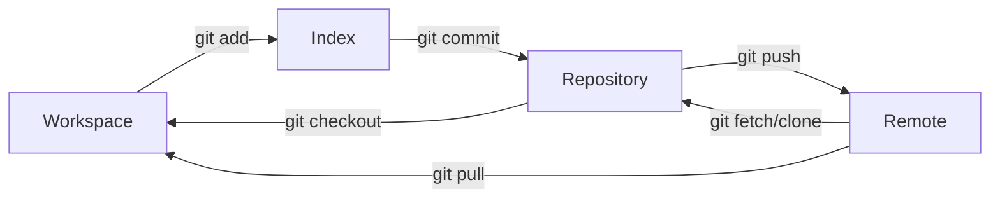

Git

Git 是一个版本控制工具，既可以通过图形化的方式操作，也可以通过命令行来完成。

Git 版本管理分为四个板块：

1. **Workspace**：这是你的工作目录，包含了项目的所有文件。在这里你可以修改、创建和删除文件。Workspace包含了你正在工作的文件，这些文件可能已经被Git跟踪（tracked），也可能还没有被Git跟踪。

2. **Index**（也被称为暂存区或者stage）：这是一个中间区域，一个准备提交到Repository的更改列表。当你执行`git add`命令时，更改（添加、修改、删除）会被加入到Index中。然后通过执行`git commit`命令，Index中的所有更改会被永久记录到Repository中。

3. **Repository**：这是Git存储项目历史记录的地方，可以认为它是一个数据库，存储了所有的提交（commit）和包含改动的文件。每次提交，Git都会保存一个快照并记录其详细信息。你可以回到任何一个已经提交的版本。

4. **Remote**：这是存储在网络上的版本库，可以让多个人共享和交换各自的更改。最常见的远程仓库服务包括GitHub、GitLab和Bitbucket等。你可以执行`git push`命令将本地Repository的更改推送到Remote，也可以执行`git pull`或`git fetch`命令从Remote获取最新的更改。

文件在这四个区域之间的转换关系如下：



[Interactive Git Courses](https://ooloo.io/project/github-flow/mindset)了解如何在 GitHub (一个托管和协作管理 Git 仓库的平台)团队中使用 Git

## 常用操作

**初始化一个新的 Git 仓库：**

```bash showLineNumbers
git init
```

**克隆一个已存在的 Git 仓库：**

```bash showLineNumbers
git clone <repo_url>
```

**查看当前的文件状态（哪些文件已修改或已准备提交等）：**

```bash showLineNumbers
git status
```

**添加文件到暂存区：**

```bash showLineNumbers
git add <file_name>
```

**添加所有改动到暂存区：**

```bash showLineNumbers
git add .
```

**提交暂存区的改动：**

```bash showLineNumbers
git commit -m "Your descriptive commit message"
```

**查看提交历史：**

```bash showLineNumbers
git log
```

**拉取远程仓库的改动并合并到当前分支：**

```bash showLineNumbers
git pull
```

**将改动推送到远程仓库：**

```bash showLineNumbers
git push
```

**创建新的分支：**

```bash showLineNumbers
git branch <branch_name>
```

**切换到特定的分支：**

```bash showLineNumbers
git checkout <branch_name>
```

**合并特定分支到当前分支：**

```bash showLineNumbers
git merge <branch_name>
```

**查看当前分支和远程分支：**

```bash showLineNumbers
git branch -a
```

## 分支

```bash showLineNumbers
git tag -l | xargs git tag -d #删除所有本地分支

git fetch origin --prune #从远程拉取所有信息

git branch -a # 查看远程分支

git branch # 查看本地分支

git branch newBranch # 创建本地分支

git checkout newBranch # 切换到本地分支

git checkout -b newBranch  # 创建并切换到分支
```

## 版本

```bash showLineNumbers
git log # 查看你要回到的那个版本

git reset --hard HEAD^ # 回退到上个版本

git reset --hard commit_id # 退到/进到 指定commit_id

git push origin HEAD --force #将本地的修改提交到远程
```

## Tag

```bash showLineNumbers
git ls-remote --tags origin #查询远程tags

git tag #列出所有tag

git tag -l v1.* #列出符合条件的tag（筛选作用）

git tag [tag名] #创建轻量tag（无-m标注信息）

git tag -a [tag名] #创建含注解的tag

git push origin --tags #推送所有本地tag到远程
git push origin [本地tag名] #推送指定本地tag到远程

git tag -d [本地tag名] #删除本地指定tag
git push origin :refs/tags/[远程tag名] #删除远程指定tag

git fetch origin [远程tag名] #拉取远程指定tag
git show [tag名] #显示指定tag详细信息

git branch -a --contains Tag_V1.0.0 # 看看哪个分支包含这个tag/commit
```

## Git commit 规范

Git commit的规范是为了更好的管理代码，方便后续的代码维护和版本回退。

因此它并不是一个硬性要求，但是在团队协作中，规范的commit message可以让团队更好的理解代码的变更。

个人开发者可以根据自己的习惯来定义规范，譬如：Gitmoji

> Gitmoji是一种在Git提交消息中使用表情符号来表示提交目的的规范。每个表情符号（emoji）都代表着一种特定的提交类型，使提交消息更加生动和易读。Gitmoji 的目标是通过简单的图标和表情符号传达清晰的信息，从而提高代码提交历史的可读性和可理解性。

> Gitmoji提供Vscode插件，可以在提交时选择对应的表情符号，然后填写提交信息。

## Github Action

Github Action 是一种工作流，是 CI/CD 最常用的工具

- CI/CD（持续集成/持续部署）是自动化构建、测试和部署应用程序的实践，其主要目标是及早发现问题，并更快地发布到生产环境。

工作流是一个可配置的自动化过程，它将运行一个或多个作业。工作流由签入您的存储库的 YAML 文件定义，并在由存储库中的事件触发时运行，或者它们可以手动触发或按定义的时间表触发。

工作流在存储库的目录中定义.github/workflows，存储库可以有多个工作流，每个工作流可以执行一组不同的任务。例如，您可以有一个工作流来构建和测试拉取请求，另一个工作流在每次创建发布时部署您的应用程序，还有另一个工作流在每次有人打开新问题时添加标签。

[GitHub Actions documentation](https://docs.github.com/en/actions)

