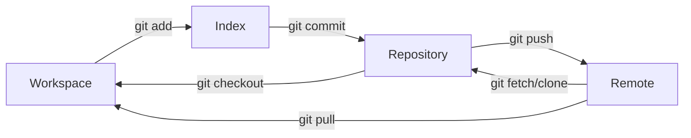

Git 是一个版本控制工具，既可以通过图形化的方式操作，也可以通过命令行来完成。

Git 版本管理分为四个板块：

1. **Workspace**：这是你的工作目录，包含了项目的所有文件。在这里你可以修改、创建和删除文件。Workspace包含了你正在工作的文件，这些文件可能已经被Git跟踪（tracked），也可能还没有被Git跟踪。

2. **Index**（也被称为暂存区或者stage）：这是一个中间区域，一个准备提交到Repository的更改列表。当你执行`git add`命令时，更改（添加、修改、删除）会被加入到Index中。然后通过执行`git commit`命令，Index中的所有更改会被永久记录到Repository中。

3. **Repository**：这是Git存储项目历史记录的地方，可以认为它是一个数据库，存储了所有的提交（commit）和包含改动的文件。每次提交，Git都会保存一个快照并记录其详细信息。你可以回到任何一个已经提交的版本。

4. **Remote**：这是存储在网络上的版本库，可以让多个人共享和交换各自的更改。最常见的远程仓库服务包括GitHub、GitLab和Bitbucket等。你可以执行`git push`命令将本地Repository的更改推送到Remote，也可以执行`git pull`或`git fetch`命令从Remote获取最新的更改。

文件在这四个区域之间的转换关系如下：



在 Git 中，有许多操作可以实现同样的效果，例如拉取远程分支：

- `git pull` 获取远程变化并自动合并到当前分支，默认不清理不再存在的远程跟踪分支。
- `git fetch origin --prune` 获取远程变化并清理不再存在的远程跟踪分支，但不合并到当前分支。

因此在 AI 编程的今天，如果我们不了解 Git 原理就使用提示词获取 Git 命令，可能会出现意料之外的情况。Git 命令的全部难点都在于如何处理与合并分支。

[Interactive Git Courses](https://ooloo.io/project/github-flow/mindset) 可以帮助你了解如何在 GitHub 团队中使用 Git（GitHub 是一个托管和协作管理 Git 仓库的平台）

import MarkmapHooks from '@site/src/components/MarkmapHooks';

## Git 命令概览

我们常用的命令约 30-40个，底层命令加参数组合起来有数千个，因此上[git-scm.com随用随查](https://git-scm.com/docs)，记住核心思想最重要。

<MarkmapHooks initialMarkdown={`

# Git 命令概览

## 仓库初始化

### 创建与克隆

- git init：初始化新仓库
- git clone <repo_url>：克隆远程仓库

### 全局配置

- git config --global user.name "您的姓名"
- git config --global user.email "邮箱@example.com"

## 本地工作流

### 状态与历史

- git status：查看文件状态
- git log：查看提交历史

### 暂存与提交

- git add <file_name>：添加指定文件
- git add .：添加所有改动
- git commit -m "提交说明"：提交更改

## 远程协作

### 拉取代码

- git pull：拉取并自动合并（个人项目）
- git fetch：仅拉取不合并（团队协作推荐）
- git fetch origin --prune：拉取并清理已删除的远程分支

### 推送代码

- git push：推送到远程仓库
- git push origin HEAD --force：强制推送（慎用）

### 查看与合并

- git diff origin/main..main：查看本地与远程差异
- git merge origin/feature-branch：合并远程分支

## 分支管理

### 查看与切换

- git branch：查看本地分支
- git branch -a：查看所有分支（含远程）
- git checkout branchName：切换分支

### 创建与合并

- git branch newBranch：创建分支
- git checkout -b newBranch：创建并切换分支
- git merge <branch_name>：合并分支到当前分支

## 版本回退

### 回退操作

- git reset --hard HEAD^：回退到上一版本
- git reset --hard commit_id：回退到指定版本
- git reset --hard HEAD~1 + push -f ：撤销最近一次 Push
- git reset --soft HEAD~1 ： 只撤销 Push 但保留代码

## 标签管理

### 查看标签

- git tag：列出本地标签
- git tag -l v1.*：筛选标签
- git ls-remote --tags origin：查询远程标签

### 创建与推送

- git tag [tag名]：创建轻量标签
- git tag -a [tag名]：创建带注解标签
- git push origin --tags：推送所有标签
- git push origin [tag名]：推送指定标签

### 删除与查询

- git tag -d [tag名]：删除本地标签
- git push origin :refs/tags/[tag名]：删除远程标签
- git show [tag名]：显示标签详情
- git branch -a --contains [tag名]：查找标签所在分支

`} />


## Git commit 规范

Git commit 的规范是为了更好地管理代码，方便后续的代码维护和版本回退。

因此它并不是一个硬性要求，但是在团队协作中，规范的 commit message 可以让团队更好地理解代码的变更。现在 AI 编辑器也可以自动生成格式优雅、内容准确的 commit 信息。

个人开发者也可以根据自己的习惯来定义规范，譬如 Gitmoji：

> Gitmoji 是一种在 Git 提交消息中使用表情符号来表示提交目的的规范。每个表情符号（emoji）都代表着一种特定的提交类型，使提交消息更加生动和易读。Gitmoji 的目标是通过简单的图标和表情符号传达清晰的信息，从而提高代码提交历史的可读性和可理解性。

> Gitmoji 提供 VS Code 插件，可以在提交时选择对应的表情符号，然后填写提交信息。

### .gitignore

.gitignore 文件用于指定 Git 应该忽略的未跟踪文件。这能防止敏感信息（如 API Key）或编译产物（如 node_modules）进入版本库。

建议包含的内容：

- 系统文件： .DS_Store (macOS), Thumbs.db (Windows)。

- 依赖包： node_modules/, vendor/。

- 编译产物： dist/, build/, *.exe, *.log。

- 环境配置： .env, .env.local。

推荐工具： [gitignore.io](https://www.toptal.com/developers/gitignore) 可以根据你的开发环境（如 Java, Node, Python）自动生成完整的模板。

### .gitattributes

.gitattributes 用于定义特定文件或目录的路径属性。它最常见的用途是解决跨平台协作时的换行符问题。

常见配置项：
```bash
// 统一换行符： 强制所有文本文件在 Git 库中以 LF 存储，防止 Windows 用户提交 CRLF 导致冲突。
* text=auto eol=lf

// LFS (Large File Storage)： 指定哪些大文件通过 Git LFS 管理。
*.psd filter=lfs diff=lfs merge=lfs -text

// 语言统计： 告诉 GitHub/GitLab 忽略某些文件夹的语言统计。
docs/* linguist-documentation
```

### .gitkeep

Git 默认不追踪空文件夹，如果你想在仓库中保留一个空文件夹（如 logs/），可以在里面放一个空的 `.gitkeep`。


## 常见 Git 事故修复方案：

事故发生前，养成好习惯来预防是成本最低的：

* **先拉后推：** 养成 `git push` 前先执行 `git pull --rebase` 的习惯。
* **原子化提交：** 每个 commit 只解决一个问题。禁止将逻辑修改与格式优化混在一起。
* **分支隔离：** 严禁直接在 `main` 或 `master` 分支开发，所有新特性应在 `feature/` 分支进行。

在多人协作中，除了基础的操作外，提交记录的整洁度和冲突处理能力是衡量开发者水平的重要标准，以下是一些常见 Git 事故修复方案：

### 提交历史不整洁

**场景描述**
在开发功能时产生了多次琐碎提交（如：`fix typo`, `add logic`, `update test`）。在推送到主分支前，需要将这些记录合并为一个完整的提交。
> **注意：** 仅在尚未推送到远程仓库时进行此操作，严禁对已共享的公共分支记录进行变基。

**解决方案**
使用交互式变基：`git rebase -i`。

**操作步骤**

- 执行 `git rebase -i HEAD~3`（针对最近 3 次提交）。
- 在编辑器中，将第 2、3 行开头的 `pick` 改为 `squash` (或简写为 `s`)。
- 保存并退出，在随后的弹窗中编辑合并后的提交说明（Commit Message）。

### 修复不完美提交

**问题描述：** 修复BUG，已经 push 到了远程，但发现之前的代码并没真的修复，现在本地已经真正修复完了。

**解决方案**
修改最近一次提交。

**目前还没有其他人提交：**

1. 暂存修改： 在本地完成真正的修复后，执行 `git add .`
2. 合并提交： 执行 `git commit --amend --no-edit`
- `--amend` 表示将当前的修改合并到上一次提交中。
- `--no-edit` 表示沿用上一次的提交信息（不用重新写 Commit Message）。
- 如果你发现上一次提交的 Commit Message 写错了，只需要把 `--no-edit` 去掉，或者换成 `-m "新消息"` 即可。
3. 强制推送： 执行 `git push origin <分支名> --force-with-lease`。
- `--force-with-lease`只有在远程没有新提交时才覆盖。
- `--force`极其危险，会盲目覆盖远程一切内容。

远程仓库的那条“没修好”的记录会被这条“真正修好”的记录直接替换。

**目前有其他人提交：**

- 暂存修改： 在本地完成真正的修复后，执行 `git add .`
- 查找记录： 在本地执行`git log` 找到之前那次不完美提交的`hash`值
- 合并： 执行`git commit --fixup <commit-hash>`
- 提交： 执行 `git rebase -i --autosquash` 时，Git 会自动把这些 fixup 提交合并到对应的原始提交中
- 推送： `git push`

这种修复方式会新增一条fixup记录，但是不会导致其他人的记录不可用，最推荐。

### 处理多人协作冲突

**场景描述**
A 和 B 同时修改了同一文件。B 先推送，A 在推送时被拒绝。

**解决方案**
使用 `git pull --rebase` 保持提交线性的整洁。

**推荐理由**

* **Merge：** 会产生额外的“Merge branch...”节点，使分支图谱出现交叉。
* **Rebase：** 将本地提交“移至”远程最新提交之后，保持一条直线。

**操作步骤**

- 执行 `git pull --rebase`。
- 若遇冲突，Git 会提示冲突文件。打开文件手动修复。
- 解决后执行 `git add <file>`。
- 执行 `git rebase --continue`，重复此步骤直到合并完成。

### 应忽略的内容误推至远程

**问题描述：** 将 `.env`、API Key 或 SSH 私钥不小心 `git push` 到了公共仓库。

**解决方案**
仅删除当前提交是不够的，必须从历史记录中彻底抹除。否则 `.git` 文件夹会包含该文件，导致仓库体积激增，拉取缓慢。

**操作步骤：**
- 安装[git-filter-repo](https://github.com/newren/git-filter-repo)
- **立即撤销泄露密钥的有效性**（这是最安全的操作，假设密钥已泄露）。
- 安装工具后执行：`git filter-repo --path secret.txt --invert-paths`（从所有历史中删除指定文件）。
- 强制推送到远程：`git push origin --force --all`。

预防： 在项目根目录配置 `.gitignore`，对于密钥泄露，修改代码是补救，更换密钥是根治。一旦信息进入过互联网，就应视为已泄露。

### 推错分支

**问题描述：** 在错误的分支上进行了提交并已推送到远程（本应推到 feature，误推到了 main）。

**解决方案**
转移提交并重置原分支。

**操作步骤：**
- 先在当前错误分支创建新分支保存进度：`git branch feature-correct`。
- 切回 `main` 分支：`git checkout main`。
- 强制重置 `main` 到上一个版本：`git reset --hard HEAD~1`。
- 强制推送回远程：`git push origin main --force`。

### 线上 Bug 紧急回退

**场景描述**
A 修复 Bug 后已推送，B 随后也提交了代码。现发现 A 的修复方案有误，需撤销 A 的修改，但必须保留 B 的代码。

**解决方案**
使用 `git revert` 生成反向提交。

**对比差异**

- **Reset：** 物理抹除记录，会造成他人本地仓库与远程不一致。
- **Revert：** 创建一个新提交来抵消旧提交。这是多人协作中安全的回退方式。

**操作步骤**

- 获取错误提交的哈希值（如 `abc1234`）。
- 执行 `git revert abc1234`。
- 推送生成的“抵消”提交。此时 A 的错误被撤销，B 的代码完好无损。

### 临时切换任务

**场景描述**
功能开发到一半，需紧急切换到 `master` 分支修复 Bug，但当前代码尚不具备提交条件。

**解决方案**
使用 `git stash` 将修改暂存至堆栈。

**操作步骤**

- 执行 `git stash`，工作区恢复干净。
- 切换分支修复 Bug 并提交。
- 切回原分支，执行 `git stash pop` 恢复之前的进度。

## GitHub Actions

GitHub Actions 是一种工作流，是 CI/CD 最常用的工具。

- CI/CD（持续集成/持续部署）是自动化构建、测试和部署应用程序的实践，其主要目标是及早发现问题，并更快地发布到生产环境。

工作流是一个可配置的自动化过程，它将运行一个或多个作业。工作流由签入您的存储库的 YAML 文件定义，并在由存储库中的事件触发时运行，或者它们可以手动触发或按定义的时间表触发。

工作流在存储库的 `.github/workflows` 目录中定义，存储库可以有多个工作流，每个工作流可以执行一组不同的任务。例如，您可以有一个工作流来构建和测试拉取请求，另一个工作流在每次创建发布时部署您的应用程序，还有另一个工作流在每次有人打开新问题时添加标签。

[GitHub Actions documentation](https://docs.github.com/en/actions)

