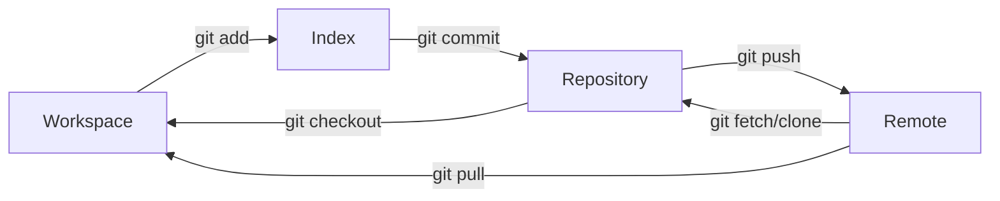

Git 是一个版本控制工具，既可以通过图形化的方式操作，也可以通过命令行来完成。

Git 版本管理分为四个板块：

1. **Workspace**：这是你的工作目录，包含了项目的所有文件。在这里你可以修改、创建和删除文件。Workspace包含了你正在工作的文件，这些文件可能已经被Git跟踪（tracked），也可能还没有被Git跟踪。

2. **Index**（也被称为暂存区或者stage）：这是一个中间区域，一个准备提交到Repository的更改列表。当你执行`git add`命令时，更改（添加、修改、删除）会被加入到Index中。然后通过执行`git commit`命令，Index中的所有更改会被永久记录到Repository中。

3. **Repository**：这是Git存储项目历史记录的地方，可以认为它是一个数据库，存储了所有的提交（commit）和包含改动的文件。每次提交，Git都会保存一个快照并记录其详细信息。你可以回到任何一个已经提交的版本。

4. **Remote**：这是存储在网络上的版本库，可以让多个人共享和交换各自的更改。最常见的远程仓库服务包括GitHub、GitLab和Bitbucket等。你可以执行`git push`命令将本地Repository的更改推送到Remote，也可以执行`git pull`或`git fetch`命令从Remote获取最新的更改。

文件在这四个区域之间的转换关系如下：

在 Git 中，有许多操作可以实现同样的效果，例如拉取远程分支：

- `git pull` 获取远程变化并自动合并到当前分支，默认不清理不再存在的远程跟踪分支。
- `git fetch origin --prune` 获取远程变化并清理不再存在的远程跟踪分支，但不合并到当前分支。

因此在 AI 编程的今天，如果我们不了解 Git 原理就使用提示词获取 Git 命令，可能会出现意料之外的情况。Git 命令的全部难点都在于如何处理与合并分支。

[Interactive Git Courses](https://ooloo.io/project/github-flow/mindset) 可以帮助你了解如何在 GitHub 团队中使用 Git（GitHub 是一个托管和协作管理 Git 仓库的平台）

import MarkmapHooks from '@site/src/components/MarkmapHooks';

## Git 命令概览

<MarkmapHooks initialMarkdown={`

# Git 命令概览

## 仓库初始化

### 创建与克隆

- git init：初始化新仓库
- git clone <repo_url>：克隆远程仓库

### 全局配置

- git config --global user.name "您的姓名"
- git config --global user.email "邮箱@example.com"

## 本地工作流

### 状态与历史

- git status：查看文件状态
- git log：查看提交历史

### 暂存与提交

- git add <file_name>：添加指定文件
- git add .：添加所有改动
- git commit -m "提交说明"：提交更改

## 远程协作

### 拉取代码

- git pull：拉取并自动合并（个人项目）
- git fetch：仅拉取不合并（团队协作推荐）
- git fetch origin --prune：拉取并清理已删除的远程分支

### 推送代码

- git push：推送到远程仓库
- git push origin HEAD --force：强制推送（慎用）

### 查看与合并

- git diff origin/main..main：查看本地与远程差异
- git merge origin/feature-branch：合并远程分支

## 分支管理

### 查看与切换

- git branch：查看本地分支
- git branch -a：查看所有分支（含远程）
- git checkout branchName：切换分支

### 创建与合并

- git branch newBranch：创建分支
- git checkout -b newBranch：创建并切换分支
- git merge <branch_name>：合并分支到当前分支

## 版本回退

### 回退操作

- git reset --hard HEAD^：回退到上一版本
- git reset --hard commit_id：回退到指定版本

## 标签管理

### 查看标签

- git tag：列出本地标签
- git tag -l v1.*：筛选标签
- git ls-remote --tags origin：查询远程标签

### 创建与推送

- git tag [tag名]：创建轻量标签
- git tag -a [tag名]：创建带注解标签
- git push origin --tags：推送所有标签
- git push origin [tag名]：推送指定标签

### 删除与查询

- git tag -d [tag名]：删除本地标签
- git push origin :refs/tags/[tag名]：删除远程标签
- git show [tag名]：显示标签详情
- git branch -a --contains [tag名]：查找标签所在分支

`} />

## Git commit 规范

Git commit 的规范是为了更好地管理代码，方便后续的代码维护和版本回退。

因此它并不是一个硬性要求，但是在团队协作中，规范的 commit message 可以让团队更好地理解代码的变更。现在 AI 编辑器也可以自动生成格式优雅、内容准确的 commit 信息。

个人开发者也可以根据自己的习惯来定义规范，譬如 Gitmoji：

> Gitmoji 是一种在 Git 提交消息中使用表情符号来表示提交目的的规范。每个表情符号（emoji）都代表着一种特定的提交类型，使提交消息更加生动和易读。Gitmoji 的目标是通过简单的图标和表情符号传达清晰的信息，从而提高代码提交历史的可读性和可理解性。

> Gitmoji 提供 VS Code 插件，可以在提交时选择对应的表情符号，然后填写提交信息。

## GitHub Actions

GitHub Actions 是一种工作流，是 CI/CD 最常用的工具。

- CI/CD（持续集成/持续部署）是自动化构建、测试和部署应用程序的实践，其主要目标是及早发现问题，并更快地发布到生产环境。

工作流是一个可配置的自动化过程，它将运行一个或多个作业。工作流由签入您的存储库的 YAML 文件定义，并在由存储库中的事件触发时运行，或者它们可以手动触发或按定义的时间表触发。

工作流在存储库的 `.github/workflows` 目录中定义，存储库可以有多个工作流，每个工作流可以执行一组不同的任务。例如，您可以有一个工作流来构建和测试拉取请求，另一个工作流在每次创建发布时部署您的应用程序，还有另一个工作流在每次有人打开新问题时添加标签。

[GitHub Actions documentation](https://docs.github.com/en/actions)

