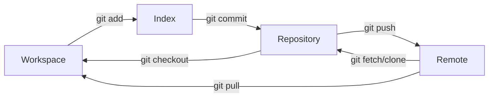

Git 是一个版本控制工具，既可以通过图形化的方式操作，也可以通过命令行来完成。

Git 版本管理分为四个板块：

1. Workspace：这是你的工作目录，包含了项目的所有文件。在这里你可以修改、创建和删除文件。Workspace包含了你正在工作的文件，这些文件可能已经被Git跟踪（tracked），也可能还没有被Git跟踪。

2. Index（也被称为暂存区或者stage）：这是一个中间区域，一个准备提交到Repository的更改列表。当你执行`git add`命令时，更改（添加、修改、删除）会被加入到Index中。然后通过执行`git commit`命令，Index中的所有更改会被永久记录到Repository中。

3. Repository：这是Git存储项目历史记录的地方，可以认为它是一个数据库，存储了所有的提交（commit）和包含改动的文件。每次提交，Git都会保存一个快照并记录其详细信息。你可以回到任何一个已经提交的版本。

4. Remote：这是存储在网络上的版本库，可以让多个人共享和交换各自的更改。最常见的远程仓库服务包括GitHub、GitLab和Bitbucket等。你可以执行`git push`命令将本地Repository的更改推送到Remote，也可以执行`git pull`或`git fetch`命令从Remote获取最新的更改。

文件在这四个区域之间的转换关系如下：


```mermaid
flowchart LR
    A[Workspace] -- git add --> B[Index]
    B -- git commit --> C[Repository]
    C -- git push --> D[Remote]
    D -- git fetch/clone --> C
    C -- git checkout --> A
    D -- git pull --> A
```

在 Git 中，有许多操作可以实现同样的效果，例如拉取远程分支：

- `git pull` 获取远程变化并自动合并到当前分支，默认不清理不再存在的远程跟踪分支。
- `git fetch origin --prune` 获取远程变化并清理不再存在的远程跟踪分支，但不合并到当前分支。

因此在 AI 编程的今天，如果我们不了解 Git 原理就使用提示词获取 Git 命令，可能会出现意料之外的情况。Git 命令的全部难点都在于如何处理与合并分支。

[Interactive Git Courses](https://ooloo.io/project/github-flow/mindset) 可以帮助你了解如何在 GitHub 团队中使用 Git（GitHub 是一个托管和协作管理 Git 仓库的平台）

import MarkmapHooks from '@site/src/components/MarkmapHooks';

## Git commit 规范

Git commit 的规范是为了更好地管理代码，方便后续的代码维护和版本回退。

每个 commit 只解决一个问题。禁止将逻辑修改与格式优化混在一起。

因此它并不是一个硬性要求，但是在团队协作中，规范的 commit message 可以让团队更好地理解代码的变更。现在 AI 编辑器也可以自动生成格式优雅、内容准确的 commit 信息。

个人开发者也可以根据自己的习惯来定义规范，譬如 Gitmoji：

> Gitmoji 是一种在 Git 提交消息中使用表情符号来表示提交目的的规范。每个表情符号（emoji）都代表着一种特定的提交类型，使提交消息更加生动和易读。Gitmoji 的目标是通过简单的图标和表情符号传达清晰的信息，从而提高代码提交历史的可读性和可理解性。

> Gitmoji 提供 VS Code 插件，可以在提交时选择对应的表情符号，然后填写提交信息。

### .gitignore

.gitignore 文件用于指定 Git 应该忽略的未跟踪文件。这能防止敏感信息（如 API Key）或编译产物（如 node_modules）进入版本库。

建议包含的内容：

- 系统文件： .DS_Store (macOS), Thumbs.db (Windows)。

- 依赖包： node_modules/, vendor/。

- 编译产物： dist/, build/, *.exe, *.log。

- 环境配置： .env, .env.local。

推荐工具： [gitignore.io](https://www.toptal.com/developers/gitignore) 可以根据你的开发环境（如 Java, Node, Python）自动生成完整的模板。

### .gitattributes

.gitattributes 用于定义特定文件或目录的路径属性。它最常见的用途是解决跨平台协作时的换行符问题。

常见配置项：
```bash
// 统一换行符： 强制所有文本文件在 Git 库中以 LF 存储，防止 Windows 用户提交 CRLF 导致冲突。
* text=auto eol=lf

// LFS (Large File Storage)： 指定哪些大文件通过 Git LFS 管理。
*.psd filter=lfs diff=lfs merge=lfs -text

// 语言统计： 告诉 GitHub/GitLab 忽略某些文件夹的语言统计。
docs/* linguist-documentation
```

### .gitkeep

Git 默认不追踪空文件夹，如果你想在仓库中保留一个空文件夹（如 logs/），可以在里面放一个空的 `.gitkeep`。


## Git 命令概览

我们常用的命令约 30-40个，底层命令加参数组合起来有数千个，因此上[git-scm.com随用随查](https://git-scm.com/docs)，记住核心思想最重要。

<MarkmapHooks initialMarkdown={`

# Git 命令概览

## init（初始化）

- git init：把当前目录初始化为 Git 仓库
- git clone 仓库地址：克隆远程仓库到本地
- git config --global user.name "你的名字"：设置全局用户名
- git config --global user.email "你的邮箱"：设置全局邮箱

## check（检查当前状态）

- git status：检查工作区和暂存区状态
- git log --oneline --graph --decorate：检查提交历史结构
- git diff：检查未暂存改动
- git diff --staged：检查已暂存改动
- git branch -a：检查本地与远程分支

## record（记录变更）

- git add 路径/文件名 / git add .：把改动加入暂存区
- git commit -m "message"：生成一次可追踪记录

## switch（切换与开分支）

- git switch main：切换到已有分支
- git switch -c feature-login：创建并切换到新分支
- git switch --detach a1b2c3d：切到历史提交做只读实验

## sync（与远程同步）

- git fetch origin --prune：同步远程信息并清理失效远程分支
- git pull --rebase：拉取并把本地提交重放到最新远程之后
- git push origin main：推送当前分支

## undo（撤销与修复）

- git restore 路径/文件名：撤销工作区改动（未暂存）
- git reset HEAD 路径/文件名：撤销暂存（保留工作区改动）
- git revert a1b2c3d：用“反向提交”安全撤销历史提交
- git reset --soft HEAD~1：回退提交但保留代码和暂存状态

## tag（发布锚点）

- git tag：查看标签
- git tag -a v1.0.0 -m "release"：创建发布标签
- git push origin v1.0.0：推送单个标签

`} />


* 先拉后推： 养成 `git push` 前先执行 `git pull --rebase` 的习惯。

* 分支隔离： 严禁直接在 `main` 或 `master` 分支开发，所有新特性应在 `feature/` 分支进行。


### switch

如果你正在学习某个知名的开源项目。想穿越回过去看看代码长什么样，或者在该点做点小实验，可以使用 `switch`

- 首先通过 `git log --oneline` 找到你想要切换到的那个提交的 ID 。假设你查看log 后想在 `a1b2c3d` 查看项目或二次开发。

- 二次开发：创建一个`a1b2c3d`的副本复制到新分支`git checkout -b <新分支名> a1b2c3d`
- 只查看：在较新版本的 Git 中执行`git switch --detach a1b2c3d` 

>  `git checkout a1b2c3d`也可以只查看，但是`git checkout` 承担了太多的职责（既能切换分支，又能恢复文件）语义不清晰。

- 如果你理解这个部分想查看下个部分，可以返回主分支：`git switch main` 后，重复上述步骤。

> 如果你做了一些零碎的修改测试，想回到主分支，这些内容丢弃，可以使用 `git switch -f main` 会强制切换到主分支，忽略未提交的修改。

> 如果你想留下这个更改，可以创建一个新分支并切换到该分支，可以使用 `git switch -c <分支名>` 。

### subtree

现在你已经认识到git记录的重要性，假设你们小组多个人都在一个独立的仓库中，现在只能保留一个仓库，其他人的代码合并进来的同时保持git记录的整洁。

假设当前主仓库叫 `AI-Practice-Collection`，你要把组员的 `Agent_loop` 仓库放到子目录 `Agent_loop/`。

```bash
# 1. 先进入主仓库：
cd AI-Practice-Collection

# 2. 添加组员仓库为临时远程：
git remote add agent_loop <Agent_loop仓库地址,远程或本地均可>
git fetch agent_loop

# 3. 以子目录形式合并进来：
git subtree add --prefix=Agent_loop agent_loop main
```

> `--prefix=Agent_loop` 表示把内容放到 `Agent_loop/` 子目录。  
> `agent_loop main` 表示来源是远程 `agent_loop` 的 `main` 分支。

```bash
# 4. 后续如果组员仓库还有更新，可以继续同步：
git subtree pull --prefix=Agent_loop agent_loop main

# 5. 不再需要这个临时远程时可以移除：
git remote remove agent_loop
```

### revert

#### 错误的BUG修复

A 修复 Bug 后已推送，B 随后也提交了代码。

现发现 A 的修复方案有误，需撤销 A 的修改，但必须保留 B 的代码。

解决方案 ： 使用 `git revert` 生成反向提交。

操作步骤

- 获取错误提交的哈希值（如 `abc1234`）。
- 执行 `git revert abc1234`。
- 推送生成的“抵消”提交。此时 A 的错误被撤销，B 的代码完好无损。

#### 推错分支

在错误的分支上进行了提交并已推送到远程（本应推到 `feature`，误推到了 `main`）。

`main` 设置了分支保护（禁止强制推送），或已有同事拉取了错误代码，需使用“反转提交”方案。

操作步骤：
1. 创建功能分支：
```bash
# 先把正确的代码逻辑留在 feature 分支
git checkout -b feature-correct
```
2. 在 Main 分支回滚：
```bash
git checkout main
# 撤销错误的提交，这会生成一个新的“抵消”提交
git revert <错误提交的ID>
git push origin main
```
> 注意： 这种做法历史记录中会留下“错误提交”和“撤销提交”两条痕迹，但对团队协作最安全。


### filter-repo

问题描述： 将 `.env`、API Key 或 SSH 私钥不小心 `git push` 到了公共仓库。

解决方案
仅删除当前提交是不够的，必须从历史记录中彻底抹除。否则 `.git` 文件夹会包含该文件，导致仓库体积激增，拉取缓慢。

操作步骤：
- 安装[git-filter-repo](https://github.com/newren/git-filter-repo)
- 立即撤销泄露密钥的有效性（这是最安全的操作，假设密钥已泄露）。
- 安装工具后执行：`git filter-repo --path secret.txt --invert-paths`（从所有历史中删除指定文件）。
- 强制推送到远程：`git push origin --force --all`。

预防： 在项目根目录配置 `.gitignore`，对于密钥泄露，修改代码是补救，更换密钥是根治。一旦信息进入过互联网，就应视为已泄露。

### commit

在开发功能时产生了多次琐碎提交，或者是修复BUG，但发现没完全修复。

尚未推送到远程仓库：

- 执行 `git rebase -i HEAD~3`（针对最近 3 次提交）。
- 在编辑器中，将第 2、3 行开头的 `pick` 改为 `squash`（或简写为 `s`）。
- 保存并退出，在随后的界面中编辑合并后的提交说明（Commit Message）。
- 保存后，这些记录会合并为一个完整的提交。


已推送，但暂无其他人提交/拉取：

1. 暂存修改： 在本地完成真正的修复后，执行 `git add .`
2. 合并提交： 执行 `git commit --amend --no-edit`
- `--amend` 表示将当前的修改合并到上一次提交中。
- `--no-edit` 表示沿用上一次的提交信息（不用重新写 Commit Message）。
- 如果你发现上一次提交的 Commit Message 写错了，只需要把 `--no-edit` 去掉，或者换成 `-m "新消息"` 即可。
3. 强制推送： 执行 `git push origin main --force-with-lease`
- `main` 假设你不是推送到main分支上则改用对应分支名。
- `--force-with-lease`只有在远程没有新提交时才覆盖。
- `--force`极其危险，会盲目覆盖远程一切内容。

远程仓库的那条“没修好”的记录会被这条“真正修好”的记录直接替换。

已推送，但有其他人提交：

- 暂存修改： 在本地完成真正的修复后，执行 `git add .`
- 查找记录： 在本地执行`git log` 找到之前那次不完美提交的`hash`值
- 合并： 执行`git commit --fixup <commit-hash>`
- 提交： 执行 `git rebase -i --autosquash` 时，Git 会自动把这些 fixup 提交合并到对应的原始提交中
- 推送： `git push`

这种修复方式会新增一条fixup记录，但是不会导致其他人的记录不可用，最推荐。

### pull

场景描述
A 和 B 同时修改了同一文件。B 先推送，A 在推送时被拒绝。

解决方案
使用 `git pull --rebase` 保持提交线性的整洁。

推荐理由

* Merge： 会产生额外的“Merge branch...”节点，使分支图谱出现交叉。
* Rebase： 将本地提交“移至”远程最新提交之后，保持一条直线。

操作步骤

- 执行 `git pull --rebase`。
- 若遇冲突，Git 会提示冲突文件。打开文件手动修复。
- 解决后执行 `git add <file>`。
- 执行 `git rebase --continue`，重复此步骤直到合并完成。

### stash

场景描述
功能开发到一半，需紧急切换到 `master` 分支修复 Bug，但当前代码尚不具备提交条件。

解决方案
使用 `git stash` 将修改暂存至堆栈。

操作步骤

- 执行 `git stash`，工作区恢复干净。
- 切换分支修复 Bug 并提交。
- 切回原分支，执行 `git stash pop` 恢复之前的进度。

## GitHub Actions

GitHub Actions 是一种工作流，是 CI/CD 最常用的工具。

- CI/CD（持续集成/持续部署）是自动化构建、测试和部署应用程序的实践，其主要目标是及早发现问题，并更快地发布到生产环境。

工作流是一个可配置的自动化过程，它将运行一个或多个作业。工作流由签入您的存储库的 YAML 文件定义，并在由存储库中的事件触发时运行，或者它们可以手动触发或按定义的时间表触发。

工作流在存储库的 `.github/workflows` 目录中定义，存储库可以有多个工作流，每个工作流可以执行一组不同的任务。例如，您可以有一个工作流来构建和测试拉取请求，另一个工作流在每次创建发布时部署您的应用程序，还有另一个工作流在每次有人打开新问题时添加标签。

[GitHub Actions documentation](https://docs.github.com/en/actions)

