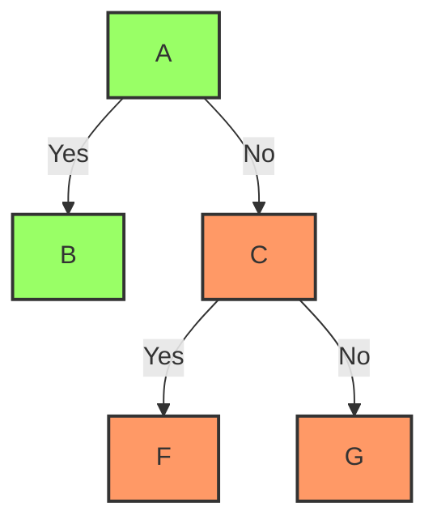

## 拓展

### 数学公式

$\Delta \delta\\$
$\cos (2\theta) = \cos^2 \theta - \sin^2 \theta\\$

```markdown
$\Delta \delta\\$
$\cos (2\theta) = \cos^2 \theta - \sin^2 \theta\\$
```

### 流程图



````

````

## HTML

### 语音

```markdown
<audio src="语音地址"></audio>
```

### 视频

```markdown
<video src="视频地址"></video>
```

## 原生语法

### 任务列表

- [x] 任务 1
- [ ] 任务 2

```markdown
- [x] 任务 1
- [ ] 任务 2
```

### 表格

| 表头 | 表头 |
| ---- | ---- |
| 单元 | 单元 |

```markdown
| 表头 | 表头 |
| ---- | ---- |
| 单元 | 单元 |
```


### 表情

:smile:

```markdown
:smile:
```

### 图片

```markdown

```

### 标题

```markdown
# 一级标题

### 二级标题

#### 三级标题
```

### 页内跳转

```markdown
[跳转](#标题)
```

### 粗体

```markdown
**粗体**
```

### 斜体

```markdown
_斜体_
```

### 删除线

```markdown
~~删除线~~
```

### 引用

```markdown
> 引用
```

### 分割线

```markdown
---
```

### 脚注

```markdown
脚注[^1]
[^1]: 脚注内容
```

### 链接

```markdown
[链接描述](链接地址)
```

### 代码

```markdown
`代码`
```

### 代码块

```markdown
`代码类型
代码
`
```


### 转义

```markdown
\\
```

### 注释

```markdown
<!-- 注释 -->
```


### 列表

```markdown
- 无序列表

1. 有序列表
```
