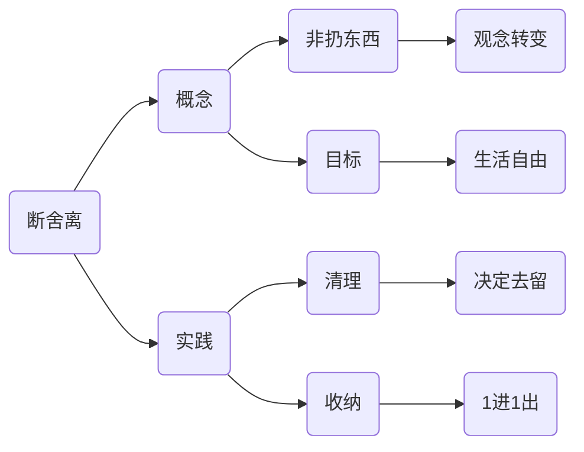

## 拓展

### MDX

MDX 允许高度自定义样式，例如像<HoverText text="鼠标悬浮展示" explanation="将需要说明的内容嵌入。这使得编写包含组件的长篇内容变得非常有趣。"/>。

也可以加载第三方思维导图组件，用于系统展示框架：

<MarkmapHooks initialMarkdown={`
# 断舍离核心
## 理念
### 不是扔东西
- 重点是改变观念
### 目标
- 获得更自由的生活
## 实践
### 清理
- 决定物品去留
### 收纳
- 1进1出原则
`} />

### 选项卡

import Tabs from '@theme/Tabs';
import TabItem from '@theme/TabItem';

对比展示多种语言可以使用选项卡：

<Tabs>
  <TabItem value="Python" label="Python" default>
使用Python打印Hello, World!
```python showLineNumbers title="test.py"
print("Hello, World!")
```
  </TabItem>
  <TabItem value="C" label="C">
使用C打印Hello, World!
```c showLineNumbers {3} title="test.c"
#include <stdio.h>
int main(){
    printf("Hello, World!");
    return 0;
}
```
  </TabItem>
  <TabItem value="javascript" label="javascript">
使用JavaScript打印Hello, World!
```javascript showLineNumbers title="test.js"
console.log("Hello, World!");
```
  </TabItem>
  <TabItem value="html" label="html">
使用html展示Hello, World!
```html showLineNumbers title="test.html"
<p>Hello, World!</p>
```
  </TabItem>
</Tabs>

### 高亮提示

不同颜色的高亮提示：

这是行内<Highlight color="r">危险提醒</Highlight>、<Highlight>警示提醒</Highlight>、<Highlight color="g">建议提醒</Highlight>、<Highlight color="b">信息提醒</Highlight>。

:::danger
用于危险操作的警告。例如 `rm -rf /` 会删除所有文件。
:::

:::warning
用于警示操作的警告。例如 C语言中`5/2` 结果是 `2` 而不是 `2.5`。
:::

:::tip
这是块级的建议提醒。例如 Python 中 type 有另外一个截然不同的用法，它是一个元类，用于创建类。
:::

:::info
这是块级的信息提醒。例如 技术演进的历史背景，辅助读者理解技术原理。
:::

:::note
这是块级的注解提醒。例如 福柯的《规训与惩罚》不仅是对现代社会的批判，也是对权力运作机制的深刻反思。其主要著作有：《规训与惩罚》、《疯癫与文明》、《性史》、《知识考古学》。

主要用在读书笔记中，类似注脚。
:::

### 数学公式

$\cos (2\theta) = \cos^2 \theta - \sin^2 \theta\\$

```markdown
$\cos (2\theta) = \cos^2 \theta - \sin^2 \theta\\$
```

### mermaid绘图

支持横向与纵向绘图，支持颜色定义。




## 多媒体

### 表情

你可以从[emoji-cheat-sheet](https://github.com/ikatyang/emoji-cheat-sheet)中找到支持的表情。

:clown_face: :heart: :smile: 

```markdown
:clown_face: :heart: :smile: 
```

### 图片

```markdown

```

### 音视频

`markdown`中使用`html`标签插入音视频。

```markdown
<audio src="语音地址"></audio>

<video src="视频地址"></video>
```

## 结构化

### 标题

```markdown
# 一级标题

### 二级标题

#### 三级标题
```

### 无序列表
- 学习使用-号创建无序列表
* 学习使用*号创建无序列表

```markdown
- 学习使用-号创建无序列表
* 学习使用*号创建无序列表
```
### 任务列表

- [x] 任务 1
- [ ] 任务 2

```markdown
- [x] 任务 1
- [ ] 任务 2
```

### 表格

| 表头左对齐 |表头居中|表头右对齐|
| :---- | :----: | ----: |
| 单元格字段左对齐 | 单元格字段居中 | 单元格字段右对齐 |

```markdown
| 表头左对齐 |表头居中|表头右对齐|
| :---- | :----: | ----: |
| 单元格字段左对齐 | 单元格字段居中 | 单元格字段右对齐 |
```


### 链接

```markdown
[链接描述](链接地址)
```

### 页内跳转

```markdown
[跳转](#标题)
```

### 脚注

```markdown
脚注[^1]
[^1]: 脚注内容
```

## 字体样式

### 粗体

```markdown
**粗体**
```

### 斜体

```markdown
_斜体_
```

### 删除线

~~删除线~~

```markdown
~~删除线~~
```

### 引用

> 引用

```markdown
> 引用
```

### 行内代码

`Python` is a programming language.

```markdown
`Python` is a programming language.
```

### 代码块

```python
print("Hello, World!")
```

````markdown
```python
print("Hello, World!")
```
````
### 转义

\`python\` is a programming language.

```markdown
\`python\` is a programming language.
```

### 分割线

```markdown
---
```

### 注释

```markdown
<!-- 注释 -->
```