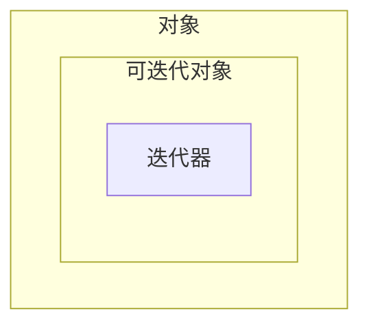

:::info
数据类自动生成常用的方法如`__init__`、`__repr__`等，减少样板代码，让开发者专注于业务逻辑。

```python showLineNumbers
from dataclasses import dataclass

@dataclass
class Person:
    name: str
    age: int
```

[PEP 557 – 数据类](https://peps.python.org/pep-0557/)
:::

## 面向对象编程

面向对象编程——Object Oriented Programming，简称 OOP，是一种程序设计思想。OOP 把对象作为程序的基本单元，一个对象包含了数据和操作数据的函数。

在 Python 中，所有数据类型都可以视为对象，当然也可以自定义对象。自定义的对象数据类型就是面向对象中的类（Class）的概念。

面向对象的设计思想是从自然界中来的，因为在自然界中，类（Class）和实例（Instance）的概念是很自然的。Class 是一种抽象概念，比如我们定义的 Class——Student，是指学生这个概念，而实例（Instance）则是一个个具体的 Student，比如，张三和李四是两个具体的 Student。

所以，面向对象的设计思想是抽象出 Class，根据 Class 创建 Instance。

面向对象的抽象程度又比函数要高，因为一个 Class 既包含数据，又包含操作数据的方法。

### class

python通过class关键字定义一个类，类如果不继承其他类，则默认继承object类，此时可以省略括号与object。

```python showLineNumbers
# class ClassName:
class ClassName(object):
    """class docstring"""
    pass

instance = ClassName()
```

类里的函数称为方法，类里的变量称为属性。

类方法包括以下几种：

- 共有的方法和属性，即不以 \_\_ 开头和结尾的方法和属性
- special 方法和属性，即以 \_\_ 开头和结尾的方法和属性(有特殊用途)
- 私有方法和属性，以 \_ 开头，不过不是真正私有，而是可以调用的，但是不会被代码自动完成所记录（即 Tab 键之后不会显示）
- 名称修饰方法，以 `__` 开头不以 `__` 结尾的属性是更加特殊的方法。

```python showLineNumbers
class MyDemoClass(object):
    def __init__(self):
        print("special.")

    def get_value(self):
        print("get_value is public method.")

    def _get_name(self):
        print("_get_name is private method.")
    # 当你定义一个 __my_method() 方法时，Python 解释器会自动将其名称修改为 
    # _ClassName__my_method() 的形式，以避免在子类中发生名称冲突
    def __get_type(self):
        print("__get_type is really special method.")

demo = MyDemoClass() # special.
demo.get_value() # get_value is public method.
demo._get_name() # _get_name is private method
demo._MyDemoClass__get_type() # __get_type is really special method.
```

类继承的基本形式：

```python showLineNumbers
class ClassName(ParentClass):
    """class docstring"""
    def method(self):
        return
```

里面的 ParentClass 就是用来继承的。

```python showLineNumbers
class Clothes(object):
    def __init__(self, color="green"):
        self.color = color

    def out_print(self):
        return self.__class__.__name__, self.color

my_clothes = Clothes()
my_clothes.color
my_clothes.out_print()

# 定义一个子类，继承父类的所有方法
class NikeClothes(Clothes):
    def change_color(self):
        if self.color == "green":
            self.color = "red"

# 子类继承父类的所有方法
your_clothes = NikeClothes()
your_clothes.color
your_clothes.out_print()

# 同时子类也有自己的方法可用
your_clothes.change_color()
your_clothes.color

# 如果想对父类的方法进行修改，只需要在子类中重定义这个类方法即可
class AdidasClothes(Clothes):
    def change_color(self):
        if self.color == "green":
            self.color = "black"

    def out_print(self):
        self.change_color()
        return self.__class__.__name__, self.color


him_clothes = AdidasClothes()
print(him_clothes.color)

him_clothes.change_color()
print(him_clothes.color)
print(him_clothes.out_print())
```

:::info
异常是标准库中的类，这意味着我们可以自定义异常类：

尝试在文本输入框输入：k，start，q

```python showLineNumbers
class CommandError(ValueError):
    print("bad command operation. must input 'start', 'stop', 'pause'")

valid_commands = {'start', 'stop', 'pause'}
while True:
    command = input('>')
    if command == 'q':
        break
    try:
        if command.lower() not in valid_commands:
            raise CommandError('Invalid command: %s' % command)
        print('input command:', command)
    except CommandError:
        print("bad command string: %s" % command)

```
:::

### super

`super(CurrentClassName, instance)`返回该类实例对应的父类对象。

刚才 AdidasClothes 可以改写为：

```python showLineNumbers
class NewAdidasClothes(Clothes):
    def change_color(self):
        if self.color == "green":
            self.color = "black"

    def out_print(self):
        self.change_color()
        print(super(NewAdidasClothes, self).out_print())

her_clothes = NewAdidasClothes()
print(her_clothes.color)

her_clothes.out_print()
```


### property

`@property`装饰器可以使得一个属性变成通过方法访问的只读属性（注意是属性不是方法）。

对于 `@property` 生成的只读属性，我们可以使用相应的 `@attr.setter` 修饰符来使得这个属性变成可写的：


```python showLineNumbers
class Clothes(object):
    def __init__(self, price):
        self.price = price

    # 这样就变成属性了
    @property
    def discount_price(self):
        print("discount_price 被读取")
        if self.price <= 100:
            self.new_price = 0
        else:
            self.new_price = 1
        return self.new_price

    @discount_price.setter
    def discount_price(self, new_price):
        print(f"discount_price 被设置{new_price}")
        self.new_price = new_price


my_clothes = Clothes(100)
print(my_clothes.discount_price)
my_clothes.price = 200 
my_clothes.discount_price = 180 
print(my_clothes.discount_price) 
"""
discount_price 被读取
0
discount_price 被设置180
discount_price 被读取
1
"""
```

:::info

property 函数也可以直接使用，等价于上面的写法。

```python showLineNumbers {8,18,21}
class Clothes(object):
    def __init__(self, price):
        self.price = price

    # # 这样就变成属性了
    # @property
    # def discount_price(self):
    def get_discount_price(self):
        print("discount_price 被读取")
        if self.price <= 100:
            self.new_price = 0
        else:
            self.new_price = 1
        return self.new_price

    # @discount_price.setter
    # def discount_price(self, new_price):
    def set_discount_price(self, new_price):
        print(f"discount_price 被设置{new_price}")
        self.new_price = new_price
    discount_price = property(get_discount_price, set_discount_price)


my_clothes = Clothes(100)
print(my_clothes.discount_price)
my_clothes.price = 200 
my_clothes.discount_price = 180 
print(my_clothes.discount_price) 
"""
discount_price 被读取
0
discount_price 被设置180
discount_price 被读取
1
"""
```
:::


## 特殊方法与属性

Python 使用 \_\_ 开头的名字来定义特殊方法与特殊属性

### \_\_init\_\_

`__init__()` 在每次创建实例时被调用，用于初始化实例。

```python showLineNumbers
class Clothes(object):
    """
    init_demo
    """
    def __init__(self, color="green"):
        self.color = color


my_clothes = Clothes()
my_clothes.color
```

传入有参数的值：

```python showLineNumbers
your_clothes = Clothes('orange')
your_clothes.color
```


### \_\_new\_\_

\_\_new\_\_()用来创建一个实例，它至少有一个参数 cls，代表当前类。默认情况下\_\_new\_\_()会创建当前类的实例，该方法也可以被重载，重载后也可以创建其他类的实例。

```python showLineNumbers
class Fun(object):
    def __init__(self, fun):
        self.fun = fun

    def __new__(cls, *args, **kwargs):
        return object.__new__(Fun)

if __name__ == '__main__':
    f = Fun.__new__(Fun)
    print(type(f))
```

\_\_new\_\_()方法只是创建实例，此时拿到的实例并不能正常使用。一个实例需要被\_\_init\_\_()方法初始化后才可以被正常使用。也就是说，正常场景下，我们生成一个类的实例，Python 先调用该类的\_\_new\_\_方法创建一个实例，然后再调用\_\_init\_\_()方法初始化该实例。\_\_new\_\_方法存在于 object 方法中，通常情况下不需要被重载。

可以使用\_\_new\_\_()方法创建出其它类的实例。在这种场景下，\_\_new\_\_()方法创建后会调用对应类的\_\_init\_\_方法完成初始化：

```python showLineNumbers
class Fun(object):
    def __init__(self, fun):
        self.fun = fun

    def __new__(cls, *args, **kwargs):
        return Demo(*args, **kwargs)


class Demo(object):
    def __init__(self, d):
        self.demo = d


if __name__ == '__main__':
    f = Fun(1)
    print("type f:", type(f))
    print("f.demo:", f.demo)
```

可以看出，f 不是 Fun 类的一个实例，而是 Demo 类的一个实例，拥有 Demo 类的字段。因为 Fun 类的\_\_new\_\_方法创建的是一个 Demo 类实例，而非 Fun 类本身。因此 Fun.\_\_new\_\_方法在 return 后调用了 Demo.\_\_init\_\_方法，以完成该实例的初始化。


### \_\_call\_\_

`__call__()` 当实例名加上()时被调用,可以使对象可以像函数一样被调用。

```python showLineNumbers
class Clothes(object):
    def __init__(self, color="green"):
        self.color = color
        self.wear_count = 0

    def __call__(self):
        self.wear_count += 1
        return f"Wearing {self.color} clothes for the {self.wear_count} time"

my_clothes = Clothes("blue")
print(my_clothes())  # Wearing blue clothes for the 1 time
print(my_clothes())  # Wearing blue clothes for the 2 time
```

### \_\_iter\_\_和\_\_next\_\_

:::info
实现了 `__iter__()` 方法的对象是可迭代对象。

如果同时实现了 `__next__()` 方法，那它是可迭代对象的同时，也是迭代器。

如果只实现了 `__next__()` 方法，那它可以像手动迭代器一样工作，但是，它不是一个有效的可迭代对象。



| 类型 | 是否实现`__iter__` | 是否实现`__next__` |
| :--- | :---: | :---: |
| **对象** | ✖️ | ✖️ |
| **对象** | ✖️ | ✔️ |
| **可迭代对象** | ✔️ | ✖️ |
| 是**可迭代对象**也是**迭代器** | ✔️ | ✔️ |
:::

```python showLineNumbers
class MyRange:
    def __init__(self, start, end):
        self.current = start
        self.end = end
    
    def __iter__(self):
        print("__iter__")
        return self
    
    def __next__(self):
        print("__next__")
        if self.current < self.end:
            result = self.current
            self.current += 1
            return result
        else:
            raise StopIteration

# 创建一个 MyRange 对象，这是一个“可迭代对象”
my_range_object = MyRange(1, 4) # 调用__iter__

for i in my_range_object: # 每次迭代都在调用__next__
    # 等价于 print(next(my_iterator))
    print(i) 
"""
__iter__
__next__
1
__next__
2
__next__
3
__next__
"""
```

###  \_\_enter\_\_和\_\_exit\_\_ 与 with 语句

`__enter__()` 和 `__exit__()` 定义对象的上下文管理行为。

当一个对象被用于 with 语句时，会自动调用 `__enter__()` ,当 with 语句块结束时，会自动调用 `__exit__()` 方法。

```python showLineNumbers
class ContextManager(object):
    def __enter__(self):
        print("Entering")
        return self

    def __exit__(self, exc_type, exc_value, traceback):
        print("Exiting")

with ContextManager():
    print("inside operate")
"""
Entering
inside operate
Exiting
"""
```

:::info
with 语句常常与 as 关键字一起使用，`as 变量名`。`__enter__()` 方法返回的值被赋值给 as 关键字后面的变量。

下面的代码展示了打开文件，将文件语柄赋值给 fp 变量，然后通过 fp 变量调用 write 方法写入文件。

```python showLineNumbers
with open('my_file.txt', 'w') as fp:
    fp.write("Hello world")
```
:::

### \_\_len\_\_

`__len__()` 返回对象的长度。

```python showLineNumbers
class Clothes(object):
    def __init__(self, color="green"):
        self.color = color

    def __len__(self):
        return len(self.color)
    
my_clothes = Clothes("blue")
print(len(my_clothes)) # 调用__len__方法
# 因为有4个字符，所以返回4
```
### \_\_getitem\_\_和\_\_setitem\_\_和\_\_delitem\_\_

`__getitem__()` 返回对象的索引值。

`__setitem__()` 设置对象的索引值。

`__delitem__()` 删除对象的索引值。

```python showLineNumbers
class Clothes:
    def __init__(self):
        self.color = ["blue", "green", "red"]
    
    def __getitem__(self, index):
        return self.color[index]
    
    def __setitem__(self, index, value):
        self.color[index] = value
    
    def __delitem__(self, index):
        del self.color[index]
    
my_clothes = Clothes()
print(my_clothes[0]) # 调用__getitem__方法
# blue
my_clothes[0] = "red" # 调用__setitem__方法
print(my_clothes.color) # ['red', 'green', 'red']

del my_clothes[0] # 调用__delitem__方法
print(my_clothes.color) # ['green', 'red']
```

### \_\_class\_\_和\_\_name\_\_

`__class__` 返回对象所属的类，`__name__` 返回类的名称。

```python showLineNumbers
class Clothes(object):
    def __init__(self, color="green"):
        self.color = color

    def get_class_info(self):
        # __class__ 返回对象的类
        return self.__class__
    
    def get_class_name(self):
        # __class__.__name__ 返回类的名称
        return self.__class__.__name__

# 创建实例
my_clothes = Clothes("blue")
print(Clothes)                        # <class '__main__.Clothes'>
# 使用 __class__ 属性
print(my_clothes.__class__)           # <class '__main__.Clothes'>
print(my_clothes.get_class_info())    # <class '__main__.Clothes'>

# 使用 __name__ 属性
print(Clothes.__name__)               # Clothes
print(my_clothes.__class__.__name__)  # Clothes
print(my_clothes.get_class_name())    # Clothes

# 检查对象类型
print(type(my_clothes))               # <class '__main__.Clothes'>
print(my_clothes.__class__ == Clothes)  # True

# 在继承中的应用：

class NikeClothes(Clothes):
    def __init__(self, color="red"):
        super().__init__(color)

nike_clothes = NikeClothes()
print(nike_clothes.__class__.__name__)  # NikeClothes
print(nike_clothes.__class__)           # <class '__main__.NikeClothes'>

# 获取父类
print(nike_clothes.__class__.__bases__)  # (<class '__main__.Clothes'>,)
```


## 重载类型转换

### \_\_repr\_\_和\_\_str\_\_

```python showLineNumbers
class Clothes(object):
    """
    repr and str demo
    """
    def __init__(self, color="green"):
        self.color = color

    # __str__() 是使用 print 函数显示的结果,即str()函数调用的结果。
    def __str__(self):
        "This is a string to print."
        return ("a {} clothes".format(self.color))

    # __repr__() 是使用 repr() 函数显示的结果，理想情况下，应该返回一个可以重新创建对象的表达式。
    def __repr__(self):
        "This string recreates the object."
        return ("{}(color='{}')".format(self.__class__.__name__, self.color))

print(Clothes()) # a green clothes
print(repr(Clothes())) # Clothes(color='green')
```

### \_\_int\_\_和\_\_float\_\_和\_\_complex\_\_

```python showLineNumbers
class Price(object):
    def __init__(self, value):
        self.value = value
    
    def __int__(self):
        return int(self.value)
    
    def __float__(self):
        return float(self.value)
    
    def __complex__(self):
        return complex(self.value)

price = Price(100)
print(int(price)) # 100
print(float(price)) # 100.0
print(complex(price)) # (100+0j)
```

## 重载运算符

:::warning
运算符当中，除了`=` `is` `not` `and` `or` 不能被重载，其他运算符都可以被重载。
:::

### 重载算术运算符

这些方法定义对象的算术运算行为。

```python showLineNumbers
class Price(object):
    def __init__(self, value):
        self.value = value
    
    def __add__(self, other):
        # + (加法)
        if isinstance(other, Price):
            return Price(self.value + other.value)
        return Price(self.value + other)
    
    def __sub__(self, other):
        # - (减法)
        if isinstance(other, Price):
            return Price(self.value - other.value)
        return Price(self.value - other)

    def __mul__(self, other):
        # * (左乘法)
        return Price(self.value * other)
    
    def __rmul__(self, other):
        # * (右乘法)
        return Price(other * self.value)

    def __truediv__(self, other):
        # / (左除法)
        return Price(self.value / other)
    
    def __rtruediv__(self, other):
        # / (右除法)
        return Price(other / self.value)

    def __floordiv__(self, other):
        # // (左整数除法)
        return Price(self.value // other)
    
    def __rfloordiv__(self, other):
        # // (右整数除法)
        return Price(other // self.value)

    def __mod__(self, other):
        # % (左取模)
        return Price(self.value % other)
    
    def __rmod__(self, other):
        # % (右取模)
        return Price(other % self.value)

    def __pow__(self, other):
        # ** (左幂运算)
        return Price(self.value ** other)
    
    def __rpow__(self, other):
        # ** (右幂运算)
        return Price(other ** self.value)

    def __repr__(self):
        return f"Price({self.value})"

price1 = Price(100)
price2 = Price(50)
print(price1 + price2)  # Price(150)
print(price1 - 30)      # Price(70)

price = Price(10)
print(price * 5)    # Price(50) - 调用 __mul__
print(3 * price)    # Price(30) - 调用 __rmul__

price = Price(10)
print(price / 2)    # Price(5.0) - 调用 __truediv__
print(3 / price)    # Price(0.3) - 调用 __rtruediv__


price = Price(10)
print(price // 2)    # Price(5) - 调用 __floordiv__
print(3 // price)    # Price(0) - 调用 __rfloordiv__

price = Price(10)
print(price % 3)    # Price(1) - 调用 __mod__
print(3 % price)    # Price(3) - 调用 __rmod__

price = Price(10)
print(price ** 2)    # Price(100) - 调用 __pow__
print(2 ** price)    # Price(1024) - 调用 __rpow__
```

### 重载比较（关系）运算符


```python showLineNumbers
class Price(object):
    def __init__(self, value):
        self.value = value
    
    def __eq__(self, other):
        # == (等于)
        return self.value == other.value
    
    def __ne__(self, other):
        # != (不等于)
        return self.value != other.value
    
    def __lt__(self, other):
        # < (小于)
        return self.value < other.value
    
    def __gt__(self, other):
        # > (大于)
        return self.value > other.value
    
    def __le__(self, other):
        # <= (小于等于)
        return self.value <= other.value
    
    def __ge__(self, other):
        # >= (大于等于)
        return self.value >= other.value
    
    def __repr__(self):
        return f"Price({self.value})"

price1 = Price(10)
price2 = Price(20)
print(price1 == price2)    # False
print(price1 != price2)    # True
print(price1 < price2)    # True
print(price1 > price2)    # False
print(price1 <= price2)    # True
print(price1 >= price2)    # False
```
### 重载赋值运算符

这些方法定义对象的赋值运算行为。


```python showLineNumbers
class Price(object):
    def __init__(self, value):
        self.value = value
    
    def __iadd__(self, other):
        # += (加法赋值)
        return Price(self.value + other)
    
    def __isub__(self, other):
        # -= (减法赋值)
        return Price(self.value - other)
        
    def __imul__(self, other):
        # *= (乘法赋值)
        return Price(self.value * other)
    
    def __itruediv__(self, other):
        # /= (除法赋值)
        return Price(self.value / other)
    
    def __imod__(self, other):
        # %= (取模赋值)
        return Price(self.value % other)
    
    def __ipow__(self, other):
        # **= (幂赋值)
        return Price(self.value ** other)
    
    def __ifloordiv__(self, other):
        # //= (整数除法赋值)
        return Price(self.value // other)
    
    def __repr__(self):
        return f"Price({self.value})"

for i in [ "+=","-=", "*=", "/=", "%=", "**=", "//="]:
    price = Price(10)
    if i == "+=":
        price += 10
    elif i == "-=":
        price -= 10
    elif i == "*=":
        price *= 10
    elif i == "/=":
        price /= 10
    elif i == "%=":
        price %= 10
    elif i == "**=":
        price **= 10
    elif i == "//=":
        price //= 10
    print(price)
"""
Price(20)
Price(0)
Price(100)
Price(1.0)
Price(0)
Price(10000000000)
Price(1)
"""
```

### 重载位运算符

这些方法定义对象的位运算行为。

```python showLineNumbers
class Permission(object):
    def __init__(self, value):
        self.value = value
    
    def __and__(self, other):
        # & (按位与)
        return Permission(self.value & other.value)
    
    def __or__(self, other):
        # | (按位或)
        return Permission(self.value | other.value)
    
    def __xor__(self, other):
        # ^ (按位异或)
        return Permission(self.value ^ other.value)
    
    def __invert__(self):
        # ~ (按位取反)
        return Permission(~self.value)
    
    def __lshift__(self, other):
        # << (左移)
        if isinstance(other, Permission):
            return Permission(self.value << other.value)
        return Permission(self.value << other)
    
    def __rshift__(self, other):
        # >> (右移)
        if isinstance(other, Permission):
            return Permission(self.value >> other.value)
        return Permission(self.value >> other)
    
    def __repr__(self):
        return f"Permission({self.value})"

# 权限示例
read_perm = Permission(4)    # 100 (二进制)
write_perm = Permission(2)   # 010 (二进制)
exec_perm = Permission(1)    # 001 (二进制)

# 位运算操作
print(read_perm & write_perm)    # Permission(0) - 按位与
print(read_perm | write_perm)    # Permission(6) - 按位或
print(read_perm ^ write_perm)    # Permission(6) - 按位异或
print(~read_perm)                # Permission(-5) - 按位取反
print(read_perm << 1)            # Permission(8) - 左移
print(read_perm >> 1)            # Permission(2) - 右移
```

### 重载成员运算符

`__contains__()` 定义对象的成员运算 `in` 行为。

```python showLineNumbers
class ClothesWardrobe(object):
    def __init__(self):
        self.clothes = ["shirt", "pants", "jacket", "dress"]

    def __contains__(self, item):
        # in (成员运算)
        return item.lower() in self.clothes

# 创建衣柜对象
wardrobe = ClothesWardrobe()

# 使用 in 运算符检查
print("shirt" in wardrobe)      # True
print("SHIRT" in wardrobe)      # True # 不区分大小写
print("hat" in wardrobe)        # False
print("jacket" in wardrobe)     # True

```
## 内置函数


### type函数、isinstance函数、issubclass函数


### dir函数、hasattr函数、delattr函数、setattr函数、getattr函数、vars函数

表格说明：
| 函数 | 说明 |
| --- | --- |
| dir | 获取对象的所有属性和方法 |
| hasattr | 检查对象是否具有某个属性 |
| delattr | 删除对象的属性 |
| setattr | 设置对象的属性 |
| getattr | 获取对象的属性 |
| vars | 获取对象的属性字典 |


## 元类编程


### object

```python showLineNumbers

```