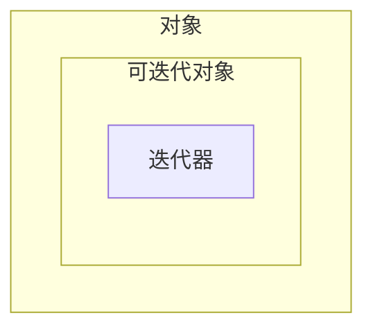

:::info
数据类自动生成常用的方法如`__init__`、`__repr__`等，减少样板代码，让开发者专注于业务逻辑。

```python showLineNumbers
from dataclasses import dataclass

@dataclass
class Person:
    name: str
    age: int
```

[PEP 557 – 数据类](https://peps.python.org/pep-0557/)
:::

## 面向对象编程

面向对象编程——Object Oriented Programming，简称 OOP，是一种程序设计思想。OOP 把对象作为程序的基本单元，一个对象包含了数据和操作数据的函数。

在 Python 中，所有数据类型都可以视为对象，当然也可以自定义对象。自定义的对象数据类型就是面向对象中的类（Class）的概念。

面向对象的设计思想是从自然界中来的，因为在自然界中，类（Class）和实例（Instance）的概念是很自然的。

Class 是一种抽象概念，比如我们定义的 Class——印花T恤，是指印花T恤这个概念，而实例（Instance）则是一个个具体的印花T恤，比如，我手上的向日葵印花T恤和玫瑰印花T恤是两个具体的印花T恤。

所以，面向对象的设计思想是抽象出 Class，根据 Class 创建 Instance。

面向对象的抽象程度又比函数要高，因为一个 Class 既包含数据，又包含操作数据的方法。

### class

python通过class关键字定义一个类，类如果不继承其他类，则默认继承object类，此时可以省略括号与object。

```python showLineNumbers
# class ClassName(object):
class ClassName:
    """class docstring"""
    pass

instance = ClassName()
```

如果在定义时，括号内含有一个或多个其他类，那么这个类就<HoverText text="继承了这些类" explanation="继承可以让子类拥有父类的所有方法和属性，子类可以增加新方法或者重写父类的方法。"/>。

类继承的基本形式：

```python showLineNumbers
# class ClassName(ParentClass1, ParentClass2, ...):
class ClassName(ParentClass): # ParentClass 就是用来继承的父类
    """class docstring"""
    # 类里的变量称为属性。
    name = "ClassName"

    # 类里的函数称为方法。
    def method(self):
        return

# 类被调用称为创建实例或实例化
# instance称之为ClassName类的实例。
instance = ClassName()
```

#### 方法和属性

方法按照是否可访问实例和类的属性分为：

- [类方法](#classmethod-和-staticmethod)：`@classmethod` 装饰器+第一个参数传入类（约定为cls） ，类或实例可以调用，能访问类的属性和方法。
- [静态方法](#classmethod-和-staticmethod)：`@staticmethod` 装饰器，类或实例可以调用，不能访问实例和类和实例的属性和方法。
- 实例方法：约定第一个参数传入实例（约定为self），约定实例化后调用，可以访问实例的属性和方法。

:::tip
不遵守`self`和`cls`命名约定不会让你代码报错，但是遵守约定可以让你的代码可读性更高。

```python showLineNumbers
class ClassName:
    def instance_method(is_not_self):
        print("instance_method", is_not_self)

    # 不遵守第一个参数传入实例的约定，可通过类调用。但是不能实例化后调用。
    # 这种方法如果加上@staticmethod装饰器，既可以类调用，也可以实例化后调用。
    def instance_method_no_self():
        print("instance_method_no_self")

# 如果你通过类调用方法，那么它就是普通函数。如果有参数需要手动传入参数。
ClassName.instance_method_no_self()   # instance_method_no_self
ClassName.instance_method(1)          # instance_method 1
ClassName.instance_method(ClassName())# instance_method <__main__.ClassName object at 0x0000021973262280>

# 如果实例化后调用，那么它会自动将实例作为第一个参数传入。如果方法没有参数则会报错。
ClassName().instance_method()         # instance_method <__main__.ClassName object at 0x0000021973262280>
ClassName().instance_method_no_self() # TypeError: ClassName.instance_method_no_self() takes 0 positional arguments but 1 was given
```
:::

方法和属性按照是否以下划线`_`开头和结尾，可以分为以下几种：

- 以 \_\_ 开头和结尾的方法和属性，大多有特殊用途。称呼多样，称为 “special/双下划线/魔法” 方法和属性。
- 不以 \_\_ 开头和结尾的方法和属性，即共有的方法和属性。
- 以 \_\_ 开头不以 \_\_ 结尾的方法，名称修饰方法，解释器会自动将其名称修改。
- 以 \_ 开头，私有方法，不过不是真正私有，而是可以调用的，但是不会被代码自动完成所记录（即 Tab 键之后不会显示）

```python showLineNumbers
class MyDemoClass(object):
    # special 方法(有特殊用途)
    def __init__(self):
        print("special.")
    # 共有方法
    def get_value(self):
        print("get_value is public method.")

    # 私有方法：会被代码自动完成所记录
    def _get_name(self):
        print("_get_name is private method.")

    # 名称修饰方法
    # 当你定义一个 __my_method() 方法时，Python 解释器会自动将其名称修改为 
    # _ClassName__my_method() 的形式，以避免在子类中发生名称冲突
    def __get_type(self):
        print("__get_type is really special method.")

demo = MyDemoClass() # special.
demo.get_value() # get_value is public method.
demo._get_name() # _get_name is private method
demo._MyDemoClass__get_type() # __get_type is really special method.
```

#### 继承

继承可以让子类拥有父类的所有方法和属性，子类可以增加新方法或者重写父类的方法。

```python showLineNumbers
class Clothes(object):
    def __init__(self, color="green"):
        self.color = color

    def out_print(self):
        return self.__class__.__name__, self.color

my_clothes = Clothes()
my_clothes.color
my_clothes.out_print()

# 定义一个子类，继承父类的所有方法
class NikeClothes(Clothes):
    def change_color(self):
        if self.color == "green":
            self.color = "red"

# 子类继承父类的所有方法
your_clothes = NikeClothes()
your_clothes.color
your_clothes.out_print()

# 同时子类也有自己的方法可用
your_clothes.change_color()
your_clothes.color

# 如果想对父类的方法进行修改，只需要在子类中重定义这个方法即可
class AdidasClothes(Clothes):
    def change_color(self):
        if self.color == "green":
            self.color = "black"

    def out_print(self):
        self.change_color()
        return self.__class__.__name__, self.color


him_clothes = AdidasClothes()
print(him_clothes.color)

him_clothes.change_color()
print(him_clothes.color)
print(him_clothes.out_print())
```

:::info
异常是标准库中的类，这意味着我们可以自定义异常类：

尝试在文本输入框输入：k，start，q

```python showLineNumbers
class CommandError(ValueError):
    print("bad command operation. must input 'start', 'stop', 'pause'")

valid_commands = {'start', 'stop', 'pause'}
while True:
    command = input('>')
    if command == 'q':
        break
    try:
        if command.lower() not in valid_commands:
            raise CommandError('Invalid command: %s' % command)
        print('input command:', command)
    except CommandError:
        print("bad command string: %s" % command)

```
:::

### super

`super(class, instance)` 函数用于在子类中调用父类（或超类）的方法，特别是支持多继承的场景下，它会根据方法的解析顺序[Method Resolution Order, MRO](#__mro__与mro)来决定调用查找类的下一个类的方法。

<Highlight>参数`class`决定从MRO的哪个类之后开始查找（即从该类的下一个类开始找），参数`instance`决定使用谁的MRO。`instance`可以是实例对象或类对象。</Highlight>

#### 无参数形式

无参数写法必须在方法或实例方法内部使用，即有`self`或`cls`上下文。当在类的方法内部使用 `super()` 时，它会自动推断当前类和当前上下文。

将当前类传入第一个参数，将当前方法的第一个实例或类（即`self`或`cls`）传入第二个参数。

```python showLineNumbers
class Child:
    def self_method(self):
        # 自动推断当前类和当前上下文，将当前类传入第一个参数，将当前上下文传入第二个参数。
        print(id(super())==id(super(Child, self))) # True

    @classmethod
    def class_method(cls):
        # 自动推断当前类和当前上下文，将当前类传入第一个参数，将当前上下文传入第二个参数。
        print(id(super())==id(super(Child, cls))) # True
    
    @staticmethod
    def static_method():
        # 静态方法没有上下文，不传入第一个参数，不传入第二个参数。
        print(id(super())) 
child = Child()
child.self_method() # True
child.class_method() # True
child.static_method() # super(): no arguments
```

使用`super().指定方法()`时，会将当前的上下文(`self` 或 `cls`)作为打包为super对象，传递给"<Highlight>当前的上下文(`self` 或 `cls`)对应MRO的下一个类</Highlight>的指定方法",然后调用。

- 如果指定方法是静态方法，则上下文不作为参数，因为静态方法本身就不依赖于实例或类来执行。
- 如果指定方法是类方法，则不论上下文是实例对象还是类对象。类方法都能解析为类对象正常执行。
- 如果指定方法是实例方法，则传递当前的上下文如果是不是实例对象，而是其他（如类对象）会报错。

```python showLineNumbers
class Parent:
    def self_method(self):
        print("Parent self_method: ",self)
    
    @classmethod
    def class_method(cls):
        # cls参数永远指向调用该方法的类
        # 不论提供的是类还是实例，最终都会调用类的方法。
        print("Parent class method:",cls)

    @staticmethod
    def static_method():
        print("Parent static method")


class Child(Parent):
    
    def self_method(self):
        # 将当前的self作为参数，传递给"self即Child,对应的MRO的Child的下一个类的方法",然后调用
        super().self_method()  # 调用父类的 self_method 方法
        super().class_method()  # 调用父类的 class_method 方法
        super().static_method()  # 调用父类的 static_method 方法

    @classmethod
    def class_method(cls):
        # 将当前的cls作为参数，传递给"cls即Child,对应的MRO的Child的下一个类的方法",然后调用
        # super().self_method()  # 调用父类的 self_method 方法
        super().class_method()  # 调用父类的 class_method 方法
        super().static_method()  # 调用父类的 static_method 方法

child = Child()
child.self_method()
"""
Parent self_method:  <__main__.Child object at 0x000001CAE6FBC1D0>
Parent class method: <class '__main__.Child'>
Parent static method
"""
child.class_method()
"""
TypeError: Parent.self_method() missing 1 required positional argument: 'self'
Parent class method: <class '__main__.Child'>
Parent static method
"""
```

#### 双参数写法

明确指定要查找的类和绑定的类或实例，使`super()`可以在类外使用，提供最大的控制灵活性，一般是与实例方法和类方法配合使用。

<Highlight>参数`class`决定从MRO的哪个类之后开始查找（即从该类的下一个类开始找），参数`instance`决定使用谁的MRO。`instance`可以是实例对象或类对象。</Highlight>

下面例子中第二个参数始终不变，但是第一个参数一直在变。下面代码中`d.method()`运行流程：

- 首先会调用`D`的`method`方法，`super()`中自动补全`D`和`D`的实例`d`（即`self`）。
- 然后`super().method()`会依据`D`的MRO找`method`方法找`D`的下一个类`B`,看有没有`method`方法,没找到则继续找下一个类，找到则调用。
- 然后调用`B`的`method`方法,将`D`的<Highlight>实例`d`（即`self`）作为参数传递给`B`的`method`方法。</Highlight>
- 此时`B`的`method`方法中的`super()`中自动补全`B`和实例`self`，<Highlight>这时的`self`是刚刚传入`d`的实例</Highlight>。
- 然后`super().method()`会依据`d`的MRO找`B`的下一个类`C`,看有没有`method`方法,找到`C`。
- 然后调用`C`的`method`方法,打印"C.method"


```python showLineNumbers
class A:
    def method(self):
        print("A.method")

class B(A):
    def method(self):
        print(f"super将从{self}的{self.__class__.__mro__}中，找到B的下一个类")
        super().method()

class C(A):
    def method(self):
        print(f"C: {self}{self.__class__.__mro__}")
        print("C.method")

class D(B, C):
    def method(self):
        super().method()


print("MRO:", D.__mro__)
d = D()
d.method()
"""
MRO: (<class '__main__.D'>, <class '__main__.B'>, <class '__main__.C'>, <class '__main__.A'>, <class 'object'>)
super将从<__main__.D object at 0x0000024AF4D00500>的(<class '__main__.D'>, <class '__main__.B'>, <class '__main__.C'>, <class '__main__.A'>, <class 'object'>)中，找到B的下一个类
C: <__main__.D object at 0x000001A7BA8F04D0>(<class '__main__.D'>, <class '__main__.B'>, <class '__main__.C'>, <class '__main__.A'>, <class 'object'>)
C.method
"""
# 在类外使用super()，不可缺省，要明确指定要查找的类和绑定的类或实例即可。
# 找到C的MRO，从该MRO的C之后的类开始找，找到A有method方法，然后调用A的method方法。
super(C, C()).method()
"""
A.method
"""
```

### classmethod 和 staticmethod

- `classmethod`：第一个参数传入类（约定为cls）+ @classmethod 装饰器，<Highlight>可以访问类变量</Highlight>，并可以用于创建类的不同实例。
- `staticmethod`：@staticmethod 装饰器，本质上就是一个普通的函数，只是被放在类的命名空间下。它<Highlight>不能访问类或实例的任何属性</Highlight>，通常用于与类逻辑相关但不需要访问其状态的工具函数。

```python showLineNumbers
class A:
    name = 'A'
    @classmethod
    def class_method(cls):
        print(cls,cls.name)

    @staticmethod
    def static_method():
        print("static_method")

a = A()
a.class_method()
a.static_method()
"""
<class '__main__.A'> A
static_method
"""
```

### property

`@property`装饰器可以使得一个属性变成通过方法访问的只读属性（注意是属性不是方法）。

对于 `@property` 生成的只读属性，我们可以使用相应的 `@attr.setter` 修饰符来使得这个属性变成可写的：


```python showLineNumbers
class Clothes(object):
    def __init__(self, price):
        self.price = price

    # 这样就变成属性了
    @property
    def discount_price(self):
        print("discount_price 被读取")
        if self.price <= 100:
            self.new_price = 0
        else:
            self.new_price = 1
        return self.new_price

    @discount_price.setter
    def discount_price(self, new_price):
        print(f"discount_price 被设置{new_price}")
        self.new_price = new_price


my_clothes = Clothes(100)
print(my_clothes.discount_price)
my_clothes.price = 200 
my_clothes.discount_price = 180 
print(my_clothes.discount_price) 
"""
discount_price 被读取
0
discount_price 被设置180
discount_price 被读取
1
"""
```

:::info

property 函数也可以直接使用，等价于上面的写法。

```python showLineNumbers {8,18,21}
class Clothes(object):
    def __init__(self, price):
        self.price = price

    # # 这样就变成属性了
    # @property
    # def discount_price(self):
    def get_discount_price(self):
        print("discount_price 被读取")
        if self.price <= 100:
            self.new_price = 0
        else:
            self.new_price = 1
        return self.new_price

    # @discount_price.setter
    # def discount_price(self, new_price):
    def set_discount_price(self, new_price):
        print(f"discount_price 被设置{new_price}")
        self.new_price = new_price
    discount_price = property(get_discount_price, set_discount_price)


my_clothes = Clothes(100)
print(my_clothes.discount_price)
my_clothes.price = 200 
my_clothes.discount_price = 180 
print(my_clothes.discount_price) 
"""
discount_price 被读取
0
discount_price 被设置180
discount_price 被读取
1
"""
```
:::


## 特殊方法与属性

Python 使用 \_\_ 开头的名字来定义特殊方法与特殊属性

### `__mro__`与mro()与`__bases__`

`__mro__`与`mro()`用于获取类的继承关系。

`__mro__`是method resolution order的缩写，表示方法解析顺序。返回的是tuple。

mro()是method resolution order的缩写，表示方法解析顺序。返回的是list。

`__bases__`返回一个元组，包含直接继承的所有父类。它只反映了类的直接继承关系，不包括当前类及其祖父类或其他更远的祖先。


```python showLineNumbers
class Parent(object):
    pass

class Child(Parent):
    pass

print(Child.mro()) # [<class '__main__.Child'>, <class '__main__.Parent'>, <class 'object'>]
print(Child.__mro__) # (<class '__main__.Child'>, <class '__main__.Parent'>, <class 'object'>)
print(Child.__bases__) # (<class '__main__.Parent'>,)
```

### `__init__` 与 `__new__` 方法详解

- `__new__()` 在每次<Highlight>创建实例时</Highlight>时被调用，用于创建实例。它至少有一个参数，约定俗成为`cls`，代表当前类。必须返回一个实例。

- `__init__()` 在每次<Highlight>实例创建后</Highlight>后被调用，用于初始化实例。它至少有一个参数，约定俗成为`self`，代表当前实例。返回值必须为 `None` 。


执行流程：

- 调用\_\_new\_\_()方法创建实例。\_\_new\_\_必须返回一个实例。

此时拿到的实例并不能正常使用。一个实例需要被\_\_init\_\_()方法初始化后才可以被正常使用。

- 调用\_\_init\_\_()方法初始化该实例。\_\_init\_\_什么都不返回

```python showLineNumbers
class Person:
    def __new__(cls, name, age):
        print(f"__new__ called: 创建 {name} 的实例")
        # 调用父类的 __new__ 方法创建实例
        # 因为__new__必须返回一个实例，当前的__new__又被重写了，如果调用自己会循环引用，所以调用父类的__new__
        instance = super().__new__(cls)
        return instance
    
    def __init__(self, name, age):
        print(f"__init__ called: 初始化 {name} 的实例")
        self.name = name
        self.age = age
    
    def __str__(self):
        return f"Person(name={self.name}, age={self.age})"

# 创建实例
person = Person("Alice", 25)
print(person)
"""
__new__ called: 创建 Alice 的实例
__init__ called: 初始化 Alice 的实例
Person(name=Alice, age=25)
"""
```


:::info
单例模式实现

`__new__` 方法最常见的用途是实现单例模式：

```python showLineNumbers
class Singleton:
    _instance = None
    
    def __new__(cls, *args, **kwargs):
        if cls._instance is None:
            print("创建新的单例实例")
            cls._instance = super().__new__(cls)
        return cls._instance
    
    def __init__(self, *args, **kwargs):
        print(id(self))

a = Singleton() # 2747644276960
b = Singleton() # 2747644276960
# id 相同，说明是同一个实例
```
:::

### \_\_call\_\_

- `__call__()` 当实例名加上()时被调用,可以使对象可以像函数一样被调用。

```python showLineNumbers
class Clothes(object):
    def __init__(self, color="green"):
        self.color = color
        self.wear_count = 0

    def __call__(self):
        self.wear_count += 1
        return f"Wearing {self.color} clothes for the {self.wear_count} time"

my_clothes = Clothes("blue")
print(my_clothes())  # Wearing blue clothes for the 1 time
print(my_clothes())  # Wearing blue clothes for the 2 time
```

### \_\_iter\_\_和\_\_next\_\_

:::info
实现了 `__iter__()` 方法的对象是可迭代对象。

如果同时实现了 `__next__()` 方法，那它是可迭代对象的同时，也是迭代器。

如果只实现了 `__next__()` 方法，那它可以像手动迭代器一样工作，但是，它不是一个有效的可迭代对象。


| 类型 | 是否实现`__iter__` | 是否实现`__next__` |
| :--- | :---: | :---: |
| **对象** | ✖️ | ✖️ |
| **对象** | ✖️ | ✔️ |
| **可迭代对象** | ✔️ | ✖️ |
| 是**可迭代对象**也是**迭代器** | ✔️ | ✔️ |
:::

```python showLineNumbers
class MyRange:
    def __init__(self, start, end):
        self.current = start
        self.end = end
    
    def __iter__(self):
        print("__iter__")
        return self
    
    def __next__(self):
        print("__next__")
        if self.current < self.end:
            result = self.current
            self.current += 1
            return result
        else:
            raise StopIteration

# 创建一个 MyRange 对象，这是一个“可迭代对象”
my_range_object = MyRange(1, 4) # 调用__iter__

for i in my_range_object: # 每次迭代都在调用__next__
    # 等价于 print(next(my_iterator))
    print(i) 
"""
__iter__
__next__
1
__next__
2
__next__
3
__next__
"""
```


###  \_\_enter\_\_和\_\_exit\_\_ 与 with 语句

`__enter__()` 和 `__exit__()` 定义对象的上下文管理行为。

- 当一个对象被用于 with 语句时，会自动调用 `__enter__()` 方法。

- 当 with 语句块结束时，会自动调用 `__exit__()` 方法。

```python showLineNumbers
class ContextManager(object):
    def __enter__(self):
        """
        __enter__ 方法可以返回一个值，该值会被 `as` 关键字绑定到 `with` 语句的变量上。
        """
        print("Entering")
        # 一个常见的做法是让 `__enter__` 返回上下文管理器对象本身。
        return self

    def __exit__(self, exc_type, exc_value, traceback):
        """
        __exit__ 方法接收三个参数：exc_type (异常类型), exc_value (异常值), traceback (堆栈信息)。如果 `with` 块中发生了异常，这些参数将包含异常信息。
        
        如果 __exit__ 返回 True，则表示该异常已被处理，不会再次向上抛出。
        如果 __exit__ 返回 False (或 None)，则异常会继续传播。
        """
        print("Exiting")
        if exc_type is not None:
            print(f"  Exception Type: {exc_type.__name__}")
            print(f"  Exception Value: {exc_value}")
            return True  # 阻止异常向外传播

with ContextManager():
    print("inside operate")
"""
Entering
inside operate
Exiting
"""
with ContextManager():
    print(1 / 0) # 会引发 ZeroDivisionError
print("程序继续执行") # 如果 __exit__ 返回 True，这行会被执行
"""
Entering
Exiting
  Exception Type: ZeroDivisionError
  Exception Value: division by zero
程序继续执行
"""
```

:::info
with 语句常常与 as 关键字一起使用，`as 变量名`。`__enter__()` 方法返回的值被赋值给 as 关键字后面的变量。

下面的代码展示了打开文件，将文件语柄赋值给 fp 变量，然后通过 fp 变量调用 write 方法写入文件。

```python showLineNumbers
with open('my_file.txt', 'w') as fp:
    fp.write("Hello world")
```
:::

### \_\_len\_\_

- `__len__()` 返回对象的长度。

```python showLineNumbers
class Clothes(object):
    def __init__(self, color="green"):
        self.color = color

    def __len__(self):
        return len(self.color)
    
my_clothes = Clothes("blue")
print(len(my_clothes)) # 调用__len__方法
# 因为有4个字符，所以返回4
```
### \_\_getitem\_\_和\_\_setitem\_\_和\_\_delitem\_\_

- `__getitem__()` 返回对象的索引值。

- `__setitem__()` 设置对象的索引值。

- `__delitem__()` 删除对象的索引值。

```python showLineNumbers
class Clothes:
    def __init__(self):
        self.color = ["blue", "green", "red"]
    
    def __getitem__(self, index):
        return self.color[index]
    
    def __setitem__(self, index, value):
        self.color[index] = value
    
    def __delitem__(self, index):
        del self.color[index]
    
my_clothes = Clothes()
print(my_clothes[0]) # 调用__getitem__方法
# blue
my_clothes[0] = "red" # 调用__setitem__方法
print(my_clothes.color) # ['red', 'green', 'red']

del my_clothes[0] # 调用__delitem__方法
print(my_clothes.color) # ['green', 'red']
```

### \_\_class\_\_和\_\_name\_\_

- `__class__` 返回<Highlight>对象</Highlight>所属的<Highlight>类</Highlight>
- `__name__` 返回<Highlight>类</Highlight>的名称。

```python showLineNumbers
class Clothes(object):
    def __init__(self, color="green"):
        self.color = color

    def get_class_info(self):
        # __class__ 返回对象的类
        return self.__class__
    
    def get_class_name(self):
        # __class__.__name__ 返回类的名称
        return self.__class__.__name__

# 创建实例
my_clothes = Clothes("blue")
print(Clothes)                        # <class '__main__.Clothes'>
# 使用 __class__ 属性
print(my_clothes.__class__)           # <class '__main__.Clothes'>
print(my_clothes.get_class_info())    # <class '__main__.Clothes'>

# 使用 __name__ 属性
print(Clothes.__name__)               # Clothes
print(my_clothes.__class__.__name__)  # Clothes
print(my_clothes.get_class_name())    # Clothes

# 检查对象类型
print(type(my_clothes))               # <class '__main__.Clothes'>
print(my_clothes.__class__ == Clothes)  # True

# 在继承中的应用：

class NikeClothes(Clothes):
    def __init__(self, color="red"):
        super().__init__(color)

nike_clothes = NikeClothes()
print(nike_clothes.__class__.__name__)  # NikeClothes
print(nike_clothes.__class__)           # <class '__main__.NikeClothes'>

# 获取父类
print(nike_clothes.__class__.__bases__)  # (<class '__main__.Clothes'>,)
```


## 重载类型转换

### \_\_repr\_\_和\_\_str\_\_

```python showLineNumbers
class Clothes(object):
    """
    repr and str demo
    """
    def __init__(self, color="green"):
        self.color = color

    # __str__() 是使用 print 函数显示的结果,即str()函数调用的结果。
    def __str__(self):
        "This is a string to print."
        return ("a {} clothes".format(self.color))

    # __repr__() 是使用 repr() 函数显示的结果，理想情况下，应该返回一个可以重新创建对象的表达式。
    def __repr__(self):
        "This string recreates the object."
        return ("{}(color='{}')".format(self.__class__.__name__, self.color))

print(Clothes()) # a green clothes
print(repr(Clothes())) # Clothes(color='green')
```

### \_\_int\_\_和\_\_float\_\_和\_\_complex\_\_

```python showLineNumbers
class Price(object):
    def __init__(self, value):
        self.value = value
    
    def __int__(self):
        return int(self.value)
    
    def __float__(self):
        return float(self.value)
    
    def __complex__(self):
        return complex(self.value)

price = Price(100)
print(int(price)) # 100
print(float(price)) # 100.0
print(complex(price)) # (100+0j)
```

## 重载运算符

:::warning
运算符当中，除了`=` `is` `not` `and` `or` 不能被重载，其他运算符都可以被重载。
:::

### 重载算术运算符

这些方法定义对象的算术运算行为。

```python showLineNumbers
class Price(object):
    def __init__(self, value):
        self.value = value
    
    def __add__(self, other):
        # + (加法)
        if isinstance(other, Price):
            return Price(self.value + other.value)
        return Price(self.value + other)
    
    def __sub__(self, other):
        # - (减法)
        if isinstance(other, Price):
            return Price(self.value - other.value)
        return Price(self.value - other)

    def __mul__(self, other):
        # * (左乘法)
        return Price(self.value * other)
    
    def __rmul__(self, other):
        # * (右乘法)
        return Price(other * self.value)

    def __truediv__(self, other):
        # / (左除法)
        return Price(self.value / other)
    
    def __rtruediv__(self, other):
        # / (右除法)
        return Price(other / self.value)

    def __floordiv__(self, other):
        # // (左整数除法)
        return Price(self.value // other)
    
    def __rfloordiv__(self, other):
        # // (右整数除法)
        return Price(other // self.value)

    def __mod__(self, other):
        # % (左取模)
        return Price(self.value % other)
    
    def __rmod__(self, other):
        # % (右取模)
        return Price(other % self.value)

    def __pow__(self, other):
        # ** (左幂运算)
        return Price(self.value ** other)
    
    def __rpow__(self, other):
        # ** (右幂运算)
        return Price(other ** self.value)

    def __repr__(self):
        return f"Price({self.value})"

price1 = Price(100)
price2 = Price(50)
print(price1 + price2)  # Price(150)
print(price1 - 30)      # Price(70)

price = Price(10)
print(price * 5)    # Price(50) - 调用 __mul__
print(3 * price)    # Price(30) - 调用 __rmul__

price = Price(10)
print(price / 2)    # Price(5.0) - 调用 __truediv__
print(3 / price)    # Price(0.3) - 调用 __rtruediv__


price = Price(10)
print(price // 2)    # Price(5) - 调用 __floordiv__
print(3 // price)    # Price(0) - 调用 __rfloordiv__

price = Price(10)
print(price % 3)    # Price(1) - 调用 __mod__
print(3 % price)    # Price(3) - 调用 __rmod__

price = Price(10)
print(price ** 2)    # Price(100) - 调用 __pow__
print(2 ** price)    # Price(1024) - 调用 __rpow__
```

### 重载比较（关系）运算符


```python showLineNumbers
class Price(object):
    def __init__(self, value):
        self.value = value
    
    def __eq__(self, other):
        # == (等于)
        return self.value == other.value
    
    def __ne__(self, other):
        # != (不等于)
        return self.value != other.value
    
    def __lt__(self, other):
        # < (小于)
        return self.value < other.value
    
    def __gt__(self, other):
        # > (大于)
        return self.value > other.value
    
    def __le__(self, other):
        # <= (小于等于)
        return self.value <= other.value
    
    def __ge__(self, other):
        # >= (大于等于)
        return self.value >= other.value
    
    def __repr__(self):
        return f"Price({self.value})"

price1 = Price(10)
price2 = Price(20)
print(price1 == price2)    # False
print(price1 != price2)    # True
print(price1 < price2)    # True
print(price1 > price2)    # False
print(price1 <= price2)    # True
print(price1 >= price2)    # False
```
### 重载赋值运算符

这些方法定义对象的赋值运算行为。


```python showLineNumbers
class Price(object):
    def __init__(self, value):
        self.value = value
    
    def __iadd__(self, other):
        # += (加法赋值)
        return Price(self.value + other)
    
    def __isub__(self, other):
        # -= (减法赋值)
        return Price(self.value - other)
        
    def __imul__(self, other):
        # *= (乘法赋值)
        return Price(self.value * other)
    
    def __itruediv__(self, other):
        # /= (除法赋值)
        return Price(self.value / other)
    
    def __imod__(self, other):
        # %= (取模赋值)
        return Price(self.value % other)
    
    def __ipow__(self, other):
        # **= (幂赋值)
        return Price(self.value ** other)
    
    def __ifloordiv__(self, other):
        # //= (整数除法赋值)
        return Price(self.value // other)
    
    def __repr__(self):
        return f"Price({self.value})"

for i in [ "+=","-=", "*=", "/=", "%=", "**=", "//="]:
    price = Price(10)
    if i == "+=":
        price += 10
    elif i == "-=":
        price -= 10
    elif i == "*=":
        price *= 10
    elif i == "/=":
        price /= 10
    elif i == "%=":
        price %= 10
    elif i == "**=":
        price **= 10
    elif i == "//=":
        price //= 10
    print(price)
"""
Price(20)
Price(0)
Price(100)
Price(1.0)
Price(0)
Price(10000000000)
Price(1)
"""
```

### 重载位运算符

这些方法定义对象的位运算行为。

```python showLineNumbers
class Permission(object):
    def __init__(self, value):
        self.value = value
    
    def __and__(self, other):
        # & (按位与)
        return Permission(self.value & other.value)
    
    def __or__(self, other):
        # | (按位或)
        return Permission(self.value | other.value)
    
    def __xor__(self, other):
        # ^ (按位异或)
        return Permission(self.value ^ other.value)
    
    def __invert__(self):
        # ~ (按位取反)
        return Permission(~self.value)
    
    def __lshift__(self, other):
        # << (左移)
        if isinstance(other, Permission):
            return Permission(self.value << other.value)
        return Permission(self.value << other)
    
    def __rshift__(self, other):
        # >> (右移)
        if isinstance(other, Permission):
            return Permission(self.value >> other.value)
        return Permission(self.value >> other)
    
    def __repr__(self):
        return f"Permission({self.value})"

# 权限示例
read_perm = Permission(4)    # 100 (二进制)
write_perm = Permission(2)   # 010 (二进制)
exec_perm = Permission(1)    # 001 (二进制)

# 位运算操作
print(read_perm & write_perm)    # Permission(0) - 按位与
print(read_perm | write_perm)    # Permission(6) - 按位或
print(read_perm ^ write_perm)    # Permission(6) - 按位异或
print(~read_perm)                # Permission(-5) - 按位取反
print(read_perm << 1)            # Permission(8) - 左移
print(read_perm >> 1)            # Permission(2) - 右移
```

### 重载成员运算符

`__contains__()` 定义对象的成员运算 `in` 行为。

```python showLineNumbers
class ClothesWardrobe(object):
    def __init__(self):
        self.clothes = ["shirt", "pants", "jacket", "dress"]

    def __contains__(self, item):
        # in (成员运算)
        return item.lower() in self.clothes

# 创建衣柜对象
wardrobe = ClothesWardrobe()

# 使用 in 运算符检查
print("shirt" in wardrobe)      # True
print("SHIRT" in wardrobe)      # True # 不区分大小写
print("hat" in wardrobe)        # False
print("jacket" in wardrobe)     # True

```
## 内置函数


### type函数、isinstance函数、issubclass函数

`type(object)` / `type(name, bases, dict, **kwds)`: 获取对象的类型，或动态创建类。返回对象的类型或新创建的类
- `object`: 要获取类型的对象
- `name`: 新类的名称（动态创建时）
- `bases`: 父类元组（动态创建时）
- `dict`: 类属性字典（动态创建时）


`isinstance(object, classinfo)->bool`: 检查对象是否是指定类型的实例（支持继承关系） 如果对象是指定类型的实例为`True`，否则 `False`
- `object`: 要检查的对象
- `classinfo`: 类<Highlight>或类型元组</Highlight>


`issubclass(class, classinfo)->bool`: 检查一个类是否是另一个类的子类。如果是子类为`True`，否则 `False`
- `class`: 要检查的类
- `classinfo`: 父类<Highlight>或父类元组</Highlight>

```python showLineNumbers
class Animal:
    def __init__(self, name):
        self.name = name

class Dog(Animal):
    def __init__(self, name, breed):
        super().__init__(name)
        self.breed = breed

class Cat(Animal):
    def __init__(self, name, color):
        super().__init__(name)
        self.color = color

# 创建实例
dog = Dog("旺财", "金毛")
cat = Cat("小白", "白色")

# type() - 获取对象的确切类型
print(type(dog))        # <class '__main__.Dog'>
print(type(cat))        # <class '__main__.Cat'>
print(type(Dog))        # <class 'type'>

# type() - 比较类型
print(type(dog) == Dog)     # True
print(type(dog) == Animal)  # False (不考虑继承关系)

# isinstance() - 检查实例类型（考虑继承关系）
print(isinstance(dog, Dog))     # True
print(isinstance(dog, Animal))  # True (Dog继承自Animal)
print(isinstance(dog, Cat))     # False

# isinstance() - 检查多个类型
print(isinstance(dog, (Dog, Cat)))  # True (是Dog或Cat中的一种)
print(isinstance(42, (int, str)))   # True (42是int类型)

# issubclass() - 检查类的继承关系
print(issubclass(Dog, Animal))      # True (Dog是Animal的子类)
print(issubclass(Cat, Animal))      # True (Cat是Animal的子类)
print(issubclass(Dog, Cat))         # False (Dog不是Cat的子类)
print(issubclass(Animal, object))   # True (所有类都继承自object)

# issubclass() - 检查多个父类
print(issubclass(Dog, (Animal, object)))  # True
```
:::info
type 函数获取对象的类型。同时也可以动态创建类。

```python showLineNumbers
# 定义一个方法
def init_method(self, x):
    self.x = x

# 定义一个方法
def say_hello(self):
    return f"Hello, x = {self.x}"

# 动态创建类：type(类名, 父类元组, 属性字典)
DynamicClass = type('DynamicClass', (object,), {
    '__init__': init_method,
    'say_hello': say_hello,
    'class_var': 'I am a class variable'
})

# 使用动态创建的类
obj = DynamicClass(10)
print(obj.say_hello())        # Hello, x = 10
print(obj.class_var)          # I am a class variable
print(type(obj))              # <class '__main__.DynamicClass'>
```
:::


### dir函数、hasattr函数、delattr函数、setattr函数、getattr函数、vars函数

`dir(object=None)->list`: 获取对象的所有属性和方法名列表
- `object`: 要获取属性的对象，默认为当前作用域

`hasattr(object, name)->bool`: 检查对象是否具有指定名称的属性。如果对象有该属性为`True`，否则 `False`
- `object`: 要检查的对象
- `name`: 属性名称（字符串）

`delattr(object, name)->None`: 删除对象的指定属性。等价于 `del object.name`
- `object`: 目标对象
- `name`: 要删除的属性名称（字符串）

`setattr(object, name, value)->None`: 设置对象的属性值。等价于 `object.name = value`
- `object`: 目标对象
- `name`: 属性名称（字符串）
- `value`: 要设置的属性值

`getattr(object, name, default=None)`: 获取对象的属性值。等价于 `object.name`，但可以提供默认值
- `object`: 目标对象
- `name`: 属性名称（字符串）
- `default`: 属性不存在时的默认值

`vars(object=None)->dict`: 获取对象的属性字典。返回对象的 `__dict__` 属性或当前作用域的局部变量字典
- `object`: 目标对象，默认为当前作用域

```python showLineNumbers
class Person:
    def __init__(self, name, age):
        self.name = name
        self.age = age
    
    def greet(self):
        return f"Hello, I'm {self.name}"

person = Person("Alice", 25)

# dir() - 获取所有属性和方法名
print("dir(person):", dir(person))
# ['__class__', '__delattr__', '__dict__', ... 'age', 'greet', 'name']

# hasattr() - 检查属性是否存在
print("hasattr(person, 'name'):", hasattr(person, 'name'))        # True
print("hasattr(person, 'height'):", hasattr(person, 'height'))    # False
print("hasattr(person, 'greet'):", hasattr(person, 'greet'))      # True

# getattr() - 获取属性值
print("getattr(person, 'name'):", getattr(person, 'name'))                    # Alice
print("getattr(person, 'height', 'Unknown'):", getattr(person, 'height', 'Unknown'))  # Unknown

# setattr() - 设置属性值
setattr(person, 'height', 170)
setattr(person, 'country', 'China')
print("After setattr:", person.name, person.age, person.height, person.country)
# After setattr: Alice 25 170 China

# vars() - 获取属性字典
print("vars(person):", vars(person))
# {'name': 'Alice', 'age': 25, 'height': 170, 'country': 'China'}

# delattr() - 删除属性
delattr(person, 'country')
print("After delattr:", vars(person))
# {'name': 'Alice', 'age': 25, 'height': 170}

# 等价操作演示
person.city = "Beijing"              # 等价于 setattr(person, 'city', 'Beijing')
print(person.city)                   # 等价于 getattr(person, 'city')
del person.city                      # 等价于 delattr(person, 'city')

# vars() 在不同上下文的使用
def test_vars():
    local_var = "test"
    another_var = 42
    print("Local vars:", vars())  # 显示局部变量
    # {'local_var': 'test', 'another_var': 42}

test_vars()
print("Global vars keys:", list(vars().keys()))  # 显示全局变量的键
```


## 元类编程

### object

`object` 是 Python 中所有类的最终基类。在 Python 3 中，即使没有显式继承，所有类都会自动继承自 `object`。<Highlight>object 自己没有基类，它是根基类。</Highlight>

Python 使用 `type` 这个内置类作为所有新类默认的元类。<Highlight>type 是所有类的元类，包括 object 和 type自己</Highlight>

元类编程就是通过继承 type 或自定义元类，来控制类的创建过程，例如在一个类被定义时，动态地修改它的属性、方法，或者对其进行验证。

这使得我们可以在不修改类定义本身的情况下，对多个类应用相同的行为或规则，从而实现更强大的代码生成和设计模式。

```python showLineNumbers
# 以下两种写法是等价的
class MyClass:
    pass

# 类的元类
print("\n元类关系:")
print(type(MyClass))            # <class 'type'>
print(MyClass.__class__)        # <class 'type'>

# object 本身的类型
print(type(object))             # <class 'type'>
print(object.__class__)         # <class 'type'>

# object 提供的所有方法和属性
print("\nobject 的所有属性和方法:")
object_methods = dir(object)
for attr in object_methods:
    print(f"  {attr}")
"""
  __class__      __delattr__    __dir__        __doc__
  __eq__         __format__     __ge__         __getattribute__
  __getstate__   __gt__         __hash__       __init__
  __init_subclass__  __le__     __lt__         __ne__
  __new__        __reduce__     __reduce_ex__  __repr__
  __setattr__    __sizeof__     __str__        __subclasshook__
"""

# 元类的概念示例
class Meta(type):
    def __new__(cls, name, bases, attrs):
        attrs['class_id'] = f"{name}_ID"
        return super().__new__(cls, name, bases, attrs)

class MyMetaClass(metaclass=Meta):
    pass

print(type(MyMetaClass))     # <class '__main__.Meta'>
print(MyMetaClass.class_id)  # MyMetaClass_ID
```