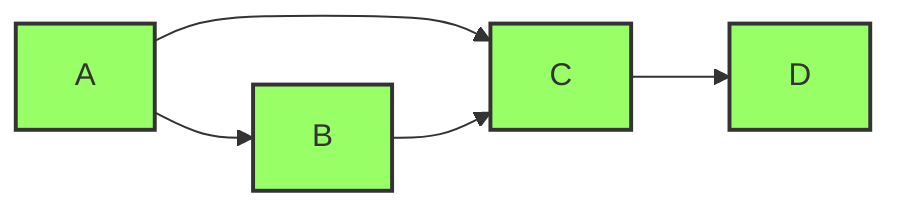
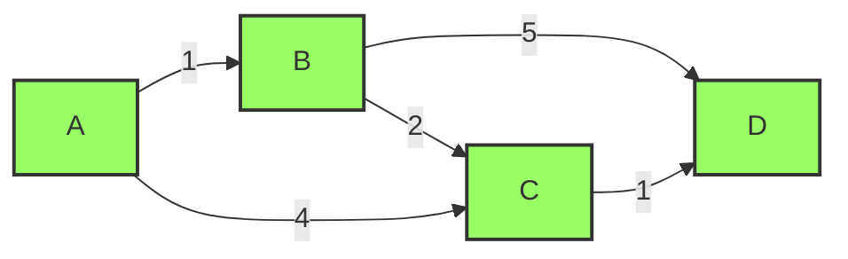
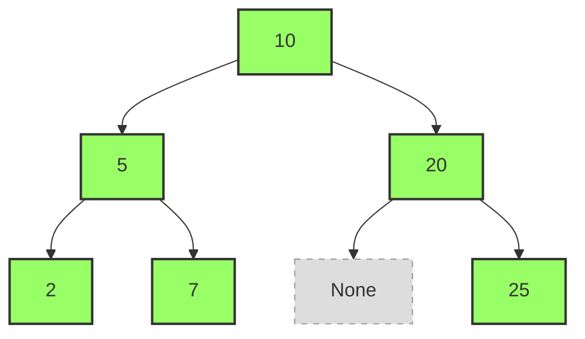
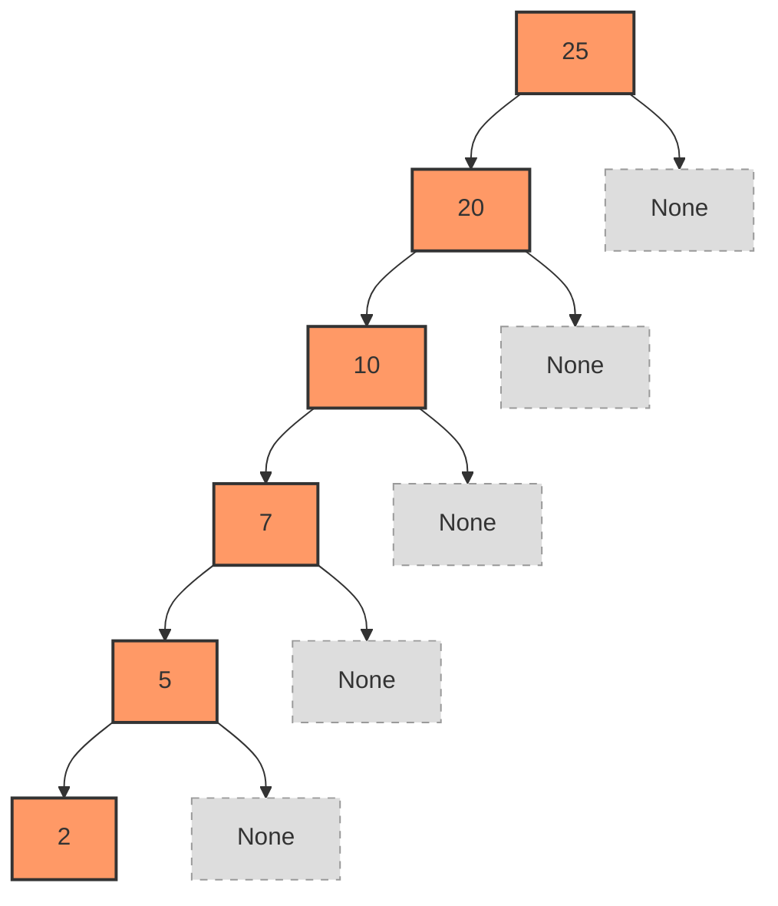

更多练习，请访问[Python cookbook](https://python-cookbook.readthedocs.io/zh_CN/latest/index.html)

## 程序题

### 折纸问题

一张厚度为N层的纸，每次对折都会使厚度变为原来的2倍，问第多少次对折后，其高度超过珠穆朗玛峰的高度(8848.86米)

#### 题解

```python showLineNumbers
def fold_paper(thickness, height):
    count = 0
    while thickness < height:
        thickness *= 2
        count += 1
    return count

print(fold_paper(0.0001, 8848.86))
```

### 打印时间

#### 描述

请从00:00依次打印出一天的时间
示例：

- 23 : 52
- 23 : 53
- 23 : 54

#### 题解

```python showLineNumbers 

for 时钟 in range(24):
    for 分钟 in range(60):
        print(时钟, ':', 分钟)

```


### 九九乘法表

#### 描述

要求使用循环代码打印一个九九乘法表出来.如下

```bash
1*1=1 

1*2=2 2*2=4 

1*3=3 2*3=6 3*3=9 

1*4=4 2*4=8 3*4=12 4*4=16 

1*5=5 2*5=10 3*5=15 4*5=20 5*5=25 

1*6=6 2*6=12 3*6=18 4*6=24 5*6=30 6*6=36 

1*7=7 2*7=14 3*7=21 4*7=28 5*7=35 6*7=42 7*7=49 

1*8=8 2*8=16 3*8=24 4*8=32 5*8=40 6*8=48 7*8=56 8*8=64      

1*9=9 2*9=18 3*9=27 4*9=36 5*9=45 6*9=54 7*9=63 8*9=72 9*9=81 
```

#### 题解

```python showLineNumbers 
#方法一
for i in range(1,10):
    print()
    for j in range(1,i+1):
        print('%d*%d=%d' % (j,i,i*j),end=' ')

#方法二
i=1
while i<10: #控制行，1到9
    j=1
    while j <= i: #控制每行显示的数量，1到9
        print("%d*%d=%d"%(j,i,i*j),end=' ') #输出
        j+=1 #每行显示的数量加1
    print("\n") #每一行结束换行
    i+=1 #行数加1

```


### 复利的力量

小明从2026年1月1日每日定投100元，年化收益率为10%，考虑到交易日，问小明在第几年可以实现100万的目标？

#### 题解

```python showLineNumbers
# 小明从2026年1月1日每日定投300元，年化收益率为10%，考虑到交易日（周一到周五），问小明在第几年可以实现100万的目标？

from datetime import datetime, timedelta
import calendar

# 计算参数
daily_investment = 100  # 每日定投金额（元）
annual_return_rate = 0.10  # 年化收益率 10%
target_amount = 1000000  # 目标金额 100万元

# 起始日期：2026年1月1日
start_date = datetime(2026, 1, 1)
current_date = start_date

# 计算每日收益率（假设每年约250个交易日）
# 先估算，后面会根据实际交易日数调整
estimated_trading_days = 250
daily_return_rate = (1 + annual_return_rate) ** (1 / estimated_trading_days) - 1

print("=" * 60)
print("定投计算（实际交易日：周一到周五）")
print("=" * 60)
print(f"起始日期: {start_date.strftime('%Y年%m月%d日')}")
print(f"每日收益率: {daily_return_rate * 100:.6f}%")
print(f"每日定投: {daily_investment} 元")
print(f"目标金额: {target_amount:,} 元")
print("-" * 60)

# 模拟每日定投
total_amount = 0  # 当前总金额
trading_day_count = 0  # 交易日计数
current_year = start_date.year
trading_days_this_year = 0  # 当前年度的交易日数
last_year_end_amount = 0  # 上一年结束时的金额
last_year_trading_days = 0  # 上一年的交易日数

while total_amount < target_amount:
    # 检查是否是工作日（周一到周五，weekday()返回0-6，0是周一，6是周日）
    weekday = current_date.weekday()  # 0=周一, 1=周二, ..., 4=周五, 5=周六, 6=周日
    
    # 检查是否跨年（在处理交易日之前）
    if current_date.year > current_year:
        year_num = current_year - start_date.year + 1
        print(f"第 {year_num} 年（{current_year} 年）结束时，总金额: {last_year_end_amount:,.2f} 元，交易日数: {last_year_trading_days} 天")
        current_year = current_date.year
        trading_days_this_year = 0
        last_year_end_amount = total_amount
        last_year_trading_days = 0
    
    if weekday < 5:  # 周一到周五（0-4）是交易日
        trading_day_count += 1
        trading_days_this_year += 1
        last_year_trading_days = trading_days_this_year
        
        # 先计算昨日收益（复利）
        total_amount = total_amount * (1 + daily_return_rate)
        
        # 然后投入今日的定投金额
        total_amount += daily_investment
        last_year_end_amount = total_amount
        
        # 检查是否达到目标（在交易日达到目标）
        if total_amount >= target_amount:
            break
    
    # 移动到下一天
    current_date += timedelta(days=1)

# 打印最后一年（如果还没打印）
if trading_days_this_year > 0:
    year_num = current_year - start_date.year + 1
    print(f"第 {year_num} 年（{current_year} 年）结束时，总金额: {last_year_end_amount:,.2f} 元，交易日数: {trading_days_this_year} 天")

# 计算达到目标的实际日期
# 由于在交易日达到目标后立即break，current_date就是达到目标的日期
actual_date = current_date
year_num = actual_date.year - start_date.year + 1

print("-" * 60)
print("\n最终结果：")
print("=" * 60)
print(f"达到目标日期: {actual_date.strftime('%Y年%m月%d日')} ({calendar.day_name[actual_date.weekday()]})")
print(f"达到目标时间: 第 {year_num} 年（{actual_date.year} 年）的第 {trading_days_this_year} 个交易日")
print(f"总金额: {total_amount:,.2f} 元")
print(f"累计交易日数: {trading_day_count} 天")
print(f"累计投资本金: {trading_day_count * daily_investment:,.2f} 元")
print(f"累计收益: {total_amount - trading_day_count * daily_investment:,.2f} 元")
print(f"收益率: {(total_amount - trading_day_count * daily_investment) / (trading_day_count * daily_investment) * 100:.2f}%")
print(f"实际经过天数: {(actual_date - start_date).days + 1} 天")
print("=" * 60)
```

### 字典排序

#### 描述

将字典数组按字典的某个key排序

#### 题解

```python showLineNumbers 
# 方法1：
sorted(d.cop(),key = lambda i:i[k])

# 方法2：
heappush(h,(i[k],i)) for i in d
```

### 单例模式

单例模式目的：让类创建的对象，在系统中只有 **唯一的一个实例**

特点：每一次执行 `类名()` 返回的对象，内存地址是相同的

#### 方法一：使用 `__new__` 方法

##### 基本实现

```python showLineNumbers   title="单例模式基础实现"
class MusicPlayer(object):
    # 记录第一个被创建对象的引用
    instance = None
    
    def __new__(cls, *args, **kwargs):
        # 1. 判断类属性是否为空对象
        if cls.instance is None:
            # 调用父类方法为第一个对象分配空间
            cls.instance = super().__new__(cls)
        
        # 2. 返回类属性保存的对象引用
        return cls.instance

# 测试单例效果
player1 = MusicPlayer()
player2 = MusicPlayer()

print(f"player1: {player1}")
print(f"player2: {player2}")
print(f"是否为同一对象: {player1 is player2}")  # True
```

##### 优化：只初始化一次


上述实现中，虽然返回的是同一个对象，但 `__init__` 方法会被多次调用


```python showLineNumbers  title="确保初始化只执行一次" {16-23}
class MusicPlayer(object):
    # 记录第一个被创建对象的引用
    instance = None
    # 记录初始化执行状态
    init_flag = False

    def __new__(cls, *args, **kwargs):
        if cls.instance is None:
            cls.instance = super().__new__(cls)
        return cls.instance

    def __init__(self):
        # 1. 判断是否执行过初始化动作
        if MusicPlayer.init_flag:
            return
        
        # 2. 如果没有执行过就执行初始化动作
        print("播放器初始化")
        
        # 3. 修改初始化状态
        MusicPlayer.init_flag = True


# 测试
player1 = MusicPlayer()  # 输出: 播放器初始化
player2 = MusicPlayer()  # 不会再次初始化
```

#### 方法二：使用装饰器 

```python showLineNumbers  title="装饰器实现单例"
def singleton(cls):
    """单例装饰器"""
    instances = {}
    
    def get_instance(*args, **kwargs):
        if cls not in instances:
            instances[cls] = cls(*args, **kwargs)
        return instances[cls]
    
    return get_instance

@singleton
class MySingleton:
    def __init__(self, param):
        self.param = param
        print(f"初始化参数: {param}")

# 使用示例
if __name__ == '__main__':
    a = MySingleton(10)  # 输出: 初始化参数: 10
    b = MySingleton(20)  # 不会再次初始化
    
    print(f"a.param: {a.param}")  # 10
    print(f"b.param: {b.param}")  # 10
    print(f"是否为同一对象: {a is b}")  # True
```

:::tip 装饰器优势
- 代码简洁优雅
- 可重用性强
- 不需要修改原类的内部结构
:::

#### 方法三：使用类方法 

```python showLineNumbers  title="类方法实现单例"
class Singleton(object):
    def __init__(self, name):
        self.name = name

    @classmethod
    def instance(cls, *args, **kwargs):
        if not hasattr(cls, "_instance"):
            cls._instance = cls(*args, **kwargs)
        return cls._instance

# 使用示例
single_1 = Singleton.instance('第1次创建')
single_2 = Singleton.instance('第2次创建')

print(f"single_1.name: {single_1.name}")  # 第1次创建
print(f"single_2.name: {single_2.name}")  # 第1次创建
print(f"是否为同一对象: {single_1 is single_2}")  # True
```

##### 线程安全版本

:::warning 多线程问题
上述实现在多线程环境下不安全，需要加锁保护
:::

```python showLineNumbers  title="线程安全的类方法单例"
from threading import RLock

class Singleton(object):
    _lock = RLock()  # 可重入锁

    def __init__(self, name):
        self.name = name

    @classmethod
    def instance(cls, *args, **kwargs):
        # 使用锁确保线程安全
        with cls._lock:
            if not hasattr(cls, "_instance"):
                cls._instance = cls(*args, **kwargs)
        return cls._instance
```

#### 方法四：使用元类

```python showLineNumbers  title="元类实现单例"
class SingletonType(type):
    def __call__(cls, *args, **kwargs):
        # 创建 cls 的对象时调用
        if not hasattr(cls, "_instance"):
            # 创建 cls 的对象
            cls._instance = super(SingletonType, cls).__call__(*args, **kwargs)
        return cls._instance

class Singleton(metaclass=SingletonType):
    def __init__(self, name):
        self.name = name

# 使用示例
single_1 = Singleton('第1次创建')
single_2 = Singleton('第2次创建')

print(f"single_1.name: {single_1.name}")  # 第1次创建
print(f"single_2.name: {single_2.name}")  # 第1次创建
print(f"是否为同一对象: {single_1 is single_2}")  # True
```

:::info 元类原理
- `Singleton` 是元类 `SingletonType` 的实例
- `Singleton('参数')` 实际上是调用元类的 `__call__` 方法
- 使用 `super()` 避免递归调用
:::

#### 方法五：使用模块

:::tip 官方推荐
这是 Python 官方推荐的单例实现方式，简单且天然线程安全
:::

```python showLineNumbers  title="my_singleton.py - 模块单例"
class Singleton:
    def __init__(self, name):
        self.name = name

    def do_something(self):
        print(f"{self.name} 正在工作...")

# 创建单例实例
singleton = Singleton('模块单例')
```

```python showLineNumbers  title="使用模块单例"
# file1.py
from my_singleton import singleton
print(f"file1 中的 singleton: {singleton}")

# file2.py  
from my_singleton import singleton
print(f"file2 中的 singleton: {singleton}")

# 测试文件
import file1
import file2

print(f"是否为同一对象: {file1.singleton is file2.singleton}")  # True
```


### 进度条打印

#### 描述

字符串具有更丰富的格式化方法，结合转义字符、暂停模块，可以实现进度条打印。

效果如下：

```bash
从0%到100%,每0.5秒打印一次,每次在同一行打印
[#         ] 0%
[##########] 100%
```
#### 题解

```python showLineNumbers  
# 模拟进度条
import time
for i in range(1,10):
    print(f"[{'#'*i:<10}]",f"{i*10}%",'\r',end="",flush=True)
    time.sleep(0.5)
```

### 后缀表达式

#### 描述

后缀表达式，又称逆波兰式，指的是不包含括号，运算符放在两个运算对象的后面，所有的计算按运算符出现的顺序，严格从左向右进行（不再考虑运算符的优先规则）。

例如：后缀表达式为“2 3 + 4 × 5 -”计算过程如下：
（1）从左至右扫描，将 2 和 3 压入堆栈；
（2）遇到 + 运算符，因此弹出 3 和 2（ 3 为栈顶元素，2 为次顶元素，注意与前缀表达式做比较），计算出 3+2 的值，得 5，再将 5 入栈；
（3）将 4 入栈；
（4）接下来是 × 运算符，因此弹出 4 和 5，计算出 4 × 5 = 20，将 20 入栈；
（5）将 5 入栈；
（6）最后是-运算符，计算出 20-5 的值，即 15，由此得出最终结果。

示例

listx = [15, 7, 1, 1, "+", "-", "/", 3, "*", 2, 1, 1, "+", "+", "-"]

#### 题解

```python showLineNumbers 

# 方法1-python人思维
while len(listx) > 1:
    print(listx)
    for i in range(len(listx)):
        if str(listx[i]) in '+-*/':
            if listx[i] == '+':
                new = listx[i-2] + listx[i-1]
            if listx[i] == '-':
                new = listx[i-2] - listx[i-1]
            if listx[i] == '*':
                new = listx[i-2] * listx[i-1]
            if listx[i] == '/':
                new = listx[i-2] / listx[i-1]
            del listx[i]
            del listx[i-1]
            listx[i-2] = new
            break
print(listx)

# 方法2-利用pop 和 append 仿c语言栈操作
listy = []
for i in listx:
    if str(i) not in "+-*/":
        listy.append(i)  # 入栈
    else:
        if i == "+":
            new = listy.pop() + listy.pop()  # 出栈
        if i == "-":
            new = listy.pop() - listy.pop()
        if i == "*":
            new = listy.pop() * listy.pop()
        if i == "/":
            new = listy.pop() / listy.pop()
        listy.append(new)
print(listy)
```

### 电影演员

#### 描述

小明拿到了一个电影+演员的数据名单，他想设计一个程序，要求：
1.输入演员名
2.如果演员出演了电影，则打印他+他出演的全部电影。程序结束
3.如果演员没有出演电影，则打印查无此人。程序继续

```python showLineNumbers 
电影 = [
'妖猫传',['黄轩','染谷将太'],
'无问西东',['章子怡','王力宏','祖峰'],
'超时空同居',['雷佳音','佟丽娅','黄轩']]
```

#### 题解

```python showLineNumbers 

电影 = [
'妖猫传',['黄轩','染谷将太'],
'无问西东',['章子怡','王力宏','祖峰'],
'超时空同居',['雷佳音','佟丽娅','黄轩']]
# 如果查到了：打印出演员+【所有的】电影，循环结束
# 如果没查到，就 循环继续，并且打印【查无此人】
找到了吗 = 0 
while True:
    name = input('你要找的演员')
    for i in 电影:
        if name not in i : 
            a = i #暂存---for 是逐一提取数据，并赋值
        else:
            print(name,'出演了',a)
            找到了吗 += 1      
    if 找到了吗 != 0 : # 不等于 0 就代表它找到了
        break
    print('【查无此人】') # 1号位
```


### 规整的打印考场号

#### 描述

学校有440人参加考试，1号考场有80个座位，要求座位号为0101--0180
后面每个考场40个座位：
2号考场考试号要求为0201--0240
3号考场考试号要求为0301--0340
后续考场以此类推，请你打印出来这些考场号吧

#### 题解

```python showLineNumbers 

for i in range(1,440):
    if i <= 80 :
        print('01{:0>2d}'.format(i))
    elif i <= 440:
        if i%40 == 0:
            print('{:0>2d}{:0>2d}'.format(i//40-1,40))
        else:
            print('{:0>2d}{:0>2d}'.format(i//40,i%40))
```

### 读取BMP文件

#### 描述

不使用第三方模块的前提下，完成对24位bmp图像的图像数据分析与像素读取。
程序设计需要体现面向对象编程的特点，以创建类的形式编写。

参考资料：

以一张2*2的24位图的bmp格式图片为例

| Offset                                               | Offset10 | Size | Hex value      | Value                           | Description                                                      |
| ---------------------------------------------------- | -------- | ---- | -------------- | ------------------------------- | ---------------------------------------------------------------- |
| BMP Header                                           |          |      |                |                                 |                                                                  |
| 0h                                                   | 0        | 2    | 42 4D          | "BM"                            | ID field\(42h, 4Dh\)                                             |
| 2h                                                   | 2        | 4    | 46 00 00 00 | 70 bytes\(54\+16\)              | BMP 文件的大小（54 字节标头\+ 16 字节数据）                      |
| 6h                                                   | 6        | 2    | 00 00          | Unused                          | 特定应用                                                         |
| 8h                                                   | 8        | 2    | 00 00          | Unused                          | 特定应用                                                         |
| Ah                                                   | 10       | 4    | 36 00 00 00    | 54 bytes\(14\+40\)              | 可以找到像素阵列（位图数据）的偏移量                             |
| DIB Header\-Device Independent Bitmaps\-设备无关位图 |          |      |                |                                 |                                                                  |
| Eh                                                   | 14       | 4    | 28 00 00 00    | 40 bytes                        | DIB 头中的字节数（从此时开始）                                   |
| 12h                                                  | 18       | 4    | 02 00 00 00    | 2 pixels\(left to right order\) | 位图的宽度（以像素为单位）                                       |
| 16h                                                  | 22       | 4    | 02 00 00 00    | 2 pixels\(bottom to top order\) | 位图的高度（以像素为单位）。从下到上的像素顺序为正。             |
| 1Ah                                                  | 26       | 2    | 01 00          | 1 plane                         | 使用的颜色平面数量                                               |
| 1Ch                                                  | 28       | 2    | 18 00          | 24 bits                         | 每个像素的位数                                                   |
| 1Eh                                                  | 30       | 4    | 00 00 00 00    | 0                               | BI\_RGB，未使用像素阵列压缩                                      |
| 22h                                                  | 34       | 4    | 10 00 00 00    | 16 bytes                        | 原始位图数据的大小（包括填充）                                   |
| 26h                                                  | 38       | 4    | 13 0B 00 00    | 2835 pixels/metre horizontal    | 图像的打印分辨率，                                               |
| 2Ah                                                  | 42       | 4    | 13 0B 00 00    | 2835 pixels/metre vertical      | 72 DPI × 39\.3701 inches per metre yields 2834\.6472           |
| 2Eh                                                  | 46       | 4    | 00 00 00 00    | 0 colors                        | 调色板中的颜色数量                                               |
| 32h                                                  | 50       | 4    | 00 00 00 00    | 0 important colors              | 0 表示所有颜色都很重要                                           |
| Start of pixel array\(bitmap data\)                  |          |      |                |                                 |                                                                  |
| 36h                                                  | 54       | 3    | 00 00 FF       | 0 0 255                         | Red, Pixel\(x=0, y=1\)                                           |
| 39h                                                  | 57       | 3    | FF FF FF       | 255 255 255                     | White, Pixel\(x=1, y=1\)                                         |
| 3Ch                                                  | 60       | 2    | 00 00          | 0 0                             | Padding for 4 byte alignment\(could be a value other than zero\) |
| 3Eh                                                  | 62       | 3    | FF 00 00       | 255 0 0                         | Blue, Pixel\(x=0, y=0\)                                          |
| 41h                                                  | 65       | 3    | 00 FF 00       | 0 255 0                         | Green, Pixel\(x=1, y=0\)                                         |
| 44h                                                  | 68       | 2    | 00 00          | 0 0                             | Padding for 4 byte alignment\(could be a value other than zero\) |

bit（位）比特是计算机运算的基础，属于二进制的范畴

byte字节是内存的基本单位

8 bit = 1 byte

```python showLineNumbers 
# 参考知识

data = b'\xff' # b代表这是一个二进制数据，\x代表这是一个十六进制的数据

bin_data = bin(int.from_bytes(data))[2:]  # -> 11111111

int(bin_data, 2) # -> 255

# 打开文件作为可编辑对象
with open("r.bmp", "rb") as f:
    d = f.read()
    data = bytearray(d)
# 试着把54到246的数据都改成0x00，即黑色。这样整张图片都变成黑色了
for i in range(54, 246):
    data[i]= 0x00
# 保存文件
with open("black.bmp", "wb") as f:
    f.write(data)
```

#### 题解

```python showLineNumbers 
class Readbmp:
    """
    read bmp files
    图片的格式说明：https://en.wikipedia.org/wiki/BMP_file_format#Example_1
    """

    def __init__(self, pic_path) -> None:
        self.pic_path = pic_path
        self.read_color()

    def read_color(self):
        if self.pic_path.endswith(".bmp"):
            self.read_bmp()
        else:
            print("不支持的格式")

    def read_bmp(self):
        bin_datas = []
        """read file data to bin"""
        with open(self.pic_path, "rb") as f:
            while True:
                if len(bin_datas) == f.tell():
                    data = f.read(1)
                    bindata = bin(int.from_bytes(data))[2:]
                    if len(bindata) < 8:
                        bindata = (8 - len(bindata)) * "0" + bindata
                    bin_datas.append(bindata)
                else:
                    bin_datas = bin_datas[:-1]
                    break

        self.bin_pic_head = bin_datas[0:2]  # ID field
        self.bin_pic_size = bin_datas[2:6]  # Size of the BMP file 文件大小
        self.bin_pic_exe = bin_datas[6:10]  # 特定应用，默认为0
        self.bin_pic_address = bin_datas[10:14]  # 图片信息开始地址
        self.bin_pic_dib = bin_datas[14:18]  # DIB 头中的字节数
        self.bin_pic_w = bin_datas[18:22]  # 图片像素宽度
        self.bin_pic_h = bin_datas[22:26]  # 图片像素高度
        self.bin_pic_color_num = bin_datas[26:28]  # 使用颜色平面数
        self.bin_pic_color_long = bin_datas[28:30]  # 每个像素位数
        self.bin_pic_bi = bin_datas[30:34]  # BI_RGB
        self.bin_pic_big = bin_datas[34:38]  # 原始图像数据大小
        self.bin_pic_printpix = bin_datas[38:42]  # 打印分辨率
        self.bin_pic_dpi = bin_datas[42:46]  # DPI
        self.bin_pic_color_num = bin_datas[46:50]  # 调色板中颜色数量
        self.bin_pic_color_important = bin_datas[50:54]  # 重要颜色数量
        self.bin_pic_data = bin_datas[54:]  # 图片数据
        self.bin_to_pic()

    # 将二进制数据转化成十进制数据
    def bin_to_dec(self, bin_datas):
        bin_data = ""
        for i in reversed(bin_datas):
            bin_data += i
        return int(bin_data, 2)

    # 将列表转为3个一组的二维列表
    def change_data(self, data):
        data_2d = []
        x = []
        for i in data:
            x.append(int(i, 2))
            if len(x) == 3:
                data_2d.append(tuple(x))
                x = []
        return data_2d

    # 处理图片数据
    def bin_to_pic(self):
        self.pic_head = chr(int(self.bin_pic_head[0], 2)) + chr(
            int(self.bin_pic_head[1], 2)
        )
        self.pic_size = self.bin_to_dec(self.bin_pic_size)
        self.pic_exe = self.bin_to_dec(self.bin_pic_exe)
        self.pic_address = self.bin_to_dec(self.bin_pic_address)
        self.pic_dib = self.bin_to_dec(self.bin_pic_dib)
        self.pic_w = self.bin_to_dec(self.bin_pic_w)
        self.pic_h = self.bin_to_dec(self.bin_pic_h)
        self.pic_color_num = self.bin_to_dec(self.bin_pic_color_num)
        self.pic_color_long = self.bin_to_dec(self.bin_pic_color_long)
        self.pic_bi = self.bin_to_dec(self.bin_pic_bi)
        self.pic_big = self.bin_to_dec(self.bin_pic_big)
        self.pic_printpix = self.bin_to_dec(self.bin_pic_printpix)
        self.pic_dpi = self.bin_to_dec(self.bin_pic_dpi)
        self.pic_color_num = self.bin_to_dec(self.bin_pic_color_num)
        self.pic_color_important = self.bin_to_dec(self.bin_pic_color_important)
        self.pic_data = self.change_data(self.bin_pic_data)

    # 打印图片信息
    def show(self):
        print(
            """
文件ID  {} 
图像大小(Byte)  {}   
特定应用  {}   
图片信息开始地址  {}   
DIB 头中的字节数 {}   
图片像素宽度  {}   
图片像素高度  {}   
使用颜色平面数  {}   
每个像素位数  {}   
BI_RGB  {}   
原始图像数据大小(Byte) {} 
打印分辨率  {}   
DPI  {}   
调色板中颜色数量  {}   
重要颜色数量  {}   
图片数据  {} .... {} 
""".format(
                self.pic_head,
                self.pic_size,
                self.pic_exe,
                self.pic_address,
                self.pic_dib,
                self.pic_w,
                self.pic_h,
                self.pic_color_num,
                self.pic_color_long,
                self.pic_bi,
                self.pic_big,
                self.pic_printpix,
                self.pic_dpi,
                self.pic_color_num,
                self.pic_color_important,
                self.pic_data[:5],
                self.pic_data[-5:],
            )
        )

    # 判断颜色
    def color(self, color):
        b, g, r = color[0], color[1], color[2]
        if r == 0 and g == 0 and b == 0:
            return "黑色"
        elif r == 0 and g == 0 and b == 255:
            return "蓝色"
        elif r == 0 and g == 255 and b == 0:
            return "绿色"
        elif r == 255 and g == 0 and b == 0:
            return "红色"
        elif r == 255 and g == 255 and b == 255:
            return "白色"
        else:
            return "其他颜色"

    # 统计颜色
    def count_color(self):
        color_dict = {}
        for i in self.pic_data:
            if i in color_dict:
                color_dict[i] += 1
            else:
                color_dict[i] = 1
        return color_dict

    # 判断颜色的比例
    def color_percent(self):
        color_dict = self.count_color()
        color_percent_dict = {}
        for i in color_dict:
            color_percent_dict[self.color(i)] = int(
                color_dict[i] / len(self.pic_data) * 100
            )
        for i in color_percent_dict:
            print("{} 占比百分之 {}".format(i, color_percent_dict[i]))


p = Readbmp("r.bmp")  # 另存为新文件
p.color_percent()
# 红色 占比百分之 100
"""
r.bmp是8*8的位图，其中有一个点是红色，其他都是黑色
"""
# 打开文件作为可编辑对象
with open("r.bmp", "rb") as f:
    d = f.read()
    data = bytearray(d)
# 试着把54到246的数据都改成0x00，即黑色。这样整张图片都变成黑色了（也可以只更改某个数据端）
for i in range(54, 246):
    data[i]= 0x00
# 保存文件
with open("rn.bmp", "wb") as f:
    f.write(data)

p = Readbmp("rn.bmp")
p.show()
p.color_percent()
# 黑色 占比百分之 100
```

## 算法题

### 二分查找

#### 描述

给定一个有序列表和一个目标值，请你查找目标值在列表中的索引

#### 题解

```python showLineNumbers  
def binary_search(arr, target):
    left, right = 0, len(arr) - 1
    while left <= right:
        mid = (left + right) // 2
        if arr[mid] == target:
            return mid
        elif arr[mid] < target:
            left = mid + 1
        else:
            right = mid - 1
    return -1

print(binary_search([1, 2, 6, 7, 8, 9, 10], 0))# -1
print(binary_search([1, 2, 6, 7, 8, 9, 10], 6))# 2
```


### 冒泡排序

#### 描述

给定一个列表，请你对列表的元素进行排序

#### 题解

```python showLineNumbers  
list1 = [13, 22, 6, 99, 11, 0]

for a in range(len(list1)):
    for b in range(a,len(list1)):
        if list1[a] < list1[b]:  #如果m大于了n
           list1[a] ,list1[b] =  list1[b],list1[a]#交换位置
print(list1)
```


### 快速排序

#### 描述

快速排序（Quicksort）是对冒泡排序的一种改进算法。

该算法的实现基本可分为以下几步：

在数组中选一个基准数（通常为数组第一个）。
将数组中小于基准数的数据移到基准数左边，大于基准数的移到右边
对于基准数左、右两边的数组，不断重复以上两个过程，直到每个子集只有一个元素，即为全部有序。

请你编写它的实现代码。

#### 题解

```python showLineNumbers  
def quick_sort(arr):
    """
    快速排序
    :param arr: 待排序的List
    :return: 排序后的List
    """
    # 递归结束条件：如果列表长度小于等于1，直接返回
    if len(arr) <= 1:
        return arr
    
    # 创建左右2个空列表
    left = []
    right = []
    
    # 选择一个选中值（pivot），选择第一个元素
    pivot = arr[0]
    
    # 将元素分配到左右列表
    for i in range(1, len(arr)):
        if arr[i] <= pivot:  # 小于等于pivot的元素放入左列表
            left.append(arr[i])
        else:  # 大于pivot的元素放入右列表
            right.append(arr[i])
    
    # 递归排序左右两部分，并合并结果
    return quick_sort(left) + [pivot] + quick_sort(right)

# 测试数据
if __name__ == '__main__':
    arr = [17, 56, 71, 38, 61, 62, 48, 28, 57, 42, 10, 21, 12, 90]  # 长度为14
    sorted_arr = quick_sort(arr)
    print("快速排序结果：", sorted_arr)
```

### 密码组合

#### 描述

Python中的string模块包含了许多字符，请根据以下提示设计一个函数：

参数1：密码可用字符的列表
参数2：密码的长度
输出：一个符合要求的所有的密码组合

#### 题解

```python showLineNumbers  
def set_password(chars, length):
    passwords = []
    def get_password(char, length):
        if len(char) == length:  # 修复：检查当前密码长度，而不是字符集长度
            passwords.append(char)  # 修复：添加当前构建的密码，而不是字符集
            return
        for i in chars:
            get_password(char + i, length)
    get_password("", length)
    return passwords

print(set_password(['a', 'b', 'c'], 2))# ['aa', 'ab', 'ac', 'ba', 'bb', 'bc', 'ca', 'cb', 'cc']
print(set_password(['a', 'b', 'c'], 3))# ['aaa', 'aab', 'aac', 'aba', 'abb', 'abc', 'aca', 'acb', 'acc', 'baa', 'bab', 'bac', 'bba', 'bbb', 'bbc', 'bca', 'bcb', 'bcc', 'caa', 'cab', 'cac', 'cba', 'cbb', 'cbc', 'cca', 'ccb', 'ccc']
```


### 括号组合

#### 描述

给定一个数字n，请你生成所有可能的括号组合

#### 题解

```python showLineNumbers  

def generate_parenthesis(n):
    def backtrack(s, left, right):
        if len(s) == 2 * n:
            result.append(s)
            return
        if left < n:
            backtrack(s + '(', left + 1, right)
        if right < left:
            backtrack(s + ')', left, right + 1)

    result = []
    backtrack('', 0, 0)
    return result

print(generate_parenthesis(3))# ['((()))', '(()())', '(())()', '()(())', '()()()']  
```

### 质数分解

#### 描述

每个数字可以写成多个质数的乘积，给定一个数字，请你分解为多个质数

#### 题解

```python showLineNumbers 
def fun(num, list=None):
    if list is None:
        list = []
    for i in range(2, num):
        while num % i == 0:
            list.append(i)
            num = int(num / i)
            if num > 1:
                fun(num)
    return list
x = 9*5
print(fun(x))# [3, 3, 5]
```

### 最少换乘

#### 描述

假设你要从起点去往终点，路上有多个**单向**站点，怎么设计一个算法，找到最少换乘的路线？

这是一个经典的图论问题，可以用广度优先搜索（BFS）来解决。每条路线可以看作是一条边，换乘次数就是路径的边数。


图数据结构定义：

```python
edges = {
    'A': ['B', 'C'],
    'B': ['C'],
    'C': ['D'],
    'D': [],
}
```

如下图所示：




#### 思路

1. 找到起点能去的所有节点
2. 检查可去节点是否包含终点
3. 如果不包含则继续前往这些节点的可去节点
4. 使用广度优先搜索（BFS）确保找到的是最少换乘路线
5. 使用队列记录当前层级的节点，逐层扩展直到找到终点

#### 题解

```python showLineNumbers

def min_transfers(edges, start, end):
    """
    找到从起点到终点的最少换乘路线
    
    :param edges: 图的邻接表表示，edges[u] = [v1, v2, ...] 表示从u可以到达的站点
    :param start: 起点
    :param end: 终点
    :return: 最少换乘次数和路径，如果无法到达返回-1和None
    """
    if start == end:
        return 0, [start]
    
    # BFS队列，存储(当前站点, 换乘次数, 路径)
    queue = [(start, 0, [start])]
    visited = {start}  # 已访问的站点
    
    # 只要队列不为空，就继续遍历
    while queue:
        # 获取队列中最左侧（最左边是第一个进入队列的元素）元素，并从队列中删除
        # 当前站点, 换乘次数, 路径
        current, transfers, path = queue.pop(0)
        
        # 遍历所有可达的下一个站点(即当前站点可去的站点)
        # 如果当前站点没有下一个站点，则跳过
        # 如果当前站点有下一个站点，则将下一个站点加入队列
        for next_station in edges.get(current, []):
            if next_station == end:
                # 找到终点
                return transfers + 1, path + [end]
            # 如果下一个站点没有被访问过，则将下一个站点加入已访问集合，并加入队列
            # 这一步可以避免重复访问同一个站点，提升算法效率
            if next_station not in visited:
                # 将下一个站点加入已访问集合
                visited.add(next_station)
                # 将下一个站点加入队列
                # 换乘次数加1，路径加上下一个站点
                queue.append((next_station, transfers + 1, path + [next_station]))
    
    # 无法到达终点
    return -1, None

# 测试数据
if __name__ == '__main__':
    # 示例：站点A->B->D, A->C->D, A->D
    edges = {
        'A': ['B', 'C'],
        'B': ['C'],
        'C': ['D'],
        'D': []
    }
    
    transfers, path = min_transfers(edges, 'A', 'D')
    print(f"最少换乘次数: {transfers}")
    print(path)  
```

### 最少价格路径

#### 描述

给定一个带权有向图，每条边都有一个价格（权重），请找到从起点到终点的**价格总和最小**的路径。

这是一个典型的**单源最短路径**问题，可以使用Dijkstra算法来解决（假设所有边权非负）。

图数据结构定义：

```python
graph = {
    'A': [('B', 1), ('C', 4)],
    'B': [('C', 2), ('D', 5)],
    'C': [('D', 1)],
    'D': []
}
```

如下图所示：



虽然`A` -> `B` -> `D` 或 `A` -> `C` -> `D` 的路径最短，但价格较高。

其中沿着`A` -> `B` -> `C` -> `D` 的路径，价格总和最小，为`1 + 2 + 1 = 4`。

#### 思路

1. 初始化起点的距离为0，其他所有节点距离为无穷大
2. 找到起点能去的所有节点，计算到达这些节点的价格
3. 选择价格最小的节点作为下一个访问节点
4. 检查该节点的可去节点，更新到达这些节点的最少价格
5. 重复步骤3-4，直到访问到终点或所有可达节点都访问完毕
6. 使用优先队列（堆）来快速找到价格最小的节点

#### 题解

```python showLineNumbers
def dijkstra(graph, start, end):
    """
    使用Dijkstra算法找到从起点到终点的最少价格路径
    
    :param graph: 图的邻接表表示，graph[u] = [(v1, weight1), (v2, weight2), ...]
    :param start: 起点
    :param end: 终点
    :return: 最少价格和路径，如果无法到达返回-1和None
    """
    # 初始化节点信息字典：每个节点包含价格、前驱节点等信息
    nodes = {}
    processed = set()  # 已处理的节点集合
    
    # 获取所有节点
    # 1. 获取所有节点放入 集合，集合具有去重的特点
    all_nodes = set(graph.keys())
    # 2. 获取所有邻居节点
    for neighbors in graph.values():
        for neighbor, _ in neighbors:
            all_nodes.add(neighbor) # 将邻居节点加入所有节点集合
    
    # 步骤1：初始化起点的距离为0，其他所有节点距离为无穷大
    for node in all_nodes:
        nodes[node] = {
            'price': 0 if node == start else float('inf'),
            'previous': None # 前一个节点
        }
    """
    all_nodes = {'A', 'B', 'C', 'D'}

    nodes = {'A': {'price': 0, 'previous': None},
     'D': {'price': inf, 'previous': None}, 
     'C': {'price': inf, 'previous': None}, 
     'B': {'price': inf, 'previous': None}}
    """
    
    def find_lowest_price_node():
        """在所有未处理的节点中，找到价格最小的节点"""
        lowest_price = float('inf')
        lowest_price_node = None
        for node_name, node_info in nodes.items():
            # 依次取出每个节点，并检查其价格是否小于最低价格
            # 初始选择中，除了起点是0，其他都是无穷大，所以一定会选择起点
            if node_name not in processed:  # 只从未处理的节点中查找
                cost = node_info['price']
                if cost < lowest_price:
                    lowest_price = cost
                    lowest_price_node = node_name
        return lowest_price_node
    
    # 步骤3-5：重复选择价格最小的节点，更新其邻居节点的价格
    node = find_lowest_price_node()  # 在所有未处理的节点中，找到价格最小的节点
    
    while node is not None:  # 只要存在未处理的节点，就继续循环

        # 如果到达终点，可以提前结束（可选优化）
        if node == end:
            break
            
        price = nodes[node]['price']  # 当前节点的价格
        
        # 步骤2和4：找到当前节点能去的所有节点，计算到达这些节点的价格
        neighbors = graph.get(node, [])  # 当前节点的邻居（从图的邻接表中获取）
        for neighbor_name, edge_weight in neighbors:  # 遍历当前节点的邻居
            # 计算到达邻居的价格 = 当前节点价格 + 边权重
            new_price = price + edge_weight
            # 如果到达邻居的价格比当前价格更小，则更新邻居的价格
            if new_price < nodes[neighbor_name]['price']:
                nodes[neighbor_name]['price'] = new_price  # 更新邻居的价格
                nodes[neighbor_name]['previous'] = node  # 更新邻居的前一个节点
        
        processed.add(node)  # 将当前节点标记为已处理
        node = find_lowest_price_node()  # 在所有未处理的节点中，找到价格最小的节点
    
    # 检查是否能到达终点
    if nodes[end]['price'] == float('inf'):
        return -1, None
    
    # 重建路径
    def get_path(node_name):
        """根据前驱节点重建路径"""
        path = []
        current = node_name
        while current is not None:
            path.append(current)
            current = nodes[current]['previous']
        path.reverse()
        return path if path else None
    
    path = get_path(end)
    return nodes[end]['price'], path


# 测试数据
if __name__ == '__main__':
    # 示例图：A->B(1), B->C(2),
    #                 B->D(5),
    #       A->C(4),  C->D(1)
    graph = {
        'A': [('B', 1), ('C', 4)],
        'B': [('C', 2), ('D', 5)],
        'C': [('D', 1)],
        'D': []
    }
    
    price, path = dijkstra(graph, 'A', 'D')
    print(f"最少价格: {price}")
    print(f"路径: {' -> '.join(path)}")  # 最少价格: 4, 路径: A -> B -> C -> D
```

### 最少交换价格

#### 描述

给定一个带权有向图，每条边都有一个价格（权重），**考虑负权边**的情况，请找到从起点到所有其他顶点的最少价格路径。

当图中存在负权边时，Dijkstra算法不再适用（因为可能出现负环），需要使用**Bellman-Ford算法**或**SPFA算法**。Bellman-Ford算法可以检测负权环，并找到最短路径。

#### 思路

1. 初始化起点的距离为0，其他所有节点距离为无穷大
2. 对所有边进行V-1次松弛操作（V为顶点数），每次检查所有边是否能更新最短距离
3. 对于每条边(u, v, w)，如果dist[u] + w < dist[v]，则更新dist[v] = dist[u] + w
4. 经过V-1次松弛后，如果没有负权环，所有最短路径应该已经找到
5. 再进行一次松弛操作，如果还能更新距离，说明存在负权环
6. 使用前驱数组记录路径，便于重建最短路径

#### 题解

```python showLineNumbers
def bellman_ford(graph, start):
    """
    使用Bellman-Ford算法找到从起点到所有顶点的最少价格路径
    可以处理负权边，并检测负权环
    
    :param graph: 图的边列表表示，[(u, v, weight), ...]
    :param start: 起点
    :return: (距离字典, 前驱字典, 是否存在负权环)
    """
    # 获取所有顶点
    vertices = set()
    for u, v, w in graph:
        vertices.add(u)
        vertices.add(v)
    vertices = list(vertices)
    
    # 初始化距离和前驱
    distances = {v: float('inf') for v in vertices}
    predecessors = {v: None for v in vertices}
    distances[start] = 0
    
    # 松弛操作：进行V-1次（V为顶点数）
    for _ in range(len(vertices) - 1):
        updated = False
        for u, v, weight in graph:
            if distances[u] != float('inf') and distances[u] + weight < distances[v]:
                distances[v] = distances[u] + weight
                predecessors[v] = u
                updated = True
        if not updated:
            break  # 提前退出优化
    
    # 检测负权环：再进行一次松弛，如果还能更新，说明存在负权环
    has_negative_cycle = False
    for u, v, weight in graph:
        if distances[u] != float('inf') and distances[u] + weight < distances[v]:
            has_negative_cycle = True
            break
    
    return distances, predecessors, has_negative_cycle

def get_path(predecessors, start, end):
    """
    根据前驱字典重建路径
    """
    if end not in predecessors or predecessors[end] is None:
        return None
    
    path = []
    current = end
    while current is not None:
        path.append(current)
        current = predecessors[current]
        if current == start:
            path.append(start)
            break
    
    path.reverse()
    return path if path[0] == start else None

# 测试数据
if __name__ == '__main__':
    # 示例图：A->B(-1), A->C(4), B->C(3), B->D(2), B->E(2), D->B(1), D->C(5), E->D(-3)
    graph = [
        ('A', 'B', -1),
        ('A', 'C', 4),
        ('B', 'C', 3),
        ('B', 'D', 2),
        ('B', 'E', 2),
        ('D', 'B', 1),
        ('D', 'C', 5),
        ('E', 'D', -3)
    ]
    
    distances, predecessors, has_cycle = bellman_ford(graph, 'A')
    
    if has_cycle:
        print("警告：图中存在负权环！")
    else:
        print("从A到各顶点的最少价格：")
        for vertex, dist in distances.items():
            if dist != float('inf'):
                path = get_path(predecessors, 'A', vertex)
                print(f"A -> {vertex}: {dist}, 路径: {' -> '.join(path)}")
            else:
                print(f"A -> {vertex}: 无法到达")
```

### 树

树是一种特殊的图，没有环路。其中更特殊的是二叉树。二叉树是一种每个节点最多有两个子节点的树。

其中左子节点及其所有子节点称为左子树，右子节点及其所有子节点称为右子树。

树兼顾了数组与链表的优点，即可以快速访问任意元素，又可以快速插入和删除元素。

BST树满足普通二叉树的条件，同时：左子节点与左子树总是比父节点要小，右子节点与右子树总是比父节点要大。

假设其根节点为：10 ，左节点为5，右节点为20 则表示为：`[10, 5, 20]`

如果5有左节点为2，右节点为7。20没有左节点，有右节点为25。则表示为：`[10, 5, 20, 2, 7, None,25]`

如下图所示：



这棵树从根节点出发，到任意子节点，最多只有两条边。所以树的高度为2。

同样的这组数据，也可绘制以25为根节点的树，所有比25小的都在左侧，但是这样树会很高（去往左侧节点需要走很多步）。

如下图所示：



这棵树高度为5，所有节点都形成了一条链，访问最左侧的节点2需要经过5步，效率很低。

AVL树是一种平衡二叉树，它保证树的左右节点尽量平衡，即左右子树的高度差不超过1。

在上面不平衡的树中，你可以把位于中间的节点`10`或者节点`7`，这样可以把树大致对折。持续对折所有节点，直到所有节点都高度差不超过1为止。
:::info
在AVL树中，每个节点存储一个平衡因子，如果仅有左子树或仅有右子树，则平衡因子为1或-1。如果左右子树都有，则平衡因子和为0。

如果左子树还有左子树，没有右子树，则总平衡因子为2，其绝对值大于1。此时需要进行左旋转。

如果右子树还有右子树，没有左子树，则总平衡因子为-2，其绝对值大于1。此时需要进行右旋转。

叶子节点由于没有子节点，所以平衡因子为0。
:::

每当数据被插入，其可以通过O(logn)时间复杂度找到插入位置。

然后对每个父节点更新其平衡因子（父节点数量小于logn）。如果发生不平衡，则最多进行1次旋转操作，即可恢复平衡（常量操作）。

所以插入操作的时间复杂度为：

O(logn) + O(logn) + O(1) = 2O(logn)

大O表示法中，常量可以忽略不计，所以插入操作的时间复杂度为：O(logn)。

:::tip
另一种是伸展树，其访问性能很高，每次访问后，会将访问节点移动到根节点，从而提高后续访问性能。

其工作原理是：你在伸展树中查找过一次节点后，会将该节点移动到根节点，后续再次访问该节点时，可以一瞬间找到该节点。

所有经常访问的节点，都可以会聚集在根节点附近，从而提高访问性能。代价是无法保持自平衡，偶尔访问很偏远的节点，需要更多的时间。

但在大部分情况下，伸展树的访问性能很高，可以接受。
:::

B树是一种广义的二叉树，其每个节点可以有多个子节点，每个节点可以有多个键值。主要用于数据库索引。

在计算机真实进行数据库检索时，需要移动物理部件到指定位置，这称为**寻道**。

寻道时间非常长，好比你去超市买东西，假设你从家走到超市买了一个面包，然后从超市走到家，发现也许应该再买一瓶水。往返很耗时。

B树的理念是：既然都去超市了，不如把这个超市的东西都加载到内存里。免得反复**寻道**。所以B树的子节点更多。

B+树是B树的一种变种和改进，在数据库系统中应用更加广泛。B+树与B树的主要区别在于：

1. **数据存储位置**：
   - B树：内部节点既存储键值，也存储实际数据
   - B+树：只有叶子节点存储实际数据，内部节点只存储键值和指向子节点的指针

2. **叶子节点结构**：
   - B+树的叶子节点通过指针相互连接，形成有序链表
   - 这使得范围查询和顺序访问非常高效

3. **树的高度**：
   - 由于B+树内部节点不存储数据，在相同数据量下，B+树通常比B树更矮
   - 更少的层级意味着更少的磁盘I/O操作

4. **查询性能**：
   - 对于精确查询，B树和B+树性能相近
   - 对于范围查询，B+树性能明显优于B树，因为可以通过叶子节点的链表顺序访问

继续用超市的比喻：B+树就像是在超市门口放了一个**目录架**，目录架上只写了商品类别和对应的货架编号（内部节点存储键值），而实际的商品（数据）都放在货架上（叶子节点）。当你想找某个商品时，先看目录找到货架位置，然后直接去货架拿商品。如果你要买多个同类商品，可以在同一个货架上依次拿取，非常方便。

由于B+树这些优势，大多数现代数据库系统（如MySQL的InnoDB引擎、PostgreSQL等）都采用B+树作为索引结构，特别适合处理大量的范围查询和排序操作。

