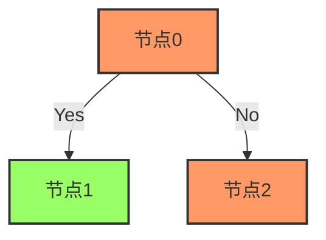

import { CustomTitle, Center, Text, CustomH1Title, photos } from '../mdxcustom/customtitle';
import { PhotoAlbum } from "react-photo-album";

<CustomH1Title>
欢迎来到我的站点
</CustomH1Title>


<CustomTitle>
  使用<Text color="#D8262C">强大</Text>的<Text color="#D8262C"> MD</Text><Text color="#00A3E9">X </Text>
</CustomTitle>


<Center>
❤️强大：MDX 混合了 markdown 和 JSX 语法  
💻组件：使用现有组件并将其他 MDX 文件导入为组件  
🔧定制：本页你所看到的都是在MDX中构建的     
📚弹性：你依然可以仅使用 Markdown    
🔥极快：MDX 没有运行时，所有编译都发生在构建阶段  
</Center>


<CustomTitle>
  集成 <Text color="#D8262C">React Photo Album</Text>
</CustomTitle>


<Center>
:point_right:[查看更多完整演示](https://jiangmiemie.com/gallery/)
</Center>

<PhotoAlbum photos={photos} layout="rows" />

<Center>
<CustomTitle>
  集成 <Text color="#D8262C">meraid</Text> 与
  <Text color="#2e8555">KaTeX</Text>
</CustomTitle>
</Center>
$$
a_{9}^{1} = \sum_{1}^{81} (w_{9,i} \cdot a_{i}^{0})
\begin{bmatrix}
    w_{0,0} & ... & w_{0,81} \\
    ... & ... & ... \\
    w_{9,0} & ... & w_{9,81}
\end{bmatrix}
$$
<Center>



:white_check_mark:复杂公式  
:white_check_mark:矩阵运算  
:white_check_mark:快如闪电  
:point_right:[KaTeX文档](https://katex.org/)  
:white_check_mark:易于使用  
:white_check_mark:图类丰富  
:point_right:[meraid文档](https://mermaid.js.org/intro/)

</Center>


<CustomTitle>
  支持 <Text color="#D8262C">gh-pages</Text>
</CustomTitle>

<Center>
在Github上<b>[创建](https://github.com/jiangyangcreate/jiangyangcreate.github.io/fork)</b>你自己的免费博客
</Center>

```yml title=".github\workflows\updata.yml" showLineNumbers
name: Build HTML
on: push
jobs:
  build-and-deploy:
    runs-on: ubuntu-latest
    permissions:
      contents: write
    steps:
      - uses: actions/checkout@v3
      - uses: actions/setup-node@v3
        with:
          node-version: 18
      - run: |
          npm install
          npm run build
      - uses: peaceiris/actions-gh-pages@v3
        if: github.ref == 'refs/heads/main'
        with:
          github_token: ${{ secrets.GITHUB_TOKEN }}
          publish_dir: ./build
```

<CustomTitle>
  自定义页脚<Text color="#D8262C">说明</Text>👇
</CustomTitle>

<Center>
<svg version="1.1" xmlns="http://www.w3.org/2000/svg" x="0px" y="0px" viewBox="0 0 512 512" height={20} width={20} style={{ marginRight: 7 }}><g transform="translate(0.000000,512.000000) scale(0.100000,-0.100000)" fill="url(#grad1)" stroke="none"><path d="M2384 5060 c-1012 -69 -1891 -738 -2235 -1703 -53 -146 -102 -349 -125 -512 -23 -157 -25 -496 -5 -655 102 -816 575 -1526 1287 -1932 164 -94 418 -200 483 -202 51 -1 94 20 116 57 18 30 19 50 16 267 -1 129 -3 236 -4 236 -1 1 -38 -4 -82 -12 -263 -43 -497 16 -646 165 -58 58 -76 86 -134 206 -94 196 -149 271 -255 348 -78 56 -120 98 -120 119 0 50 121 67 217 30 125 -47 208 -119 299 -258 126 -191 284 -276 485 -261 77 6 233 49 245 68 3 6 13 38 20 71 19 80 68 181 110 228 40 45 44 42 -86 60 -103 14 -282 60 -368 94 -362 143 -571 410 -649 829 -25 134 -25 463 0 567 36 149 103 285 195 398 l43 53 -15 47 c-52 161 -46 370 16 564 20 61 24 67 54 73 107 20 352 -68 576 -206 l98 -61 87 20 c204 47 298 57 553 57 256 0 349 -10 553 -57 l88 -20 77 48 c153 96 304 167 407 193 85 21 159 31 191 25 28 -5 33 -12 52 -72 57 -178 67 -404 23 -542 l-21 -65 20 -25 c98 -121 175 -269 212 -409 26 -98 36 -348 19 -488 -74 -608 -407 -935 -1041 -1023 -120 -16 -118 -15 -83 -53 46 -48 90 -134 115 -223 20 -74 22 -106 27 -529 7 -492 5 -482 66 -507 47 -20 102 -13 200 26 348 135 622 311 884 569 417 410 679 942 752 1527 20 159 18 498 -5 655 -173 1219 -1151 2131 -2373 2215 -161 11 -175 11 -339 0z"/></g></svg>在 Github 上编辑此页  
</Center>

<Center>
<svg version="1.1" xmlns="http://www.w3.org/2000/svg" x="0px" y="0px" viewBox="0 0 24 24" height={20} width={20} style={{ marginRight: 7 }}><g fill="url(#grad1)"><path d="M18.244 2.25h3.308l-7.227 8.26 8.502 11.24H16.17l-5.214-6.817L4.99 21.75H1.68l7.73-8.835L1.254 2.25H8.08l4.713 6.231zm-1.161 17.52h1.833L7.084 4.126H5.117z"></path></g></svg>在 Twitter 上分享此页  
</Center>

<Center>
<svg version="1.1" xmlns="http://www.w3.org/2000/svg" x="0px" y="0px" viewBox="0 0 16 16" height={20} width={20} style={{ marginRight: 7 }}><g fill="url(#grad1)"><linearGradient id="grad1" x1="0%" y1="0%" x2="100%" y2="100%"><stop offset="0%" style={{ stopColor: "#D8262C", stopOpacity: 1 }} /><stop offset="100%" style={{ stopColor: "#E6B800", stopOpacity: 1 }} /></linearGradient><circle cx="3" cy="13" r="2"></circle><path d="M1 5.667v2.667A6.674 6.674 0 0 1 7.667 15h2.666c0-5.146-4.187-9.333-9.333-9.333z"></path><path d="M1 1v2.667C7.25 3.667 12.334 8.75 12.334 15H15C15 7.28 8.72 1 1 1z"></path></g></svg>跳转至 RSS 订阅链接
</Center>

<Center>
<svg version="1.1" xmlns="http://www.w3.org/2000/svg" x="0px" y="0px" viewBox="0 0 1024 1024" style={{ marginRight: 7, height: 20, width: 20 }}><g><path style={{ opacity: 0.996, fill: "url(#grad1)" }} d="M 243.5,420.5 C 189.523,379.185 135.857,337.518 82.5,295.5C 140.987,183.298 229.487,104.632 348,59.5C 432.42,30.213 518.587,23.713 606.5,40C 693.576,57.6997 769.243,96.6997 833.5,157C 787.833,202.667 742.167,248.333 696.5,294C 695.5,294.667 694.5,294.667 693.5,294C 642.378,246.775 581.711,222.942 511.5,222.5C 407.283,227.337 327.117,273.337 271,360.5C 259.938,379.624 250.771,399.624 243.5,420.5 Z"/></g><g><path style={{ opacity: 0.996, fill: "url(#grad1)" }} d="M 82.5,295.5 C 135.857,337.518 189.523,379.185 243.5,420.5C 223.5,481.168 223.5,541.835 243.5,602.5C 189.523,643.815 135.857,685.482 82.5,727.5C 31.7513,624.612 18.5846,516.945 43,404.5C 51.5465,366.35 64.7132,330.016 82.5,295.5 Z"/></g><g><path style={{ opacity: 0.998, fill: "url(#grad1)" }} d="M 829.5,876.5 C 777.833,835.833 726.167,795.167 674.5,754.5C 725.318,718.61 756.985,669.944 769.5,608.5C 683.503,607.5 597.503,607.167 511.5,607.5C 511.5,546.167 511.5,484.833 511.5,423.5C 662.5,423.5 813.5,423.5 964.5,423.5C 979.017,509.532 974.517,594.532 951,678.5C 928.206,755.703 887.706,821.703 829.5,876.5 Z"/></g><g><path style={{ opacity: 0.997, fill: "url(#grad1)" }} d="M 243.5,602.5 C 274.71,690.744 334.043,751.577 421.5,785C 487.78,805.861 553.78,804.861 619.5,782C 638.723,774.388 657.056,765.222 674.5,754.5C 726.167,795.167 777.833,835.833 829.5,876.5C 762.129,936.339 683.462,972.839 593.5,986C 437.233,1008.45 300.566,967.451 183.5,863C 141.888,823.583 108.222,778.416 82.5,727.5C 135.857,685.482 189.523,643.815 243.5,602.5 Z"/></g></svg>拉起e-mail与作者联系
</Center>